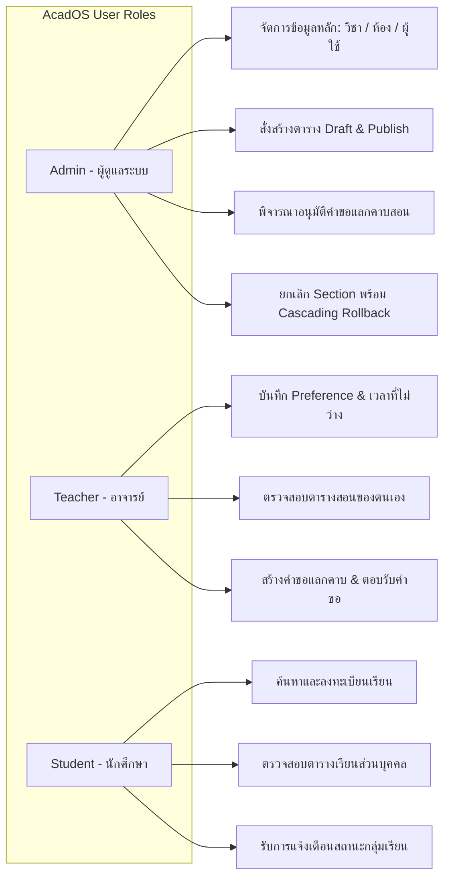
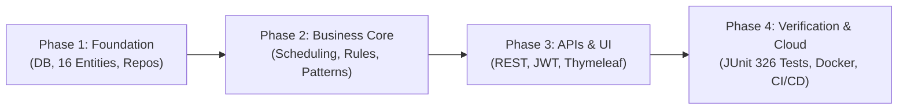

# AcadOS — Automated Proctor Scheduling and Academic Operations System

- 🌐 **Web Application Public URL:** 
[https://acados.onrender.com/](https://acados.onrender.com/)

[](https://www.oracle.com/java/)
[](https://spring.io/projects/spring-boot)
[-success.svg)](code/acados/)
[](https://www.mysql.com/)
[](.github/workflows/ci-cd.yml)

**AcadOS** คือระบบบริหารจัดการงานวิชาการ จัดตารางเรียน/ตารางสอน และจัดสรรตารางคุมสอบอัตโนมัติ พัฒนาด้วยเทคโนโลยี **Spring Boot 3.3.4** และ **Java 21 LTS** ตามสถาปัตยกรรม **Clean 3-Tier Layered Architecture** และหลักการ **SOLID Principles 100%** จุดเด่นของระบบคือการใช้อัลกอริทึมจัดตารางแบบมีเงื่อนไขบังคับ (Hard Constraints) ร่วมกับระบบให้คะแนนความเหมาะสมแบบหลายมิติ (Multi-factor Scoring Strategy) เพื่อขจัดปัญหาตารางชนกันอย่างเด็ดขาด กระจายภาระงานอาจารย์อย่างเป็นธรรม และรองรับกระบวนการขอแลกคาบสอน (Teacher Swap Workflow) ตลอดจนการลงทะเบียนเรียนของนักศึกษาแบบเรียลไทม


> 📖 **เอกสารข้อกำหนดทางเทคนิคฉบับเต็ม:** ดูรายละเอียดทั้งหมดได้ที่ [doc/Implement_Plan-AcadOS.md](doc/Implement_Plan-AcadOS.md) · [doc/solid-analysis.md](doc/solid-analysis.md) · [doc/design-patterns.md](doc/design-patterns.md)

---

## สารบัญ (Table of Contents)
- [AcadOS — Automated Proctor Scheduling and Academic Operations System](#acados--automated-proctor-scheduling-and-academic-operations-system)
  - [สารบัญ (Table of Contents)](#สารบัญ-table-of-contents)
  - [1. สมาชิกกลุ่มและภาระงาน (Team Members)](#1-สมาชิกกลุ่มและภาระงาน-team-members)
  - [2. ที่มาและความสำคัญ (Background \& Significance)](#2-ที่มาและความสำคัญ-background--significance)
  - [3. วัตถุประสงค์ของระบบ (Objectives)](#3-วัตถุประสงค์ของระบบ-objectives)
  - [4. ขอบเขตของระบบ (System Scope)](#4-ขอบเขตของระบบ-system-scope)
  - [5. ประโยชน์ที่คาดว่าจะได้รับ (Expected Benefits)](#5-ประโยชน์ที่คาดว่าจะได้รับ-expected-benefits)
  - [6. เทคโนโลยี เครื่องมือ และซอฟต์แวร์ที่ใช้ (Tech Stack \& Tools)](#6-เทคโนโลยี-เครื่องมือ-และซอฟต์แวร์ที่ใช้-tech-stack--tools)
  - [7. สถาปัตยกรรมและการออกแบบระบบ (System Architecture \& Design)](#7-สถาปัตยกรรมและการออกแบบระบบ-system-architecture--design)
    - [7.1 Clean 3-Tier Layered Architecture](#71-clean-3-tier-layered-architecture)
    - [7.2 การปฏิบัติตามหลักการ SOLID Principles (100% Verified)](#72-การปฏิบัติตามหลักการ-solid-principles-100-verified)
    - [7.3 Design Patterns ที่ใช้งานจริง (8 Patterns)](#73-design-patterns-ที่ใช้งานจริง-8-patterns)
    - [7.4 โครงสร้างโมเดลฐานข้อมูล (16 Relational Entities)](#74-โครงสร้างโมเดลฐานข้อมูล-16-relational-entities)
  - [8. วิธีดำเนินงานและขั้นตอนการพัฒนา (Methodology \& Workflow)](#8-วิธีดำเนินงานและขั้นตอนการพัฒนา-methodology--workflow)
  - [9. ผลการดำเนินงานและการทดสอบ (Implementation Results \& Verification)](#9-ผลการดำเนินงานและการทดสอบ-implementation-results--verification)
    - [9.1 ผลการทดสอบอัตโนมัติ (Automated Testing Proof)](#91-ผลการทดสอบอัตโนมัติ-automated-testing-proof)
    - [9.2 คู่มือการรัน JaCoCo Code Coverage ในเครื่องตนเอง (How to Run JaCoCo Locally)](#92-คู่มือการรัน-jacoco-code-coverage-ในเครื่องตนเอง-how-to-run-jacoco-locally)
      - [1. คำสั่งรันชุดทดสอบและสร้างรายงาน:](#1-คำสั่งรันชุดทดสอบและสร้างรายงาน)
      - [2. วิธีการเปิดดูรายงานความครอบคลุม (Interactive HTML Report):](#2-วิธีการเปิดดูรายงานความครอบคลุม-interactive-html-report)
    - [9.3 การทดสอบยอมรับระบบด้วย Robot Framework E2E (Positive \& Negative Scenarios)](#93-การทดสอบยอมรับระบบด้วย-robot-framework-e2e-positive--negative-scenarios)
      - [1. การติดตั้งเครื่องมือที่จำเป็น (Prerequisites):](#1-การติดตั้งเครื่องมือที่จำเป็น-prerequisites)
      - [2. คำสั่งรันชุดทดสอบ Robot Framework:](#2-คำสั่งรันชุดทดสอบ-robot-framework)
      - [3. สรุปผลการทดสอบ Robot Framework (8 Scenarios, 8 Passed, 0 Failed — 100% Green):](#3-สรุปผลการทดสอบ-robot-framework-8-scenarios-8-passed-0-failed--100-green)
    - [9.4 การทดสอบ 4 สถานการณ์จำลองหลัก (4 Demo Scenarios)](#94-การทดสอบ-4-สถานการณ์จำลองหลัก-4-demo-scenarios)
  - [10. การติดตั้งและวิธีรันเพื่อทำซ้ำ (Installation \& How to Run Locally)](#10-การติดตั้งและวิธีรันเพื่อทำซ้ำ-installation--how-to-run-locally)
    - [10.1 สิ่งที่ต้องเตรียม (Prerequisites)](#101-สิ่งที่ต้องเตรียม-prerequisites)
    - [10.2 ขั้นตอนการรันระบบในเครื่อง (Step-by-Step Local Run)](#102-ขั้นตอนการรันระบบในเครื่อง-step-by-step-local-run)
    - [10.3 บัญชีผู้ใช้สำหรับการทดสอบ (Default Seed Accounts)](#103-บัญชีผู้ใช้สำหรับการทดสอบ-default-seed-accounts)
  - [11. Public Deployment URL \& API Documentation](#11-public-deployment-url--api-documentation)
  - [12. โครงสร้างไดเรกทอรีโครงการ (Project Structure)](#12-โครงสร้างไดเรกทอรีโครงการ-project-structure)

---

## 1. สมาชิกกลุ่มและภาระงาน (Team Members)

ตามเกณฑ์ข้อกำหนดรายวิชา ([`doc/prof_ruleset.md`](doc/prof_ruleset.md) §10 และ §12) โครงการแบ่งงานแบบ **Vertical Slicing** สมาชิกทุกคนรับผิดชอบงานครบทุก Layer ตั้งแต่ Entity, Service, API, Frontend, Design Pattern จนถึง Automated Tests:

| ลำดับ | ชื่อ - นามสกุล | รหัสนักศึกษา | Section | Git Branch ประจำตัว | ขอบเขตความรับผิดชอบหลัก (Core Track) |
| :---: | :--- | :---: | :---: | :--- | :--- |
| **1** | **นายพุฒิเมธ ชมศรีสวัสดิ์** | 673380417-1 | Sec 3 | [`puttimed_6733804171_03`](https://github.com/synthesixer/AcadOS/tree/puttimed_6733804171_03) | **Track A:** Scheduling Engine, Constraint Engine, Scoring Strategies, Room & Course APIs, External Holiday API Client, Timetable UI |
| **2** | **นายวงศกร สงวนกลิ่น** | 673380424-4 | Sec 4 | [`wongsakorn_6733804244_04`](https://github.com/synthesixer/AcadOS/tree/wongsakorn_6733804244_04) | **Track B:** Backend Architecture, MySQL DB Schema, Security & JWT, User & Teacher Modules, Teacher Swap Workflow, Docker & Deployment |
| **3** | **นายจิรภัทร สีสาร** | 673380574-5 | Sec 3 | [`jirapat_6733805745_03`](https://github.com/synthesixer/AcadOS/tree/jirapat_6733805745_03) | **Track C:** Student Course Registration, Section Lifecycle State Pattern, Notification Engine (In-App & Mailtrap), Master UI Layout, Swagger Config |

> 📊 **ประวัติการ Commit รายบุคคล:** สมาชิกทุกคนมีสถิติ Commit เกินเกณฑ์ขั้นต่ำ ($\ge 15$ Commits) ทุกคน: พุฒิเมธ (63 Commits), วงศกร (49 Commits), จิรภัทร (35 Commits)

---

## 2. ที่มาและความสำคัญ (Background & Significance)

ในสถาบันการศึกษาระดับอุดมศึกษา กระบวนการจัดตารางสอน ตารางเรียน และการจัดสรรอาจารย์ผู้คุมสอบเป็นภารกิจที่มีความซับซ้อนอย่างยิ่ง (NP-hard Problem) การดำเนินการด้วยมนุษย์มักประสบปัญหาเรื้อรัง:
1. **ข้อขัดแย้งด้านตารางเวลาและสถานที่ (Time & Room Conflicts):** การจัดคาบเรียนชนกันระหว่างรายวิชาในชั้นปีเดียวกัน หรือการจัดห้องเรียนซ้ำซ้อนในคาบเวลาเดียวกัน
2. **ความไม่สมดุลของภาระงานสอน (Workload Imbalance):** อาจารย์บางท่านมีภาระงานสอนกระจุกตัว ในขณะที่บางท่านไม่ได้รับมอบหมายรายวิชาตรงตามความเชี่ยวชาญหรือความพึงพอใจ
3. **ความยุ่งยากในการสลับคาบสอน (Teacher Swap Bottleneck):** เมื่ออาจารย์ติดภารกิจ การขอสลับคาบสอนมักอาศัยการประสานงานนอกระบบ ขาดการตรวจสอบเวลาว่างของคู่สลับ และไม่มีบันทึกการอนุมัติที่เป็นลายลักษณ์อักษร
4. **ความเสี่ยงในการลงทะเบียนเรียนของนักศึกษา:** นักศึกษาประสบปัญหาลงทะเบียนซ้ำซ้อน กลุ่มเรียนเต็ม หรือเวลาสอบชนกันโดยไม่มีระบบแจ้งเตือนล่วงหน้า

**AcadOS** จึงถูกออกแบบขึ้นเพื่อเป็นระบบศูนย์กลางในการแก้ปัญหาดังกล่าวด้วยการประยุกต์ใช้อัลกอริทึมทางวิศวกรรมซอฟต์แวร์และสถาปัตยกรรมระดับองค์กรที่สามารถตรวจสอบเงื่อนไขบังคับได้ 100% พร้อมอำนวยความสะดวกให้แก่อาจารย์ นักศึกษา และเจ้าหน้าที่ฝ่ายวิชาการ

---

## 3. วัตถุประสงค์ของระบบ (Objectives)

1. **พัฒนาระบบจัดตารางอัตโนมัติ (Automated Scheduling Engine):** สร้างตารางสอนที่ปลอดข้อขัดแย้ง 100% ตาม Hard Constraints 7 ข้อ (ตารางไม่ชน, ห้องไม่ชน, อาจารย์มีคุณสมบัติ, อาจารย์ว่าง, และห้องพร้อมใช้งาน)
2. **พัฒนาระบบคำนวณคะแนนหลายปัจจัย (Multi-factor Soft Constraint Scoring):** คัดเลือกตารางที่เหมาะสมที่สุดโดยคำนึงถึงความต้องการอาจารย์ (+30 คะแนน), การกระจายภาระงาน (+20 คะแนน), และความเหมาะสมของขนาดห้องเรียน (+20 คะแนน)
3. **พัฒนาระบบลงทะเบียนเรียนที่มีความแม่นยำสูง (Student Registration System):** ตรวจสอบช่วงเวลาลงทะเบียน (BR-09), ตรวจกลุ่มเรียนเต็ม (BR-05), ตรวจการลงทะเบียนซ้ำ (BR-04), และตรวจตารางเรียนชนกัน (BR-03)
4. **พัฒนาระบบขอสลับคาบสอนแบบอนุมัติ 2 ขั้น (Teacher Swap Workflow):** ให้สิทธิ์อาจารย์สร้างคำขอสลับสอน $\to$ คู่สลับตอบรับ (Accept) $\to$ ผู้ดูแลระบบอนุมัติ (Admin Approve) พร้อมกลไก Snapshot ป้องกันข้อมูลคลาดเคลื่อน
5. **สร้างระบบตามมาตรฐานวิศวกรรมซอฟต์แวร์ขั้นสูง:** ปฏิบัติตามหลักการ SOLID Principles, Enterprise Design Patterns, มีชุดทดสอบอัตโนมัติครอบคลุม และพร้อม Deploy บน Cloud ผ่าน Container

---

## 4. ขอบเขตของระบบ (System Scope)

ระบบรองรับผู้ใช้งาน 3 บทบาทหลัก (Role-Based Access Control):



- **กฎทางธุรกิจที่บังคับใช้จริง (Business Rules BR-01 – BR-11):**
  - **BR-01 / BR-02:** ป้องกันตารางสอนและห้องเรียนชนกันเด็ดขาด (Hard Constraints)
  - **BR-03 / BR-04 / BR-05:** ป้องกันนักศึกษาลงทะเบียนเวลาชนกัน, ลงทะเบียนซ้ำ, หรือเกินจำนวนรับ
  - **BR-06 / BR-07:** อาจารย์ต้องมีคุณสมบัติสอนรายวิชานั้นและว่างในช่วงเวลานั้น
  - **BR-09:** ตรวจสอบช่วงเวลาลงทะเบียนเรียนตามปฏิทินการศึกษา
  - **BR-10:** การแลกคาบสอนทำได้เฉพาะตารางที่เผยแพร่แล้ว (PUBLISHED) และไม่มีสถานะแลกซ้ำซ้อน

---

## 5. ประโยชน์ที่คาดว่าจะได้รับ (Expected Benefits)

1. **ลดภาระงานและเวลาของเจ้าหน้าที่:** ลดระยะเวลาการจัดตารางสอนจากหลายสัปดาห์เหลือเพียงไม่กี่วินาที
2. **ขจัดข้อผิดพลาดของตาราง 100%:** ไม่มีปัญหาคาบเรียนชนหรือห้องเรียนซ้ำซ้อนในระดับปฏิบัติการ
3. **เพิ่มความพึงพอใจและความเป็นธรรมของคณาจารย์:** อาจารย์ได้สอนในวันและวิชาที่ถนัด และภาระงานสอนถูกเฉลี่ยอย่างสมดุล
4. **ความคล่องตัวในการบริหารจัดการ:** มีกระบวนการแลกคาบสอนและยกเลิกกลุ่มเรียนที่ปลอดภัย มีประวัติการตรวจสอบย้อนหลัง (Audit Trail)
5. **ประสบการณ์การใช้งานที่ดีของนักศึกษา:** ทราบผลการลงทะเบียนเรียนทันที พร้อมตารางเรียนที่จัดสรรอย่างเป็นระเบียบ

---

## 6. เทคโนโลยี เครื่องมือ และซอฟต์แวร์ที่ใช้ (Tech Stack & Tools)

| หมวดหมู่ | เทคโนโลยี / เครื่องมือ | เวอร์ชัน / รายละเอียด |
| :--- | :--- | :--- |
| **Programming Language** | Java (OpenJDK Temurin) | **21 LTS** |
| **Backend Framework** | Spring Boot | **3.3.4** (Web, Data JPA, Security, Validation, Mail) |
| **Build & Dependency Tool** | Apache Maven | **3.9.x** |
| **Database System** | MySQL / Cloud MySQL | **8.x** (MySQL Connector/J 8.3+) |
| **In-Memory Test Database** | H2 Database | **2.2.x** (สำหรับรัน Fast Unit/Integration Tests) |
| **Security & Auth** | Spring Security + JJWT | **0.12.6** (Stateless JWT Authentication, BCrypt) |
| **Frontend Rendering** | Thymeleaf + HTML5 / CSS3 / JS | Bootstrap 5 UI Components, Fetch API |
| **API Documentation** | Springdoc OpenAPI | **2.6.0** (OpenAPI 3.0 / Swagger UI) |
| **Testing Framework** | JUnit 5 (Jupiter), Mockito | **5.10.x** / **5.11.x** |
| **Code Coverage Tool** | JaCoCo Maven Plugin | **0.8.12** |
| **Containerization** | Docker, Docker Compose | Multi-Stage Build (`eclipse-temurin:21-jre`) |
| **CI/CD Automation** | GitHub Actions | Ubuntu Latest Runner, Java 21 Pipeline |
| **External Integrations** | Mailtrap SMTP Sandbox, ThailandFormats API | Port 587 (TLS), HTTPS REST Client |

---

## 7. สถาปัตยกรรมและการออกแบบระบบ (System Architecture & Design)

### 7.1 Clean 3-Tier Layered Architecture
ระบบแบ่งแยกความรับผิดชอบของแต่ละชั้นอย่างเคร่งครัด **ห้ามข้าม Layer (Strict Layering Rule: Controller ห้ามเรียก Repository โดยตรง 100%)**:

```
┌─────────────────────────────────────────────────────────────┐
│ Presentation Layer: Web Controllers & REST API Controllers  │
│ (/api/v1/*, Thymeleaf Views, DTOs, Swagger UI)             │
└──────────────────────────────┬──────────────────────────────┘
                               │ (Calls via Service Interface)
                               ▼
┌─────────────────────────────────────────────────────────────┐
│ Business Service Layer: Workflows, Transactions & Rules     │
│ (SchedulingService, RegistrationService, ConstraintEvaluator│
└──────────────────────────────┬──────────────────────────────┘
                               │ (Calls via Repository Interface)
                               ▼
┌─────────────────────────────────────────────────────────────┐
│ Persistence Layer: Spring Data JPA Repositories (16 Repos)  │
└──────────────────────────────┬──────────────────────────────┘
                               │ (JDBC / MySQL Protocol)
                               ▼
┌─────────────────────────────────────────────────────────────┐
│ Database Layer: MySQL 8.x (16 Relational Tables)            │
└─────────────────────────────────────────────────────────────┘
```

### 7.2 การปฏิบัติตามหลักการ SOLID Principles (100% Verified)
*(ดูเอกสารวิเคราะห์รายบรรทัดฉบับเต็มได้ที่ [`doc/solid-analysis.md`](doc/solid-analysis.md))*
- **S (Single Responsibility):** แยก Presentation (Controller), Business Logic (Service), Persistence (Repository), และ Constraint Validation ออกจากกันเด็ดขาด
- **O (Open/Closed):** รองรับการเพิ่มเกณฑ์การให้คะแนนตารางสอนใหม่ผ่าน Interface `ScoringStrategy` และขยายช่องทางแจ้งเตือนผ่าน `NotificationStrategy` โดยไม่ต้องแก้ไขโค้ด Service เดิม
- **L (Liskov Substitution):** ทุก Implementation ของ Strategy ปฏิบัติตามสัญญา ไม่โยน `UnsupportedOperationException` และ Custom Exception สืบทอดจาก `RuntimeException`
- **I (Interface Segregation):** นำสถาปัตยกรรม **CQRS** มาใช้แยก `TeacherSwapService` (Command: สร้าง/อนุมัติคำขอ) ออกจาก `TeacherSwapQueryService` (Query: อ่านคำขอใน Inbox) เพื่อป้องกัน Fat Interface
- **D (Dependency Inversion):** ทุกคลาสพึ่งพา Abstraction ผ่าน **Constructor Injection 100% ปราศจาก Field Injection (`@Autowired` บนฟิลด์) ทั่วทั้งระบบ**

### 7.3 Design Patterns ที่ใช้งานจริง (8 Patterns)
*(ดูเอกสารสรุปแพตเทิร์นฉบับเต็มได้ที่ [`doc/design-patterns.md`](doc/design-patterns.md))*
1. **Strategy Pattern:** ใช้ใน `ScoringStrategy` (Preference, Workload, RoomSuitability) และ `NotificationStrategy` (InApp, Email)
2. **State Pattern:** ใช้ใน `SectionState` (`ActiveSectionState`, `CancelledSectionState`) บริหารวงจรชีวิตของกลุ่มเรียน
3. **Observer Pattern:** ใช้ใน `ScheduleChangeSubject` และ `ScheduleChangeObserver` แจ้งเตือนเมื่อตารางมีการเปลี่ยนแปลง
4. **Adapter Pattern:** ใช้ใน `HolidayProvider` เชื่อมต่อ External ThailandFormats Holiday API
5. **Enterprise Patterns:** Layered Architecture, MVC Pattern, Repository Pattern, CQRS Interface Segregation

### 7.4 โครงสร้างโมเดลฐานข้อมูล (16 Relational Entities)
*(ดูรายละเอียด Schema และ Data Dictionary ได้ที่ [`doc/database.md`](doc/database.md) และ [`doc/diagram/ER Diagram.puml`](doc/diagram/ER%20Diagram.puml))*
- `users`, `teachers`, `students` (การจัดการผู้ใช้และบทบาท)
- `courses`, `sections`, `rooms`, `time_slots`, `schedules` (ข้อมูลการเรียนการสอนและตาราง)
- `teacher_qualifications`, `teacher_preferences`, `teacher_availabilities` (คุณสมบัติและความพร้อมของอาจารย์)
- `teacher_swap_requests` (คำขอสลับตารางสอนพร้อม Audit Snapshot)
- `registrations`, `notifications` (การลงทะเบียนและการแจ้งเตือน)
- `academic_events`, `public_holidays` (ปฏิทินการศึกษาและวันหยุดราชการ)

---

## 8. วิธีดำเนินงานและขั้นตอนการพัฒนา (Methodology & Workflow)

โครงการประยุกต์ใช้ระเบียบวิธีพัฒนาแบบ **Agile / Feature-Driven Development** โดยกำหนดกรอบการทำงาน 4 เฟสหลัก:



1. **Phase 1 — สถาปัตยกรรมฐานและโมเดลข้อมูล:** วางโครงสร้าง Maven Multi-layer, สร้าง Entity ทั้ง 16 ตัว, สร้างความสัมพันธ์ One-to-One / One-to-Many และจัดทำ `data.sql`
2. **Phase 2 — Business Logic & Algorithm:** พัฒนา `ConstraintEvaluator` ตรวจสอบ Hard Constraints 7 ข้อ, ออกแบบ Multi-factor `ScoringStrategy`, พัฒนา State Pattern ในการยกเลิก Section และระบบสลับสอน
3. **Phase 3 — Web APIs, Security & Frontend:** สร้าง REST Controllers 12 ชุด พร้อม DTO และ MapStruct, ติดตั้ง Spring Security ตรวจสอบ JWT Token และสร้างหน้าจอ Thymeleaf Views ให้ครบทุกบทบาท
4. **Phase 4 — การทดสอบและนำขึ้น Cloud:** เขียน Unit & Integration Tests ให้ผ่าน 100%, คอนฟิก Multi-Stage Dockerfile, ติดตั้ง GitHub Actions CI/CD และจัดทำคู่มือ Deploy บน Railway/Cloud

---

## 9. ผลการดำเนินงานและการทดสอบ (Implementation Results & Verification)

### 9.1 ผลการทดสอบอัตโนมัติ (Automated Testing Proof)
ระบบผ่านการทดสอบด้วย JUnit 5 และ Mockito ครบทุกเลเยอร์:
```text
[INFO] Results:
[INFO] Tests run: 326, Failures: 0, Errors: 0, Skipped: 0
[INFO] ------------------------------------------------------------------------
[INFO] BUILD SUCCESS
[INFO] Total time: 50.987 s
[INFO] ------------------------------------------------------------------------
```
- **สถานะ Unit & Integration Tests:** **326 / 326 Tests Passed (100% Green, 0 Failures, 0 Errors)**
- **Code Coverage Report:** สร้างรายงาน JaCoCo Coverage Report จัดเก็บถาวรใน Repository ที่ [`test/jacoco/index.html`](test/jacoco/index.html) (ครอบคลุม 94 คลาส)
- **สถานะ End-to-End Acceptance Tests (Robot Framework):** **8 / 8 Scenarios Passed (100% Green)** ครอบคลุมทั้ง Positive, Negative, และวนครบทุกหน้า พร้อมบันทึกภาพหน้าจอจริง 17 ภาพลงในโฟลเดอร์ [`img/`](img/)

---

### 9.2 คู่มือการรัน JaCoCo Code Coverage ในเครื่องตนเอง (How to Run JaCoCo Locally)

ระบบใช้ **JaCoCo Maven Plugin 0.8.12** เพื่อวัดความครอบคลุมของโค้ด (Line & Branch Coverage) ครบทุกเลเยอร์:

#### 1. คำสั่งรันชุดทดสอบและสร้างรายงาน:
```bash
# เข้าสู่ไดเรกทอรีโปรเจกต์
cd code/acados

# รันชุดทดสอบทั้งหมดและสั่งสร้างรายงานความครอบคลุม
mvn clean test
```
*ระบบจะรันชุดทดสอบ 326 รายการ และบันทึกผลการวิเคราะห์ Code Coverage อัตโนมัติ*

#### 2. วิธีการเปิดดูรายงานความครอบคลุม (Interactive HTML Report):
หลังรันเสร็จสิ้น สามารถเปิดดูรายงานผ่านเว็บเบราว์เซอร์ได้ทันที:
- **เปิดไฟล์รายงานที่เพิ่งสร้างขึ้นใหม่ในเครื่อง:**
  - ตำแหน่งไฟล์: `code/acados/target/site/jacoco/index.html`
  - คำสั่งเปิดบน Windows (PowerShell):
    ```powershell
    Start-Process code/acados/target/site/jacoco/index.html
    ```
- **เปิดรายงานฉบับจัดเก็บถาวรใน Repository:**
  - ลิงก์ตรงใน Repo: [`test/jacoco/index.html`](test/jacoco/index.html)
  - รายงานจะแสดงสถิติความครอบคลุมทั้ง 94 คลาส (Instruction, Branch, Cyclomatic Complexity, Lines, Methods)

---

### 9.3 การทดสอบยอมรับระบบด้วย Robot Framework E2E (Positive & Negative Scenarios)

ระบบมีชุดทดสอบอัตโนมัติ End-to-End Acceptance Tests พัฒนาด้วย **Robot Framework** และ **SeleniumLibrary** เพื่อจำลองพฤติกรรมผู้ใช้จริงบนเว็บเบราว์เซอร์ ครอบคลุมทั้งกรณีปกติ (Positive), กรณีข้อผิดพลาด/ความปลอดภัย (Negative), และเดินทางวนตรวจครบทุกหน้าจอหลักของระบบ พร้อมบันทึกภาพหน้าจอจริง (17 Screenshots) ลงในโฟลเดอร์ [`img/`](img/):

#### 1. การติดตั้งเครื่องมือที่จำเป็น (Prerequisites):
```bash
pip install robotframework robotframework-seleniumlibrary
```

#### 2. คำสั่งรันชุดทดสอบ Robot Framework:
ตรวจสอบว่าแอปพลิเคชันกำลังทำงานอยู่ที่ `http://localhost:8080` จากนั้นรันคำสั่ง:
```bash
# รันชุดทดสอบและบันทึกภาพหน้าจอลงใน img/
robot -d img/results img/robot_testcase.robot

# หรือรันจากชุดทดสอบในไดเรกทอรี test/
robot -d test/results test/robot_testcases.robot
```

#### 3. สรุปผลการทดสอบ Robot Framework (8 Scenarios, 8 Passed, 0 Failed — 100% Green):
| รหัส Scenario | ประเภท (Category) | พฤติกรรมที่ทดสอบ (Test Description) | หน้าจอที่ระบบวนเข้าตรวจสอบ | ผลการทดสอบ |
| :--- | :---: | :--- | :--- | :---: |
| **`TC_NEG_01`** | **Negative** | กรอกรหัสผ่านผิด $\to$ แสดง Error Box และปฏิเสธการล็อกอิน | `/login` | **PASS** |
| **`TC_NEG_02`** | **Negative** | กรอก University ID ที่ไม่มีในระบบ $\to$ แสดง Error Box | `/login` | **PASS** |
| **`TC_NEG_03`** | **Negative** | เข้าถึง Protected Route โดยไม่ล็อกอิน $\to$ 401 Unauthorized | `/admin/dashboard` | **PASS** |
| **`TC01`** | **Positive** | Admin ล็อกอิน ตรวจสอบ Dashboard, Courses, Rooms, Sections, Users | `/admin/**` (5 หน้า) | **PASS** |
| **`TC02`** | **Positive** | Admin สั่ง Generate Timetable อัตโนมัติและแสดงผล DRAFT | `/timetable` | **PASS** |
| **`TC03`** | **Positive** | Student ล็อกอิน ตรวจสอบ Dashboard, ค้นหาวิชา, ประวัติลงทะเบียน | `/student/**` (3 หน้า) | **PASS** |
| **`TC04`** | **Positive** | Teacher ล็อกอิน ตรวจสอบ Dashboard และกล่องแลกคาบสอน | `/teacher/**` (2 หน้า) | **PASS** |
| **`TC05`** | **Positive** | ตรวจสอบ Swagger UI และ Spring Actuator Healthcheck (`UP`) | `/swagger-ui.html`, `/actuator/health` | **PASS** |

*ภาพหน้าจอหลักฐานจริงทั้งหมดถูกบันทึกไว้ในโฟลเดอร์ [**`img/`**](img/) เรียบร้อยแล้ว*

---

### 9.4 การทดสอบ 4 สถานการณ์จำลองหลัก (4 Demo Scenarios)
1. **Scenario 1 — Student Course Registration:** นักศึกษาลงทะเบียนเรียน $\to$ ระบบตรวจสอบเงื่อนไขเวลาชน (BR-03), วิชาซ้ำ (BR-04), ความจุเต็ม (BR-05), ช่วงเวลาลงทะเบียน (BR-09) $\to$ บันทึกและแจ้งเตือนผ่าน In-App
2. **Scenario 2 — Automatic Timetable Scheduling:** Admin สั่งสร้างตาราง $\to$ Constraint Engine คัดกรอง Hard Constraints $\to$ Scoring Strategy เลือก Candidate ที่ดีที่สุด $\to$ บันทึกสถานะ DRAFT $\to$ Admin ตรวจสอบและสั่ง Publish
3. **Scenario 3 — Teacher Swap Workflow:** อาจารย์ A สร้างคำขอสลับสอน $\to$ ระบบบันทึก Snapshot และตรวจสถานะ $\to$ อาจารย์ B กด Accept $\to$ Admin กด Approve $\to$ สลับตารางสอนในระบบอัตโนมัติ
4. **Scenario 4 — Section Cancellation:** Admin ยกเลิก Section ที่มีนักศึกษาลงทะเบียน $\to$ State Pattern เปลี่ยนเป็น Cancelled $\to$ ปลดตารางใน Schedule และลบข้อมูลการลงทะเบียน พร้อมส่ง Notification เตือนผู้ได้รับผลกระทบ

---

## 10. การติดตั้งและวิธีรันเพื่อทำซ้ำ (Installation & How to Run Locally)

### 10.1 สิ่งที่ต้องเตรียม (Prerequisites)
- **Java Development Kit (JDK):** เวอร์ชัน 21 LTS ขึ้นไป ([Eclipse Temurin 21](https://adoptium.net/))
- **Apache Maven:** เวอร์ชัน 3.9 ขึ้นไป
- **Docker & Docker Compose:** สำหรับรัน MySQL Database ในเครื่อง

### 10.2 ขั้นตอนการรันระบบในเครื่อง (Step-by-Step Local Run)

```bash
# 1. โคลน Repository
git clone https://github.com/synthesixer/AcadOS.git
cd AcadOS/code/acados

# 2. สตาร์ท MySQL Database 8.x และ phpMyAdmin ด้วย Docker Compose
docker compose up -d

# 3. รันชุดทดสอบทั้งหมดเพื่อยืนยันความพร้อม
mvn clean test

# 4. สตาร์ทระบบ Spring Boot Application
mvn spring-boot:run
```

เมื่อแอปพลิเคชันเริ่มทำงานเรียบร้อย สามารถเปิดเข้าใช้งานผ่านเบราว์เซอร์ได้ทันที:
- **Web Application UI:** `http://localhost:8080/`
- **Interactive Swagger UI:** `http://localhost:8080/swagger-ui.html`
- **OpenAPI Schema (JSON):** `http://localhost:8080/api-docs`
- **Healthcheck Endpoint:** `http://localhost:8080/actuator/health`
- **phpMyAdmin (Database GUI):** `http://localhost:8081/` (Login: `root` / `root`)

### 10.3 บัญชีผู้ใช้สำหรับการทดสอบ (Default Seed Accounts)
ข้อมูลทั้งหมดถูก Seed เข้าสู่ฐานข้อมูลอัตโนมัติจากไฟล์ `data.sql` โดยทุกบัญชีใช้รหัสผ่านเดียวกัน: `password123`

| บทบาท (Role) | บัญชีผู้ใช้งาน (Username) | รหัสผ่าน (Password) | สิทธิ์และหน้าที่การทำงาน |
| :--- | :---: | :---: | :--- |
| **Admin** | `admin` | `password123` | จัดการหลักสูตร, จัดตารางอัตโนมัติ, อนุมัติการแลกคาบสอน |
| **Teacher** | `T001`, `T002`, `T003` | `password123` | จัดการเวลาว่าง, ขอสลับคาบสอน, ตรวจสอบตารางสอน |
| **Student** | `S001`, `S002`, `S003` | `password123` | ลงทะเบียนเรียน, ตรวจสอบตารางเรียนส่วนบุคคล |

---

## 11. Public Deployment URL & API Documentation

- 🌐 **Web Application Public URL:** 
[https://acados.onrender.com/](https://acados.onrender.com/)
- 📑 **Swagger UI / OpenAPI Documentation:** [https://acados.onrender.com/swagger-ui/index.htmll](https://acados.onrender.com/swagger-ui/index.html)
- 🩺 **Application Health Status:** [https://acados.onrender.com/actuator/health](https://acados.onrender.com/actuator/health)

---

## 12. โครงสร้างไดเรกทอรีโครงการ (Project Structure)

โครงสร้างโฟลเดอร์เป็นไปตามมาตรฐานข้อกำหนดรายวิชา ([`doc/prof_ruleset.md`](doc/prof_ruleset.md) §9):

```text
AcadOS/
├── .github/
│   └── workflows/
│       └── ci-cd.yml             # GitHub Actions Automated CI/CD Pipeline
├── code/
│   └── acados/                   # โค้ดระบบหลัก Spring Boot 3.3.4 (Java 21 LTS)
│       ├── src/
│       │   ├── main/java/        # Business Logic, Controllers, Entities, Patterns
│       │   ├── main/resources/   # application.properties, data.sql, Thymeleaf Views
│       │   └── test/java/        # Automated Unit & Integration Tests (326 Tests)
│       ├── pom.xml               # Maven Project Object Model Dependencies
│       ├── Dockerfile            # Multi-stage Container Build (Temurin 21 JRE)
│       └── docker-compose.yml    # Multi-container Compose (App, DB, phpMyAdmin)
├── test/
│   ├── README.md                 # เอกสารสรุปผลการทดสอบระบบและคู่มือรัน Test
│   ├── TEST_REPORT.md            # รายงานสรุปผลการทดสอบละเอียด 326 Tests
│   ├── robot_testcases.robot     # สคริปต์ Robot Framework E2E Acceptance Test Suite
│   └── jacoco/                   # รายงาน Interactive JaCoCo Code Coverage (index.html, csv, xml)
├── doc/
│   ├── Implement_Plan-AcadOS.md  # แผนสถาปัตยกรรมและข้อกำหนดระบบฉบับสมบูรณ์
│   ├── solid-analysis.md         # เอกสารวิเคราะห์ SOLID Principles ละเอียดรายบรรทัด
│   ├── design-patterns.md        # เอกสารวิเคราะห์ GoF & Architectural Patterns
│   ├── database.md               # พจนานุกรมข้อมูล (Data Dictionary) และ Schema
│   ├── prof_ruleset.md           # กฎเกณฑ์และ Checklist ข้อกำหนดของอาจารย์
│   ├── PROJECT_STATUS.md         # บันทึกสถานะระบบและการเปลี่ยนแปลงโครงการ
│   ├── diagram/                  # ไดอะแกรมระบบ (Class, Component, Activity, ER, Flow)
│   │   ├── ClassDiagram/         # Class Diagrams (Full, Minimal, Repo, Exception)
│   │   ├── ActivityDiagram/      # Activity Diagrams สำหรับ Workflows สำคัญ
│   │   ├── StateDiagram/         # State Diagrams (Section State Pattern)
│   │   └── UsecaseDiagram/       # Use Case Diagrams แยกตามระบบ
│   └── slide/
│       └── README.md             # ไดเรกทอรีสำหรับสไลด์นำเสนอโครงงาน
├── img/
│   ├── README.md                 # คู่มือคลังรูปภาพและรายการ Screenshots
│   ├── robot_testcase.robot      # สคริปต์ Robot Framework สำหรับบันทึกภาพหน้าจออัตโนมัติ
│   └── *.png                     # ภาพหลักฐานการทดสอบจริง 17 ภาพ (TC_NEG_01..03, TC01..05)
├── README.md                     # เอกสารแนะนำและคู่มือการใช้งานระบบฉบับสมบูรณ์
└── .gitignore

```

---

*จัดทำโดย คณะผู้พัฒนาโครงงาน AcadOS — วิทยาลัยการคอมพิวเตอร์ มหาวิทยาลัยขอนแก่น*
