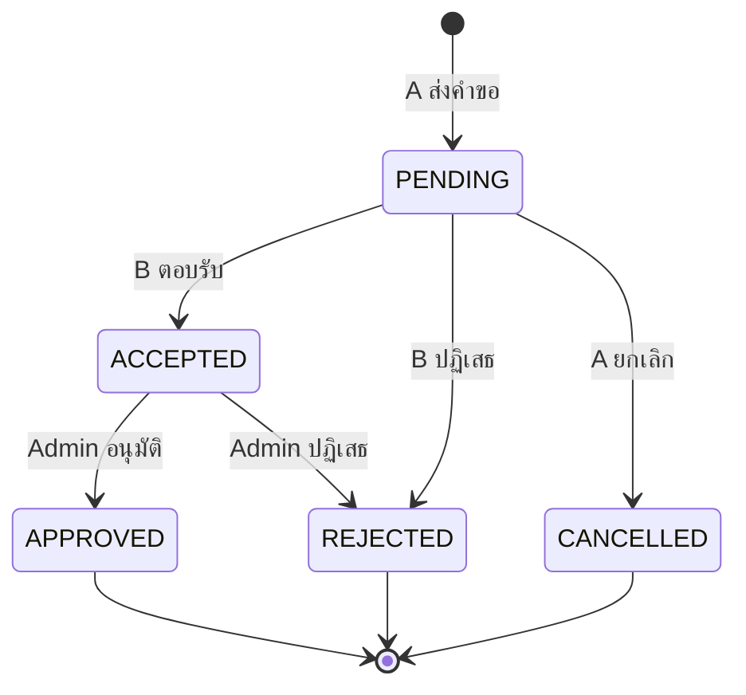
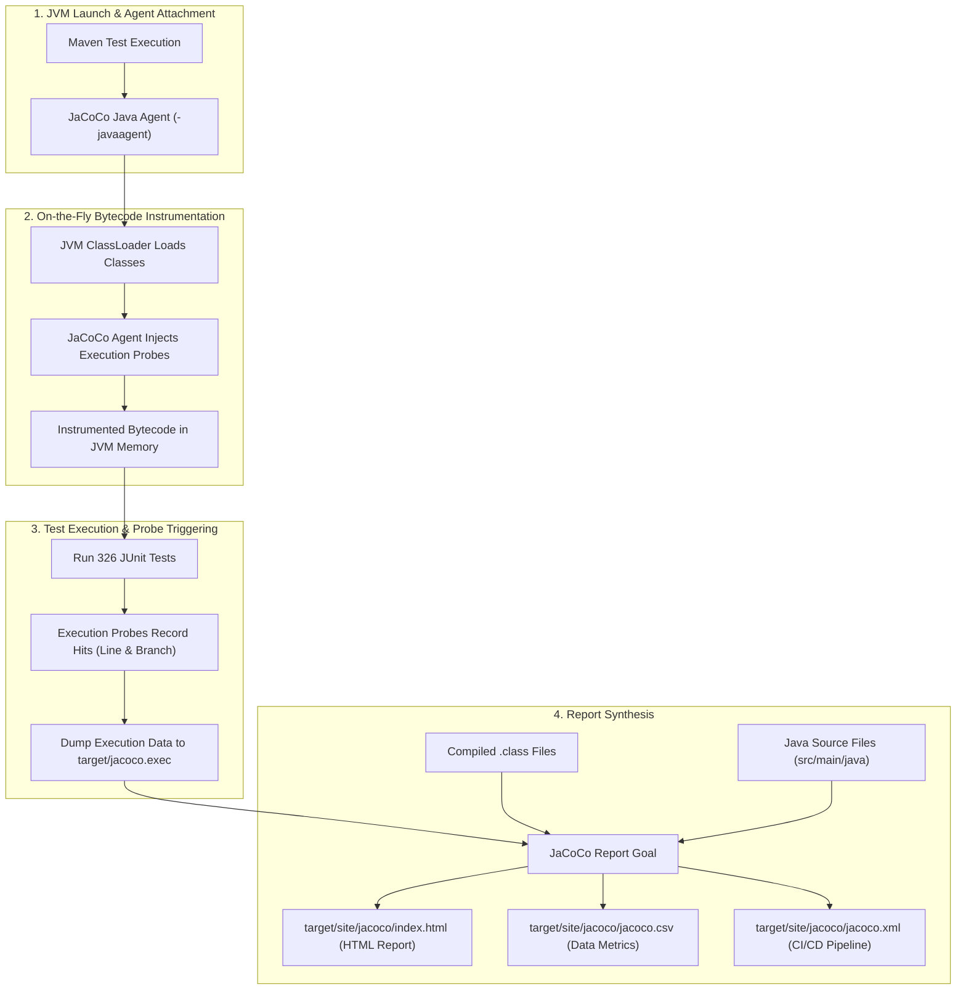

# AcadOS: Automated Proctor Scheduling and Academic Operations System
**Version:** v6
**Project Status:** Implementation / Rapid Development  
**Development Time:** 4 Days  
**Team Size:** 3 คน  

> “ทำระบบที่มี Core Feature จริง + โครงสร้าง Software Design ครบตาม Rubric + Test + Git + Deploy”

เอกสารฉบับนี้เป็นการจัดเรียงและปรับปรุงข้อกำหนดทางเทคนิคและสถาปัตยกรรมระบบสำหรับ **AcadOS** โดยผสานรวมเนื้อหาเดิมทั้งหมด รักษาข้อมูลที่ถูกต้องครบถ้วน 100% (No Information Loss) แก้ไขจุดขัดแย้งตามมติที่ได้รับการยืนยันอย่างเป็นทางการ ปรับให้สอดคล้องกับเกณฑ์ข้อกำหนดของรายวิชา CP353002 (Spring Boot) และระบุส่วนที่ยังรอการกำหนดรายละเอียดในอนาคตเป็น **TBA** อย่างเคร่งครัด (ห้ามแต่งข้อมูลขึ้นเอง)

---

## ข้อมูลสมาชิกในกลุ่ม (Team Members)

| ลำดับ | ชื่อ - นามสกุล | รหัสนักศึกษา | Section | อีเมล | Git Branch (ตามเกณฑ์ข้อกำหนด) | หน้าที่รับผิดชอบหลัก |
| :---: | :--- | :---: | :---: | :--- | :--- | :--- |
| 1 | นายพุฒิเมธ ชมศรีสวัสดิ์ | 673380417-1 | Sec 3 | puttimed.c@kkumail.com | `puttimed_6733804171_03` | Person 1: Business Rules, Scheduling Engine, Constraint Model, Scoring Strategy, Test |
| 2 | นายวงศกร สงวนกลิ่น | 673380424-4 | Sec 4 | wongsakorn.sa@kkumail.com | `wongsakorn_6733804244_04` | Person 2: Spring Boot Architecture, MySQL, JPA Entity, Repository, Security & JWT, DB Schema |
| 3 | นายจิรภัทร สีสาร | 673380574-5 | Sec 3 | Jirapat.sees@kkumail.com | `jirapat_6733805745_03` | Person 3: Frontend (Thymeleaf), UI/Dashboard, REST API Controller, DTO, API Test, Swagger |

---

## สารบัญ (Table of Contents)

- [AcadOS: Automated Proctor Scheduling and Academic Operations System](#acados-automated-proctor-scheduling-and-academic-operations-system)
  - [ข้อมูลสมาชิกในกลุ่ม (Team Members)](#ข้อมูลสมาชิกในกลุ่ม-team-members)
  - [สารบัญ (Table of Contents)](#สารบัญ-table-of-contents)
  - [1. Project Overview \& Identity](#1-project-overview--identity)
    - [1.1 Project Identity](#11-project-identity)
    - [1.2 Project Objectives](#12-project-objectives)
    - [1.3 Core Architecture Direction](#13-core-architecture-direction)
  - [2. Development Principles](#2-development-principles)
    - [2.1 Feature Complete, Complexity Limited](#21-feature-complete-complexity-limited)
    - [2.2 Core First](#22-core-first)
  - [3. Frozen Implementation Scope](#3-frozen-implementation-scope)
  - [4. Technology Stack](#4-technology-stack)
  - [5. System Architecture \& Layering Rules](#5-system-architecture--layering-rules)
    - [5.1 Layering Rules (กฎเหล็กห้ามละเมิด)](#51-layering-rules-กฎเหล็กห้ามละเมิด)
  - [6. Main Entities \& Domain Relationships](#6-main-entities--domain-relationships)
    - [6.1 รายการ Main Entities ทั้งหมด (16 Entities)](#61-รายการ-main-entities-ทั้งหมด-16-entities)
    - [6.2 Confirmed Relationships \& Business Constraints](#62-confirmed-relationships--business-constraints)
  - [7. Package Structure \& Class Organization](#7-package-structure--class-organization)
  - [8. Class Diagram Design Decisions](#8-class-diagram-design-decisions)
  - [9. UML Class Diagram (PlantUML)](#9-uml-class-diagram-plantuml)
  - [10. Class, Method \& Responsibility Specifications](#10-class-method--responsibility-specifications)
    - [10.1 Domain Entities](#101-domain-entities)
    - [10.2 Service Layer](#102-service-layer)
    - [10.3 Scheduling Engine \& Design Patterns](#103-scheduling-engine--design-patterns)
  - [11. Core Business Rules (BR-01 – BR-10)](#11-core-business-rules-br-01--br-10)
  - [12. Scheduling Model \& Algorithm](#12-scheduling-model--algorithm)
    - [12.1 Frozen Scheduling Decisions](#121-frozen-scheduling-decisions)
    - [12.2 Scheduling Flow](#122-scheduling-flow)
    - [12.3 Hard Constraints (ต้องผ่านทั้งหมด)](#123-hard-constraints-ต้องผ่านทั้งหมด)
    - [12.4 Soft Factors \& Scoring Parameters](#124-soft-factors--scoring-parameters)
  - [14. Feature Workflows](#14-feature-workflows)
    - [14.1 Student Registration Workflow](#141-student-registration-workflow)
    - [14.2 Student Course Withdraw Workflow](#142-student-course-withdraw-workflow)
    - [14.3 Teacher Swap Workflow](#143-teacher-swap-workflow)
    - [14.4 Section Cancellation Workflow](#144-section-cancellation-workflow)
    - [14.5 Notification Management](#145-notification-management)
    - [14.6 Email Notification](#146-email-notification)
    - [14.7 Academic Calendar \& Public Holiday Integration](#147-academic-calendar--public-holiday-integration)
  - [15. Authentication, Authorization \& Security](#15-authentication-authorization--security)
    - [15.1 Architecture Decisions (Security)](#151-architecture-decisions-security)
    - [15.2 Role Matrix](#152-role-matrix)
    - [15.3 สิ่งที่ไม่ทำใน Scope ปัจจุบัน (Out of Scope for Rapid Delivery)](#153-สิ่งที่ไม่ทำใน-scope-ปัจจุบัน-out-of-scope-for-rapid-delivery)
  - [16. RESTful API Specification](#16-restful-api-specification)
    - [16.1 Standard Error Response Contract (ErrorResponse)](#161-standard-error-response-contract-errorresponse)
  - [17. Software Design Patterns](#17-software-design-patterns)
    - [17.1 Enterprise \& Architectural Patterns](#171-enterprise--architectural-patterns)
    - [17.2 Gang of Four (GoF) Patterns ที่ใช้งานจริง](#172-gang-of-four-gof-patterns-ที่ใช้งานจริง)
  - [18. SOLID Principles Alignment](#18-solid-principles-alignment)
  - [19. Testing Plan \& Quality Assurance](#19-testing-plan--quality-assurance)
    - [19.1 Unit Testing](#191-unit-testing)
    - [19.2 Integration Testing](#192-integration-testing)
    - [19.3 Code Coverage Measurement \& Verification (JaCoCo)](#193-code-coverage-measurement--verification-jacoco)
      - [1. เหตุผลทางวิศวกรรมซอฟต์แวร์ที่ต้องใช้ JaCoCo (Rationale for Choosing JaCoCo)](#1-เหตุผลทางวิศวกรรมซอฟต์แวร์ที่ต้องใช้-jacoco-rationale-for-choosing-jacoco)
  - [20. Required Diagrams Specification](#20-required-diagrams-specification)
  - [21. Repository Structure \& Git Workflow](#21-repository-structure--git-workflow)
    - [21.1 โครงสร้างโฟลเดอร์ของ Repository](#211-โครงสร้างโฟลเดอร์ของ-repository)
    - [21.2 Git Workflow \& กฎการทำงาน](#212-git-workflow--กฎการทำงาน)
  - [22. Commit Plan \& Four-Day Execution Plan](#22-commit-plan--four-day-execution-plan)
    - [22.1 Commit Breakdown สำหรับสมาชิกทั้ง 3 คน](#221-commit-breakdown-สำหรับสมาชิกทั้ง-3-คน)
    - [22.2 แผนการดำเนินงาน 4 วัน (Four-Day Execution Plan)](#222-แผนการดำเนินงาน-4-วัน-four-day-execution-plan)
  - [23. Deployment Architecture, Checklist \& Demo Scenarios](#23-deployment-architecture-checklist--demo-scenarios)
    - [23.1 Cloud Production Deployment Environment \& Container Architecture (ตรงตาม Implementation จริง)](#231-cloud-production-deployment-environment--container-architecture-ตรงตาม-implementation-จริง)
      - [1. ข้อกำหนดสภาพแวดล้อม Cloud Server (Host Specifications)](#1-ข้อกำหนดสภาพแวดล้อม-cloud-server-host-specifications)
      - [2. โครงสร้างคอนเทนเนอร์ใน Docker Compose (3 Services Architecture)](#2-โครงสร้างคอนเทนเนอร์ใน-docker-compose-3-services-architecture)
      - [3. รายละเอียด Multi-Stage Dockerfile (`code/acados/Dockerfile`)](#3-รายละเอียด-multi-stage-dockerfile-codeacadosdockerfile)
      - [4. กลไกความทนทานและการคงอยู่ของข้อมูล (Data Persistence \& Healthcheck)](#4-กลไกความทนทานและการคงอยู่ของข้อมูล-data-persistence--healthcheck)
      - [5. สรุป Service Endpoints บน Cloud Production Host (`http://<SERVER_PUBLIC_IP>`)](#5-สรุป-service-endpoints-บน-cloud-production-host-httpserver_public_ip)
      - [6. คำสั่งในการ Deploy และจัดการบน Production Server](#6-คำสั่งในการ-deploy-และจัดการบน-production-server)
    - [23.2 Deployment Checklist](#232-deployment-checklist)
    - [23.2 Final Demo Scenarios](#232-final-demo-scenarios)
  - [24. Final Project Definition \& Definition of Done](#24-final-project-definition--definition-of-done)
    - [24.1 Definition of Done (DoD)](#241-definition-of-done-dod)
  - [25. Scope Preservation \& Priority Strategy](#25-scope-preservation--priority-strategy)
  - [26. Freeze Decision Log (D01 – D36 \& FL-01 – FL-04)](#26-freeze-decision-log-d01--d36--fl-01--fl-04)
    - [26.1 Decision Log (D01 – D36)](#261-decision-log-d01--d36)
    - [26.2 Freeze Log (FL-01 – FL-04)](#262-freeze-log-fl-01--fl-04)
  - [27. Requirement Compliance Matrix (เทียบข้อกำหนดรายวิชา)](#27-requirement-compliance-matrix-เทียบข้อกำหนดรายวิชา)
  - [28. Notes / TBA Summary](#28-notes--tba-summary)

---

## 1. Project Overview & Identity

### 1.1 Project Identity
| รายการ | รายละเอียด |
| :--- | :--- |
| **ชื่อระบบ** | AcadOS |
| **ชื่อเต็ม** | Automated Proctor Scheduling and Academic Operations System |
| **Version** | 1.0.0 (Production) |
| **Project Status** | Implementation / Rapid Development |
| **Development Time** | 4 Days |
| **Team Size** | 3 คน |

### 1.2 Project Objectives
AcadOS เป็นระบบสำหรับการพัฒนาและส่งมอบระบบที่สามารถใช้งานได้จริงภายในระยะเวลาจำกัด โดยเน้นให้ Core System ทำงานครบวงจรตั้งแต่ Authentication จนถึง Deployment:

$$\text{Login} \longrightarrow \text{Database} \longrightarrow \text{REST API} \longrightarrow \text{Business Logic} \longrightarrow \text{Scheduling} \longrightarrow \text{Frontend} \longrightarrow \text{Testing} \longrightarrow \text{Deployment}$$

ระบบต้องสามารถใช้งานผ่าน **Public URL** ได้จริง และแสดงให้เห็นการทำงานของ Database, REST API, Authentication, Scheduling Engine และ Feature หลักของระบบได้อย่างสมบูรณ์

### 1.3 Core Architecture Direction
การเชื่อมโยงระบบดำเนินตามลำดับดังนี้:
$$\text{Frontend / REST Controller} \longrightarrow \text{Service Layer} \longrightarrow \text{Repository Layer} \longrightarrow \text{Domain / Entity} \longrightarrow \text{SQL DB}$$

ระบบต้องมี Frontend และสามารถดึงข้อมูลผ่าน REST API ได้ โดยมีส่วนประกอบสนับสนุนตามแบบแผน Enterprise ได้แก่ DTO, Mapper, Config, Exception, Security และ Util/Common

---

## 2. Development Principles

### 2.1 Feature Complete, Complexity Limited
ทุก Feature ที่กำหนดใน Scope ต้องมี Implementation จริง แต่ไม่ทำ Workflow ที่ซับซ้อนเกินความจำเป็น ตัวอย่างเช่น กระบวนการ Teacher Swap:
$$\text{Teacher A Request Swap} \longrightarrow \text{System Validation} \longrightarrow \text{Teacher B Respond (Accept / Reject)} \longrightarrow \text{Admin Approve / Reject} \longrightarrow \text{Update Schedule}$$
*(ไม่สร้าง Workflow เพิ่มเติมหากไม่จำเป็นต่อการ Demonstrate ระบบ)*

### 2.2 Core First
ลำดับการพัฒนาเน้นรากฐานที่สำคัญเป็นอันดับแรก ห้ามเริ่มจาก Feature ที่ไม่ใช่ Core ก่อนที่ Database และ Backend จะทำงานได้:
$$\text{Database} \longrightarrow \text{Authentication} \longrightarrow \text{Core CRUD} \longrightarrow \text{Registration} \longrightarrow \text{Scheduling} \longrightarrow \text{Swap / Cancellation} \longrightarrow \text{Notification} \longrightarrow \text{Email / Holiday API} \longrightarrow \text{WebSocket} \longrightarrow \text{Polish}$$

---

## 3. Frozen Implementation Scope

| Feature | Implementation Scope | ระดับความสำคัญ |
| :--- | :--- | :---: |
| **Student Registration** | ลงทะเบียน / ถอน + ตรวจสอบ Registration Period + Schedule Conflict + Room/Section Capacity | **MUST** |
| **Notification** | In-app Notification แจ้งเตือนสถานะต่างๆ ภายในระบบ | **MUST** |
| **Teacher Swap** | Request Swap $\rightarrow$ Validate $\rightarrow$ Teacher B Respond $\rightarrow$ Admin Review/Approve | **MUST** |
| **Section Cancellation** | Cancel Section $\rightarrow$ ลบ Registration ของนักศึกษา $\rightarrow$ Release Schedule $\rightarrow$ แจ้งเตือน | **MUST** |
| **Academic Calendar** | CRUD Academic Event (Semester Start/End, Reg Period, Midterm, Final) *(ตัด University Event ออก)* | **MUST** |
| **Authentication & Auth**| Login ด้วย University ID + Password (BCrypt) + Role-based Authorization (ADMIN, TEACHER, STUDENT) | **MUST** |
| **Scheduling Algorithm** | Constraint-based Validation (Hard) + Multi-criteria Scoring (Soft) + Randomization กรณีคะแนนเท่ากัน | **MUST** |
| **Email Notification** | ส่ง Email แจ้งเตือนเฉพาะ Event สำคัญ (Registration Success, Swap Approved) ผ่าน Strategy Pattern | **SHOULD** |
| **Public Holiday API** | ดึงข้อมูลวันหยุดราชการจาก External API + Validate/Transform + บันทึกลง MySQL Database | **SHOULD** |
| **WebSocket** | Real-time Notification / Live Schedule Update *(ทำเพิ่มเฉพาะเมื่อ Core System เสร็จแล้วเท่านั้น)* | **OPTIONAL** |
| **Account Management** | Admin สร้างบัญชีผู้ใช้งาน Teacher และ Student พร้อมกำหนดสิทธิ์ ||
| **Section Management** | Admin จัดการ Section, กำหนด Capacity, ผูก Course, กำหนด Schedule Format |  |
| **Teacher Assignment** | Admin มอบหมายผู้สอนให้กับ Section ตามคุณสมบัติ (Qualification) | |
| **Schedule Override** | Admin Override ผลการตรวจสอบตารางในกรณีพิเศษตาม BR-10 | |
| **View Generated Schedule** | Admin ตรวจสอบตารางสอนรวมที่ระบบประมวลผลก่อนนำไปใช้งาน |  |

---

## 4. Technology Stack

| ส่วนประกอบ | เทคโนโลยี / เครื่องมือ | รายละเอียด |
| :--- | :--- | :--- |
| **Language & SDK** | Java 21 LTS | ภาษาหลักในการพัฒนา รองรับ Virtual Threads และ Modern Syntax |
| **Backend Framework**| Spring Boot 3.3.4 (หรือ 3.3.x) | Web, Data JPA, Security, Validation, Actuator, DevTools |
| **Build Tool** | Apache Maven 3.9+ | จัดการ Dependency, Plugins และ Lifecycle การ Build |
| **Database** | MySQL 8.x | ฐานข้อมูลเชิงสัมพันธ์หลักสำหรับระบบ |
| **Database Migration**| JPA `ddl-auto=update` + SQL Scripts | ควบคู่กับ `data.sql` (Initial Mock/Demo Data) จัดเรียงตาม Topological Order และ Hash รหัสผ่านด้วย BCrypt ครบทั้ง 4 Demo Scenarios |
| **ORM / Persistence** | Spring Data JPA / Hibernate | เชื่อมต่อฐานข้อมูลผ่าน Repository Pattern |
| **Security** | Spring Security + JWT | จัดการ Stateless Authentication และ Role-based Access Control |
| **Validation** | Jakarta Bean Validation | Hibernate Validator (`@NotNull`, `@Size`, `@Email` ฯลฯ) |
| **API Documentation** | Springdoc OpenAPI (Swagger UI) | สเปก OpenAPI v3 เข้าถึงผ่าน `/swagger-ui.html` |
| **Frontend** | Thymeleaf + HTML5 / CSS3 / JS | เรนเดอร์ฝั่ง Server เรียกใช้งานผ่าน Web Controller และ REST API |
| **Testing & Code Coverage** | JUnit 5 + Mockito + Spring Boot Test + JaCoCo | ทดสอบ Unit Test, Service Mocking, Integration Testing และวัดผล Code Coverage (Line & Branch) ด้วย JaCoCo 0.8.12 |
| **Containerization** | Docker & Docker Compose (Multi-Container) | รองรับ 3 คอนเทนเนอร์: `acados-app` (Spring Boot 3.3.4 บน Eclipse Temurin 21 JRE), `acados-db` (MySQL 8.4 LTS), และ `acados-phpmyadmin` พร้อม Docker Persistent Volume `mysql_data` |
| **Deployment** | Cloud Host Server (VPS / Cloud VM) + Docker Compose + Public URL | รันผ่าน Docker Compose บน Linux VPS เข้าถึงโดยตรง Port 8080 (No Nginx), phpMyAdmin Port 8081, ฐานข้อมูลภายใน Port 3306 พร้อม Healthcheck `mysqladmin ping` และ Auto-restart policy |
| **Email Service** | Mailtrap (mailtrap.io) Sandbox SMTP | บริการ Sandbox SMTP ทดสอบส่งอีเมลผ่าน `spring-boot-starter-mail` (Host: `sandbox.smtp.mailtrap.io`, Port 587) ตรวจสอบผลบน Web Inbox ตอน Demo ได้ทันที |
| **External Holiday API** | ThailandFormats Public Holiday API | บริการดึงข้อมูลวันหยุดราชการไทยฟรีแบบไม่ต้องมี API Key ผ่าน `https://thailandformats.com/api/v1/holidays/{year}` |

---

## 5. System Architecture & Layering Rules

ระบบใช้สถาปัตยกรรม **Layered Architecture** ร่วมกับ **MVC Pattern**:

```
Presentation Layer (Controller / REST API / Thymeleaf View)
       │
       ▼
Service Layer (Business Logic / Transaction Management)
       │
       ▼
Repository Layer (Spring Data JPA)
       │
       ▼
Database Layer (MySQL Database)
```

**ส่วนประกอบสนับสนุน (Cross-cutting & Supporting Modules):**
- `domain/entity/`: โมเดลข้อมูลและเอนทิตีของฐานข้อมูล
- `dto/request/`, `dto/response/`: อ็อบเจกต์รับส่งข้อมูลเพื่อแยก Entity ออกจาก API Contract 100%
- `mapper/`: ตัวแปลงข้อมูลระหว่าง Entity $\longleftrightarrow$ DTO
- `security/`: การยืนยันตัวตน (JWT), กำหนดสิทธิ์ (Role/Permission)
- `exception/`: จัดการข้อผิดพลาดส่วนกลาง (`GlobalExceptionHandler`)
- `strategy/`: การคำนวณคะแนนจัดตาราง (Scoring) และช่องทางการแจ้งเตือน (Notification Channel)
- `holiday/`: Adapter เชื่อมต่อ External Holiday API
- `config/`, `common/`: การตั้งค่าระบบและคลาสอรรถประโยชน์

### 5.1 Layering Rules (กฎเหล็กห้ามละเมิด)
1. **ห้าม Controller เรียก Repository โดยตรง:** Controller ต้องเรียกผ่าน Service Layer เท่านั้น
2. **Frontend UI ห้ามข้าม Layer:** Thymeleaf View และ JavaScript ต้องเรียกผ่าน Controller/REST API ห้ามแตะ Repository
3. **Security Filter:** ทำงานดักจับและตรวจสอบ Authentication ก่อนเข้าสู่ Controller
4. **Exception Handling:** Exception จากทุก Layer ต้องถูกส่งต่อมาจัดการที่ `GlobalExceptionHandler` เพื่อส่ง Error Response มาตรฐาน

---

## 6. Main Entities & Domain Relationships

### 6.1 รายการ Main Entities ทั้งหมด (16 Entities)
1. **`User`**: ข้อมูลบัญชีผู้ใช้งาน, Username (University ID), Password Hash (BCrypt), Role (ADMIN, TEACHER, STUDENT)
2. **`Teacher`**: ข้อมูลอาจารย์ผู้สอน (สัมพันธ์กับ User แบบ 1 : 0..1)
3. **`Student`**: ข้อมูลนักศึกษา (สัมพันธ์กับ User แบบ 1 : 0..1)
4. **`Course`**: ข้อมูลรายวิชา (รหัสวิชา, ชื่อวิชา, จำนวนชั่วโมงเรียนต่อสัปดาห์)
5. **`Section`**: กลุ่มเรียนของรายวิชา (มี Capacity, มีสถานะ State และจัดสรรห้องเรียนรายคาบใน Schedule)
6. **`Room`**: ข้อมูลห้องเรียน (ชื่อห้อง, อาคาร, ชั้น, ความจุ Capacity, สถานะความพร้อมใช้งาน)
7. **`TimeSlot`**: วันและช่วงเวลาของตาราง (วันในสัปดาห์ `dayOfWeek`, เวลาเริ่ม `startTime`, เวลาสิ้นสุด `endTime`)
8. **`Schedule`**: ตารางเวลาการสอนของ Section (ผูก Section, Teacher, TimeSlot และจัดเก็บห้องเรียนรายคาบ Schedule.room, มีสถานะ status = DRAFT หรือ PUBLISHED)
9. **`Registration`**: การลงทะเบียนเรียนของนักศึกษาใน Section
10. **`TeacherQualification`**: คุณสมบัติรายวิชาที่อาจารย์แต่ละท่านสามารถสอนได้
11. **`TeacherPreference`**: ความต้องการ/ความพึงพอใจของอาจารย์ต่อรายวิชา พร้อมลำดับความสำคัญ (Priority)
12. **`TeacherAvailability`**: ช่วงเวลาที่อาจารย์ไม่ว่างสอน (นำมาใช้เป็น Hard Constraint)
13. **`TeacherSwapRequest`**: คำขอสลับตารางสอนระหว่างอาจารย์ (บันทึก requestingSchedule, targetSchedule พร้อม requestingTeacher และ targetTeacher เป็น Audit Snapshot, บันทึกสถานะ PENDING, ACCEPTED, REJECTED, APPROVED, CANCELLED)
14. **`Notification`**: ข้อมูลการแจ้งเตือนผู้ใช้งาน (หัวข้อ, ข้อความ, ประเภท, ผู้รับ, สถานะการอ่าน)
15. **`AcademicEvent`**: กำหนดการทางวิชาการ (Semester Start/End, Reg Period, Midterm, Final) *(ไม่มี University Event)*
16. **`PublicHoliday`**: ข้อมูลวันหยุดราชการที่ได้จาก External API บันทึกลงในระบบ

> [!NOTE]
> เพื่อลดความซ้ำซ้อนตามข้อกำหนด FL-01 ระบบใช้คลาส `Student` และ `Teacher` เป็น Domain Entity หลักโดยตรง ไม่สร้างคลาส `StudentProfile` หรือ `TeacherProfile` ซ้ำซ้อน

### 6.2 Confirmed Relationships & Business Constraints

- **Schedule Status**
  - `DRAFT`: ผลลัพธ์จากการ Generate รอ Admin ตรวจสอบ เห็นเฉพาะ Admin
  - `PUBLISHED`: ตารางที่ใช้งานจริง Teacher และ Student เห็นและใช้เฉพาะสถานะนี้
  - Generate บันทึกผลเป็น DRAFT เสมอ และการ Generate ใหม่ = ลบ DRAFT เดิมทิ้งก่อน
  - Admin Publish → DRAFT ทั้งหมดเปลี่ยนเป็น PUBLISHED / Admin Discard → ลบ DRAFT ทั้งหมด
  - Teacher Swap และ Assign Teacher ทำได้เฉพาะคาบที่ PUBLISHED
  - Unique Constraint ของตารางนับรวมคาบ DRAFT ด้วย: Swap หรือ Assign Teacher ที่ชนกับคาบ DRAFT จะถูกปฏิเสธพร้อมข้อความชัดเจนว่าเป็นข้อขัดแย้งกับตารางร่าง (409 Conflict: DRAFT Timetable Conflict) ต้องให้ Admin ดำเนินการ Publish หรือ Discard ก่อน
  - ไม่มีการแจ้งเตือนตอน Generate / เมื่อ Publish แจ้งเตือน `SCHEDULE_CHANGED` แก่อาจารย์ที่ได้คาบใหม่ และนักศึกษาของ Section ที่ตารางเปลี่ยน

| บทบาท | เห็นคาบสถานะ |
| :--- | :--- |
| ADMIN | DRAFT และ PUBLISHED |
| TEACHER | PUBLISHED เท่านั้น |
| STUDENT | PUBLISHED เท่านั้น |

- **PK & University ID**: Entity ใช้ `Long id` เป็น Primary Key และจัดเก็บ `universityId` แยกต่างหาก
- **Course 1 : N Section**: รายวิชาหนึ่งสามารถเปิดสอนได้หลาย Section
- **จัดสรรห้องเรียนรายคาบ (Schedule.room)**: ห้องเรียนถูกจัดสรรลงในแต่ละคาบ (Schedule) ไม่ผูกติดกับ Section โดยความจุห้องที่จัดสรรต้องไม่น้อยกว่า Section Capacity (Section.capacity <= Room.capacity, BR-05)
- **Section 1 : N Schedule**: แต่ละ Section สามารถกระจายช่วงเวลาเรียนได้หลาย Schedule ตามจำนวนชั่วโมงเรียนต่อสัปดาห์ (เช่น วิชา 6 ชั่วโมง แบ่งเป็น 2 วัน คือ จันทร์ 09:00–12:00 และ พุธ 09:00–12:00)
- **Flexible TimeSlot**: กำหนดช่วงเวลาแบบยืดหยุ่นด้วย `dayOfWeek` + `startTime` + `endTime`
- **Teacher Qualification $\rightarrow$ Course**: ความเชี่ยวชาญของอาจารย์ผูกกับรายวิชา
- **Teacher Availability**: บันทึกช่วงเวลาที่ไม่สะดวกสอน และใช้เป็น **Hard Constraint** ในการจัดตาราง
- **Registration DB + Service Constraint**: ป้องกันการลงทะเบียนซ้ำซ้อนทั้งในระดับโค้ด Service และ Unique Constraint ใน Database
- **AcademicEvent กับ PublicHoliday**: ตัดความสัมพันธ์ระหว่าง Entity ทั้งสองออกจากกัน Calendar จะดึงข้อมูลทั้งสองมารวมแสดงผลในหน้าปฏิทินโดยไม่มี Entity Relationship

```
User ──┬── Student
       └── Teacher

Course ──── Section ──── Schedule ──┬── Teacher
                                    ├── Room
                                    └── TimeSlot
```

---

## 7. Package Structure & Class Organization

โครงสร้างแพ็กเกจภายใน `src/main/java/com/project/acados/`:

```com.project.acados/
├── config/
│   ├── SecurityConfig.java
│   └── SwaggerConfig.java
├── controller/
│   ├── api/                      # REST Controllers (@RestController)
│   │   ├── AuthApiController.java
│   │   ├── CourseApiController.java
│   │   ├── RoomApiController.java
│   │   ├── RegistrationApiController.java
│   │   ├── ScheduleApiController.java
│   │   ├── TeacherSwapApiController.java
│   │   ├── SectionApiController.java             # เพิ่ม GET/POST/PUT, PUT /{id}/teacher
│   │   ├── NotificationApiController.java
│   │   ├── UserApiController.java                # ใหม่: Account
│   │   ├── AcademicEventApiController.java       # ใหม่
│   │   └── HolidayApiController.java             # ใหม่: GET /holidays
│   └── web/                      # Thymeleaf Controllers (@Controller)
│       ├── AuthWebController.java
│       ├── DashboardWebController.java
│       └── TimetableWebController.java
├── service/                      # Business Logic Layer
│   ├── RegistrationService.java
│   ├── SchedulingService.java
│   ├── TeacherSwapService.java
│   ├── SectionCancellationService.java
│   ├── NotificationService.java
│   ├── HolidayService.java
│   ├── UserService.java                          # ใหม่: Account
│   ├── SectionService.java                       # ใหม่: Section CRUD & Assign Teacher (A13)
│   ├── TeacherPreferenceService.java             # ใหม่: Teacher Preferences & Availabilities (D21, D22)
│   ├── TeacherSwapQueryService.java              # ใหม่: Swap Query CQRS
│   └── AcademicEventService.java                 # ใหม่
├── repository/                   # Spring Data JPA Repositories
│   ├── UserRepository.java
│   ├── CourseRepository.java
│   ├── SectionRepository.java
│   ├── RoomRepository.java
│   ├── ScheduleRepository.java
│   ├── RegistrationRepository.java
│   ├── PublicHolidayRepository.java
│   ├── StudentRepository.java                    # ใหม่ (สร้างบัญชี Student)
│   ├── TeacherRepository.java                    # ใหม่ (สร้างบัญชี Teacher)
│   └── AcademicEventRepository.java              # ใหม่
├── domain/
│   ├── entity/                   # JPA Entities
│   │   ├── User.java
│   │   ├── Teacher.java
│   │   ├── Student.java
│   │   ├── Course.java
│   │   ├── Section.java
│   │   ├── Room.java
│   │   ├── TimeSlot.java
│   │   ├── Schedule.java
│   │   ├── Registration.java
│   │   ├── TeacherQualification.java
│   │   ├── TeacherPreference.java
│   │   ├── TeacherAvailability.java
│   │   ├── TeacherSwapRequest.java
│   │   ├── Notification.java
│   │   ├── AcademicEvent.java
│   │   └── PublicHoliday.java
│   └── enums/                    # ใหม่
│       ├── ScheduleStatus.java                   # DRAFT, PUBLISHED
│       └── SwapStatus.java                       # PENDING, ACCEPTED, REJECTED, APPROVED, CANCELLED
├── dto/                          # Data Transfer Objects
│   ├── request/
│   │   ├── LoginRequest.java
│   │   ├── CourseRequest.java
│   │   ├── RoomRequest.java
│   │   ├── RegistrationRequest.java
│   │   ├── TeacherSwapRequestDto.java
│   │   ├── UserCreateRequest.java                # ใหม่
│   │   ├── UserUpdateRequest.java                # ใหม่
│   │   ├── SectionRequest.java                   # ใหม่
│   │   ├── AssignTeacherRequest.java             # ใหม่
│   │   └── AcademicEventRequest.java             # ใหม่
│   └── response/
│       ├── AuthResponse.java
│       ├── CourseResponse.java
│       ├── RoomResponse.java
│       ├── ScheduleResponse.java
│       ├── NotificationResponse.java
│       ├── UserResponse.java                     # ใหม่
│       ├── SectionResponse.java                  # ใหม่
│       ├── AcademicEventResponse.java            # ใหม่
│       └── HolidayResponse.java                  # ใหม่
├── mapper/                       # MapStruct Mappers
│   ├── CourseMapper.java
│   ├── RoomMapper.java
│   ├── ScheduleMapper.java
│   ├── UserMapper.java                           # ใหม่
│   ├── SectionMapper.java                        # ใหม่
│   └── AcademicEventMapper.java                  # ใหม่
├── observer/                     # Observer Pattern for Schedule Changes
│   ├── ScheduleChangeSubject.java
│   ├── ScheduleChangeObserver.java
│   └── ScheduleChangePublisher.java
├── strategy/                     # Scoring Strategies (Scheduling)
│   ├── ScoringStrategy.java
│   ├── PreferenceScoreStrategy.java
│   ├── WorkloadScoreStrategy.java
│   └── RoomSuitabilityScoreStrategy.java  (TBA)
├── notification/
│   └── strategy/                 # Notification Channel Strategy
│       ├── NotificationStrategy.java
│       ├── InAppNotificationStrategy.java
│       └── EmailNotificationStrategy.java
├── holiday/                      # Holiday External Adapter
│   ├── HolidayProvider.java
│   └── ExternalHolidayAdapter.java
├── state/                        # Section State Pattern
│   ├── SectionState.java
│   ├── ActiveSectionState.java
│   └── CancelledSectionState.java
├── exception/                    # Global Error Handling
│   ├── GlobalExceptionHandler.java
│   ├── ResourceNotFoundException.java
│   ├── BusinessRuleException.java
│   └── ErrorResponse.java
└── common/                       # Utilities and Constants
```

---

## 8. Class Diagram Design Decisions

ข้อสรุปการตัดสินใจสำหรับการออกแบบ Class Diagram:
1. **Student / Teacher Entity (FL-01):** ใช้ `Student` และ `Teacher` เป็นหลัก ไม่สร้างคลาส Profile แยก
2. **Teacher Availability เป็น Hard Constraint (FL-02 / Issue 7A):** ระบบจะไม่จัดตารางให้อาจารย์ในช่วงเวลาที่ระบุว่าไม่พร้อมสอน และตัด `AvailabilityScoreStrategy` ออกจากการคำนวณคะแนน
3. **Orchestrator Scheduling (FL-03):** ตัด `SchedulingStrategy` ซ้ำซ้อนออก คง `SchedulingService` ทำหน้าที่เป็น Orchestrator ประสานงานร่วมกับ `ConstraintEvaluator` และ `ScheduleSelector`
4. **AcademicEvent ขอบเขตเฉพาะปฏิทิน (FL-04 / Issue 14B):** `AcademicEvent` มีผลเฉพาะการแสดงผลปฏิทิน/ตารางเรียน ไม่เชื่อมโยงเป็น Constraint ในการจัดตาราง และไม่สร้าง Entity Relationship กับ `PublicHoliday`
5. **Section State Pattern (Issue 5A):** ใช้ State Pattern เฉพาะกับ `Section` (`ActiveSectionState`, `CancelledSectionState`) โดย Teacher Swap บริหารสถานะผ่าน Enum
6. **Notification Strategy Pattern (Issue 6B):** แยกช่องทางการส่งแจ้งเตือนเป็น Strategy เพื่อรองรับ In-App และ Email อย่างถูกต้องตามหลัก Liskov Substitution Principle (LSP)

---

## 9. UML Class Diagram (PlantUML)

contain in doc/diagram


---

## 10. Class, Method & Responsibility Specifications

### 10.1 Domain Entities
| Class | Method | Responsibility |
| :--- | :--- | :--- |
| **`User`** | — | จัดเก็บข้อมูลผู้ใช้ บัญชี และสิทธิ์การใช้งาน (Role) |
| **`Student`** | — | จัดเก็บข้อมูลนักศึกษา |
| **`Teacher`** | — | จัดเก็บข้อมูลอาจารย์ผู้สอน |
| **`Course`** | — | จัดเก็บข้อมูลรายวิชาและชั่วโมงเรียนต่อสัปดาห์ |
| **`Section`** | `cancel()`<br>`setState()`<br>`getState()` | บริหารจัดการสถานะของ Section ผ่าน State Pattern และควบคุม Section Capacity |
| **`Room`** | — | จัดเก็บข้อมูลห้องเรียน อาคาร ชั้น และความจุ (Room Capacity) |
| **`TimeSlot`** | — | จัดเก็บข้อมูลวันและช่วงเวลา (Day, Start, End) |
| **`Schedule`** | — | จัดเก็บความสัมพันธ์ตารางสอนของ Section, Room, Teacher และเวลา (TimeSlot) พร้อมสถานะ DRAFT / PUBLISHED |
| **`Registration`** | — | จัดเก็บบันทึกการลงทะเบียนเรียนของนักศึกษา |
| **`TeacherQualification`** | — | บันทึกความเชี่ยวชาญในรายวิชาที่อาจารย์สามารถสอนได้ |
| **`TeacherPreference`** | — | บันทึกวิชาที่อาจารย์ต้องการสอนพร้อมลำดับ Priority |
| **`TeacherAvailability`** | — | บันทึกช่วงเวลาที่อาจารย์ไม่สะดวกสอน (ใช้ตรวจสอบ Hard Constraint) |
| **`TeacherSwapRequest`** | `accept()`<br>`reject()`<br>`approve()` | บันทึกคำขอสลับตารางสอนและเปลี่ยนสถานะตามลำดับที่อนุญาต (Teacher B ตอบรับ/ปฏิเสธ, Admin อนุมัติ/ปฏิเสธ, Teacher A ยกเลิก)  |
| **`Notification`** | `markAsRead()` | จัดเก็บข้อมูลการแจ้งเตือนและเปลี่ยนสถานะเป็นอ่านแล้ว |
| **`AcademicEvent`** | — | บันทึกกำหนดการและเหตุการณ์สำคัญทางการศึกษา (ไม่มี University Event) |
| **`PublicHoliday`** | — | บันทึกข้อมูลวันหยุดราชการที่เชื่อมต่อจาก External API |

### 10.2 Service Layer
| Class | Method | Responsibility |
| :--- | :--- | :--- |
| **`RegistrationService`** | `register()`<br>`withdraw()`<br>`checkDuplicate()`<br>`checkConflict()` | ดำเนินการลงทะเบียน, ถอนรายวิชา (ลบ Registration Record), ตรวจสอบวิชาซ้ำ และตรวจสอบเวลาเรียนชนกัน |
| **`SchedulingService`** | `generateSchedule()`<br>`publishSchedule()`<br>`discardDraft()` | ประสานงานการจัดตารางอัตโนมัติ (Orchestrator) บันทึกผลเป็น DRAFT / Publish เปลี่ยน DRAFT เป็น PUBLISHED แล้วเรียก Observer แจ้งเตือน / Discard ลบ DRAFT |
| **`TeacherSwapService`** | `createSwapRequest()`<br>`respondSwap()`<br>`approveSwap()`<br>`rejectSwap()` | สร้างคำขอสลับอาจารย์, รองรับ Teacher B ตอบรับ/ปฏิเสธ, และ Admin อนุมัติ/ปฏิเสธ ,Teacher A ยกเลิก|
| **`SectionCancellationService`** | `cancelSection()` | ยกเลิก Section, ปรับ State, ลบ Registration ที่เกี่ยวข้อง, Release Schedule และส่งแจ้งเตือน |
| **`NotificationService`** | `sendNotification()`<br>`getNotifications()`<br>`markAsRead()` | ส่งการแจ้งเตือนผ่าน Channel Strategies, ดึงรายการแจ้งเตือน, และอัปเดตสถานะการอ่าน |
| **`HolidayService`** | `getHolidays()`<br>`syncHolidays()` | ซิงค์ข้อมูลวันหยุดจาก External Provider และดึงข้อมูลวันหยุดจากฐานข้อมูล |

### 10.3 Scheduling Engine & Design Patterns
| Class / Interface | Method | Responsibility |
| :--- | :--- | :--- |
| **`ConstraintEvaluator`** | `validate()` | ตรวจสอบ Hard Constraints (Qualification, Availability, Teacher/Room/Student Conflict, Room Capacity) |
| **`ScheduleSelector`** | `selectBest()` | ประเมินคะแนน Candidate Schedules และเลือก Candidate ที่ได้คะแนนสูงสุด (หรือสุ่มกรณีคะแนนเท่ากัน) |
| **`ScoringStrategy`** | `calculateScore()` | อินเทอร์เฟซกำหนดกลยุทธ์การคำนวณคะแนน Soft Factors |
| **`PreferenceScoreStrategy`** | `calculateScore()` | คำนวณคะแนนตามความพึงพอใจของอาจารย์ (+30) |
| **`WorkloadScoreStrategy`** | `calculateScore()` | คำนวณคะแนนเพื่อกระจายภาระงานอาจารย์ให้สมดุล (+20) |
| **`RoomSuitabilityScoreStrategy`**| `calculateScore()` | คำนวณคะแนนความเหมาะสมของห้องเรียน (+20) (รายละเอียดเงื่อนไข = TBA) |
| **`SectionState`** | `cancel()` | อินเทอร์เฟซกำหนดพฤติกรรมการยกเลิกตามสถานะปัจจุบัน |
| **`ActiveSectionState`** | `cancel()` | ดำเนินการยกเลิก Section และเปลี่ยนสถานะเป็น Cancelled |
| **`CancelledSectionState`** | `cancel()` | ป้องกันการยกเลิกซ้ำสำหรับ Section ที่ถูกยกเลิกไปแล้ว |
| **`NotificationStrategy`** | `send()` | อินเทอร์เฟซสำหรับช่องทางการส่งการแจ้งเตือน (In-App และ Email) |
| **`HolidayProvider`** | `fetchHolidays()` | อินเทอร์เฟซรับข้อมูลวันหยุดจากแหล่งข้อมูลภายนอก |
| **`ExternalHolidayAdapter`** | `fetchHolidays()` | อะแดปเตอร์เชื่อมต่อไปยัง External Public Holiday API |
| **`GlobalExceptionHandler`** | `handleBusinessRuleException()`, `handleResourceNotFoundException()`, `handleResponseStatusException()`, `handleValidationException()`, `handleAccessDeniedException()`, `handleBadCredentialsException()`, `handleIllegalArgumentException()`, `handleGenericException()` | ดักจับ Exception ส่วนกลางของ REST API Controllers และแปลงเป็น `ErrorResponse` DTO ตามมาตรฐาน HTTP Status Codes |

---

## 11. Core Business Rules (BR-01 – BR-10)

| ID | Business Rule | รายละเอียดข้อกำหนด |
| :---: | :--- | :--- |
| **BR-01** | **Teacher Conflict** | อาจารย์ท่านเดียวกัน **ไม่สามารถสอน 2 Section ในช่วงเวลาเดียวกันได้** |
| **BR-02** | **Room Conflict** | ห้องเรียนเดียวกัน **ไม่สามารถถูกใช้งานพร้อมกัน 2 Section ในช่วงเวลาเดียวกันได้** |
| **BR-03** | **Student Conflict** | นักศึกษา **ไม่สามารถลงทะเบียน Section ที่มีเวลาเรียนชนกับ Section ที่ลงทะเบียนไว้แล้วได้** |
| **BR-04** | **Duplicate Course** | นักศึกษา **ไม่สามารถลงทะเบียนเรียน Course เดียวกันมากกว่า 1 Section ได้** |
| **BR-05** | **Room Capacity** | แต่ละ Section ใช้ 1 ห้องเรียนประจำ และ **จำนวน Student ใน Section ต้องไม่เกิน Capacity ของห้องนั้น** |
| **BR-06** | **Teacher Qualification**| อาจารย์ที่ถูกมอบหมาย (Assign) ให้สอน **ต้องมีคุณสมบัติตรงตาม Qualification ของ Course นั้น** |
| **BR-07** | **Teacher Availability** | ระบบ **ต้องไม่ Assign อาจารย์ในช่วงเวลาที่อาจารย์ระบุว่าไม่พร้อมสอน** (จัดเป็น Hard Constraint) |
| **BR-08** | **Room Availability** | ระบบไม่ Assign ห้องเรียน ตอนที่ห้องเรียนไม่พร้อมใช้งาน Admin ห้ามปิดห้องที่มี Section ACTIVE ใช้อยู่ (ต้องย้าย Section ไปห้องอื่นก่อน) ทำง่ายสุดและไม่ต้องมี workflow เพิ่ม |
| **BR-09** | **Registration Period** | นักศึกษาสามารถลงทะเบียนและถอนรายวิชาได้ **เฉพาะภายในช่วงเวลา Registration Period เท่านั้น** |


---

## 12. Scheduling Model & Algorithm

### 12.1 Frozen Scheduling Decisions
1. **Course กำหนดชั่วโมง/สัปดาห์:** ข้อมูลจำนวนชั่วโมงเรียนเป็นของ Entity Course
2. **Admin + System Generate:** รองรับทั้ง Admin กำหนดรูปแบบการแบ่งชั่วโมง และให้ระบบจัดสรรอัตโนมัติ
3. **Hard Constraint First:** ตาราง Candidate ต้องผ่านเกณฑ์ Hard Constraint ทุกข้อก่อน จึงจะนำไปคิดคะแนน Score
4. **Fail with Reason:** หากไม่สามารถจัดตารางได้ ระบบต้องแจ้งข้อผิดพลาดพร้อมระบุสาเหตุหลัก
5. **Score Ranking:** จัดอันดับ Candidate ที่ผ่านเกณฑ์ด้วยผลรวมคะแนน Soft Constraints
6. **Constraint-based Randomization:** ใช้วิธีสุ่มเฉพาะในกรณีที่ Candidate มีคะแนนเท่ากันเท่านั้น (Tie-break)
7. **Student Conflict:** ตรวจสอบซ้ำตอนนักศึกษาลงทะเบียนจริง

### 12.2 Scheduling Flow
$$\text{Course (จำนวนชั่วโมง)} \longrightarrow \text{แบ่งคาบเรียน (Admin/System)} \longrightarrow \text{Generate Candidate Schedules} \longrightarrow \text{Hard Constraint Check}$$
- **ไม่ผ่าน:** $\longrightarrow$ Reject Candidate ทันที
- **ผ่าน:** $\longrightarrow$ Calculate Scores $\longrightarrow$ Rank Candidates $\longrightarrow$ เลือกคะแนนสูงสุด *(หากเท่ากันให้สุ่ม)* $\longrightarrow$ Select Schedule

### 12.3 Hard Constraints (ต้องผ่านทั้งหมด)
1. **Teacher Qualification:** อาจารย์ต้องมีคุณสมบัติตรงตามรายวิชา
2. **Teacher Availability:** อาจารย์ต้องว่างและพร้อมสอนในช่วงเวลานั้น
3. **Teacher Conflict:** อาจารย์ไม่มีสอนคาบอื่นในเวลาเดียวกัน
4. **Room Conflict:** ห้องเรียนว่าง ไม่ถูกใช้ในเวลาเดียวกัน
5. **Room Availability:** ห้องเรียนเปิดใช้งานได้
6. **Student Conflict:** ไม่ชนกับตารางเรียนอื่นของนักศึกษา คือ Course = Math, นักศึกษาไม่สามารถลงทั้ง section 3 และ 4 ได้ และไม่มีคาบอื่นที่ลงในเวลาเดียวกัน
7. **Room Capacity:** ความจุห้องเรียนต้องเพียงพอกับจำนวนที่นั่งใน Section

### 12.4 Soft Factors & Scoring Parameters
| ปัจจัยการประเมิน (Factor) | น้ำหนักคะแนน | รายละเอียด |
| :--- | :---: | :--- |
| **No Conflict Baseline** | +100 | คะแนนฐานเมื่อผ่านการตรวจ Hard Constraints ทั้งหมด |
| **Teacher Preference** | +30 | ตรงตามวิชาที่อาจารย์มีความต้องการสอนสูง |
| **Room Suitability** | +20 | ห้องเรียนมีความเหมาะสม (ความจุห้อง section.capacity <= room <= 1.5x) |
| **Workload Balance** | +20 | ช่วยกระจายภาระงานสอนของอาจารย์ในภาควิชาให้สมดุล ไม่กระจุกตัว |

> [!IMPORTANT]
> **Section ไม่เท่ากับ Schedule:** 1 Section สามารถมีได้หลาย Schedule (เช่น สัปดาห์ละ 2 วัน) ดังนั้นการตรวจสอบ Conflict ทั้งหมดจะต้องตรวจสอบครอบคลุมทุก Schedule ย่อยของ Section นั้นๆ

---


## 14. Feature Workflows

### 14.1 Student Registration Workflow
$$\text{Student} \longrightarrow \text{Select Course} \longrightarrow \text{Select Section} \longrightarrow \text{Check Registration Period} \longrightarrow \text{Check Duplicate Course} \longrightarrow \text{Check Section Capacity} \longrightarrow \text{Check Schedule Conflict} \longrightarrow \text{Register Success} \longrightarrow \text{Create Notification}$$

### 14.2 Student Course Withdraw Workflow
$$\text{Student} \longrightarrow \text{My Registration} \longrightarrow \text{Select Withdraw} \longrightarrow \text{Validate Period} \longrightarrow \text{Delete Registration Record (Hard Delete)} \longrightarrow \text{Update Student Schedule} \longrightarrow \text{Create Notification}$$

### 14.3 Teacher Swap Workflow
$$\text{Teacher A Request Swap} \longrightarrow \text{Select Teacher B} \longrightarrow \text{System Validation} \longrightarrow \text{Teacher B Respond (Accept / Reject)} \longrightarrow \text{Admin Review (Approve / Reject)} \longrightarrow \text{Update Schedule} \longrightarrow \text{Create Notification}$$

- **การป้องกันคำขอซ้อน (Double Open Swap Prevention):** ตรวจสอบว่าคาบใดคาบหนึ่ง (`requestingSchedule` หรือ `targetSchedule`) มีคำขอที่ค้างอยู่ (สถานะ `PENDING` หรือ `ACCEPTED`) หรือไม่ หากมีให้ปฏิเสธด้วย `409 Conflict` ทันที
- **การจัดการข้อขัดแย้งกับตารางร่าง (DRAFT Conflict):** หากชนกับคาบสถานะ `DRAFT` ให้ตอบกลับด้วย `409 Conflict: "Time slot conflicts with an unfinalized timetable draft under administrative review."` เพื่อให้อาจารย์เข้าใจสาเหตุชัดเจน
- **การคงอยู่ของประวัติคำขอ (Audit Trail Retention - ON DELETE SET NULL):** ความสัมพันธ์ Foreign Key ของ `requesting_schedule_id` และ `target_schedule_id` ในฐานข้อมูลถูกกำหนดเป็น `NULLABLE (ON DELETE SET NULL)` เพื่อให้กรณี Section หรือ Schedule ถูกยกเลิก/ลบ ประวัติคำขอ Swap และ Snapshot ครูทั้งสองฝ่าย (`requestingTeacher`, `targetTeacher`) จะยังคงอยู่ครบ 100% ไม่สูญหาย

**การเปลี่ยนสถานะที่อนุญาต**

| จากสถานะ | ไปสถานะ | ผู้กระทำ | หมายเหตุ |
| :--- | :--- | :--- | :--- |
| (สร้างใหม่) | PENDING | Teacher A | ผ่านการตรวจ Qualification, Availability, Conflict |
| PENDING | ACCEPTED | Teacher B | รอ Admin |
| PENDING | REJECTED | Teacher B | ตารางไม่เปลี่ยน |
| PENDING | CANCELLED | Teacher A | ยกเลิกได้เฉพาะตอน PENDING (B ยังไม่ตอบ) / Teacher B ยกเลิกไม่ได้ |
| ACCEPTED | APPROVED | Admin | สลับ `teacher` ของ 2 คาบแบบถาวร (requestingTeacher และ targetTeacher ยังคงบันทึกเป็น Snapshot Audit Log) |
| ACCEPTED | REJECTED | Admin | Admin ปฏิเสธได้เฉพาะ ACCEPTED ตารางไม่เปลี่ยน |




### 14.4 Section Cancellation Workflow
$$\text{Admin Cancel Section} \longrightarrow \text{Update Section State (ACTIVE} \to \text{CANCELLED)} \longrightarrow \text{Find Registered Students} \longrightarrow \text{Delete Registrations (Hard Delete)} \longrightarrow \text{Release Schedule} \longrightarrow \text{Create In-app Notification to Students & Teacher}$$

### 14.5 Notification Management
- **Fields:** `id`, `userId`, `title`, `message`, `type`, `isRead`, `createdAt`
- **Events:** Registration Success, Schedule Changed, Teacher Swap (Requested / Responded / Approved / Rejected / **Cancelled**), Section Cancelled, Conflict Detected
- **Teacher Swap Cancelled:** เมื่อ Teacher A ยกเลิกคำขอ ระบบแจ้งเตือน Teacher B (ประเภท `SWAP_CANCELLED`)


### 14.6 Email Notification
- ส่ง Email ผ่าน `EmailNotificationStrategy` เฉพาะกรณีสำคัญ เช่น:
  - การลงทะเบียนเรียนสำเร็จ (Registration Successful)
  - คำขอสลับผู้สอนได้รับการอนุมัติ (Teacher Swap Approved)
- **บริการที่ยืนยันใช้งาน:** กำหนดใช้ **Mailtrap (mailtrap.io)** เป็น Sandbox SMTP Server (`sandbox.smtp.mailtrap.io`, Port 587) ร่วมกับ `spring-boot-starter-mail` และ `JavaMailSender` เพื่อความสะดวกรวดเร็วในการพัฒนา ไม่ต้องกังวลเรื่องการบล็อก 2FA ของผู้ให้บริการทั่วไป และสามารถเปิด Web Inbox ตรวจสอบผลการส่งอีเมลตอน Demo ได้ทันที

### 14.7 Academic Calendar & Public Holiday Integration
- **Academic Calendar:** รองรับ CRUD ผ่าน REST API (Semester Start, Semester End, Registration Period, Midterm Exam, Final Exam)
- **Public Holiday API Flow:**
$$\text{External Holiday API (ThailandFormats)} \longrightarrow \text{ExternalHolidayAdapter} \longrightarrow \text{HolidayService} \longrightarrow \text{Validate \& Transform} \longrightarrow \text{PublicHolidayRepository} \longrightarrow \text{MySQL DB}$$
*(ระบบไม่เรียก External API ทุกครั้งที่เปิดหน้า Timetable เพื่อป้องกัน Latency และปัญหา API Limit)*
- **บริการที่ยืนยันใช้งาน:** กำหนดใช้ **ThailandFormats Public Holiday API** (`https://thailandformats.com/api/v1/holidays/{year}`) ซึ่งเป็น Open REST API สำหรับข้อมูลมาตรฐานวันหยุดราชการไทยและวันสำคัญทางพระพุทธศาสนาโดยเฉพาะ ให้บริการฟรี 100% ไม่ต้องขอสิทธิ์ ไม่ต้องใช้ API Key / Token ดึงข้อมูลผ่าน Spring `RestClient` ภายใน `ExternalHolidayAdapter` พร้อมระบบขยายช่วงวันหยุดหลายวัน (Multi-day Range Expansion เช่น วันสงกรานต์ 13-15 เม.ย.) โดยดึงข้อมูลสดจาก API ทั้งหมด หากการเชื่อมต่อล้มเหลวหรือไม่สามารถดึงข้อมูลได้ ระบบจะส่งข้อผิดพลาด (502 Bad Gateway) ทันทีโดยไม่มีการใช้ข้อมูล Hardcoded Fallback

---

## 15. Authentication, Authorization & Security

### 15.1 Architecture Decisions (Security)
| รายการ | รายละเอียดการตัดสินใจ |
| :--- | :--- |
| **Authentication Type** | JWT (JSON Web Token) สำหรับ Stateless REST API |
| **User Identification** | เข้าสู่ระบบด้วย University ID และ Password |
| **Password Encoding** | เข้ารหัสรหัสผ่านด้วย `BCryptPasswordEncoder` |
| **Role-based Authorization**| กำหนดสิทธิ์แบบ `@PreAuthorize("hasRole('ADMIN')")` เป็นต้น |
| **Permissions in Code** | ควบคุมสิทธิ์ระดับฟังก์ชันในซอร์สโค้ด ไม่สร้างตารางสิทธิ์แยกในฐานข้อมูล |

### 15.2 Role Matrix
| Role | สิทธิ์และขอบเขตการทำงาน (Permissions) |
| :--- | :--- |
| **`ADMIN`** | `COURSE_MANAGE`, `ROOM_MANAGE`, `SECTION_MANAGE`, `SCHEDULE_GENERATE`, `SWAP_APPROVE`, `SECTION_CANCEL`, `USER_MANAGE`,`SCHEDULE_PUBLISH`, `ACADEMIC_EVENT_MANAGE`, `TEACHER_ASSIGN`, `REGISTRATION_VIEW_ALL`  |
| **`TEACHER`** | `SCHEDULE_VIEW`, `SWAP_REQUEST`, `SWAP_RESPOND`, `AVAILABILITY_MANAGE` , `SWAP_CANCEL`|
| **`STUDENT`** | `COURSE_VIEW`, `REGISTRATION_MANAGE`, `SCHEDULE_VIEW` |

### 15.3 สิ่งที่ไม่ทำใน Scope ปัจจุบัน (Out of Scope for Rapid Delivery)
- Refresh Token Rotation
- OAuth2 / Social Login (Google, Microsoft)
- Two-Factor Authentication (2FA)
- Self-service Password Reset via Email Link
- Token Blacklist In-memory Cache / Redis  
*(ยกเว้นกรณีพัฒนา Core System เสร็จก่อนกำหนด)*

---

## 16. RESTful API Specification

ทุก Endpoint สื่อสารด้วย JSON และแยก **DTO 100%** (Request / Response) ออกจาก Entity:

| Method | Endpoint | คำอธิบาย | สิทธิ์ผู้ใช้ |
| :---: | :--- | :--- | :---: |
| `POST` | `/api/v1/auth/login` | เข้าสู่ระบบ คืนค่า JWT Token | Public |
| `GET` | `/api/v1/courses` | ดึงรายการรายวิชาทั้งหมด (รองรับ Pagination) | Authenticated |
| `POST` | `/api/v1/courses` | สร้างรายวิชาใหม่ | ADMIN |
| `GET` | `/api/v1/courses/{id}` | ดึงข้อมูลรายวิชารายตัว | Authenticated |
| `PUT` | `/api/v1/courses/{id}` | ปรับปรุงข้อมูลรายวิชา | ADMIN |
| `DELETE`| `/api/v1/courses/{id}` | ลบรายวิชา | ADMIN |
| `GET` | `/api/v1/rooms` | ดึงรายการห้องเรียนทั้งหมด | Authenticated |
| `POST` | `/api/v1/rooms` | สร้างห้องเรียนใหม่ | ADMIN |
| `GET` | `/api/v1/rooms/{id}` | ดึงข้อมูลห้องเรียนรายตัว | Authenticated |
| `PUT` | `/api/v1/rooms/{id}` | ปรับปรุงข้อมูลห้องเรียน | ADMIN |
| `DELETE`| `/api/v1/rooms/{id}` | ลบห้องเรียน | ADMIN |
| `POST` | `/api/v1/registrations` | ลงทะเบียนเรียนใน Section | STUDENT |
| `DELETE`| `/api/v1/registrations/{id}`| ถอนรายวิชา (ลบ Registration ออกจาก DB) | STUDENT |
| `POST` | `/api/v1/schedules/generate`| สั่งประมวลผลจัดตารางสอนอัตโนมัติ | ADMIN |
| `GET` | `/api/v1/schedules` | ดึงตารางสอน/ตารางเรียน | Authenticated |
| `POST` | `/api/v1/teacher-swaps` | Teacher A ยื่นคำขอสลับคาบสอน | TEACHER |
| `PUT` | `/api/v1/teacher-swaps/{id}/respond`| Teacher B ตอบรับหรือปฏิเสธคำขอ | TEACHER |
| `PUT` | `/api/v1/teacher-swaps/{id}/approve`| Admin อนุมัติคำขอสลับคาบสอน | ADMIN |
| `PUT` | `/api/v1/teacher-swaps/{id}/reject` | Admin ปฏิเสธคำขอสลับคาบสอน | ADMIN |
| `PUT` | `/api/v1/sections/{id}/cancel` | ยกเลิก Section และจัดการผลกระทบ | ADMIN |
| `GET` | `/api/v1/notifications` | ดึงรายการแจ้งเตือนของผู้ใช้ | Authenticated |
| `PUT` | `/api/v1/notifications/{id}/read` | อัปเดตสถานะการแจ้งเตือนเป็นอ่านแล้ว | Authenticated |

**Schedule (Publish / Discard)**

| Method | Endpoint | คำอธิบาย | สิทธิ์ผู้ใช้ |
| :---: | :--- | :--- | :---: |
| `PUT` | `/api/v1/schedules/publish` | Publish คาบ DRAFT ทั้งหมดเป็น PUBLISHED และส่งแจ้งเตือน | ADMIN |
| `DELETE` | `/api/v1/schedules/draft` | Discard คาบ DRAFT ทั้งหมด | ADMIN |

*(แก้แถวเดิม `GET /api/v1/schedules`: ADMIN ดูได้ทั้ง DRAFT และ PUBLISHED (กรองด้วย `?status=`) / TEACHER และ STUDENT ได้เฉพาะ PUBLISHED ที่เกี่ยวข้องกับตนเอง)*

**Teacher Swap (ยกเลิกคำขอ)**

| Method | Endpoint | คำอธิบาย | สิทธิ์ผู้ใช้ |
| :---: | :--- | :--- | :---: |
| `PUT` | `/api/v1/teacher-swaps/{id}/cancel` | Teacher A ยกเลิกคำขอของตนเอง (เฉพาะสถานะ PENDING) | TEACHER |

**Account (User Management)**

| Method | Endpoint | คำอธิบาย | สิทธิ์ผู้ใช้ |
| :---: | :--- | :--- | :---: |
| `GET` | `/api/v1/users` | ดึงรายการบัญชี Teacher / Student (รองรับ Pagination) | ADMIN |
| `GET` | `/api/v1/users/{id}` | ดึงข้อมูลบัญชีรายตัว | ADMIN |
| `POST` | `/api/v1/users` | สร้างบัญชี (role ต้องเป็น TEACHER หรือ STUDENT) | ADMIN |
| `PUT` | `/api/v1/users/{id}` | แก้ไขได้เฉพาะชื่อ, email, รหัสผ่าน (University ID และ role แก้ไม่ได้) | ADMIN |
| `DELETE` | `/api/v1/users/{id}` | ลบบัญชี Teacher / Student (409 ถ้ายังมี Registration / คาบสอน / คำขอแลกคาบผูกอยู่) | ADMIN |

**Section (CRUD ยกเว้น Delete)**

| Method | Endpoint | คำอธิบาย | สิทธิ์ผู้ใช้ |
| :---: | :--- | :--- | :---: |
| `GET` | `/api/v1/sections` | ดึงรายการ Section (กรองด้วย `?courseId=`) | Authenticated |
| `GET` | `/api/v1/sections/{id}` | ดึงข้อมูล Section รายตัว | Authenticated |
| `POST` | `/api/v1/sections` | สร้าง Section (Course, เลข Sec, Capacity) | ADMIN |
| `PUT` | `/api/v1/sections/{id}` | แก้ไข Capacity ของ Section | ADMIN |

*(ไม่มี `DELETE /sections/{id}` ใช้ `PUT /sections/{id}/cancel` แทน)*

**Assign Teacher**

| Method | Endpoint | คำอธิบาย | สิทธิ์ผู้ใช้ |
| :---: | :--- | :--- | :---: |
| `PUT` | `/api/v1/sections/{id}/teacher` | มอบหมายอาจารย์ให้ทุกคาบของ Section (เฉพาะ Section ที่มีคาบ PUBLISHED) | ADMIN |

**Academic Event**

| Method | Endpoint | คำอธิบาย | สิทธิ์ผู้ใช้ |
| :---: | :--- | :--- | :---: |
| `GET` | `/api/v1/academic-events` | ดึงรายการ Academic Event ทั้งหมด | Authenticated |
| `POST` | `/api/v1/academic-events` | สร้าง Event | ADMIN |
| `PUT` | `/api/v1/academic-events/{id}` | แก้ไข Event | ADMIN |
| `DELETE` | `/api/v1/academic-events/{id}` | ลบ Event | ADMIN |

**Public Holiday**

| Method | Endpoint | คำอธิบาย | สิทธิ์ผู้ใช้ |
| :---: | :--- | :--- | :---: |
| `GET` | `/api/v1/holidays` | ดึงวันหยุดที่บันทึกไว้ในฐานข้อมูล | Authenticated |
| `POST` | `/api/v1/holidays/sync` | สั่ง Sync วันหยุดราชการจาก ThailandFormats API ลงฐานข้อมูล (Admin Extension เพื่อการทดสอบและการ Demo สด) | ADMIN |

*(ระบบรองรับ `POST /api/v1/holidays/sync` สำหรับ ADMIN ในการ Trigger ทดสอบ และสามารถดึงจาก External API อัตโนมัติในเบื้องหลังได้)*

**Registration (ดูรายการ)**

| Method | Endpoint | คำอธิบาย | สิทธิ์ผู้ใช้ |
| :---: | :--- | :--- | :---: |
| `GET` | `/api/v1/registrations` | STUDENT: ดูการลงทะเบียนของตนเอง / ADMIN: ดูทั้งหมด (กรองด้วย `?sectionId=`) | STUDENT, ADMIN |

### 16.1 Standard Error Response Contract (ErrorResponse)

ทุก REST API Endpoint ในกรณีที่เกิดข้อผิดพลาด จะส่งกลับข้อมูลรูปแบบ JSON โดยใช้ DTO `ErrorResponse` จัดการผ่าน `GlobalExceptionHandler` (`@RestControllerAdvice`):

```json
{
  "timestamp": "2026-10-10T12:00:00",
  "status": 400,
  "error": "Bad Request",
  "message": "BR-03: เวลาเรียนชนกับ Section ที่ลงทะเบียนไว้แล้ว",
  "path": "/api/v1/registrations",
  "details": ["courseCode: must not be blank"]
}
```

**ตารางแจกแจงโครงสร้างฟิลด์ของ ErrorResponse:**

| Field | ชนิดข้อมูล | คำอธิบาย | เงื่อนไขการแสดงผล |
| :--- | :--- | :--- | :--- |
| `timestamp` | `LocalDateTime` (ISO-8601) | วันและเวลาที่เกิดข้อผิดพลาด | มีเสมอ |
| `status` | `int` | รหัสสถานะ HTTP Status Code (เช่น 400, 401, 403, 404, 409, 500) | มีเสมอ |
| `error` | `String` | ข้อความมาตรฐานของ HTTP Status (เช่น "Bad Request", "Not Found") | มีเสมอ |
| `message` | `String` | ข้อความอธิบายสาเหตุของข้อผิดพลาด หรือระบุข้อบังคับทางธุรกิจ (BR-xx) | มีเสมอ |
| `path` | `String` | Request URI ที่ส่งคำขอเข้ามา (เช่น `/api/v1/registrations`) | มีเสมอ |
| `details` | `List<String>` | รายการข้อผิดพลาดระดับ Field (สำหรับการตรวจทาน `@Valid` ล้มเหลว) | แสดงเฉพาะกรณีเกิด Field Validation Error |

**ตารางการจับคู่ Exception กับ HTTP Status:**

| Exception Type | HTTP Status | คำอธิบาย |
| :--- | :---: | :--- |
| `BusinessRuleException` | **400 Bad Request** | ละเมิดกฎธุรกิจ (BR-01 ถึง BR-11) เช่น ตารางชน, ซ้ำซ้อน, ความจุเกิน |
| `ResourceNotFoundException` | **404 Not Found** | ไม่พบข้อมูลที่ต้องการในระบบ |
| `ResponseStatusException` | **Dynamic Status** | ข้อผิดพลาดที่กำหนด HttpStatus ชัดเจนจาก Spring Web |
| `MethodArgumentNotValidException` | **400 Bad Request** | ข้อมูล Input ไม่ผ่าน Jakarta Bean Validation (`@Valid`) มีฟิลด์ `details` |
| `AccessDeniedException` | **403 Forbidden** | ผู้ใช้ไม่มีสิทธิ์เข้าถึง Endpoint ตาม `@PreAuthorize` |
| `BadCredentialsException` | **401 Unauthorized** | ล็อกอินไม่สำเร็จ รหัสผ่านหรือ University ID ไม่ถูกต้อง |
| `IllegalArgumentException` | **400 Bad Request** | พารามิเตอร์ที่ส่งเข้ามาไม่ถูกต้องตามเงื่อนไข |
| `Exception` (Fallback) | **500 Internal Server Error** | ข้อผิดพลาดภายในระบบที่ไม่คาดคิด (บันทึก Log และซ่อน Stack trace) |

---

## 17. Software Design Patterns

### 17.1 Enterprise & Architectural Patterns
1. **Layered Architecture:** แยก Presentation, Service, Repository, Database ชั้นชัดเจน
2. **MVC Pattern:** จัดระเบียบการแสดงผลผ่าน Thymeleaf View และ Spring Web Controller
3. **Repository Pattern:** ห่อหุ้มการเข้าถึงข้อมูลผ่าน Spring Data JPA
4. **Service Layer Pattern:** รวมศูนย์ Business Logic และการควบคุม Transaction ไว้ที่ Service
5. **DTO Pattern + Mapper:** แยก API Contract ออกจาก Database Entity ผ่าน MapStruct
6. **Dependency Injection:** ใช้ Constructor Injection ทุกจุด ห้ามใช้ Field Injection (`@Autowired` บนฟิลด์)

### 17.2 Gang of Four (GoF) Patterns ที่ใช้งานจริง
1. **Strategy Pattern:**
   - **Scheduling Scoring:** คำนวณคะแนนตาราง (`PreferenceScoreStrategy`, `WorkloadScoreStrategy`, `RoomSuitabilityScoreStrategy`)
   - **Notification Channels:** แยกช่องทางแจ้งเตือน (`InAppNotificationStrategy`, `EmailNotificationStrategy`)
2. **Observer Pattern:**
   - เมื่อตาราง Schedule มีการเปลี่ยนแปลง `ScheduleChangePublisher` จะแจ้งเตือนไปยัง Observer (`NotificationService`)
3. **State Pattern:**
   - ควบคุมพฤติกรรมและการยกเลิกของ Section ผ่าน `ActiveSectionState` และ `CancelledSectionState`
4. **Adapter Pattern:**
   - เชื่อมต่อและแปลงสเปกของ External Public Holiday API ผ่าน `ExternalHolidayAdapter` เพื่อให้อยู่ในโครงสร้าง `HolidayProvider`
5. **Creational Patterns (Builder, Singleton, Factory Method):**
   - Lombok `@Builder` บน Entity, Spring IoC Beans Singleton, และ Static Factory / MapStruct DTO Mappers

> [!NOTE]
> รายละเอียดเชิงลึก ตารางแค็ตตาล็อก ปัญหาที่แก้ ซอร์สโค้ด Class Diagrams และชุด Unit Tests ตรวจสอบของ GoF Patterns ทั้ง 8 รูปแบบ ถูกจัดทำไว้ในเอกสาร [`doc/design-patterns.md`](design-patterns.md) ตามข้อกำหนดใน [`doc/prof_ruleset.md`](prof_ruleset.md) §5.2 เรียบร้อยแล้ว

---

## 18. SOLID Principles Alignment

| หลักการ | สิ่งที่ต้องแสดงให้เห็นในโค้ด | ตัวอย่างการนำไปใช้ใน AcadOS |
| :---: | :--- | :--- |
| **S** (Single Responsibility) | แต่ละคลาสมีหน้าที่เดียว ไม่รวม Business + Validation + Persistence | `RegistrationService` จัดการเฉพาะตรรกะการลงทะเบียน ไม่แตะ SQL ตรง |
| **O** (Open/Closed) | ขยายการทำงานด้วยการเพิ่มคลาส ไม่แก้ `if-else` เดิม | เพิ่มเกณฑ์คำนวณคะแนนใหม่โดย Implement `ScoringStrategy` หรือ `NotificationStrategy` |
| **L** (Liskov Substitution) | Subclass ใช้แทน Superclass ได้โดยตรรกะไม่พัง ไม่ throw `UnsupportedOperationException` | `InAppNotificationStrategy` และ `EmailNotificationStrategy` ทดแทนกันได้สมบูรณ์ |
| **I** (Interface Segregation) | แยก Interface ย่อยตามการใช้งานจริง ไม่มี Fat Interface | แยก `HolidayProvider`, `NotificationStrategy`, `ScoringStrategy` อย่างเป็นเอกเทศ |
| **D** (Dependency Inversion) | คลาสระดับสูงพึ่งพา Interface ไม่พึ่ง Concrete Class + Constructor Injection | Service พึ่งพา Repository Interface และ Strategy Interface ผ่าน Constructor |

> [!NOTE]
> ทีมงานต้องจัดทำเอกสาร `doc/solid-analysis.md` ระบุชื่อคลาส หมายเลขบรรทัด และเหตุผลประกอบให้ชัดเจนก่อนส่งมอบ

---

## 19. Testing Plan & Quality Assurance

### 19.1 Unit Testing
ทดสอบ Business Logic ใน Service Layer แบบแยกส่วนด้วย **Mockito**:
- `RegistrationServiceTest`:
  - `testRegisterSuccess()`: ลงทะเบียนสำเร็จเมื่อผ่านเงื่อนไขครบ
  - `testRejectOutsidePeriod()`: ปฏิเสธเมื่ออยู่นอกช่วงเวลาลงทะเบียน
  - `testRejectDuplicateCourse()`: ปฏิเสธเมื่อลงทะเบียนวิชาซ้ำ
  - `testRejectScheduleConflict()`: ปฏิเสธเมื่อเวลาเรียนชนกับวิชาอื่น
  - `testRejectSectionFull()`: ปฏิเสธเมื่อจำนวนที่นั่งเต็มความจุห้อง
- `SchedulingServiceTest`:
  - `testTeacherConflictDetected()`: ตรวจจับและปฏิเสธเมื่ออาจารย์มีสอนชน
  - `testRoomConflictDetected()`: ตรวจจับและปฏิเสธเมื่อห้องเรียนถูกใช้ซ้ำ
  - `testQualifiedTeacherSelected()`: คัดเลือกเฉพาะอาจารย์ที่มีคุณสมบัติสอน
- `TeacherSwapServiceTest`: ทดสอบโฟลว์ Teacher B ตอบรับ และ Admin อนุมัติ/ปฏิเสธ และ Teacher A ยกเลิกกลางคัน
- `SectionCancellationServiceTest`: ทดสอบการลบ Registration และ Release Schedule

### 19.2 Integration Testing
ทดสอบการทำงานตั้งแต่ Web Controller ลงไปถึงฐานข้อมูลจริง:
- `POST /api/v1/registrations`: ตรวจสอบ Transaction และการตัดสิทธิ์ที่นั่ง
- `POST /api/v1/schedules/generate`: ตรวจสอบการบันทึก Schedule ชุดใหม่ลงใน MySQL
- `POST /api/v1/teacher-swaps`: ตรวจสอบการสร้างสถานะคำขอ

### 19.3 Code Coverage Measurement & Verification (JaCoCo)

ระบบ AcadOS กำหนดใช้ **JaCoCo (Java Code Coverage Library)** ผ่านปลั๊กอิน `jacoco-maven-plugin` ในการตรวจสอบ วัดผล และประเมินความครอบคลุมของชุดทดสอบทั้งโปรเจกต์แบบอัตโนมัติ

#### 1. ข้อกำหนดเวอร์ชันและสภาพแวดล้อมทางเทคนิค (Version & Technical Requirements)
| องค์ประกอบ | เวอร์ชัน / ข้อกำหนดที่รองรับ | รายละเอียดและความเข้ากันได้ทางเทคนิค |
| :--- | :--- | :--- |
| **JaCoCo Plugin** | `0.8.12` *(ขั้นต่ำ $\ge$ 0.8.11)* | เวอร์ชันทางการที่ปรับปรุงเอนจิน **ASM 9.6+** เพื่อรองรับ Bytecode Class File Major Version 65 ของ Java 21 |
| **Java SDK Runtime** | Java 21 LTS (Eclipse Temurin 21) | รองรับ Virtual Threads, Records, Sealed Classes และ Pattern Matching อย่างสมบูรณ์ |
| **Build Tool** | Apache Maven 3.9+ | ผสานการทำงานผ่าน Maven Standard Lifecycle (`test` และ `verify` phase) |
| **Testing Framework**| JUnit 5 (Jupiter 5.10+) + Mockito 5+ | รองรับ Mockito Inline ByteBuddy Mock Maker โดยไม่เกิดความขัดแย้งกับ Bytecode Instrumentation |
| **Backend Framework**| Spring Boot 3.3.4 | รองรับ CGLIB / Spring Data JPA Dynamic Proxies ได้อย่างไร้รอยต่อ |

#### 2. สถาปัตยกรรมการทำงานของ JaCoCo (JaCoCo Architecture & Instrumentation Flow)
JaCoCo ทำงานโดยใช้กลไก **On-the-fly Bytecode Instrumentation** ซึ่งแทรกโพรบ (Execution Probes) เข้าไปใน Bytecode ในหน่วยความจำขณะคลาสกำลังถูกโหลดเข้าสู่ JVM โดยไม่แตะต้อง Source Code หรือไฟล์ `.class` บนดิสก์:



- **Execution Probe:** อาร์เรย์ของ Boolean Flags ขนาดเล็กที่แทรกอยู่ระหว่าง Bytecode Instructions ทุกจุดที่เป็น Branch/Decision ทำให้การตรวจสอบกิ่งเงื่อนไขมีความเร็วสูงมาก ($O(1)$ ต่อการกระทำ)
- **Data Collector:** เมื่อ JVM สิ้นสุดกระบวนการทดสอบ ข้อมูลโพรบทั้งหมดจะถูกบันทึกเป็นไฟล์ไบนารี `target/jacoco.exec`
- **Report Generator:** ปลั๊กอินอ่านไฟล์ `jacoco.exec` เทียบกับ Source Code และ Compiled Bytecode เพื่อคำนวณสถิติ Line, Branch, Method, และ Class Coverage ออกมาเป็นรายงาน

#### 3. เหตุผลทางวิศวกรรมซอฟต์แวร์ที่ต้องใช้ JaCoCo (Rationale for Choosing JaCoCo)
1. **รองรับ Java 21 LTS Bytecode อย่างสมบูรณ์ (Full Java 21 Compatibility):**
   JaCoCo เวอร์ชัน 0.8.12 ขึ้นไปเป็นเครื่องมือวัด Coverage ชั้นนำใน Java Ecosystem ที่ปรับปรุงเอนจิน ASM ให้รองรับสเปก Bytecode ของ Java 21 LTS อย่างสมบูรณ์ ไม่เกิดปัญหา `Unsupported class file major version 65` หรือข้อผิดพลาดกับ Pattern Matching, Records และ Virtual Threads
2. **วัดผลลึกถึงระดับกิ่งเงื่อนไข (Branch & Decision Coverage):**
   การวัดเพียง Line Coverage อย่างเดียวอาจสร้างความเข้าใจผิด (False Sense of Security) เนื่องจากโค้ดอาจรันผ่านบรรทัดนั้น แต่ไม่ได้ทดสอบกิ่งเงื่อนไขที่ซับซ้อน เช่น ใน `ConstraintEvaluator` และ `ScheduleSelector` ซึ่งมี Hard Constraints (BR-01 ถึง BR-08) หลากหลายทิศทาง JaCoCo สามารถรายงานผล **Branch Coverage (Decision Coverage)** ช่วยให้ระบุกิ่ง `if-else` หรือเงื่อนไขตรรกะที่ยังไม่ถูกทดสอบได้อย่างแม่นยำ
3. **ผสานเข้ากับวงจรการ Build ของ Maven ได้อย่างไร้รอยต่อ (Seamless Maven Lifecycle Integration):**
   JaCoCo ทำงานผสานเข้ากับ Lifecycle ปกติของ Maven ผ่าน Goal:
   - `prepare-agent`: ติดตั้ง Java Agent เบื้องหลังอัตโนมัติก่อนเริ่มรัน Unit/Integration Tests
   - `report`: สังเคราะห์รายงาน Coverage ทันทีที่การทดสอบในเฟส `test` หรือ `verify` สิ้นสุดลง โดยทีมงานไม่ต้องเปลี่ยนพฤติกรรมการพัฒนาหรือจำคำสั่งพิเศษเพิ่มเติม (เพียงรัน `mvn test` รายงานก็ถูกสร้างทันที)
4. **ความแม่นยำสูงและมี Runtime Overhead ต่ำ (On-the-fly Bytecode Instrumentation):**
   JaCoCo ใช้วิธีแทรก Instrumentation Code บน Bytecode ในหน่วยความจำขณะที่ ClassLoader กำลังโหลดคลาส (On-the-fly) ไม่ต้องแก้ไขไฟล์ Source Code หรือแปลงไฟล์ `.class` ล่วงหน้า (Offline) ส่งผลให้การรันชุดทดสอบ 326 ข้อรวดเร็วและใช้เวลาเพียงไม่กี่นาที
5. **ไม่ขัดแย้งกับ Spring Boot 3.3.4, Hibernate และ Mockito (Zero Interference):**
   JaCoCo ทำงานเข้ากันได้อย่างสมบูรณ์กับ Dynamic Proxies ของ Spring Boot, ByteBuddy Subclasses ของ Hibernate JPA, และ Mockito Inline Mock Maker โดยไม่ก่อให้เกิดปัญหา ClassLoader Leak หรือ Bytecode Mutation Conflict
6. **รายงานผลรอบด้านหลายรูปแบบ (Multi-Format Reporting):**
   - **HTML Report (`target/site/jacoco/index.html`):** รายงานแบบ Interactive แสดงแถบสีเขียว/เหลือง/แดง แยกรายละเอียดระดับบรรทัดและกิ่งเงื่อนไข สำหรับนักพัฒนาใช้ตรวจสอบจุดบกพร่อง
   - **CSV Report (`target/site/jacoco/jacoco.csv`):** สำหรับสกัดข้อมูลตัวเลข สรุปแนวโน้ม และวิเคราะห์ทางสถิติของแต่ละโมดูล
   - **XML Report (`target/site/jacoco/jacoco.xml`):** รองรับการส่งต่อข้อมูลเข้าสู่ระบบ CI/CD Pipeline และ Quality Gate ของ SonarQube

#### 4. วิธีการรันและการตรวจสอบรายงาน (Execution & Verification Guide)

คำสั่งทั้งหมดให้รันจากโฟลเดอร์ของแอปพลิเคชัน (`code/acados`):

##### 4.1 คำสั่งการรันผ่าน Maven
1. **รันการทดสอบทั้งหมดพร้อมสร้างรายงาน Coverage อัตโนมัติ:**
   ```bash
   mvn test
   ```
   *(ปลั๊กอินจะดักจับ `prepare-agent` ตอนเริ่มต้น และสร้างรายงานใน `target/site/jacoco/` ทันทีที่ Test จบ)*

2. **รัน Clean และทดสอบใหม่ทั้งหมดแบบสมบูรณ์:**
   ```bash
   mvn clean test
   ```
   *(แนะนำใช้ก่อน Commit งาน เพื่อล้างไฟล์ชั่วคราวและสร้างรายงานจากโค้ดล่าสุดจริง)*

3. **รันเฉพาะการสังเคราะห์รายงานซ้ำ (โดยไม่รัน Test ซ้ำ):**
   ```bash
   mvn jacoco:report
   ```
   *(กรณีที่มีไฟล์ `target/jacoco.exec` อยู่แล้วและต้องการเรนเดอร์ HTML ใหม่)*

##### 4.2 แหล่งที่อยู่ของไฟล์รายงานผลลัพธ์ (Output Artifact Locations)
| ไฟล์ผลลัพธ์ | ที่อยู่ของไฟล์ (Relative Path) | คำอธิบาย |
| :--- | :--- | :--- |
| **Execution Binary Data** | `target/jacoco.exec` | ข้อมูลบันทึกการแตะโพรบระดับไบนารีจาก Java Agent |
| **Interactive HTML Dashboard** | `target/site/jacoco/index.html` | แดชบอร์ดสรุปผลภาพรวม และสามารถคลิกเจาะลึกดูโค้ดรายบรรทัดได้ |
| **CSV Raw Metrics** | `target/site/jacoco/jacoco.csv` | สรุปตัวเลข Missed/Covered Instructions, Branches, Lines, Methods, Classes |
| **XML Machine-Readable** | `target/site/jacoco/jacoco.xml` | สำหรับผูกต่อเข้ากับเครื่องมือตรวจสอบคุณภาพโค้ดอัตโนมัติ (เช่น SonarQube / GitHub Actions) |

##### 4.3 วิธีการเปิดดูรายงานบน Web Browser
เปิดดูผลลัพธ์ผ่าน Terminal / PowerShell:
```powershell
Start-Process code/acados/target/site/jacoco/index.html
```
หรือเปิดไฟล์ `index.html` ในโฟลเดอร์ `code/acados/target/site/jacoco/` ด้วยเบราว์เซอร์ใดก็ได้ (Chrome, Edge, Firefox)

---

## 20. Required Diagrams Specification

จัดเก็บไฟล์ PlantUML และรูปภาพในไดเรกทอรี `doc/diagrams/` ดังนี้:
1. `01-use-case-diagram.puml`: Use Case รวมของระบบ
2. `02-domain-model.puml`: แบบจำลองเชิงแนวคิดของโดเมน (Domain Model)
3. `03-class-diagram.puml`: Class Diagram ฉบับเต็มพร้อมระบุ Design Patterns
4. `04-sequence-registration.puml`: Sequence Diagram: ขั้นตอนการลงทะเบียนเรียน
5. `05-sequence-scheduling.puml`: Sequence Diagram: ขั้นตอนการจัดตารางอัตโนมัติ
6. `06-sequence-teacher-swap.puml`: Sequence Diagram: ขั้นตอนการสลับคาบสอนของอาจารย์
7. `07-activity-diagram.puml`: Activity Diagram แสดงกระบวนการหลักของระบบ
8. `08-er-diagram.puml`: ER Diagram แสดง Schema ฐานข้อมูลและความสัมพันธ์
9. `09-component-diagram.puml`: Component Diagram ของระบบ
10. `10-deployment-diagram.puml` / `doc/diagram/deployment-diagram.puml`: Deployment Diagram (VPS Cloud Host, Docker Compose, Port 8080, MySQL + Persistent Volume)
11. `11-state-diagram.puml`: State Diagram สำหรับ `Section` (Active/Cancelled)

---

## 21. Repository Structure & Git Workflow

### 21.1 โครงสร้างโฟลเดอร์ของ Repository
```
AcadOS/
├── code/                         # ซอร์สโค้ด Spring Boot + Maven POM
│   └── acados/
│       ├── src/
│       ├── pom.xml
│       ├── Dockerfile            # Multi-stage build (Temurin 21 SDK -> JRE)
│       ├── docker-compose.yml    # Multi-container orchestration (App, DB, phpMyAdmin)
│       ├── schema.sql            # DDL Database Schema
│       └── data.sql              # Initial Mock Data
├── test/                         # เอกสารและรายงานการทดสอบ
├── doc/                          # เอกสารข้อกำหนดและสถาปัตยกรรมระบบ
│   ├── Implement_Plan-AcadOS.md  # เอกสารสเปกหลักฉบับนี้
│   ├── business-rules.md
│   ├── scheduling-model.md
│   ├── api-specification.md
│   ├── solid-analysis.md
│   ├── design-patterns.md
│   ├── diagrams/                 # ไฟล์ไดอะแกรมทั้งหมด
│   └── slide/                    # ไฟล์สไลด์นำเสนอโครงงาน
├── img/                          # รูปภาพประกอบและมัลติมีเดีย
├── README.md                     # เอกสารแนะนำและคู่มือการรันระบบ
└── .gitignore
```

### 21.2 Git Workflow & กฎการทำงาน
1. **โครงสร้าง Branch:**
   - `main`: สำหรับส่งมอบ Production เท่านั้น ห้าม Commit ตรง
   - `develop`: Branch กลางสำหรับรวมงานของทุกคน (Integration)
   - Personal Branches: ตั้งชื่อตามรูปแบบบังคับ `ชื่อ_รหัสนักศึกษา_section`:
     - `puttimed_6733804171_03`
     - `wongsakorn_6733804244_04`
     - `jirapat_6733805745_03`
2. **กฎเหล็ก Git:**
   - สมาชิกทุกคนต้องมี **Commit ที่มีความหมายไม่น้อยกว่า 15 commits** กระจายสม่ำเสมอตลอดระยะเวลาทำโปรเจกต์
   - Commit และ Push ด้วยบัญชี GitHub ของตนเองเท่านั้น ห้ามฝากคนอื่นเด็ดขาด
   - รวมงานเข้า `develop` และ `main` ผ่าน Pull Request พร้อมมี Reviewer อย่างน้อย 1 คน
   - Commit Message Format: `<type>: <คำอธิบาย>` เช่น `feat: add scheduling engine`

---

## 22. Commit Plan & Four-Day Execution Plan

### 22.1 Commit Breakdown สำหรับสมาชิกทั้ง 3 คน
- **Person 1 (นายพุฒิเมธ ชมศรีสวัสดิ์):**
  1. `feat: add scheduling domain model and interfaces`
  2. `feat: implement teacher qualification constraints`
  3. `feat: add teacher availability hard constraint evaluator`
  4. `feat: implement room capacity and conflict checkers`
  5. `feat: build scheduling engine orchestrator service`
  6. `feat: implement teacher preference scoring strategy`
  7. `feat: implement workload balance scoring strategy`
  8. `feat: add constraint-based randomization for tie-breaks`
  9. `feat: integrate schedule change publisher observer`
  10. `test: add unit tests for hard constraints evaluator`
  11. `test: add unit tests for scoring strategies`
  12. `test: add integration test for schedule generation`
  13. `fix: tune workload distribution calculation logic`
  14. `refactor: optimize candidate generation memory footprint`
  15. `docs: complete scheduling algorithm specification`

- **Person 2 (นายวงศกร สงวนกลิ่น):**
  1. `feat: initialize spring boot 3 project and pom dependencies`
  2. `feat: configure mysql connection and ddl auto properties`
  3. `feat: create user, student, and teacher entities`
  4. `feat: create course, section, and room entities`
  5. `feat: create schedule, timeslot, and registration entities`
  6. `feat: add spring data jpa repositories for core models`
  7. `feat: configure spring security and bcrpyt password encoder`
  8. `feat: implement jwt authentication filter and provider`
  9. `feat: implement teacher swap and section cancellation entities`
  10. `feat: create notification entity and observer listener`
  11. `feat: setup schema.sql and initial data.sql scripts`
  12. `test: add repository integration tests with testcontainers`
  13. `test: add authentication and security filter tests`
  14. `fix: correct entity foreign key mappings and cascade types`
  15. `docs: update database er diagram and schema dictionary`

- **Person 3 (นายจิรภัทร สีสาร):**
  1. `feat: setup thymeleaf layout and responsive css framework`
  2. `feat: implement login view and authentication controller`
  3. `feat: build admin dashboard and navigation layout`
  4. `feat: build teacher dashboard and schedule view`
  5. `feat: build student dashboard and course browsing ui`
  6. `feat: implement course and room rest controllers with dtos`
  7. `feat: implement registration and course withdraw rest apis`
  8. `feat: implement teacher swap request and respond endpoints`
  9. `feat: create section cancellation rest endpoint with validation`
  10. `feat: implement in-app notification center ui and endpoints`
  11. `feat: integrate external public holiday api adapter`
  12. `feat: configure swagger openapi documentation ui`
  13. `test: add rest controller mockmvc api tests`
  14. `fix: resolve mobile layout overflow in timetable display`
  15. `docs: finalize api specification and readme installation guide`

### 22.2 แผนการดำเนินงาน 4 วัน (Four-Day Execution Plan)
- **DAY 1: Foundation + Database + Authentication**
  - เป้าหมาย: รันแอปพลิเคชันได้ เชื่อมต่อ MySQL สำเร็จ ล็อกอินผ่าน JWT ได้ และขึ้นโครงสร้าง Entity/CRUD พื้นฐาน
  - *ห้ามจบ Day 1 โดยที่ระบบยังเชื่อมต่อ Database ไม่ได้*
- **DAY 2: Core Business Features**
  - เป้าหมาย: ลงทะเบียนเรียน (Registration) พร้อมตรวจ Conflict, มอบหมายผู้สอน, อัลกอริทึมจัดตารางอัตโนมัติ (Scheduling), และระบบแจ้งเตือนพื้นฐาน
- **DAY 3: Advanced Features + API + Test**
  - เป้าหมาย: Teacher Swap, Section Cancellation, Academic Calendar, In-app Notification, Email Service, External Holiday API, เขียน Unit Test / Integration Test, และเปิด Swagger UI
- **DAY 4: Integration + Testing + Deployment**
  - เป้าหมาย: รัน `mvn test` ผ่าน 100%, ทดสอบ Dockerfile & docker-compose, Deploy ขึ้น Cloud ผ่าน Public URL, และซักซ้อม Demo

---

## 23. Deployment Architecture, Checklist & Demo Scenarios

### 23.1 Cloud Production Deployment Environment & Container Architecture (ตรงตาม Implementation จริง)

สถาปัตยกรรมและสภาพแวดล้อมสำหรับการ Deploy ระบบบน Cloud Production Server อ้างอิงตามโค้ดจริงใน `code/acados/Dockerfile`, `code/acados/docker-compose.yml`, `application.properties`, และ `.github/workflows/ci-cd.yml`:

ระบบออกแบบและรองรับสถาปัตยกรรมคลาวด์ 2 ทางเลือก (Dual Cloud Deployment Architecture):
- **ทางเลือกที่ 1 (Primary / Recommended):** **Cloud PaaS (Render Web Service / Railway) + Managed Cloud MySQL (TiDB Cloud Serverless / Aiven for MySQL)** — ทางเลือกฟรี 100% มีใบรับรอง SSL/HTTPS อัตโนมัติ ปลอดภัย และเหมาะสำหรับการส่งตรวจประเมิน
- **ทางเลือกที่ 2 (Alternative / Self-Hosted):** **Cloud VPS (Ubuntu 22.04 LTS บน AWS EC2, DigitalOcean, Linode) + Docker Compose** — รันครบ 3 Services ในโฮสต์เดียวตาม `docker-compose.yml`

#### 1. สถาปัตยกรรมทางเลือกที่ 1: Cloud PaaS + Managed Cloud DB (Primary)
- **Web Application Host:** Render Web Service (รันผ่าน Dockerfile จากโฟลเดอร์ `code/acados`)
- **Database Host:** TiDB Cloud Serverless หรือ Aiven for MySQL (MySQL 8.0 Protocol Compatible พร้อม SSL)
- **Security & Domain:** Public HTTPS URL อัตโนมัติ (`https://acados.onrender.com`) พร้อมใบรับรอง SSL ฟรี
- **Dynamic Port Binding:** กำหนด `server.port=${PORT:8080}` ใน `application.properties` รองรับตัวแปร `$PORT` จาก Cloud Platform อัตโนมัติ
- **JVM Memory Optimization:** กำหนด `-XX:+UseContainerSupport -XX:MaxRAMPercentage=75.0` ใน `Dockerfile` ป้องกันปัญหา Out-of-Memory (OOM Killer) บน Free Tier 512MB RAM
- **Automated CI/CD Pipeline:** ติดตั้ง GitHub Actions ([`.github/workflows/ci-cd.yml`](../.github/workflows/ci-cd.yml)) เพื่อทดสอบอัตโนมัติ `mvn clean test` และตรวจสอบการแพ็กเกจทุกครั้งที่มีการ Push/PR (รับคะแนนพิเศษตามเกณฑ์อาจารย์ §11)

#### 2. สถาปัตยกรรมทางเลือกที่ 2: Cloud VPS Host Specifications (Docker Compose 3 Services)
- **Host Machine:** Cloud Host Server (VPS / Cloud VM เช่น DigitalOcean Droplet, AWS EC2, Linode หรือ Cloud VPS ที่มี Public IPv4)
- **Operating System:** Linux OS (Ubuntu 22.04 LTS / Ubuntu 24.04 LTS หรือ Debian 12)
- **Hardware Sizing (Recommended):** $\ge$ 2 vCPU, $\ge$ 2-4 GB RAM, $\ge$ 20 GB SSD Storage
- **Host Runtime:** Docker Engine 24.x+ และ Docker Compose v2.x+ (`docker compose`)
- **Network & Firewall (Security Group Rules):**
  - **Inbound TCP 8080:** อนุญาตเข้าถึง Application Web UI (Thymeleaf), REST APIs, Swagger UI (`/swagger-ui.html`), และ Spring Actuator (`/actuator/health`) โดยตรงแบบ Direct Port Access (No Nginx Reverse Proxy ตาม Decision FL-05 / 2A)
  - **Inbound TCP 8081:** อนุญาตเข้าถึง phpMyAdmin Web Console สำหรับผู้ดูแลระบบจัดการฐานข้อมูล
  - **Inbound TCP 22:** สำหรับการเชื่อมต่อรีโมตเซิร์ฟเวอร์ผ่าน SSH
  - **Outbound TCP 443 (HTTPS):** สำหรับเชื่อมต่อไปยัง External ThailandFormats Public Holiday API (`https://thailandformats.com/api/v1/holidays/{year}`)
  - **Outbound TCP 587 (SMTP / STARTTLS):** สำหรับเชื่อมต่อไปยัง Mailtrap Sandbox SMTP (`sandbox.smtp.mailtrap.io:587`) เพื่อทดสอบการส่งอีเมล

#### 3. โครงสร้างคอนเทนเนอร์ใน Docker Compose (3 Services Architecture)
ระบบรันด้วย Multi-Container Architecture ควบคุมผ่าน `code/acados/docker-compose.yml`:

| Service Name | Container Name | Image / Base | Internal Port | Host Port | รายละเอียดการทำงานและคอนฟิกูเรชัน |
| :--- | :--- | :--- | :---: | :---: | :--- |
| **`app`** | `acados-app` | Multi-stage Build (`eclipse-temurin:21-jre`) | 8080 | **8080** | **Spring Boot 3.3.4 Application**<br>• ติดต่อ DB ผ่าน `jdbc:mysql://db:3306/acados_db`<br>• กำหนด `depends_on: db: condition: service_healthy`<br>• รองรับตัวแปร `ACADOS_JWT_SECRET` ผ่าน Environment Variable<br>• รองรับ Dynamic Port `${PORT:8080}` |
| **`db`** | `acados-db` | `mysql:8.4` (LTS) | 3306 | **3306** | **MySQL Database System**<br>• สร้างฐานข้อมูล `acados_db`<br>• รหัสผ่าน Root ควบคุมผ่าน `${MYSQL_ROOT_PASSWORD:-root}`<br>• Healthcheck ผ่าน `mysqladmin ping` ทุก 5 วินาที<br>• แมปพื้นที่จัดเก็บถาวรผ่าน Persistent Volume `mysql_data` |
| **`phpmyadmin`** | `acados-phpmyadmin` | `phpmyadmin/phpmyadmin:latest` | 80 | **8081** | **Database Management GUI**<br>• เชื่อมต่อไปยังโฮสต์ `db` พอร์ต 3306 อัตโนมัติ (`PMA_HOST: db`)<br>• เข้าใช้งานผ่าน Web Browser ที่พอร์ต 8081 สำหรับ Audit และตรวจสอบข้อมูล |

#### 4. รายละเอียด Multi-Stage Dockerfile (`code/acados/Dockerfile`)
- **Stage 1 (Build Stage):** Base Image `maven:3.9.9-eclipse-temurin-21` ทำการคอมไพล์ซอร์สโค้ดและแพ็กเกจเป็น JAR ไฟล์ด้วยคำสั่ง `mvn -B -DskipTests package` ใน Working Directory `/workspace`
- **Stage 2 (Runtime Stage):** Lightweight JRE Image `eclipse-temurin:21-jre` คัดลอกเฉพาะ `/workspace/target/acados-1.0-SNAPSHOT.jar` ไปไว้ที่ `/app/app.jar` เพื่อความปลอดภัยและลดขนาด Image (Zero Maven/Build SDK footprint in production)
- **Execution:** รันด้วย `ENTRYPOINT ["java", "-XX:+UseContainerSupport", "-XX:MaxRAMPercentage=75.0", "-jar", "/app/app.jar"]` พร้อมเปิด `EXPOSE 8080`

#### 5. กลไกความทนทานและการคงอยู่ของข้อมูล (Data Persistence & Healthcheck)
- **Data Persistence (D11):** กำหนด Docker Named Volume `mysql_data` แมปเข้ากับ `/var/lib/mysql` ของคอนเทนเนอร์ `acados-db` ป้องกันข้อมูลสูญหายเมื่อคอนเทนเนอร์หยุดทำงานหรือ Re-deploy (สำหรับ Managed Cloud DB ข้อมูลจะถูกจัดเก็บบน Cloud Storage อัตโนมัติ)
- **Startup Dependency & Healthcheck:** คอนเทนเนอร์ `app` มีเงื่อนไข `condition: service_healthy` รอจนกว่า MySQL จะพร้อมรับการเชื่อมต่อจริงจากผลตรวจ `mysqladmin ping -h localhost -uroot -p$${MYSQL_ROOT_PASSWORD} --silent` (Retries: 20 ครั้ง, Interval: 5 วินาที) แก้ไขปัญหา Application Crash จาก DB Connection Timeout
- **Restart Policy:** คอนเทนเนอร์ `db` และ `phpmyadmin` กำหนด `restart: always` กู้คืนการทำงานอัตโนมัติหากเซอร์วิสขัดข้อง

#### 6. สรุป Service Endpoints บน Cloud Production Host
- **Web Application & UI (Thymeleaf):** `https://<APP_NAME>.onrender.com/` (หรือ `http://<SERVER_PUBLIC_IP>:8080/`)
- **API Documentation (Swagger UI):** `https://<APP_NAME>.onrender.com/swagger-ui.html` (หรือ `http://<SERVER_PUBLIC_IP>:8080/swagger-ui.html`)
- **OpenAPI Schema (JSON):** `https://<APP_NAME>.onrender.com/api-docs` (หรือ `http://<SERVER_PUBLIC_IP>:8080/api-docs`)
- **Health & Liveness Check (Spring Actuator):** `https://<APP_NAME>.onrender.com/actuator/health` (หรือ `http://<SERVER_PUBLIC_IP>:8080/actuator/health`)
- **System Metrics (Spring Actuator):** `https://<APP_NAME>.onrender.com/actuator/metrics` (หรือ `http://<SERVER_PUBLIC_IP>:8080/actuator/metrics`)
- **Database Administration (phpMyAdmin - สำหรับ VPS):** `http://<SERVER_PUBLIC_IP>:8081/`

#### 7. คำสั่งในการ Deploy และจัดการบน Production Server
```bash
# กรณีที่ 1: Deploy ผ่าน Render / Railway
# เชื่อมต่อ GitHub Repo ตั้งค่า Root Directory = code/acados และกำหนด Environment Variables ตามคู่มือ walkthrough.md

# กรณีที่ 2: Deploy ผ่าน Linux VPS ด้วย Docker Compose
git clone <REPOSITORY_URL>
cd AcadOS/code/acados
docker compose up -d --build
docker compose ps
docker compose logs -f app
docker compose down
```

### 23.2 Deployment Checklist
- [ ] แอปพลิเคชัน Start ผ่าน `mvn spring-boot:run` ได้โดยไม่มี Error
- [ ] เชื่อมต่อ MySQL และสร้างโครงสร้างตารางได้ครบถ้วน
- [ ] เข้าสู่ระบบได้ทุก Role (`ADMIN`, `TEACHER`, `STUDENT`)
- [ ] REST API CRUD ทำงานถูกต้องอย่างน้อย 2 Resources หลัก (Courses, Rooms)
- [ ] เข้าใช้งาน Swagger UI ได้จริงผ่าน `/swagger-ui.html`
- [ ] รันคำสั่ง `docker compose up` ผ่าน และเชื่อมต่อ Container Database สำเร็จ
- [ ] ระบบออนไลน์และเข้าถึงได้จริงผ่าน Public URL
- [ ] เอกสาร README.md และ Diagrams ในโฟลเดอร์ `doc/` ครบถ้วน

### 23.2 Final Demo Scenarios
1. **Scenario 1 — Student Registration:** นักศึกษาล็อกอิน $\to$ ค้นหาวิชา $\to$ เลือก Section $\to$ ระบบตรวจสอบเงื่อนไข (Period, Duplicate, Capacity, Conflict) $\to$ ลงทะเบียนสำเร็จ $\to$ เห็นตารางเรียนและได้รับ In-app Notification
2. **Scenario 2 — Automatic Scheduling:** Admin ล็อกอิน → กดสั่ง Generate Schedule → ระบบคำนวณ Constraint & Scoring → ผลลัพธ์เป็น **DRAFT** แสดงบน Interactive Timetable (เห็นเฉพาะ Admin) → Admin ตรวจสอบ แล้ว **Publish** (ตารางเป็น PUBLISHED และส่งแจ้งเตือน) หรือ **Discard** แล้ว Generate ใหม่
3. **Scenario 3 — Teacher Swap:** Teacher A ล็อกอิน $\to$ ยื่นคำขอสลับสอน $\to$ Teacher B ล็อกอินเพื่อตอบรับ (Accept) $\to$ Admin ล็อกอินเพื่ออนุมัติ (Approve) $\to$ ตารางอัปเดตและแจ้งเตือนทั้งสองท่าน
4. **Scenario 4 — Section Cancellation:** Admin ล็อกอิน $\to$ ยกเลิก Section ที่มีนักศึกษาลงทะเบียน $\to$ ระบบปรับ State เป็น Cancelled, ลบ Registration, Release Schedule และส่งแจ้งเตือน

---

## 24. Final Project Definition & Definition of Done

### 24.1 Definition of Done (DoD)
โปรเจกต์จะถือว่า **DONE** เมื่อผู้ใช้และผู้ประเมินสามารถ:
1. เปิดผ่าน **Public URL** ที่กำหนดได้จริง
2. เข้าสู่ระบบตาม Role และได้รับสิทธิ์ที่ถูกต้อง
3. ติดต่อฐานข้อมูล MySQL และทำ CRUD ข้อมูลได้
4. ตรวจสอบการทำงานของ REST API ผ่าน Swagger UI
5. ทำรายการ Registration, Scheduling, Teacher Swap และ Cancellation ได้ครบถ้วน
6. รับการแจ้งเตือน In-app Notification
7. คำสั่ง `mvn test` ผ่านการทดสอบทั้งหมดโดยไม่มีข้อผิดพลาด
8. ตรวจสอบประวัติ Git History และ Pull Requests ครบถ้วนตามระเบียบ

---

## 25. Scope Preservation & Priority Strategy

หากเวลาในการพัฒนาจำกัด ให้ปรับลดความซับซ้อนตามลำดับความสำคัญ:
1. **KEEP (ห้ามตัด):** Database, Layered Architecture, REST API, CRUD 2 Resources, Bean Validation, Global Exception Handler, Swagger UI, Authentication, Testing, Git/GitHub, Docker, Deployment
2. **THEN KEEP (พยายามรักษาให้ครบ):** Registration, Scheduling Engine, Teacher Swap, Section Cancellation, In-app Notification, Academic Calendar
3. **THEN OPTIONAL (ตัดได้เป็นลำดับแรก):** Email Notification, Public Holiday API, WebSocket

---

## 26. Freeze Decision Log (D01 – D36 & FL-01 – FL-04)

### 26.1 Decision Log (D01 – D36)
- **D01:** ใช้ JWT สำหรับ Authentication
- **D02:** ใช้ `User` แยกและสัมพันธ์กับ `Student` / `Teacher`
- **D03:** Admin คือ `User` ที่มีบทบาท `ROLE_ADMIN`
- **D04:** เข้าสู่ระบบด้วย University ID และ Password
- **D05:** เข้ารหัสรหัสผ่านด้วย BCrypt
- **D06:** ควบคุมการเข้าถึงด้วย Role + Permission
- **D07:** Frontend ใช้ Thymeleaf เรียกใช้งานร่วมกับ REST API
- **D08:** UI เรียก Controller $\to$ Service ไม่เรียก Repository โดยตรง
- **D09:** ใช้ DTO 100% สำหรับทุก REST API Endpoint (ยกเลิก Mixed DTO)
- **D10:** ใช้ Hibernate `ddl-auto=update` ควบคู่กับ `data.sql` ที่จัดเรียง Topological FK Order และ Hash รหัสผ่านด้วย BCrypt เพื่อรองรับ Demo 4 Scenarios และรัน `docker compose up -d --build` ได้ทันที (Implemented & Verified 100%)
- **D11:** Deploy ด้วย Docker และกำหนด Persistent Volume สำหรับ MySQL
- **D12:** จัดการข้อผิดพลาดส่วนกลางผ่าน `GlobalExceptionHandler` (`@RestControllerAdvice`) ร่วมกับ `ErrorResponse` DTO (Implemented & Verified 100%)
- **D13:** ควบคุม Permission ภายในซอร์สโค้ด ไม่สร้างตารางในฐานข้อมูล
- **D15:** Entity ใช้ `Long id` เป็น PK และจัดเก็บ `universityId` แยก
- **D16:** Course 1 รายวิชา มีได้หลาย Section (1 : N)
- **D17:** แต่ละ Section มี Capacity ประจำ และต้องไม่เกิน Room Capacity
- **D18:** แต่ละ Section มีได้หลาย Schedule ย่อยตามจำนวนชั่วโมงเรียน (1 : N)
- **D19:** TimeSlot กำหนดแบบยืดหยุ่นด้วย `dayOfWeek` + `startTime` + `endTime`
- **D20:** Teacher Qualification ผูกกับ Course
- **D21:** Teacher Preference ผูกกับ Course พร้อมระบุ Priority
- **D22:** Teacher Availability บันทึกช่วงเวลาที่ไม่สะดวก และใช้เป็น Hard Constraint
- **D23:** ตรวจสอบทั้ง Room Availability และ Schedule Conflict
- **D24:** ป้องกันการลงทะเบียนซ้ำซ้อนทั้งในระดับ Service และ Database
- **D25:** จำนวนชั่วโมงเรียนต่อสัปดาห์ถูกกำหนดไว้ที่ Course
- **D26:** รูปแบบการแบ่งคาบเรียนมาจาก Admin หรือระบบ Generate
- **D27:** Candidate Schedule ต้องผ่าน Hard Constraint ก่อน จึงจะนำไปคิดคะแนน Score
- **D28:** หากจัดตารางไม่สำเร็จ ต้องแจ้งข้อผิดพลาดพร้อมระบุสาเหตุ
- **D29:** จัดอันดับ Candidate ที่ผ่านเกณฑ์ด้วยผลรวมคะแนน Soft Constraints
- **D30:** Teacher Preference มีผลต่อคะแนน (+30)
- **D31:** Workload Balance มีผลต่อคะแนน (+20)
- **D32:** หากอาจารย์ไม่ได้ระบุ Preference ระบบจะสุ่มเลือกวิชาที่อาจารย์ Qualified
- **D33:** อาจารย์ที่ไม่มี Qualification ตรงกับวิชาจะถูก Reject ทันที (Hard Constraint)
- **D35:** ห้องเรียนคิดคะแนน Room Suitability (+20) และเลือกห้องที่ตรงเกณฑ์
- **D36:** ใช้วิธีสุ่ม (Random) เฉพาะกรณี Candidate มีคะแนนเท่ากันเท่านั้น

### 26.2 Freeze Log (FL-01 – FL-04)
- **FL-01:** ใช้ `Student` และ `Teacher` เป็น Entity หลัก (ไม่สร้าง `StudentProfile` / `TeacherProfile`)
- **FL-02:** กำหนดให้ `Teacher Availability` เป็น **Hard Constraint** (ไม่นำไปคิดคะแนน Soft Score)
- **FL-03:** ตัด `SchedulingStrategy` ออกจาก Class Diagram คง `SchedulingService` เป็น Orchestrator ร่วมกับ Evaluator และ Selector
- **FL-04:** `AcademicEvent` มีผลเฉพาะต่อ Academic Calendar เท่านั้น ไม่เชื่อมโยงกับ Scheduling และไม่ผูก Entity กับ `PublicHoliday`

---

## 27. Requirement Compliance Matrix (เทียบข้อกำหนดรายวิชา)

ตารางตรวจสอบความสอดคล้องกับข้อกำหนดรายวิชา CP353002 (PDF B):

| ข้อกำหนดรายวิชา (PDF B) | รายละเอียดเกณฑ์ | สถานะในเอกสาร | บันทึกการตรวจสอบ |
| :--- | :--- | :---: | :--- |
| **Backend Framework** | Spring Boot 3.x+ (Java 17+) | **Complete** | ระบุใช้ Java 21 LTS และ Spring Boot 3.3.4 |
| **Build Tool** | Maven หรือ Gradle | **Complete** | ระบุใช้ Apache Maven พร้อมแจกแจง `pom.xml` |
| **Database** | SQL เท่านั้น (MySQL / PostgreSQL) | **Complete** | ระบุใช้ MySQL 8.x |
| **ORM** | Spring Data JPA (Hibernate) | **Complete** | ระบุใช้ Spring Data JPA ผ่าน Repository Pattern |
| **API & Documentation**| RESTful API + Swagger/OpenAPI | **Complete** | มีรายการ Endpoint ครบถ้วนและใช้ Springdoc OpenAPI |
| **Frontend** | Thymeleaf หรือ React/Vue | **Complete** | ระบุใช้ Thymeleaf สำหรับ Server-side Rendering |
| **Testing** | JUnit 5 + Mockito (+ Spring Boot Test) | **Complete** | มีแผนการทดสอบ Unit & Integration Test ครบ |
| **Layered Architecture**| แยก Presentation, Service, Repository, Entity ชัดเจน | **Complete** | กำหนดสถาปัตยกรรมและกฎการห้ามข้าม Layer ชัดเจน |
| **SOLID Principles** | แสดงให้เห็นในโค้ดครบทุกข้อ S, O, L, I, D | **Complete** | มีการแจกแจงหลักการทั้ง 5 ข้อพร้อมตัวอย่างในระบบ |
| **Design Patterns** | Enterprise ครบ + GoF อย่างน้อย 3 แบบ | **Complete** | Enterprise ครบ 6 แบบ, GoF 4 แบบ (Strategy, Observer, State, Adapter) |
| **Database Constraints**| อย่างน้อย 6 ตาราง, One-to-One, One-to-Many | **Complete** | มี 16 Entities, ความสัมพันธ์ One-to-One และ One-to-Many ครบถ้วน |
| **Migration Scripts** | Flyway/Liquibase หรือ schema.sql + data.sql | **Complete** | จัดทำ `data.sql` สมบูรณ์ใน `code/acados/data.sql` และ `src/main/resources/data.sql` จัดเรียง Foreign Key Topology และรหัสผ่าน BCrypt ครอบคลุมทั้ง 4 Demo Scenarios พร้อมคอนฟิก `spring.sql.init.mode=always` |
| **REST API Standards** | ครบ CRUD 2 Resources, Status Codes, Validation | **Complete** | Courses และ Rooms ทำ CRUD ครบ, มี DTO, Bean Validation |
| **Git Workflow** | Branch `ชื่อ_รหัสนักศึกษา_section`, $\ge$ 15 commits/คน | **Complete** | กำหนดชื่อ Branch ของทั้ง 3 คนถูกต้องตามฟอร์แมต |
| **Deployment** | Deploy ขึ้น Cloud/Server ได้จริงผ่าน Public URL | **Complete** | สถาปัตยกรรมยืนยันและรองรับด้วยโค้ดจริง 100%: Linux Cloud Host (VPS / Cloud VM + Docker Compose) รัน Multi-container (`acados-app` Port 8080, `acados-db` MySQL 8.4 Port 3306 พร้อม Healthcheck ping, `acados-phpmyadmin` Port 8081, Persistent Volume `mysql_data`, และ Spring Actuator `/actuator/health`) |

---

## 28. Notes / TBA Summary

ส่วนสรุปรายการที่ยังต้องระบุหรือตัดสินใจเพิ่มเติมในขั้นตอนการพัฒนา (Implementation Phase):
1. **Database Seed Scripts (Complete):** จัดทำ Initial Mock Data ใน `data.sql` เรียบร้อยแล้ว จัดเรียงตามลำดับ Foreign Key Topology 16 ตาราง พร้อมรหัสผ่าน BCrypt (`password123`) รองรับการทดสอบและการซักซ้อม Demo ทั้ง 4 Scenarios แบบ Idempotent (`INSERT IGNORE`) และคอนฟิก `spring.jpa.defer-datasource-initialization=true` ใน Spring Boot 3
2. **Cloud Provider & Public URL (Confirmed):** ยืนยันสถาปัตยกรรมคลาวด์ 2 ทางเลือก: ทางเลือกที่ 1 (Render Web Service + Managed Cloud MySQL บน TiDB Cloud/Aiven พร้อม HTTPS และ CI/CD GitHub Actions รับคะแนนพิเศษ §11) และทางเลือกที่ 2 (Linux VPS Host + Docker Compose 3 คอนเทนเนอร์ `acados-app`, `acados-db`, `acados-phpmyadmin` พร้อม Persistent Volume `mysql_data`) รองรับ Public URL จริงสำหรับวันนำเสนอตามเกณฑ์ `prof_ruleset.md` §11 และ §14
3. **Data Dictionary & ER Diagram (TBA):** รายละเอียดพจนานุกรมข้อมูล (ชนิดข้อมูล, ความยาว, Constraints) และไฟล์รูปภาพ ER Diagram ฉบับสมบูรณ์จะจัดทำในโฟลเดอร์ `doc/`
4. **Use Case Descriptions (TBA):** เอกสารอธิบาย Use Case แต่ละตัวแบบละเอียด (Main Flow, Alternative Flow, Pre/Post-condition) จะถูกจัดทำเพิ่มเติมใน `doc/`
5. **Teacher B Respond Endpoint & State (TBA):** รูปแบบ Request Body และ Endpoint ย่อยสำหรับการตอบรับคำขอสลับสอนของ Teacher B จะถูกกำหนดในขั้นตอน Implement
6. **Room Suitability Scoring Algorithm (Complete):** พัฒนาคลาส `RoomSuitabilityScoreStrategy` (+20 คะแนน) เสร็จสิ้นและมี Unit Test รองรับเรียบร้อยแล้ว
7. **SOLID Analysis Evidence (Complete):** จัดทำเอกสาร [`doc/solid-analysis.md`](solid-analysis.md) วิเคราะห์หลักการ SOLID Principles ครบทั้ง 5 ข้อ (S, O, L, I, D) พร้อมระบุชื่อคลาส ตำแหน่งไฟล์ และหมายเลขบรรทัดจริงจากซอร์สโค้ดเรียบร้อยแล้ว
8. **Slide Presentation (TBA):** สไลด์นำเสนอจะถูกจัดทำเป็นไฟล์ PDF/PPTX และบันทึกไว้ในโฟลเดอร์ `doc/slide/` ก่อนวันนำเสนอโครงงาน
