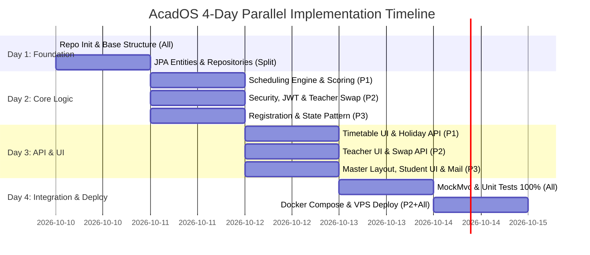

# AcadOS v4 — แผนการแบ่งงานรายบุคคลแบบละเอียด (Team Work Division & Step-by-Step Guide)

> **เอกสารอ้างอิงหลัก:** [Implement_Plan-AcadOS.md](Implement_Plan-AcadOS.md) · [database.md](database.md) · [sequence-diagrams.md](sequence-diagrams.md) · [userflow_v2.md](userflow_v2.md) · [prof_ruleset.md](prof_ruleset.md) · ไดอะแกรมทุกตัวใน `doc/diagram/`  
> **เป้าหมาย:** สมาชิกทั้ง 3 คนมีภาระงานเท่าเทียมกัน (Workload Equity), พัฒนาคู่ขนานได้ 100% โดยไม่ติดบล็อก, **ไม่มี Merge Conflict (Zero-Conflict Architecture)**, และปฏิบัติตามเกณฑ์ข้อกำหนดรายวิชา CP353002 ครบถ้วน

---

## 1. ข้อมูลสมาชิกและโครงสร้าง Git Branch

ตามเกณฑ์ข้อกำหนดรายวิชา Branch ประจำตัวของสมาชิกทุกคนต้องตั้งชื่อตามรูปแบบ `ชื่อ_รหัสนักศึกษา_section` และต้องมีประวัติการ Commit ไม่น้อยกว่า **15 Commits/คน**:

| ลำดับ | สมาชิกในทีม | รหัสนักศึกษา | Section | Git Branch ประจำตัว | ขอบเขตความรับผิดชอบหลัก (Core Track) |
|:---:|---|:---:|:---:|---|---|
| **1** | **นายพุฒิเมธ ชมศรีสวัสดิ์ (Person 1)** | 673380417-1 | Sec 3 | `puttimed_6733804171_03` | **Track A: Scheduling Engine, Timetable, Course/Room & External Holiday API** |
| **2** | **นายวงศกร สงวนกลิ่น (Person 2)** | 673380424-4 | Sec 4 | `wongsakorn_6733804244_04` | **Track B: Security & JWT, Teacher Swap Workflow, Docker & Deployment** |
| **3** | **นายจิรภัทร สีสาร (Person 3)** | 673380574-5 | Sec 3 | `jirapat_6733805745_03` | **Track C: Student Registration, Section State Pattern, Mailtrap & Master UI Layout** |

---

## 2. ตารางเปรียบเทียบความเท่าเทียมของภาระงาน (Workload Equity Matrix)

การแบ่งงานใช้หลักการ **Vertical Slicing (การแบ่งตามโดเมนฟังก์ชันครบทุกเลเยอร์)** ทำให้ทุกคนได้เขียนโค้ดตั้งแต่ระดับ Entity, Repository, Service, Design Pattern, REST Controller, DTO, Thymeleaf UI ไปจนถึง Unit/Integration Test อย่างเท่าเทียมกัน:

| มิติการประเมิน | Person 1 (พุฒิเมธ) | Person 2 (วงศกร) | Person 3 (จิรภัทร) | สรุปผลรวมระบบ |
|---|---|---|---|---|
| **Domain Entities (16 ตัว)** | 6 Entities (`Course`, `Room`, `TimeSlot`, `Schedule`, `AcademicEvent`, `PublicHoliday`) | 6 Entities (`User`, `Teacher`, `TeacherQualification`, `TeacherPreference`, `TeacherAvailability`, `TeacherSwapRequest`) | 4 Entities (`Student`, `Section`, `Registration`, `Notification`) | ครบ 16 Entities |
| **Business Logic / Services** | `SchedulingService` (Hard/Soft Constraints), `HolidayService`, `AcademicEventService` | `UserService`, `TeacherSwapService` (Snapshot, DRAFT Check, Double Swap Check), Security/JWT | `RegistrationService` (Conflict BR-03/04/05/09), `SectionCancellationService`, `NotificationService` | ครบถ้วนทุกกฎ BR-01 – BR-11 |
| **Design Patterns (GoF 4 แบบ)** | • **Strategy Pattern** (`ScoringStrategy`)<br>• **Adapter Pattern** (`HolidayProvider`) | • **Observer Pattern** (Subject/Publisher: `ScheduleChangePublisher`) | • **State Pattern** (`SectionState`)<br>• **Strategy Pattern** (`NotificationStrategy`)<br>• **Observer Pattern** (Listener) | ครบ 4 รูปแบบ (Strategy, Observer, State, Adapter) |
| **REST Controllers (11 ตัว)** | 5 Controllers (`Course`, `Room`, `Schedule`, `AcademicEvent`, `Holiday`) | 3 Controllers (`Auth`, `User`, `TeacherSwap`) + Spring Security Config | 3 Controllers (`Registration`, `Section`, `Notification`) + Swagger Config | ครบ 11 REST Controllers |
| **Frontend UI (Thymeleaf)** | หน้า Timetable Grid, หน้ารายวิชา/ห้องเรียน, ปฏิทินการศึกษา | หน้า Login, หน้า Teacher Dashboard, หน้าขอแลกคาบ (Swap UI) | โครงสร้าง Master Layout (Navbar/Sidebar/Footer/CSS), หน้า Admin Dashboard, หน้าลงทะเบียนนักศึกษา | ครบทุก Role (Admin, Teacher, Student) |
| **งาน Infrastructure & เครื่องมือ** | Unit Test Algorithm & ThailandFormats API Client | Dockerfile, Docker Compose, MySQL DB Schema Scripts & Cloud VPS Deployment | Mailtrap Sandbox Email Configuration & Swagger OpenAPI UI | ครบตามเกณฑ์ประเมิน 100% |
| **จำนวน Commit ขั้นต่ำ** | $\ge 15$ Commits | $\ge 15$ Commits | $\ge 15$ Commits | รวม $\ge 45$ Commits |

---

## 3. แผนที่การถือครองไฟล์และแพ็กเกจ (Strict File Ownership Map)

> [!IMPORTANT]
> **กฎเหล็กเพื่อป้องกัน Merge Conflict 100%:**
> สมาชิกแต่ละคนจะมีสิทธิ์สร้างและแก้ไขเฉพาะไฟล์ในโฟลเดอร์ที่ตนเองเป็นเจ้าของเท่านั้น ห้ามแก้ไขไฟล์ข้ามขอบเขตโดยไม่แจ้งล่วงหน้า

```
com.project.acados/
├── config/
│   ├── SecurityConfig.java -------------------------- [Person 2]
│   └── SwaggerConfig.java --------------------------- [Person 3]
│
├── domain/entity/
│   ├── Course, Room, TimeSlot, Schedule ------------- [Person 1]
│   ├── AcademicEvent, PublicHoliday ----------------- [Person 1]
│   ├── User, Teacher, TeacherQualification ---------- [Person 2]
│   ├── TeacherPreference, TeacherAvailability ------- [Person 2]
│   ├── TeacherSwapRequest --------------------------- [Person 2]
│   └── Student, Section, Registration, Notification - [Person 3]
│
├── repository/
│   ├── CourseRepo, RoomRepo, TimeSlotRepo ----------- [Person 1]
│   ├── ScheduleRepo, AcademicEventRepo, HolidayRepo - [Person 1]
│   ├── UserRepo, TeacherRepo, TeacherQualRepo ------- [Person 2]
│   ├── TeacherPrefRepo, TeacherAvailRepo, SwapRepo -- [Person 2]
│   └── StudentRepo, SectionRepo, RegRepo, NotifRepo - [Person 3]
│
├── pattern/
│   ├── scoring/ (Strategy: Preference, Workload, etc) [Person 1]
│   ├── holiday/ (Adapter: HolidayProvider, ThailandFormats)[Person 1]
│   ├── observer/ (Publisher & Subject) -------------- [Person 2]
│   ├── state/ (SectionState, Active, Cancelled) ----- [Person 3]
│   └── notification/ (Strategy: InApp, Email/Mailtrap)[Person 3]
│
├── service/
│   ├── SchedulingService, HolidayService ------------ [Person 1]
│   ├── AcademicEventService ------------------------- [Person 1]
│   ├── UserService, TeacherSwapService -------------- [Person 2]
│   └── RegistrationService, SectionService ---------- [Person 3]
│       ├── SectionCancellationService --------------- [Person 3]
│       └── NotificationService ---------------------- [Person 3]
│
├── controller/api/
│   ├── CourseApiController, RoomApiController ------- [Person 1]
│   ├── ScheduleApiController, HolidayApiController -- [Person 1]
│   ├── AcademicEventApiController ------------------- [Person 1]
│   ├── AuthApiController, UserApiController --------- [Person 2]
│   ├── TeacherSwapApiController --------------------- [Person 2]
│   ├── RegistrationApiController -------------------- [Person 3]
│   ├── SectionApiController ------------------------- [Person 3]
│   └── NotificationApiController -------------------- [Person 3]
│
├── templates/ (Thymeleaf Views)
│   ├── layout/ (main-layout.html, fragments) -------- [Person 3]
│   ├── timetable/ & admin/schedules.html ------------ [Person 1]
│   ├── calendar/ ------------------------------------ [Person 1]
│   ├── auth/ (login.html) & teacher/ ---------------- [Person 2]
│   └── admin/dashboard.html & student/ -------------- [Person 3]
│
└── infra / root/
    ├── Dockerfile & docker-compose.yml -------------- [Person 2]
    ├── schema.sql & data.sql ------------------------ [Person 2]
    └── application.yml / properties ----------------- [Person 2 + Person 3]
```

---

## 4. แผนงานรายบุคคลแบบละเอียด (Individual Detailed Workflows)

### 4.1 Person 1: นายพุฒิเมธ ชมศรีสวัสดิ์ (`puttimed_6733804171_03`)
**ขอบเขตงาน:** Scheduling Engine, Timetable Generation, Scoring Strategy, Holiday Adapter

#### ความรับผิดชอบหลัก:
1. **Domain & DB:** จัดการ Entity และ Repository ของ `Course`, `Room`, `TimeSlot`, `Schedule`, `AcademicEvent`, `PublicHoliday`
2. **Scheduling Engine (Core Algorithm):**
   * สร้าง `ConstraintEvaluator`: ตรวจ Hard Constraints 7 ข้อ (BR-01, BR-02, BR-06, BR-07, BR-08, BR-05 Capacity, BR-03 Time Conflict)
   * สร้าง `ScheduleSelector`: คัดเลือก Candidate ที่มีคะแนนสูงสุด พร้อมสุ่มแบบ Tie-break กรณีคะแนนเท่ากัน
   * สร้าง `SchedulingService`: Orchestrator รับคำสั่ง Generate (บันทึกเป็น DRAFT ลงใน `Schedule.room_id`), Publish (เปลี่ยน DRAFT -> PUBLISHED), และ Discard (ลบ DRAFT ทิ้ง)
3. **Design Patterns:**
   * **Strategy Pattern:** สร้าง Interface `ScoringStrategy` และ Concrete Classes: `PreferenceScoreStrategy` (+30), `WorkloadScoreStrategy` (+20), `RoomSuitabilityScoreStrategy` (+20)
   * **Adapter Pattern:** สร้าง `HolidayProvider` (Target Interface) และ `ExternalHolidayAdapter` เชื่อมต่อ ThailandFormats API (`https://thailandformats.com/api/v1/holidays/{year}`) ดึงวันหยุดไทยเข้าสู่ระบบ
4. **REST APIs & Controllers:**
   * `CourseApiController` (CRUD สมบูรณ์), `RoomApiController` (CRUD สมบูรณ์)
   * `ScheduleApiController`: `POST /generate`, `GET /schedules`, `PUT /publish`, `DELETE /discard`
   * `AcademicEventApiController` และ `HolidayApiController`
5. **Frontend:**
   * หน้าแสดงตารางสอน/ตารางเรียนรวมแบบ Grid (Timetable View)
   * หน้าแสดงปฏิทินวันหยุดราชการและกำหนดการทางวิชาการ
6. **Automated Testing:**
   * Unit Test ตรวจสอบ Hard Constraints และ Scoring Strategies
   * Integration Test ตรวจสอบกระบวนการ Generate และ Publish Schedule

---

### 4.2 Person 2: นายวงศกร สงวนกลิ่น (`wongsakorn_6733804244_04`)
**ขอบเขตงาน:** Security & Authentication (JWT), Teacher Swap Subsystem, Docker & Cloud Deployment

#### ความรับผิดชอบหลัก:
1. **Domain & DB:** จัดการ Entity และ Repository ของ `User`, `Teacher`, `TeacherQualification`, `TeacherPreference`, `TeacherAvailability`, `TeacherSwapRequest`
2. **Security & Authentication Subsystem:**
   * ตั้งค่า Spring Security 6 / Spring Boot 3.3.4 ใน `SecurityConfig`
   * สร้าง JWT Authentication Filter, Token Provider และ `BCryptPasswordEncoder`
   * จัดการ Role-based Authorization: ควบคุมสิทธิ์ระดับ Method ด้วย `@PreAuthorize` (`ADMIN`, `TEACHER`, `STUDENT`)
3. **Teacher Swap Subsystem (Business Logic & Audit Trail):**
   * สร้าง `TeacherSwapService` ตาม [Sequence Diagram 06](sequence-diagrams.md):
     * บันทึก Snapshot ของครูทั้งสองฝ่าย (`requestingTeacher`, `targetTeacher`)
     * **Double Open Swap Prevention (ความเสี่ยงที่ 2):** ตรวจสอบว่าคาบทั้งสองไม่มีคำขออื่นค้างอยู่ (PENDING / ACCEPTED) หากมีให้คืนค่า `409 Conflict`
     * **DRAFT Conflict Handling (ความเสี่ยงที่ 3A):** ตรวจจับข้อขัดแย้งกับตารางร่าง DRAFT หากชนให้ส่งคืน `409 Conflict: DRAFT Timetable Conflict`
     * อนุมัติการสลับสอน: สลับ `schedules.teacher_id` ถาวร และคงความสัมพันธ์แบบ `ON DELETE SET NULL`
4. **Design Patterns:**
   * **Observer Pattern (Subject Side):** สร้าง Interface `ScheduleChangeSubject` และคลาส `ScheduleChangePublisher` เพื่อกระจาย Event เมื่อตารางสอนถูก Publish หรือเมื่อการแลกคาบได้รับอนุมัติ
5. **REST APIs & Controllers:**
   * `AuthApiController`: `POST /api/v1/auth/login` (คืนค่า JWT)
   * `UserApiController`: จัดการบัญชีผู้ใช้
   * `TeacherSwapApiController`: `POST /teacher-swaps`, `PUT /respond`, `PUT /approve`, `PUT /reject`, `PUT /cancel`
6. **Frontend & DevOps:**
   * หน้าจอเข้าสู่ระบบ (`login.html`)
   * หน้าจอ Teacher Dashboard, จัดการเวลาว่าง (Availability) และหน้ายื่น/ตอบรับคำขอสลับสอน (Swap UI)
   * จัดทำ `Dockerfile` และ `docker-compose.yml` (เชื่อมต่อ MySQL, Port 8080, Volume `mysql_data`) และ Deploy ขึ้น Cloud Server (VPS)
7. **Automated Testing:**
   * Unit Test ทดสอบ JWT Filter และ Password Encoder
   * Integration Test ทดสอบสิทธิ์การเข้าถึง และทดสอบ Flow การสลับคาบสอนครบทั้ง 5 สถานะ

---

### 4.3 Person 3: นายจิรภัทร สีสาร (`jirapat_6733805745_03`)
**ขอบเขตงาน:** Student Registration, Section State Pattern, Mailtrap Notification, Base UI Layout & Swagger

#### ความรับผิดชอบหลัก:
1. **Domain & DB:** จัดการ Entity และ Repository ของ `Student`, `Section`, `Registration`, `Notification`
2. **Student Registration Subsystem:**
   * สร้าง `RegistrationService` ตาม [Sequence Diagram 04](sequence-diagrams.md):
     * ตรวจช่วงเวลาลงทะเบียน (BR-09 ผ่าน `AcademicEventRepository`)
     * ตรวจสถานะ Section ต้องเป็น ACTIVE (State Pattern)
     * ตรวจลงทะเบียนวิชาซ้ำ (BR-04)
     * ตรวจ Section Capacity ไม่เต็ม (BR-05)
     * ตรวจเวลาเรียนไม่ชนกับคาบอื่นของตนเอง (BR-03)
   * ฟังก์ชันถอนรายวิชา (Withdraw Course: Hard delete จาก DB)
3. **Section Cancellation Subsystem:**
   * สร้าง `SectionCancellationService`: Admin สั่งยกเลิก Section -> เปลี่ยนสถานะเป็น CANCELLED -> ลบ Registration ของนักศึกษาทั้งหมด -> Release Schedule และแจ้งเตือนทุกคน
4. **Design Patterns:**
   * **State Pattern:** สร้าง `SectionState` Interface พร้อม Concrete Classes `ActiveSectionState` และ `CancelledSectionState` สำหรับควบคุมพฤติกรรมของ Section
   * **Strategy Pattern:** สร้าง `NotificationStrategy` พร้อม `InAppNotificationStrategy` (บันทึกลง DB) และ `EmailNotificationStrategy` (ส่งเมลจริงผ่าน **Mailtrap Sandbox SMTP Port 587**)
   * **Observer Pattern (Observer Side):** สร้าง `ScheduleChangeObserver` เพื่อคอยดักฟัง Event จาก `ScheduleChangePublisher` แล้วส่ง Notification ไปยังนักศึกษาและอาจารย์ที่ได้รับผลกระทบ
5. **REST APIs & Controllers:**
   * `RegistrationApiController`: `POST /api/v1/registrations`, `DELETE /registrations/{id}`
   * `SectionApiController`: `POST /sections`, `PUT /sections/{id}`, `PUT /sections/{id}/cancel`
   * `NotificationApiController`: ดูและอัปเดตสถานะการอ่านแจ้งเตือน
   * ตั้งค่า Swagger OpenAPI 3 ใน `SwaggerConfig` (`/swagger-ui.html`)
6. **Frontend & Master Layout:**
   * ออกแบบและสร้าง Master Thymeleaf Layout (`layout/main-layout.html`, Header, Navbar, Sidebar, Footer, Responsive CSS) ที่ทุกคนจะนำไปใช้ครอบหน้าเพจของตน
   * หน้า Admin Dashboard (ภาพรวมระบบ)
   * หน้า Student Registration (ค้นหารายวิชา, เลือก Section, ลงทะเบียน, ถอนรายวิชา)
   * กล่องแจ้งเตือน (Notification Center UI)
7. **Automated Testing:**
   * Unit Test ตรวจสอบเงื่อนไขการลงทะเบียน (BR-03, BR-04, BR-05, BR-09)
   * Unit Test ตรวจสอบ State Pattern ของ Section
   * Integration Test ทดสอบการส่ง Email ผ่าน Mailtrap และ MockMvc API Test

---

## 5. แผนการดำเนินงานแบบเป็นขั้นตอน 4 วัน (Step-by-Step 4-Day Plan)



### 📅 DAY 1: Foundation, Entities & Repositories
* **ช่วงเช้า (ชั่วโมงที่ 1–2): Setup ฐานโปรเจกต์ร่วมกัน (Pairing)**
  1. Person 2 สร้างโครง Spring Boot 3.3.4 + Java 21 LTS ด้วย `pom.xml` และ Push ขึ้น `main` และ `develop`
  2. Person 1 และ Person 3 ดึง (Pull) โค้ดลงมาที่เครื่องของตนเอง และแตก Branch ของตนเอง:
     * `git checkout -b puttimed_6733804171_03`
     * `git checkout -b wongsakorn_6733804244_04`
     * `git checkout -b jirapat_6733805745_03`
* **ช่วงบ่าย: สร้าง Entity และ Repository แยกตามสิทธิ์**
  * **Person 1:** สร้าง Entity/Repo ของ `Course`, `Room`, `TimeSlot`, `Schedule`, `AcademicEvent`, `PublicHoliday`
  * **Person 2:** สร้าง Entity/Repo ของ `User`, `Teacher`, `TeacherQualification`, `TeacherPreference`, `TeacherAvailability`, `TeacherSwapRequest`
  * **Person 3:** สร้าง Entity/Repo ของ `Student`, `Section`, `Registration`, `Notification`
* **สิ้นสุด Day 1:** สมาชิกทุกคน Commit & Push งานเข้า Branch ของตนเอง -> ทำ Pull Request เข้า `develop` -> ตรวจสอบว่าแอปพลิเคชัน Start ผ่านและตาราง 16 ตัวสร้างบน MySQL สำเร็จ

---

### 📅 DAY 2: Business Logic, Services & Design Patterns
* **Person 1 (Track A):**
  1. เขียน `ConstraintEvaluator` สำหรับตรวจ Hard Constraints ครบ 7 ข้อ
  2. พัฒนา Strategy Pattern: `ScoringStrategy` (Preference, Workload, RoomSuitability)
  3. พัฒนา `SchedulingService` เมธอด `generateSchedule()`, `publishSchedule()`, `discardDraft()`
* **Person 2 (Track B):**
  1. พัฒนาระบบ Authentication: `JwtAuthenticationFilter`, `TokenProvider`, `CustomUserDetailsService`
  2. พัฒนา `TeacherSwapService`: เขียน Logic ป้องกัน Double Swap Request, จัดการ Snapshot ครู A/B, และการตรวจ DRAFT Conflict
  3. พัฒนา Observer Pattern (Subject): `ScheduleChangePublisher`
* **Person 3 (Track C):**
  1. พัฒนา State Pattern: `SectionState`, `ActiveSectionState`, `CancelledSectionState`
  2. พัฒนา `RegistrationService`: ตรวจสอบ BR-03, BR-04, BR-05, BR-09
  3. พัฒนา Strategy Pattern: `NotificationStrategy`, `InAppNotificationStrategy`, `EmailNotificationStrategy` พร้อมต่อ Mailtrap SMTP (Port 587)
  4. พัฒนา `ScheduleChangeObserver` เชื่อมต่อเข้ากับ `ScheduleChangePublisher` ของ Person 2

---

### 📅 DAY 3: REST APIs, DTOs & Thymeleaf Views
* **Person 1 (Track A):**
  1. สร้าง REST Controllers: `CourseApiController`, `RoomApiController`, `ScheduleApiController`
  2. เชื่อมต่อ ThailandFormats API ด้วย Spring `RestClient` ภายใน `ExternalHolidayAdapter`
  3. พัฒนาหน้าเว็บ Thymeleaf: Timetable Grid แสดงตารางสอน และปฏิทินวันหยุด
* **Person 2 (Track B):**
  1. สร้าง REST Controllers: `AuthApiController`, `TeacherSwapApiController`, `UserApiController`
  2. พัฒนาหน้าเว็บ Thymeleaf: `login.html`, Teacher Dashboard, หน้าขอแลกและตอบรับการแลกคาบ (Swap UI)
  3. จัดทำไฟล์ `Dockerfile` และ `docker-compose.yml`
* **Person 3 (Track C):**
  1. สร้าง REST Controllers: `RegistrationApiController`, `SectionApiController`, `NotificationApiController`
  2. สร้าง Master Layout: `templates/layout/main-layout.html` พร้อม Navigation Bar และ Responsive CSS
  3. พัฒนาหน้าเว็บ Thymeleaf: Admin Dashboard, Student Course Registration UI, และกล่องแจ้งเตือน
  4. ติดตั้งและตั้งค่า Swagger OpenAPI ใน `SwaggerConfig`

---

### 📅 DAY 4: Testing, Integration, Deployment & Demo Prep
* **ช่วงเช้า: Automated Testing (JUnit 5 + Mockito)**
  * สมาชิกทุกคนเขียน Unit Test และ Integration Test ของโมดูลตนเอง (ให้ครบตามเป้าหมายของวิชา)
  * รันคำสั่ง `mvn clean test` บนเครื่องของทุกคน ต้องได้ผลลัพธ์ **BUILD SUCCESS (Tests Passed 100%)**
* **ช่วงบ่าย: Merge & Cloud Deployment**
  1. สมาชิกทั้ง 3 คนสร้าง Pull Request รวมโค้ดเข้าสู่ `develop`
  2. ทดสอบระบบแบบ End-to-End บน `develop`
  3. Person 2 รวมโค้ดเข้าสู่ `main` และรันคำสั่ง Deploy ขึ้น Cloud Host (VPS) ด้วย Docker Compose:
     ```bash
     docker compose up -d --build
     ```
  4. ตรวจสอบการเข้าถึงผ่าน Public URL (Port 8080) และทดสอบเปิด `/swagger-ui.html`
* **ช่วงเย็น: ซักซ้อม Demo ตาม Scenario (§23.2)**
  * ทดสอบ Login ทุก Role -> ทดสอบลงทะเบียน -> ทดสอบสลับสอน -> เช็คอีเมลใน Mailtrap Inbox -> ทดสอบยกเลิก Section

---

## 6. รายการ Commit Breakdown รายบุคคล ($\ge 15$ Commits/คน)

เพื่อให้ประวัติ Git Commit สอดคล้องกับข้อกำหนดรายวิชาและสะท้อนการทำงานจริงอย่างเป็นธรรมชาติ:

### 🔹 Person 1 (นายพุฒิเมธ ชมศรีสวัสดิ์)
1. `feat: create course, room, timeslot, and schedule jpa entities`
2. `feat: add spring data jpa repositories for schedule and course models`
3. `feat: implement constraint evaluator for hard constraints br-01 and br-02`
4. `feat: implement teacher qualification and availability evaluators`
5. `feat: implement room capacity and conflict constraint checks`
6. `feat: build scheduling engine orchestrator service for draft generation`
7. `feat: implement scoring strategy pattern with preference scoring`
8. `feat: implement workload balance scoring strategy`
9. `feat: add tie-breaking randomization for candidate schedule selection`
10. `feat: implement external holiday adapter consuming thailandformats api`
11. `feat: implement course and room rest controllers with bean validation`
12. `feat: implement schedule generation, publish, and discard endpoints`
13. `feat: build responsive timetable grid view with thymeleaf`
14. `test: add unit tests for constraint evaluator and scoring strategies`
15. `test: add integration test for schedule generation lifecycle`
16. `docs: finalize scheduling engine and algorithm documentation`

### 🔹 Person 2 (นายวงศกร สงวนกลิ่น)
1. `feat: setup spring boot 3 project architecture and dependencies`
2. `feat: create user, teacher, qualification, and availability entities`
3. `feat: create teacher swap request entity with audit snapshot fields`
4. `feat: add spring data jpa repositories for users, teachers, and swaps`
5. `feat: configure spring security 6 and bcrypt password encoder`
6. `feat: implement jwt token provider and authentication filter`
7. `feat: implement user service and custom user details service`
8. `feat: implement teacher swap service with double open swap prevention`
9. `feat: add draft timetable conflict detection in teacher swap service`
10. `feat: implement schedule change publisher for observer pattern subject`
11. `feat: implement auth api controller and user management endpoints`
12. `feat: implement teacher swap api controller for request, respond, and approve`
13. `feat: build login view and teacher swap dashboard with thymeleaf`
14. `feat: create dockerfile and docker-compose configuration for cloud deploy`
15. `test: add security filter and jwt authentication unit tests`
16. `test: add teacher swap business workflow integration tests`

### 🔹 Person 3 (นายจิรภัทร สีสาร)
1. `feat: create student, section, registration, and notification entities`
2. `feat: add spring data jpa repositories for student and registration models`
3. `feat: implement section state pattern with active and cancelled states`
4. `feat: build registration service with br-03, br-04, and br-05 validation`
5. `feat: add registration period validation using academic calendar`
6. `feat: implement section cancellation service with student notification`
7. `feat: implement notification strategy pattern with in-app delivery`
8. `feat: integrate mailtrap sandbox smtp for email notification strategy`
9. `feat: implement schedule change observer to listen to timetable changes`
10. `feat: implement registration and course withdrawal rest api controllers`
11. `feat: implement section management and notification api controllers`
12. `feat: setup swagger openapi 3 documentation in swagger config`
13. `feat: build master thymeleaf layout with responsive navigation`
14. `feat: build admin dashboard and student registration views`
15. `test: add unit tests for registration validation and section state pattern`
16. `test: add rest controller mockmvc api tests for registrations`

---

## 7. กฎการทำงานร่วมกันผ่าน Git เพื่อป้องกัน Conflict 100%

1. **ห้ามทำงานบน Branch `main` หรือ `develop` โดยตรง:**
   * ทุกคนทำงานเฉพาะบน Branch ของตนเองเท่านั้น (`puttimed_...`, `wongsakorn_...`, `jirapat_...`)
2. **ก่อนเริ่มงานในแต่ละวัน:**
   * สลับไปที่ `develop` -> สั่ง `git pull origin develop` -> สลับกลับมาที่ Branch ตนเอง -> สั่ง `git merge develop` เพื่อให้โค้ดอัปเดตตรงกับส่วนกลางเสมอ
3. **การส่งงานผ่าน Pull Request (PR):**
   * เมื่อทำฟีเจอร์เสร็จ ให้ Push ขึ้น Branch ตนเอง แล้วสร้าง PR ไปยัง `develop`
   * ต้องมีสมาชิกในทีมอย่างน้อย 1 คนกด Review และ Approve ก่อนทำการ Merge
   * ห้ามเลือกใช้ `git push --force` บน Branch ส่วนกลางเด็ดขาด
4. **การจัดการ Entity ร่วมกัน:**
   * โครงสร้าง Entity ทั้ง 16 ตัวถูกตกลงและล็อกสเปกไว้ใน [database.md](database.md) และ [ER Diagram.puml](diagram/ER%20Diagram.puml) อย่างสมบูรณ์แล้ว ห้ามแก้ไขชื่อฟิลด์หรือชื่อคอลัมน์ตามอำเภอใจ

---

## 8. สรุป Checklist ก่อนส่งงาน (Final Verification)

- [ ] ทุกคนมีประวัติ Commit บน GitHub บัญชีตนเองครบ $\ge 15$ Commits
- [ ] แอปพลิเคชันรันผ่าน `mvn spring-boot:run` ได้โดยไม่มี Error
- [ ] รันคำสั่ง `mvn clean test` ผ่าน 100% ครอบคลุม Unit Test และ Integration Test
- [ ] ระบบมีครบ 4 GoF Design Patterns (Strategy, Observer, State, Adapter) และ Layered Architecture ถูกต้อง
- [ ] REST API แสดงเอกสารบน `/swagger-ui.html` ครบถ้วน
- [ ] สามารถส่ง Email แจ้งเตือนจริงผ่าน Mailtrap Sandbox SMTP
- [ ] Container ทำงานผ่าน `docker compose up -d` และออนไลน์ผ่าน Public URL บน Cloud VPS
- [ ] เอกสารและไดอะแกรมใน `doc/` อัปเดตตรงกับซอร์สโค้ดจริง 100%
