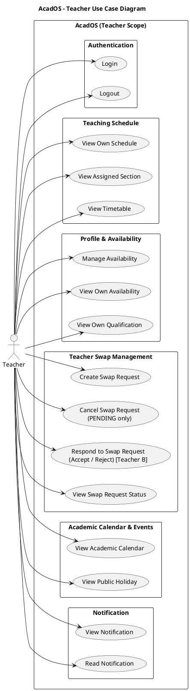
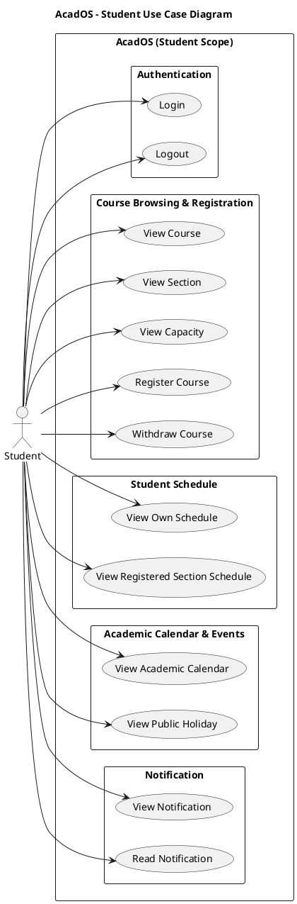

# AcadOS v4 — Use Case Diagrams

> อ้างอิง AcadOS_main §13 · ภาพอยู่ในโฟลเดอร์ `usecase-png/` (วางไว้ข้างไฟล์นี้)

### 13.4 PlantUML Use Case Diagrams

#### 13.4.1 Admin Use Case Diagram

```plantuml
@startuml
title AcadOS - Admin Use Case Diagram
left to right direction
skinparam packageStyle rectangle

actor "Admin" as Admin
actor "External Holiday API" as HolidayAPI #FEEBC8

rectangle "AcadOS (Admin Scope)" {
    package "Authentication" {
        usecase "Login" as UC_AdminLogin
        usecase "Logout" as UC_AdminLogout
    }
    package "User Management" {
        usecase "Create Teacher Account" as UC_CreateTeacher
        usecase "Create Student Account" as UC_CreateStudent
        usecase "Read Account" as UC_ReadAccount
        usecase "Update Account" as UC_UpdateAccount
        usecase "Delete Account" as UC_DeleteAccount
    }
    package "Course Management" {
        usecase "Create Course" as UC_CreateCourse
        usecase "Read Course" as UC_ReadCourse
        usecase "Update Course" as UC_UpdateCourse
        usecase "Delete Course" as UC_DeleteCourse
    }
    package "Room Management" {
        usecase "Create Room" as UC_CreateRoom
        usecase "Read Room" as UC_ReadRoom
        usecase "Update Room" as UC_UpdateRoom
        usecase "Delete Room" as UC_DeleteRoom
    }
    package "Section Management" {
        usecase "Manage Section" as UC_ManageSection
        usecase "Define Capacity" as UC_DefineCapacity
        usecase "Assign Course" as UC_AssignCourse
        usecase "Define Schedule Format\n(TBA)" as UC_DefineFormat
    }
    package "Scheduling" {
        usecase "Generate Schedule" as UC_GenSchedule
        usecase "View Generated Schedule" as UC_ViewSchedule
        usecase "Publish Schedule" as UC_PublishSchedule
        usecase "Discard Schedule" as UC_DiscardSchedule
        usecase "Override Schedule\n(TBA)" as UC_OverrideSchedule
    }
    package "System" {
        usecase "View All Schedule" as UC_ViewAllSchedule
        usecase "View Registration" as UC_ViewRegistration
    }
    package "Teacher Assignment" {
        usecase "Assign Teacher" as UC_AssignTeacher
    }
    package "Teacher Swap Approval" {
        usecase "View Swap Request" as UC_ViewSwap
        usecase "Approve Swap Request" as UC_ApproveSwap
        usecase "Reject Swap Request" as UC_RejectSwap
    }
    package "Section Cancellation" {
        usecase "Cancel Section" as UC_CancelSection
    }
    package "Academic Calendar" {
        usecase "Create Event" as UC_CreateEvent
        usecase "Read Event" as UC_ReadEvent
        usecase "Update Event" as UC_UpdateEvent
        usecase "Delete Event" as UC_DeleteEvent
    }
    package "Public Holiday" {
        usecase "View Public Holiday" as UC_ViewHoliday
        usecase "Fetch Holiday Data" as UC_FetchHoliday
    }
    package "Notification" {
        usecase "View Notification" as UC_AdminViewNotif
        usecase "Read Notification" as UC_AdminReadNotif
    }
}

Admin --> UC_AdminLogin
Admin --> UC_AdminLogout
Admin --> UC_CreateTeacher
Admin --> UC_CreateStudent
Admin --> UC_ReadAccount
Admin --> UC_UpdateAccount
Admin --> UC_DeleteAccount
Admin --> UC_CreateCourse
Admin --> UC_ReadCourse
Admin --> UC_UpdateCourse
Admin --> UC_DeleteCourse
Admin --> UC_CreateRoom
Admin --> UC_ReadRoom
Admin --> UC_UpdateRoom
Admin --> UC_DeleteRoom
Admin --> UC_ManageSection
Admin --> UC_DefineCapacity
Admin --> UC_AssignCourse
Admin --> UC_DefineFormat
Admin --> UC_GenSchedule
Admin --> UC_ViewSchedule
Admin --> UC_OverrideSchedule
Admin --> UC_ViewAllSchedule
Admin --> UC_ViewRegistration
Admin --> UC_AssignTeacher
Admin --> UC_ViewSwap
Admin --> UC_ApproveSwap
Admin --> UC_RejectSwap
Admin --> UC_CancelSection
Admin --> UC_CreateEvent
Admin --> UC_ReadEvent
Admin --> UC_UpdateEvent
Admin --> UC_DeleteEvent
Admin --> UC_ViewHoliday
Admin --> UC_AdminViewNotif
Admin --> UC_AdminReadNotif

UC_ViewSchedule <.. UC_PublishSchedule : <<extend>>
UC_ViewSchedule <.. UC_DiscardSchedule : <<extend>>

UC_FetchHoliday --> HolidayAPI
note right of UC_FetchHoliday
  System fetches automatically
  once a month (not triggered by Admin)
end note
@enduml
```

PlantUML source

#### 13.4.2 Teacher Use Case Diagram

PlantUML source

#### 13.4.3 Student Use Case Diagram

PlantUML source

