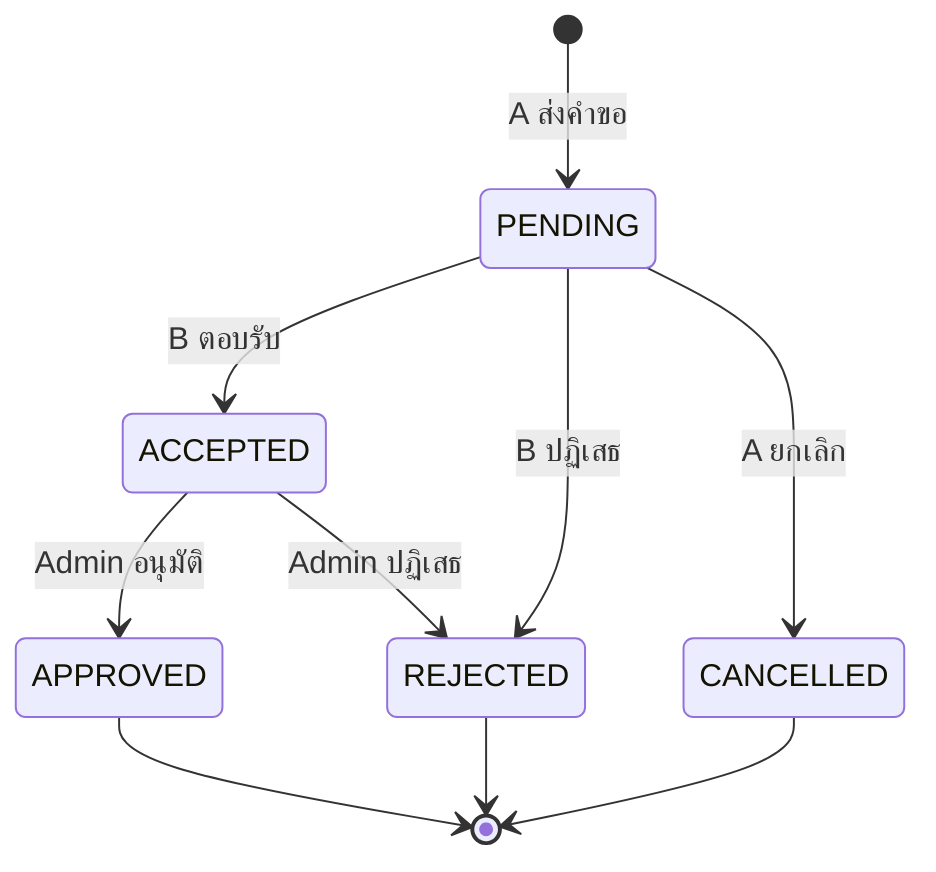
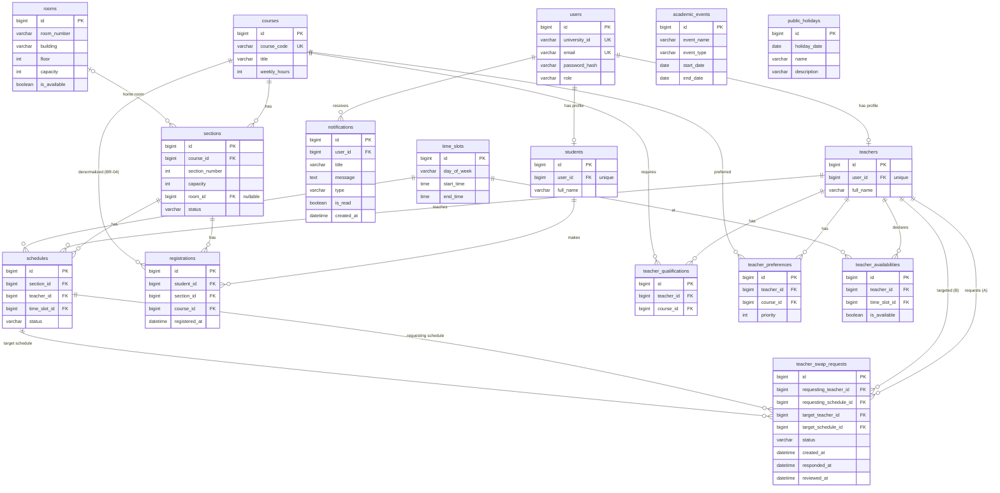

# AcadOS v4 — Database Tables

MySQL 8.x · 16 ตาราง · ตารางไหนเก็บอะไร และเชื่อมกันอย่างไร

| | |
|---|---|
| **อ้างอิง** | Acad_Lastest_v6 (§6 Entities, §9 UML Class Diagram, §11 Business Rules) · ข้อตกลง Userflow (schedules.status DRAFT / PUBLISHED, SWAP_CANCELLED) |
| **Database** | MySQL 8.0.16+ · InnoDB · utf8mb4_0900_ai_ci |
| **Primary Key** | ทุกตารางมี `id BIGINT AUTO_INCREMENT` (Java: `Long`) จึงไม่แสดงซ้ำในตารางรายละเอียด |
| **ตัวย่อ** | NN = ห้ามว่าง · UK = ห้ามซ้ำ · FK = ชี้ไปตารางอื่น |

## สารบัญ

1. [ภาพรวม 16 ตาราง](#1-ภาพรวม-16-ตาราง)
2. [รายละเอียดแต่ละตาราง](#2-รายละเอียดแต่ละตาราง)
3. [Foreign Keys](#3-foreign-keys)
4. [ER Diagram](#4-er-diagram)

---

## 1. ภาพรวม 16 ตาราง

| # | ตาราง | Entity | เก็บอะไร |
|---|---|---|---|
| 1 | `users` | User | บัญชีผู้ใช้สำหรับ login ทุก role (รวม Admin) |
| 2 | `students` | Student | ข้อมูลนักศึกษา |
| 3 | `teachers` | Teacher | ข้อมูลอาจารย์ |
| 4 | `courses` | Course | รายวิชา |
| 5 | `sections` | Section | กลุ่มเรียนของแต่ละวิชา |
| 6 | `rooms` | Room | ห้องเรียน |
| 7 | `time_slots` | TimeSlot | ช่วงวันและเวลาเรียน (รายสัปดาห์) |
| 8 | `schedules` | Schedule | ตารางสอน (1 แถว = 1 คาบ) |
| 9 | `registrations` | Registration | การลงทะเบียนเรียนของนักศึกษา |
| 10 | `teacher_qualifications` | TeacherQualification | วิชาที่อาจารย์สอนได้ |
| 11 | `teacher_preferences` | TeacherPreference | วิชาที่อาจารย์อยากสอน |
| 12 | `teacher_availabilities` | TeacherAvailability | เวลาว่างและไม่ว่างของอาจารย์ |
| 13 | `teacher_swap_requests` | TeacherSwapRequest | คำขอแลกคาบระหว่างอาจารย์ |
| 14 | `notifications` | Notification | การแจ้งเตือนของผู้ใช้ |
| 15 | `academic_events` | AcademicEvent | ปฏิทินการศึกษา |
| 16 | `public_holidays` | PublicHoliday | วันหยุดราชการ |

Admin ไม่มีตารางแยก เป็นแถวใน `users` ที่ `role = 'ADMIN'` (D03)

### ตารางเชื่อมกันอย่างไร

```text
users ─┬─ 1:0..1 ── students ── 1:N ── registrations ──┬─ N:1 ── sections
       ├─ 1:0..1 ── teachers                          └─ N:1 ── courses (copy จาก section.course, BR-04)
       └─ 1:N ───── notifications

courses ── 1:N ── sections ── N:1 ── rooms (ห้องประจำ · ทุกคาบของ Section ใช้ห้องนี้)
                     │
                     └── 1:N ── schedules ──┬─ N:1 ── teachers
                                            ├─ N:1 ── time_slots
                                            └─ 1:N ── teacher_swap_requests
                                                       (×2: คาบของ A, คาบของ B)
                                                       └─ N:1 ── teachers (×2: A, B)

teachers ── N:M ── courses     ผ่าน teacher_qualifications, teacher_preferences
teachers ── N:M ── time_slots  ผ่าน teacher_availabilities
students ── N:M ── sections    ผ่าน registrations

academic_events, public_holidays : อิสระ ไม่มี FK (FL-04)
```

---

## 2. รายละเอียดแต่ละตาราง

### 2.1 users

| คอลัมน์ | ชนิด | เงื่อนไข | เก็บอะไร |
|---|---|---|---|
| university_id | VARCHAR(20) | NN, UK | รหัสสำหรับ login (D04) |
| email | VARCHAR(255) | NN, UK | อีเมลสำหรับแจ้งเตือน (C-06) |
| password_hash | VARCHAR(100) | NN | รหัสผ่านแบบ BCrypt |
| role | VARCHAR(20) | NN, CHECK | ADMIN / TEACHER / STUDENT |

### 2.2 students

| คอลัมน์ | ชนิด | เงื่อนไข | เก็บอะไร |
|---|---|---|---|
| user_id | BIGINT | NN, UK, FK → users | บัญชีของนักศึกษา |
| full_name | VARCHAR(150) | NN | ชื่อ-นามสกุล |

### 2.3 teachers

| คอลัมน์ | ชนิด | เงื่อนไข | เก็บอะไร |
|---|---|---|---|
| user_id | BIGINT | NN, UK, FK → users | บัญชีของอาจารย์ |
| full_name | VARCHAR(150) | NN | ชื่อ-นามสกุล |

### 2.4 courses

| คอลัมน์ | ชนิด | เงื่อนไข | เก็บอะไร |
|---|---|---|---|
| course_code | VARCHAR(20) | NN, UK | รหัสวิชา |
| title | VARCHAR(255) | NN | ชื่อวิชา |
| weekly_hours | INT | NN, > 0 | ชั่วโมงเรียนต่อสัปดาห์ (D25) |

### 2.5 sections

| คอลัมน์ | ชนิด | เงื่อนไข | เก็บอะไร |
|---|---|---|---|
| course_id | BIGINT | NN, FK → courses | เป็น Sec ของวิชาไหน |
| section_number | INT | NN, > 0 | เลข Sec |
| capacity | INT | NN, > 0 | จำนวนที่นั่ง (ต้องไม่เกินความจุห้อง, BR-05) |
| room_id | BIGINT | ว่างได้, FK → rooms | ห้องประจำ (ทุกคาบของ Section ใช้ห้องนี้) |
| status | VARCHAR(20) | NN, ค่าเริ่มต้น ACTIVE | ACTIVE / CANCELLED (SectionStatus) |

ห้ามซ้ำ: (course_id, section_number) · ไม่มี teacher_id เพราะครูอยู่ที่ schedules รายคาบ (C-16)

### 2.6 rooms

| คอลัมน์ | ชนิด | เงื่อนไข | เก็บอะไร |
|---|---|---|---|
| room_number | VARCHAR(20) | NN | เลขห้อง |
| building | VARCHAR(100) | NN | อาคาร |
| floor | INT | NN | ชั้น |
| capacity | INT | NN, > 0 | ความจุ |
| is_available | BOOLEAN | NN, ค่าเริ่มต้น TRUE | ห้องใช้งานได้หรือไม่ (BR-08) |

ห้ามซ้ำ: (building, room_number)

### 2.7 time_slots

| คอลัมน์ | ชนิด | เงื่อนไข | เก็บอะไร |
|---|---|---|---|
| day_of_week | VARCHAR(10) | NN, CHECK | MONDAY ถึง SUNDAY |
| start_time | TIME | NN | เวลาเริ่ม |
| end_time | TIME | NN, > start_time | เวลาจบ |

ห้ามซ้ำ: (day_of_week, start_time, end_time) · slot คาบเกี่ยวกันได้ (D19)

### 2.8 schedules

| คอลัมน์ | ชนิด | เงื่อนไข | เก็บอะไร |
|---|---|---|---|
| section_id | BIGINT | NN, FK → sections | Sec ไหน |
| teacher_id | BIGINT | NN, FK → teachers | ใครสอน (เปลี่ยนเมื่อ Admin อนุมัติการแลกคาบ หรือ Assign Teacher) |
| time_slot_id | BIGINT | NN, FK → time_slots | เวลาไหน |
| status | VARCHAR(20) | NN, CHECK, ไม่มีค่าเริ่มต้น | DRAFT = ผล Generate รอ Admin ตรวจ (เห็นเฉพาะ Admin) · PUBLISHED = ใช้งานจริง |

ห้ามซ้ำ: (section_id, time_slot_id) · (teacher_id, time_slot_id) · วิชา 6 ชั่วโมง = 2 แถว (คาบละ 3 ชั่วโมง) · ไม่มี room_id: ห้องของคาบ = ห้องประจำของ Section (sections.room_id) · ห้องชน (BR-02) ตรวจที่ Service · status: Generate บันทึกเป็น DRAFT → Publish เปลี่ยนเป็น PUBLISHED · Discard หรือ Generate ใหม่ = ลบแถว DRAFT · Teacher / Student เห็นและใช้เฉพาะ PUBLISHED · UNIQUE นับรวม DRAFT ด้วย: Swap / Assign Teacher ที่ชนกับคาบ DRAFT ถูกปฏิเสธ ต้อง Publish หรือ Discard ก่อน

### 2.9 registrations

| คอลัมน์ | ชนิด | เงื่อนไข | เก็บอะไร |
|---|---|---|---|
| student_id | BIGINT | NN, FK → students | นักศึกษา |
| section_id | BIGINT | NN, FK → sections | Sec ที่ลงทะเบียน |
| course_id | BIGINT | NN, FK → courses | วิชาของ Sec (copy จาก section.course) |
| registered_at | DATETIME | NN, ค่าเริ่มต้นเวลาปัจจุบัน | เวลาที่ลงทะเบียน |

ห้ามซ้ำ: (student_id, section_id) (D24) · (student_id, course_id) (BR-04) · course_id copy จาก section.course ตอนลงทะเบียน

### 2.10 teacher_qualifications

| คอลัมน์ | ชนิด | เงื่อนไข | เก็บอะไร |
|---|---|---|---|
| teacher_id | BIGINT | NN, FK → teachers | อาจารย์ |
| course_id | BIGINT | NN, FK → courses | วิชาที่สอนได้ (BR-06) |

ห้ามซ้ำ: (teacher_id, course_id)

### 2.11 teacher_preferences

| คอลัมน์ | ชนิด | เงื่อนไข | เก็บอะไร |
|---|---|---|---|
| teacher_id | BIGINT | NN, FK → teachers | อาจารย์ |
| course_id | BIGINT | NN, FK → courses | วิชาที่อยากสอน (D21) |
| priority | INT | NN, ≥ 1 | ลำดับความต้องการ (1 = อยากสอนมากที่สุด) |

ห้ามซ้ำ: (teacher_id, course_id)

### 2.12 teacher_availabilities

| คอลัมน์ | ชนิด | เงื่อนไข | เก็บอะไร |
|---|---|---|---|
| teacher_id | BIGINT | NN, FK → teachers | อาจารย์ |
| time_slot_id | BIGINT | NN, FK → time_slots | ช่วงเวลา |
| is_available | BOOLEAN | NN, ไม่มีค่าเริ่มต้น | TRUE = ว่าง / FALSE = ไม่ว่าง (ห้ามจัดสอน) |

ห้ามซ้ำ: (teacher_id, time_slot_id) · ไม่มีแถว = ว่าง · ข้อมูลขัดกัน FALSE ชนะ · ตรวจแบบเวลาคาบเกี่ยว (BR-07, C-01)

### 2.13 teacher_swap_requests

| คอลัมน์ | ชนิด | เงื่อนไข | เก็บอะไร |
|---|---|---|---|
| requesting_teacher_id | BIGINT | NN, FK → teachers | อาจารย์ A (ผู้ขอ) |
| requesting_schedule_id | BIGINT | NN, FK → schedules | คาบของ A ที่จะยกให้ B |
| target_teacher_id | BIGINT | NN, FK → teachers | อาจารย์ B (ผู้ถูกขอ) |
| target_schedule_id | BIGINT | NN, FK → schedules | คาบของ B ที่จะยกให้ A |
| status | VARCHAR(20) | NN, ค่าเริ่มต้น PENDING | PENDING / ACCEPTED / REJECTED / APPROVED / CANCELLED |
| created_at | DATETIME | NN, ค่าเริ่มต้นเวลาปัจจุบัน | เวลาที่ A ส่งคำขอ |
| responded_at | DATETIME | ว่างได้ | เวลาที่ B ตอบ |
| reviewed_at | DATETIME | ว่างได้ | เวลาที่ Admin ตัดสิน |



APPROVED = สลับ `schedules.teacher_id` ของทั้ง 2 คาบแบบถาวร · Admin ปฏิเสธได้เฉพาะ ACCEPTED · A ยกเลิกได้เฉพาะ PENDING (B ยังไม่ตอบ) · ทั้ง 2 คาบต้องเป็น PUBLISHED

### 2.14 notifications

| คอลัมน์ | ชนิด | เงื่อนไข | เก็บอะไร |
|---|---|---|---|
| user_id | BIGINT | NN, FK → users | ผู้รับ |
| title | VARCHAR(200) | NN | หัวข้อ |
| message | TEXT | NN | ข้อความ |
| type | VARCHAR(40) | NN (ไม่มี CHECK) | ประเภทตาม Java Enum NotificationType: REGISTRATION_SUCCESS, REGISTRATION_WITHDRAWN, SCHEDULE_CHANGED, SWAP_REQUESTED, SWAP_RESPONDED, SWAP_APPROVED, SWAP_REJECTED, SWAP_CANCELLED, SECTION_CANCELLED, CONFLICT_DETECTED |
| is_read | BOOLEAN | NN, ค่าเริ่มต้น FALSE | อ่านแล้วหรือยัง |
| created_at | DATETIME | NN, ค่าเริ่มต้นเวลาปัจจุบัน | เวลาที่สร้าง |

### 2.15 academic_events

| คอลัมน์ | ชนิด | เงื่อนไข | เก็บอะไร |
|---|---|---|---|
| event_name | VARCHAR(200) | NN | ชื่อกิจกรรม |
| event_type | VARCHAR(30) | NN, CHECK 5 ค่า | SEMESTER_START / SEMESTER_END / REGISTRATION_PERIOD / MIDTERM_EXAM / FINAL_EXAM |
| start_date | DATE | NN | วันเริ่ม |
| end_date | DATE | NN, ≥ start_date | วันจบ |

ไม่มี FK · ใช้ตรวจช่วงลงทะเบียน (BR-09)

### 2.16 public_holidays

| คอลัมน์ | ชนิด | เงื่อนไข | เก็บอะไร |
|---|---|---|---|
| holiday_date | DATE | NN | วันที่ (Java field ชื่อ `date`) |
| name | VARCHAR(200) | NN | ชื่อวันหยุด |
| description | VARCHAR(500) | ว่างได้ | รายละเอียด |

ห้ามซ้ำ: (holiday_date, name) · ไม่มี FK · ข้อมูลมาจาก External Holiday API

---

## 3. Foreign Keys

| FK | ความสัมพันธ์ | ON DELETE | ผลเมื่อลบแถวแม่ |
|---|---|---|---|
| students.user_id → users | 1:0..1 | CASCADE | ลบโปรไฟล์ตามบัญชี |
| teachers.user_id → users | 1:0..1 | CASCADE | ลบโปรไฟล์ตามบัญชี |
| sections.course_id → courses | N:1 | RESTRICT | ลบวิชาที่ยังมี Section ไม่ได้ |
| sections.room_id → rooms | N:1 | RESTRICT | ลบห้องที่ Section ใช้อยู่ไม่ได้ |
| schedules.section_id → sections | N:1 | CASCADE | ลบคาบตาม Section |
| schedules.teacher_id / time_slot_id | N:1 | RESTRICT | ลบครู หรือ slot ที่มีคาบสอนไม่ได้ |
| registrations.student_id → students | N:1 | RESTRICT | ลบนักศึกษาที่มีประวัติลงทะเบียนไม่ได้ |
| registrations.section_id → sections | N:1 | RESTRICT | ต้องลบ registration ใน Service ก่อน |
| registrations.course_id → courses | N:1 | RESTRICT | ลบวิชาที่มีผู้ลงทะเบียนไม่ได้ |
| teacher_qualifications / teacher_preferences → teachers, courses | N:1 | CASCADE | ลบตามเจ้าของ |
| teacher_availabilities → teachers, time_slots | N:1 | CASCADE | ลบตามเจ้าของ |
| teacher_swap_requests.requesting / target teacher → teachers | N:1 | RESTRICT | รักษาประวัติคำขอ |
| teacher_swap_requests.requesting / target schedule → schedules | N:1 | CASCADE | ลบคำขอเมื่อคาบถูกลบ (แจ้งครูทั้งสองฝ่ายก่อน) |
| notifications.user_id → users | N:1 | CASCADE | ลบตามบัญชี |

---

## 4. ER Diagram



`academic_events` และ `public_holidays` ไม่มีเส้นเชื่อมกับตารางใด ตาม FL-04
