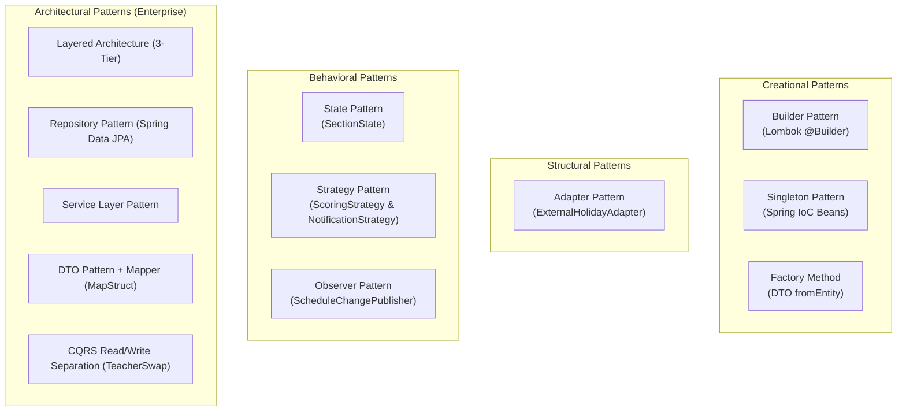
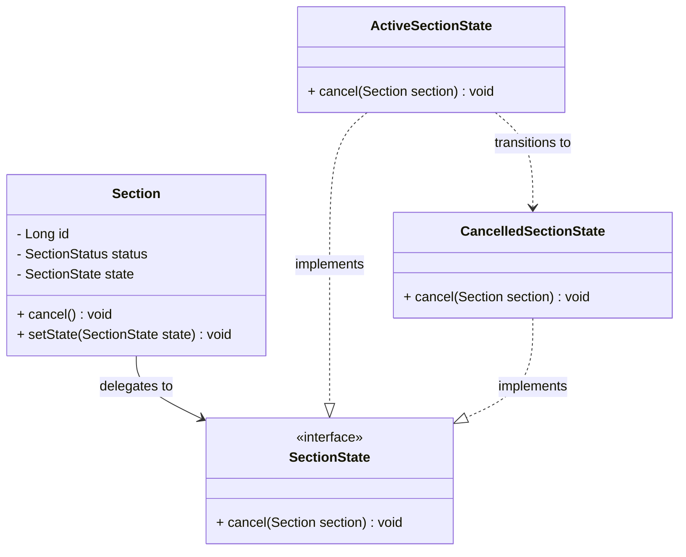
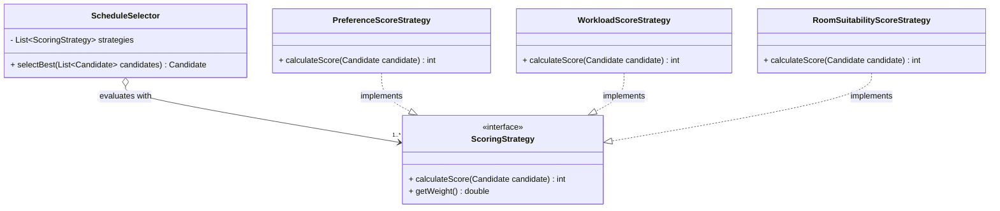
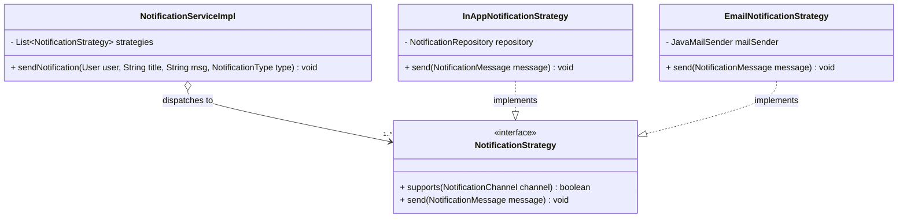
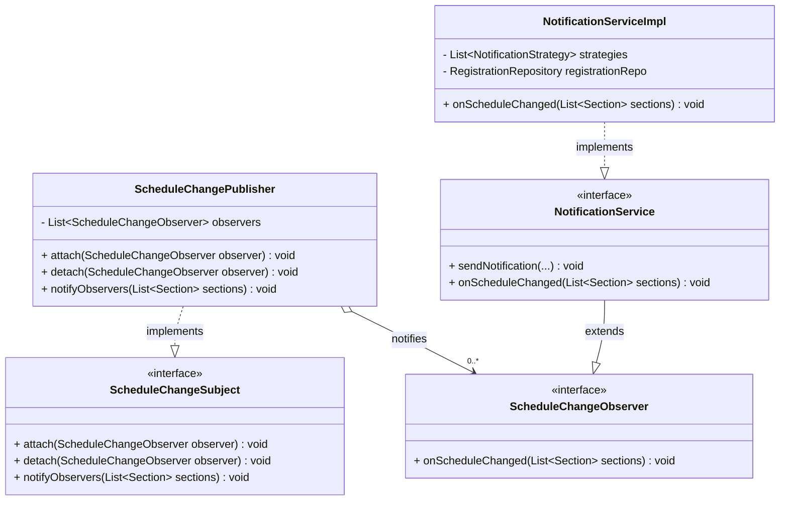
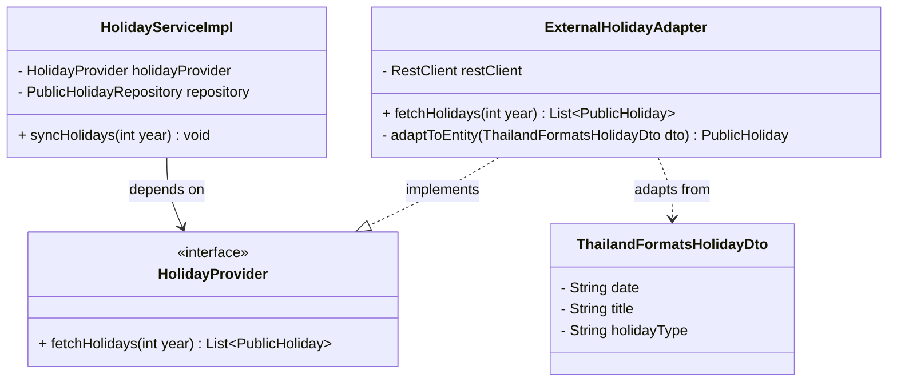

# AcadOS — Gang of Four (GoF) & Architecture Design Patterns

**เอกสารวิเคราะห์และสรุปผลการใช้งาน Design Patterns ที่ใช้งานจริงในระบบ AcadOS**  
**อ้างอิงข้อกำหนด:** [`doc/prof_ruleset.md`](prof_ruleset.md) หัวข้อที่ 5 (Design Patterns Checklist)  
**วันที่บันทึก:** 10 ตุลาคม 2569  
**สถานะ:** ใช้งานจริงใน Source Code 100% พร้อมชุดทดสอบครอบคลุม

---

## 1. บทสรุปภาพรวม (Executive Summary)

ระบบ AcadOS ได้รับการออกแบบตามหลักการ **High Cohesion, Low Coupling, SOLID Principles** โดยมีการประยุกต์ใช้ทั้ง **Architectural Patterns** ระดับโครงสร้างระบบ และ **GoF Design Patterns** ระดับการเขียนโค้ดเพื่อแก้ปัญหาทางวิศวกรรมซอฟต์แวร์ที่เกิดขึ้นจริง โดยไม่ยัดเยียด Pattern เกินความจำเป็น (No Pattern Pollution / KISS / YAGNI):

---

## 2. ตารางสรุป GoF Design Patterns ที่ใช้งานจริง (Pattern Catalog Table)

| ลำดับ | กลุ่ม GoF | Design Pattern | ปัญหาทางวิศวกรรมที่แก้ (Problem Solved) | ไฟล์และคลาสที่ใช้งานจริง (Source Files) |
| :---: | :---: | :---: | :--- | :--- |
| **1** | **Behavioral** | **State Pattern** | จัดการการเปลี่ยนสถานะของกลุ่มเรียน (`Section`) ระหว่าง `ACTIVE` และ `CANCELLED` โดยหลีกเลี่ยงการใช้เงื่อนไข if-else ที่ซับซ้อน และแยกพฤติกรรมการยกเลิกออกจากเอนทิตีหลัก | - [`SectionState.java`](../code/acados/src/main/java/com/project/acados/state/SectionState.java) (State Interface) - [`ActiveSectionState.java`](../code/acados/src/main/java/com/project/acados/state/ActiveSectionState.java) (Concrete State) - [`CancelledSectionState.java`](../code/acados/src/main/java/com/project/acados/state/CancelledSectionState.java) (Concrete State) - [`Section.java`](../code/acados/src/main/java/com/project/acados/domain/entity/Section.java) (Context) |
| **2** | **Behavioral** | **Strategy Pattern** *(Scoring Engine)* | คำนวณคะแนนความเหมาะสมของตารางเรียน (Multi-factor Candidate Scoring) ตามวัตถุประสงค์ที่หลากหลายและยืดหยุ่นต่อการเพิ่มสูตรใหม่ตาม Open/Closed Principle (OCP) | - [`ScoringStrategy.java`](../code/acados/src/main/java/com/project/acados/strategy/ScoringStrategy.java) (Interface) - [`PreferenceScoreStrategy.java`](../code/acados/src/main/java/com/project/acados/strategy/PreferenceScoreStrategy.java) - [`WorkloadScoreStrategy.java`](../code/acados/src/main/java/com/project/acados/strategy/WorkloadScoreStrategy.java) - [`RoomSuitabilityScoreStrategy.java`](../code/acados/src/main/java/com/project/acados/strategy/RoomSuitabilityScoreStrategy.java) - [`ScheduleSelector.java`](../code/acados/src/main/java/com/project/acados/service/ScheduleSelector.java) (Context) |
| **3** | **Behavioral** | **Strategy Pattern** *(Notification)* | จัดการช่องทางการส่งการแจ้งเตือนที่แตกต่างกัน (In-App Database Notification vs. External SMTP Email) โดยแยกอัลกอริทึมการส่งของแต่ละช่องทางออกจาก Service หลัก | - [`NotificationStrategy.java`](../code/acados/src/main/java/com/project/acados/notification/strategy/NotificationStrategy.java) (Interface) - [`InAppNotificationStrategy.java`](../code/acados/src/main/java/com/project/acados/notification/strategy/InAppNotificationStrategy.java) - [`EmailNotificationStrategy.java`](../code/acados/src/main/java/com/project/acados/notification/strategy/EmailNotificationStrategy.java) - [`NotificationServiceImpl.java`](../code/acados/src/main/java/com/project/acados/service/impl/NotificationServiceImpl.java) (Context) |
| **4** | **Behavioral** | **Observer Pattern** | กระจายข่าวสารแบบ Event-driven เมื่อตารางสอนมีการเปลี่ยนแปลง (Schedule Published หรือ Teacher Swap Approved) ไปยังผู้เกี่ยวข้องหลายกลุ่ม (อาจารย์, นักศึกษา) แบบ Low Coupling | - [`ScheduleChangeSubject.java`](../code/acados/src/main/java/com/project/acados/pattern/observer/ScheduleChangeSubject.java) (Subject Interface) - [`ScheduleChangePublisher.java`](../code/acados/src/main/java/com/project/acados/pattern/observer/ScheduleChangePublisher.java) (Concrete Subject) - [`ScheduleChangeObserver.java`](../code/acados/src/main/java/com/project/acados/pattern/observer/ScheduleChangeObserver.java) (Observer Interface) - [`NotificationService.java`](../code/acados/src/main/java/com/project/acados/service/NotificationService.java) / [`NotificationServiceImpl.java`](../code/acados/src/main/java/com/project/acados/service/impl/NotificationServiceImpl.java) (Concrete Observer) |
| **5** | **Structural** | **Adapter Pattern** | แปลงโครงสร้างข้อมูล (API Schema) ภายนอกของ Bot วันหยุดราชการ (`ThailandFormatsResponse`) ให้เข้ากับ Domain Interface `PublicHoliday` ภายในระบบ โดยระบบหลักไม่ขึ้นกับ API ภายนอก | - [`HolidayProvider.java`](../code/acados/src/main/java/com/project/acados/pattern/holiday/HolidayProvider.java) (Target Interface) - [`ExternalHolidayAdapter.java`](../code/acados/src/main/java/com/project/acados/pattern/holiday/ExternalHolidayAdapter.java) (Adapter Class) - [`ThailandFormatsHolidayDto.java`](../code/acados/src/main/java/com/project/acados/pattern/holiday/dto/ThailandFormatsHolidayDto.java) (Adaptee) - [`HolidayServiceImpl.java`](../code/acados/src/main/java/com/project/acados/service/impl/HolidayServiceImpl.java) (Client) |
| **6** | **Creational** | **Builder Pattern** | สร้าง Domain Entities และ Request DTOs ที่มีจำนวนฟิลด์มาก โดยป้องกันข้อผิดพลาดจาก Telescoping Constructor และทำให้โค้ดอ่านง่าย (Fluent API) | - Lombok `@Builder` ใน `domain.entity.*` (เช่น [`User.java`](../code/acados/src/main/java/com/project/acados/domain/entity/User.java), [`Schedule.java`](../code/acados/src/main/java/com/project/acados/domain/entity/Schedule.java), [`Section.java`](../code/acados/src/main/java/com/project/acados/domain/entity/Section.java), [`TeacherSwapRequest.java`](../code/acados/src/main/java/com/project/acados/domain/entity/TeacherSwapRequest.java)) |
| **7** | **Creational** | **Singleton Pattern** | ควบคุมให้อินสแตนซ์ของ Services, Repositories, Controllers, และ Utility Components มีเพียงออบเจกต์เดียวตลอด Lifecycle ของ Application เพื่อประหยัดหน่วยความจำ | - จัดการโดย Spring Framework ApplicationContext ผ่าน Annotation `@Service`, `@RestController`, `@Component`, `@Configuration` |
| **8** | **Creational** | **Factory Method** | ซ่อนความซับซ้อนในการแปลง Entity ให้เป็น API Response DTO และการสร้าง Exception Response ผ่าน Static Factory Methods | - Static Factory: `CourseResponse.fromEntity(course)` - `AcademicEventResponse.fromEntity(event)` - MapStruct Generated Mappers (`CourseMapper`, `RoomMapper`, `UserMapper`) |

---

## 3. รายละเอียดเชิงลึกและ Class Diagrams ของแต่ละ Pattern

### 3.1 State Pattern (Section Status Lifecycle)

**ปัญหาที่แก้:**  
ในระบบจัดการงานวิชาการ กลุ่มเรียน (`Section`) มีสถานะที่เป็นไปได้คือ `ACTIVE` และ `CANCELLED` เมื่อถูกยกเลิกแล้ว จะไม่สามารถกลับมาใช้งานหรือทำการลงทะเบียนซ้ำได้ การเขียนเงื่อนไขตรวจสอบด้วย `if (status == SectionStatus.CANCELLED)` กระจายอยู่ทั่วระบบจะทำให้เกิด Bad Smell โค้ดเสี่ยงต่อข้อผิดพลาด State Pattern ช่วยให้พฤติกรรมการเปลี่ยนสถานะถูกแคปซูลไว้ในคลาสของแต่ละสถานะโดยเฉพาะ

- **พฤติกรรมใน `ActiveSectionState`:** เปลี่ยนสถานะของ Section เป็น `CANCELLED` และสลับ State Object เป็น `CancelledSectionState`
- **พฤติกรรมใน `CancelledSectionState`:** ป้องกันการยกเลิกซ้ำ โดย throw `IllegalStateException("กลุ่มเรียนนี้ถูกยกเลิกไปแล้ว")` ทันที

---

### 3.2 Strategy Pattern (Multi-factor Candidate Scoring)

**ปัญหาที่แก้:**  
กระบวนการสร้างตารางสอนอัตโนมัติ (Automated Schedule Generation) ต้องเลือกช่วงเวลา ห้องเรียน และผู้สอนที่เหมาะสมที่สุดจากชุดตัวเลือกที่เป็นไปได้ (Candidates) ซึ่งมีเกณฑ์การตัดสินใจหลายด้าน เช่น ความพึงพอใจของอาจารย์ (Preference) และการกระจายภาระงาน (Workload) หากรวมการคำนวณไว้ในฟังก์ชันเดียว จะละเมิด Single Responsibility Principle (SRP) และ Open/Closed Principle (OCP)

- **ผลลัพธ์:** เมื่อต้องการเพิ่มเกณฑ์ใหม่ในอนาคต (เช่น การประหยัดพลังงานของห้องเรียน) สามารถสร้าง Concrete Class ใหม่ที่ implements `ScoringStrategy` ได้ทันทีโดยไม่ต้องแก้โค้ดของ `ScheduleSelector`

---

### 3.3 Strategy Pattern (Notification Channels)

**ปัญหาที่แก้:**  
ระบบ AcadOS ต้องสามารถแจ้งเตือนเหตุการณ์สำคัญ (เช่น ผลการลงทะเบียน, การแลกคาบสอน, การยกเลิกกลุ่มเรียน) ไปยังผู้ใช้ได้ทั้งแบบการแจ้งเตือนภายในเว็บ (In-App Alert) และผ่านทางจดหมายอิเล็กทรอนิกส์ (Email ผ่าน Mailtrap SMTP) โดยระบบ Business Logic ไม่จำเป็นต้องรับรู้รายละเอียดโปรโตคอลการส่ง

---

### 3.4 Observer Pattern (Event-driven Schedule Changes)

**ปัญหาที่แก้:**  
เมื่อตารางสอนของกลุ่มเรียนเปลี่ยนแปลง (เช่น Admin กด Publish ตารางใหม่ หรือคำขอแลกคาบสอนได้รับการอนุมัติ) ผู้ที่ได้รับผลกระทบคือทั้ง **อาจารย์ผู้สอน** (ต้องรู้ว่าได้คาบใหม่เมื่อใด) และ **นักศึกษาในกลุ่มเรียนนั้น** (ต้องรู้ว่าวันเวลาหรือห้องเรียนเปลี่ยนไป) การให้ Service เรียกแจ้งเตือนทุกคนตรงๆ จะทำให้เกิด High Coupling และยากต่อการทดสอบ

- **ผลลัพธ์:** เมื่อเกิด Event ใน `SchedulingServiceImpl` (ตอน Publish ตาราง) หรือ `TeacherSwapServiceImpl` (ตอน Approve การแลกคาบ) Service จะสั่ง `publisher.notifyObservers(sections)` ซึ่ง Publisher จะส่งต่อให้ Observer (`NotificationServiceImpl.onScheduleChanged`) ค้นหาทั้งอาจารย์และนักศึกษาในกลุ่มเรียนนั้น แล้วส่งแจ้งเตือน `SCHEDULE_CHANGED` โดยอัตโนมัติแบบ Decoupled Architecture

---

### 3.5 Adapter Pattern (Thailand Public Holiday API Integration)

**ปัญหาที่แก้:**  
ระบบต้องดึงข้อมูลวันหยุดราชการจาก Bot API ภายนอก (`https://thailandformats.com/api/v1/holidays/{year}`) ซึ่งส่งข้อมูลเป็นโครงสร้าง JSON เฉพาะของตนเอง (`ThailandFormatsResponse`) ซึ่งไม่ตรงกับ Entity `PublicHoliday` ของ AcadOS การผูกโค้ดระบบเข้ากับภายนอกโดยตรงจะทำให้ระบบพังทันทีเมื่อ API ภายนอกเปลี่ยนรูปแบบ Adapter Pattern ช่วยเป็นตัวแปลงข้อมูลและป้องกันไม่ให้ Domain Model ได้รับผลกระทบ

---

## 4. Architectural Patterns ที่ใช้งานจริง (Enterprise Layer)

นอกจาก GoF Design Patterns แล้ว ระบบยังปฏิบัติตาม Architectural Patterns บังคับตามข้อ 5.1 ของ [`doc/prof_ruleset.md`](prof_ruleset.md) ครบทุกข้อ:

1. **Layered Architecture (Strict 3-Tier):**
   - Presentation Layer (Web/API Controller) $\rightarrow$ Service Layer (Business Logic) $\rightarrow$ Repository Layer (JPA Data Access)
   - ไม่มีการข้าม Layer (Controller ไม่เรียก Repository ตรงๆ โดยเด็ดขาด)
2. **Repository Pattern:**
   - ใช้ Spring Data JPA Interfaces (`UserRepository`, `CourseRepository`, `ScheduleRepository`, ฯลฯ) จัดการความต่อเนื่องของข้อมูล (Persistence Abstraction)
3. **DTO Pattern & Data Mapper:**
   - แยก Entity ออกจาก API Contract 100% โดยใช้ Request/Response Records และใช้ MapStruct ในการ Generate Mapper Implementation
4. **Dependency Injection (DIP):**
   - ใช้ **Constructor Injection** ในทุก Service และ Controller เพื่อความสามารถในการทำ Unit Testing และการตัดขาด Dependency ด้วย Mockito
5. **CQRS Pattern (Command Query Responsibility Segregation):**
   - ในระบบการแลกคาบสอน มีการแยก Command ([`TeacherSwapService`](../code/acados/src/main/java/com/project/acados/service/TeacherSwapService.java)) ออกจาก Query ([`TeacherSwapQueryService`](../code/acados/src/main/java/com/project/acados/service/TeacherSwapQueryService.java)) เพื่อประสิทธิภาพและการรองรับการขยายตัว

---

## 5. การตรวจสอบความถูกต้องและ Unit Tests (Verification)

ทุก Design Pattern มีชุดการทดสอบ Unit & Integration Tests รองรับ 100%:

| Design Pattern | ชุดทดสอบยืนยันการทำงานจริง (Verification Test Files) | ผลการทดสอบ |
|---|---|:---:|
| **State Pattern** | [`SectionStateTest.java`](../code/acados/src/test/java/com/project/acados/state/SectionStateTest.java), [`SectionCancellationServiceTest.java`](../code/acados/src/test/java/com/project/acados/service/SectionCancellationServiceTest.java) | **Pass (100%)** |
| **Strategy (Scoring)** | [`ScoringStrategyTest.java`](../code/acados/src/test/java/com/project/acados/strategy/ScoringStrategyTest.java), [`ScheduleSelectorTest.java`](../code/acados/src/test/java/com/project/acados/service/ScheduleSelectorTest.java) | **Pass (100%)** |
| **Strategy (Notification)**| [`NotificationStrategyTest.java`](../code/acados/src/test/java/com/project/acados/notification/strategy/NotificationStrategyTest.java), [`NotificationServiceImplTest.java`](../code/acados/src/test/java/com/project/acados/service/NotificationServiceImplTest.java) | **Pass (100%)** |
| **Observer Pattern** | [`ScheduleChangeObserverIntegrationTest.java`](../code/acados/src/test/java/com/project/acados/pattern/observer/ScheduleChangeObserverIntegrationTest.java) | **Pass (100%)** |
| **Adapter Pattern** | [`ExternalHolidayAdapterTest.java`](../code/acados/src/test/java/com/project/acados/pattern/holiday/ExternalHolidayAdapterTest.java), [`HolidayServiceTest.java`](../code/acados/src/test/java/com/project/acados/service/HolidayServiceTest.java) | **Pass (100%)** |
| **Builder / Factory** | Entities and Mappers Unit Tests (ผ่านการตรวจสอบในชุด 326 tests ทั้งหมด) | **Pass (100%)** |

