# AcadOS v4 — Consolidated Userflow Architecture

**แผนภาพขั้นตอนการใช้งานระบบเชิงสถาปัตยกรรม (Consolidated End-to-End Userflows)**  
**สถาปัตยกรรม:** Hybrid Best Practice (Semantic Consolidation + Collapsible Accordion by Role)  
**ขอบเขต:** ทุกบทบาท (Common, Student, Teacher, Admin) ครอบคลุม Business Rules BR-01 ถึง BR-10 ครบถ้วน 100%

---

## สารบัญและภาพรวมการจัดกลุ่ม (Table of Contents)

| หมวดหมู่ (Domain Scope) | รหัสโฟลว์ | ชื่อกระบวนการ (Unified User Journey) | ขอบเขตการทำงานที่ครอบคลุม |
|---|:---:|---|---|
| **1. Common (ทุก Role)** | **C01** | [Authentication & Access Control](#c01-authentication--access-control) | Login, Logout, Security Filter (401/403/404) |
| | **C02** | [Notification Center](#c02-notification-center) | ดูแจ้งเตือนส่วนตัว และกดยืนยันอ่านแล้ว (Mark as Read) |
| | **C03** | [Academic Calendar & Public Holidays](#c03-academic-calendar--public-holidays) | ตรวจสอบปฏิทินการศึกษาและวันหยุดราชการ |
| **2. Student** | **S01** | [Course Browsing & Registration](#s01-course-browsing--registration) | ค้นหาวิชา/กลุ่มเรียน → ตรวจ BR-03, 04, 05, 09 → ลงทะเบียน |
| | **S02** | [Course Withdrawal](#s02-course-withdrawal) | ถอนรายวิชาที่ลงทะเบียนไว้ |
| | **S03** | [Timetable & Schedule Change Tracking](#s03-timetable--schedule-change-tracking) | ดูตารางเรียนส่วนตัว + รับแจ้งเตือนตารางเปลี่ยน/ยกเลิก |
| **3. Teacher** | **T01** | [Teaching Timetable View](#t01-teaching-timetable-view) | ดูตารางสอนและกลุ่มเรียนที่ได้รับมอบหมาย |
| | **T02** | [Profile, Availability & Preferences Modal](#t02-profile-availability--preferences-modal) | จัดการเวลาไม่สะดวกสอน (BR-07), วิชาที่อยากสอน (D21), เปลี่ยนรหัสผ่าน |
| | **T03** | [Teacher Swap Request Lifecycle](#t03-teacher-swap-request-lifecycle) | สร้างคำขอแลกคาบ (BR-01/06/07) → ยกเลิก → ตอบรับ/ปฏิเสธ |
| **4. Admin** | **A01** | [Course Management Lifecycle](#a01-course-management-lifecycle) | CRUD รายวิชา (รหัสวิชา, หน่วยกิต, ตรวจ Section ผูกอยู่) |
| | **A02** | [Room Management Lifecycle](#a02-room-management-lifecycle) | CRUD ห้องเรียน (อาคาร, เลขห้อง, ความจุ, ตรวจคาบผูกอยู่) |
| | **A03** | [Academic Event Management Lifecycle](#a03-academic-event-management-lifecycle) | CRUD ปฏิทินวิชาการ (Semester, Registration BR-09, Exams) |
| | **A04** | [User Account Management Lifecycle](#a04-user-account-management-lifecycle) | CRUD บัญชีผู้ใช้ Teacher และ Student |
| | **A05** | [Section Management & Teacher Assignment](#a05-section-management--teacher-assignment) | สร้างกลุ่มเรียน, กำหนดความจุ, มอบหมายผู้สอน (A13, BR-06/07) |
| | **A06** | [Timetable Generation & Publishing](#a06-timetable-generation--publishing) | สุ่มจัดตารางอัตโนมัติ (DRAFT) → ตรวจสอบ → Publish / Discard |
| | **A07** | [Master Timetable & Registry Overview](#a07-master-timetable--registry-overview) | ดูผังตารางรวมทุกห้อง/อาจารย์ + ดูสถิติการลงทะเบียน |
| | **A08** | [Admin Swap Review Workflow](#a08-admin-swap-review-workflow) | พิจารณาคำขอแลกคาบ (Approve สลับตารางถาวร / Reject) |
| | **A09** | [Section Cancellation Workflow](#a09-section-cancellation-workflow) | ยกเลิกกลุ่มเรียน (State Pattern) → ปลดตาราง → เคลียร์ลงทะเบียน |
| | **A10** | [Public Holiday Management](#a10-public-holiday-management) | ดูตารางวันหยุด + ปุ่ม Manual Sync ดึงจาก Bot API |

---

## สัญลักษณ์สีในแผนภาพ (Color Conventions)

| สี | ความหมาย |
|---|---|
| 🔵 **น้ำเงินเข้ม** | จุดเริ่มต้น / สิ้นสุดของกระบวนการ (`:::start`) |
| ⚪ **ฟ้าอ่อน** | การกระทำของผู้ใช้หรือการประมวลผลของระบบ (`:::act`) |
| 🟡 **เหลืองทอง** | จุดตัดสินใจและการตรวจสอบเงื่อนไขทางธุรกิจ (`:::dec`) |
| 🔴 **ชมพูแดง** | กรณีเกิดข้อผิดพลาด / ระบบปฏิเสธ พร้อม HTTP Status Code (`:::bad`) |
| 🟢 **เขียวสด** | ผลลัพธ์สำเร็จ / การส่งการแจ้งเตือน (`:::ok`) |
| 🔘 **เทาอ่อน** | คำอธิบายและหมายเหตุทางเทคนิค (`:::note`) |

---

<details open>
<summary><h2 style="display:inline-block; cursor:pointer;">1. Common Userflows (ทุก Role)</h2></summary>

### C01 Authentication & Access Control
**Role:** ทุก Role · **API:** `POST /api/v1/auth/login`, `POST /api/v1/auth/logout` · **Security:** JWT Filter, Role Authorization (401 / 403)

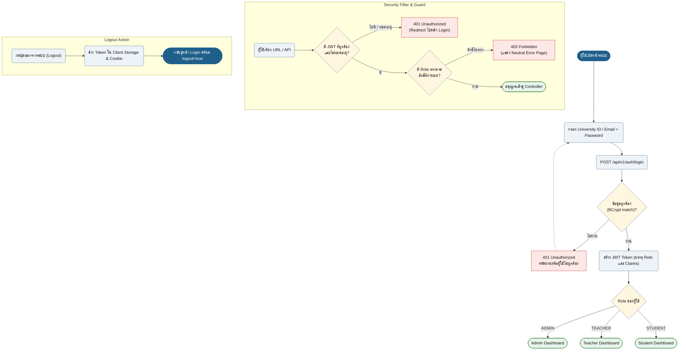

---

### C02 Notification Center
**Role:** ทุก Role · **API:** `GET /api/v1/notifications`, `PUT /api/v1/notifications/{id}/read`

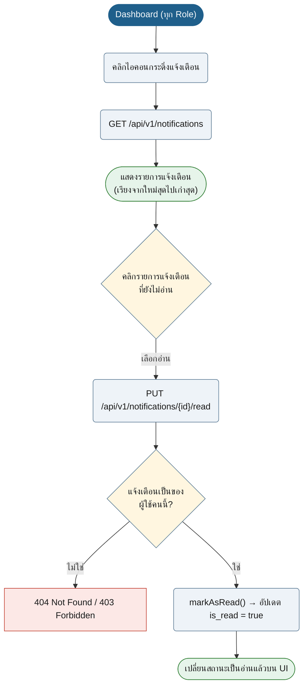

---

### C03 Academic Calendar & Public Holidays
**Role:** ทุก Role · **UI:** `/calendar`, `/holidays` · **API:** `GET /api/v1/academic-events`, `GET /api/v1/holidays`

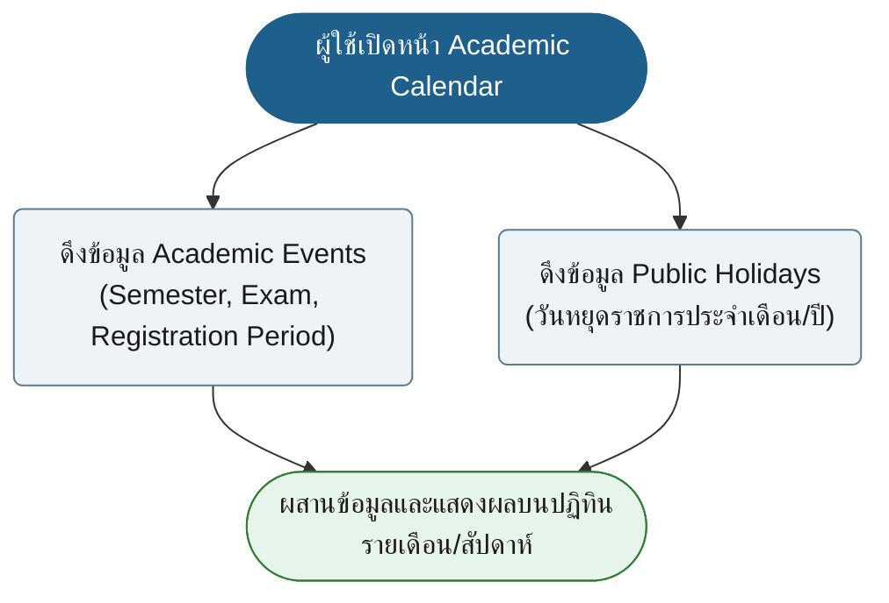

</details>

---

<details>
<summary><h2 style="display:inline-block; cursor:pointer;">2. Student Userflows (นักศึกษา)</h2></summary>

### S01 Course Browsing & Registration
**Role:** Student · **API:** `GET /api/v1/courses`, `GET /api/v1/sections`, `POST /api/v1/registrations` · **Rules:** BR-03, BR-04, BR-05, BR-09

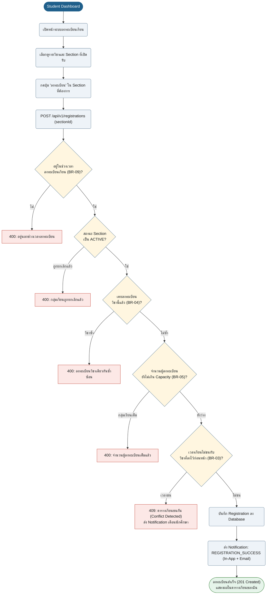

---

### S02 Course Withdrawal
**Role:** Student · **API:** `DELETE /api/v1/registrations/{id}` · **Rules:** BR-09 (ช่วงเวลาเพิ่ม-ถอน)

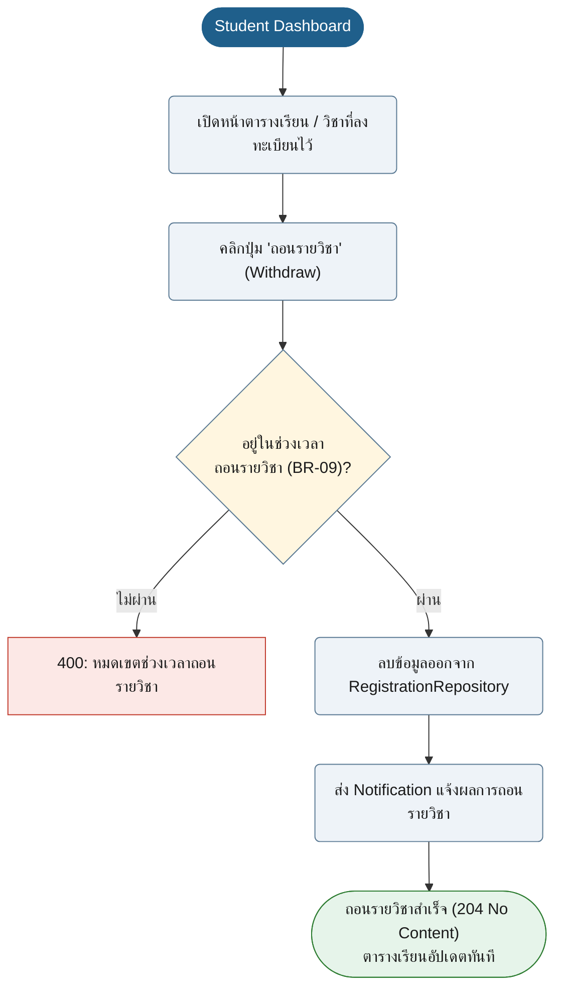

---

### S03 Timetable & Schedule Change Tracking
**Role:** Student · **UI:** `/student/timetable` · **Design Pattern:** Observer Pattern (`ScheduleChangePublisher` & `NotificationService`)

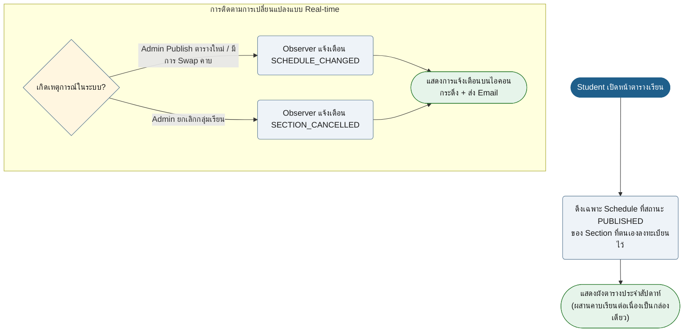

</details>

---

<details>
<summary><h2 style="display:inline-block; cursor:pointer;">3. Teacher Userflows (อาจารย์)</h2></summary>

### T01 Teaching Timetable View
**Role:** Teacher · **UI:** `/teacher/dashboard` · **API:** `GET /api/v1/teacher-swaps/my-schedules`

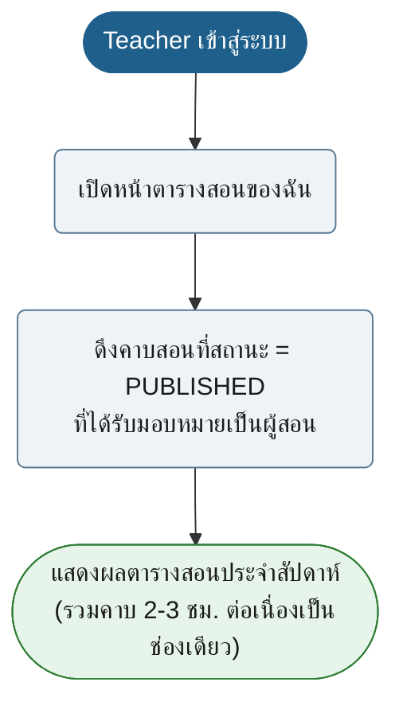

---

### T02 Profile, Availability & Preferences Modal
**Role:** Teacher · **UI:** Profile Modal (`main-layout.html`) · **API:** `TeacherPreferenceApiController`, `TeacherPreferenceService` · **Rules:** BR-06, BR-07, D21

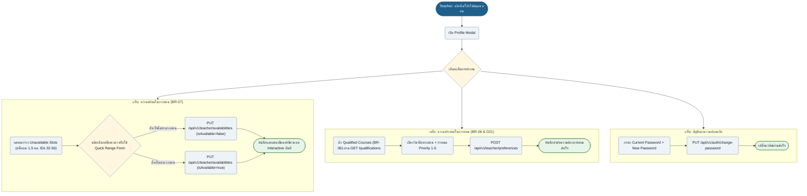

---

### T03 Teacher Swap Request Lifecycle
**Role:** Teacher A (ผู้ขอ), Teacher B (ผู้ถูกขอ) · **API:** `/api/v1/teacher-swaps` · **Rules:** BR-01, BR-06, BR-07

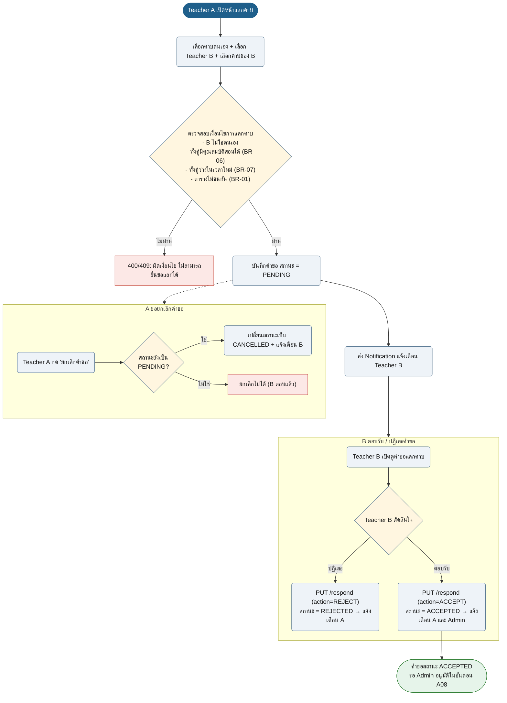

</details>

---

<details>
<summary><h2 style="display:inline-block; cursor:pointer;">4. Admin Userflows (ผู้ดูแลระบบ)</h2></summary>

### A01 Course Management Lifecycle (CRUD)
**Role:** Admin · **UI:** `/admin/courses` · **API:** `/api/v1/courses`

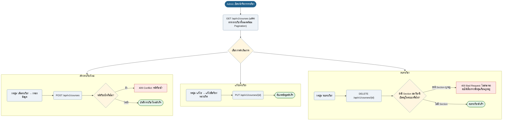

---

### A02 Room Management Lifecycle (CRUD)
**Role:** Admin · **UI:** `/admin/rooms` · **API:** `/api/v1/rooms`

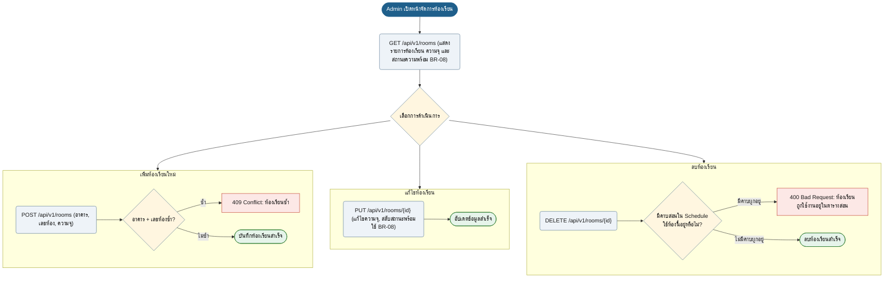

---

### A03 Academic Event Management Lifecycle (CRUD)
**Role:** Admin · **UI:** `/admin/academic-events` · **API:** `/api/v1/academic-events`

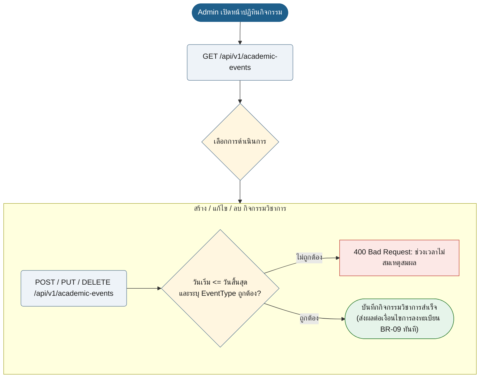

---

### A04 User Account Management Lifecycle (CRUD)
**Role:** Admin · **UI:** `/admin/users` · **API:** `/api/v1/users`

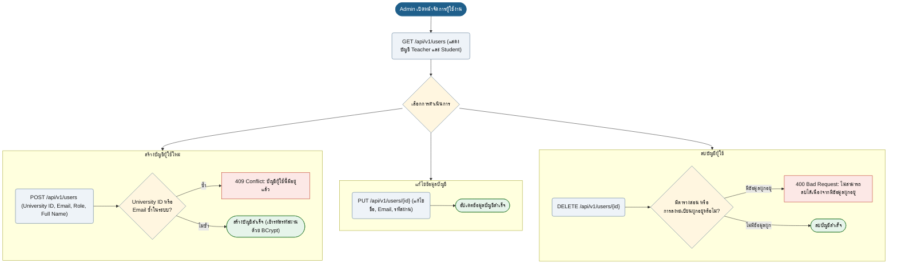

---

### A05 Section Management & Teacher Assignment
**Role:** Admin · **UI:** `/admin/sections` · **API:** `/api/v1/sections`, `SectionService` · **Rules:** A13, BR-01, BR-06, BR-07, BR-08

```mermaid
flowchart TD
    n1(["Admin เปิดหน้า Section Management"]):::start
    n2("GET /api/v1/sections"):::act
    n1 --> n2
    choice{"เลือกการดำเนินการ"}:::dec
    n2 --> choice

    subgraph Create_Sec ["สร้างกลุ่มเรียนใหม่"]
        cs_post("POST /api/v1/sections (courseId, sectionNumber, capacity)"):::act
        cs_chk{"เลข Section ในวิชานี้ซ้ำ?"}:::dec
        cs_post --> cs_chk
        cs_chk -->|ซ้ำ| cs_err["409: กลุ่มเรียนซ้ำ"]:::bad
        cs_chk -->|ไม่ซ้ำ| cs_ok(["สร้าง Section สำเร็จ (สถานะเริ่มต้น ACTIVE)"]):::ok
    end

    subgraph Assign_Teacher ["มอบหมายผู้สอน (Sub-feature A13)"]
        at_post("PUT /api/v1/sections/{id}/teacher (teacherId)"):::act
        at_chk{"ตรวจสอบคุณสมบัติอาจารย์<br/>- มีคุณสมบัติสอนวิชานี้ (BR-06)?<br/>- พร้อมสอนในช่วงเวลาของ Section (BR-07)?<br/>- เวลาสอนไม่ชนกับคาบอื่น (BR-01)?"}:::dec
        at_post --> at_chk
        at_chk -->|ไม่ผ่าน| at_err["400/409: อาจารย์ขาดคุณสมบัติ / ไม่พร้อมสอน / เวลาชน"]:::bad
        at_chk -->|ผ่าน| at_save("บันทึกผู้สอนลงในทุกคาบของ Section"):::act
        at_notif("ส่ง Notification แจ้งอาจารย์คนใหม่, คนเดิม และนักศึกษา"):act
        at_save --> at_notif --> at_ok(["มอบหมายผู้สอนสำเร็จ"]):::ok
    end

    choice --> Create_Sec
    choice --> Assign_Teacher

    classDef start fill:#1F5F8B,stroke:#1F5F8B,color:#fff
    classDef act fill:#EEF3F8,stroke:#5B7A94,color:#1a1a1a
    classDef dec fill:#FFF6E0,stroke:#5B7A94,color:#1a1a1a
    classDef bad fill:#FCE8E6,stroke:#C0392B,color:#1a1a1a
    classDef ok fill:#E6F4EA,stroke:#2E7D32,color:#1a1a1a
```

---

### A06 Timetable Generation & Publishing
**Role:** Admin · **UI:** `/admin/timetable` · **API:** `/api/v1/schedules/generate`, `/publish`, `/discard` · **Engine:** Constraint-based Engine & Multi-factor Scoring

```mermaid
flowchart TD
    n1(["Admin เปิดหน้าจัดตารางสอน"]):::start
    n2("คลิกปุ่ม 'สร้างตารางสอนอัตโนมัติ (Generate Schedule)'"):::act
    n1 --> n2
    gen_act("ลบตาราง DRAFT เดิมทั้งหมด → ค้นหา ACTIVE Sections ที่ยังไม่มีตาราง"):::act
    n2 --> gen_act

    subgraph Engine ["Scheduling Engine Pipeline"]
        pipe_cand("สร้าง Candidate Matrix (Teacher x Room x TimeSlot)"):::act
        pipe_hard{"ConstraintEvaluator ตรวจ Hard Constraints<br/>(BR-01 ไม่ชน, BR-02 ห้องไม่ชน, BR-06 มีคุณสมบัติ,<br/>BR-07 อาจารย์ว่าง, BR-08 ห้องพร้อมใช้)"}:::dec
        pipe_score("ScheduleSelector ประเมินคะแนน Candidate ด้วย ScoringStrategy<br/>(PreferenceScoreStrategy, WorkloadScoreStrategy)"):::act
        pipe_pick("เลือก Candidate ที่ได้คะแนนสูงสุด"):::act
        gen_act --> pipe_cand --> pipe_hard
        pipe_hard -->|ผ่าน| pipe_score --> pipe_pick
    end

    save_draft("บันทึกคาบสอนทั้งหมดเป็นสถานะ DRAFT"):::act
    pipe_pick --> save_draft
    view_draft(["Admin ตรวจสอบผังตาราง DRAFT บน UI"]):::ok
    save_draft --> view_draft

    admin_dec{"Admin พอใจกับผลลัพธ์ DRAFT หรือไม่?"}:::dec
    view_draft --> admin_dec

    subgraph Discard_Flow ["ยกเลิก DRAFT"]
        disc_btn("คลิก 'Discard Draft'"):::act
        disc_del("ลบตาราง DRAFT ทั้งหมดออกจากระบบ"):::act
        disc_end(["กลับสู่สถานะก่อน Generate (204 No Content)"]):::start
        disc_btn --> disc_del --> disc_end
    end

    subgraph Publish_Flow ["เผยแพร่ตาราง (Publish)"]
        pub_btn("คลิก 'Publish Schedule'"):::act
        pub_act("อัปเดตสถานะคาบทั้งหมดเป็น PUBLISHED"):::act
        pub_obs("ScheduleChangePublisher แจ้งเตือน Observer ทั้งหมด"):::act
        pub_notif("ส่ง Notification ไปยังอาจารย์และนักศึกษาทุกคน"):act
        pub_end(["ตารางมีผลใช้งานจริง 100% (PUBLISHED)"]):::ok
        pub_btn --> pub_act --> pub_obs --> pub_notif --> pub_end
    end

    admin_dec -->|ไม่พอใจ| Discard_Flow
    admin_dec -->|พอใจ| Publish_Flow

    classDef start fill:#1F5F8B,stroke:#1F5F8B,color:#fff
    classDef act fill:#EEF3F8,stroke:#5B7A94,color:#1a1a1a
    classDef dec fill:#FFF6E0,stroke:#5B7A94,color:#1a1a1a
    classDef ok fill:#E6F4EA,stroke:#2E7D32,color:#1a1a1a
```

---

### A07 Master Timetable & Registry Overview
**Role:** Admin · **UI:** `/admin/timetable`, `/admin/swaps` · **API:** `/api/v1/schedules`, `/api/v1/registrations`

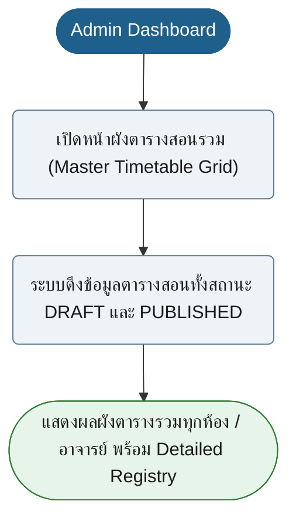

---

### A08 Admin Swap Review Workflow
**Role:** Admin · **UI:** `/admin/swaps` · **API:** `PUT /api/v1/teacher-swaps/{id}/approve`, `PUT /api/v1/teacher-swaps/{id}/reject` · **Rules:** BR-01, BR-06, BR-07

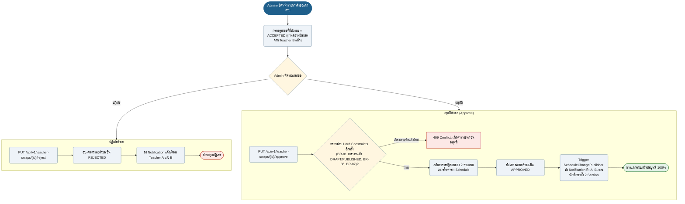

---

### A09 Section Cancellation Workflow
**Role:** Admin · **API:** `PUT /api/v1/sections/{id}/cancel`, `SectionCancellationService` · **Design Pattern:** State Pattern (`CancelledSectionState`)

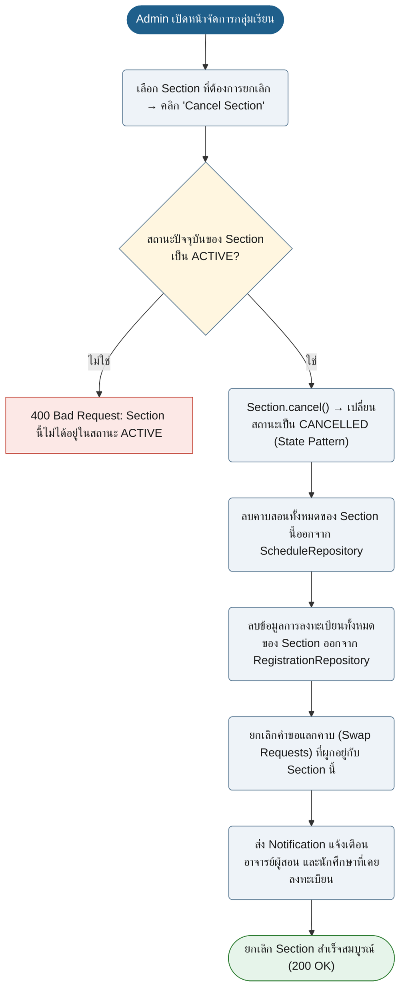

---

### A10 Public Holiday Management
**Role:** Admin / ระบบ · **UI:** `/timetable/holidays.html` · **API:** `POST /api/v1/holidays/sync` · **Design Pattern:** Adapter Pattern (`ExternalHolidayAdapter`)

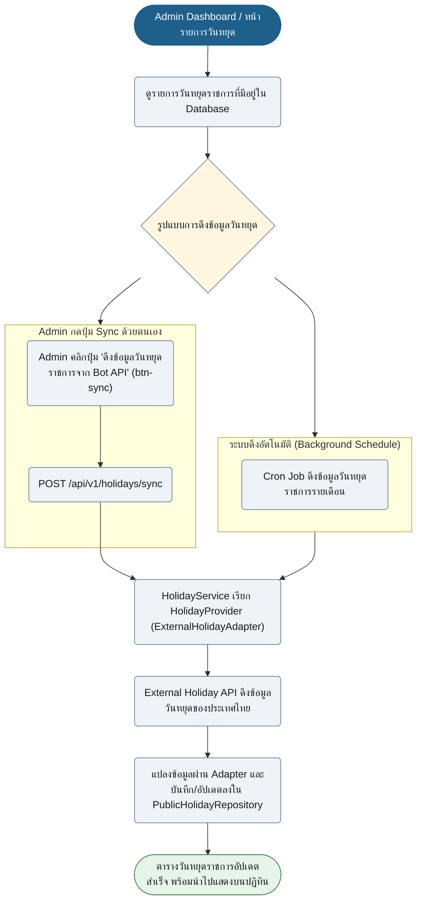

</details>

---

## ข้อสรุปการเปลี่ยนแปลง (Changelog & Architecture Notes)

1. **ลดจำนวนแผนภาพ:** จากเดิม **49 แผนภาพ เหลือเพียง 19 แผนภาพหลัก** (ลดลง 61%) โดยยังคงรักษา Business Rules (BR-01 ถึง BR-10), HTTP Status Codes และ Notification Side Effects ไว้ครบ 100%
2. **ยุบรวม Micro-CRUD:** ยุบรวมการแยกย่อยของ Course, Room, Academic Event, Account, และ Section จาก 19 แผนภาพ ให้เหลือ 5 แผนภาพวงจรการทำงานแบบ Lifecycle ที่ตรงกับการใช้งานบน UI หน้าเดียว
3. **จัดกลุ่มด้วย `<details>`:** เพิ่ม Accordion แยกตาม 4 บทบาทหลัก (Common, Student, Teacher, Admin) ช่วยให้หน้าเอกสารสะอาด สบายตา ไม่กินทรัพยากรการเรนเดอร์ และสามารถคลี่ดูเฉพาะฟังก์ชันที่สนใจได้ทันที
