# AcadOS v4 — Userflow ทุก Feature

ราย Sub-feature · Admin, Teacher, Student · 49 แผนภาพ

| | |
|---|---|
| **อ้างอิง** | AcadOS_main (§3, §5, §11–§16) · รายการสิทธิ์ราย Role (AcadOS_7) · Database Design Specification ฉบับปรับปรุง 2026-10-09 |
| **ขอบเขต** | ทุก Feature ที่ Role ทำได้ รวม Feature ที่เดิมเป็น TBA (Account, Section, Assign Teacher) ตามข้อตกลงของทีม |

## สารบัญ

| รหัส | Sub-feature | Role |
|---|---|---|
| C01 | [Login](#c01-login) | ทุก Role |
| C02 | [Logout](#c02-logout) | ทุก Role |
| C03 | [เข้าถึงข้อมูลตาม Role](#c03-เข้าถึงข้อมูลตาม-role) | ทุก Role |
| C04 | [ดู Notification](#c04-ดู-notification) | ทุก Role |
| C05 | [อ่าน Notification](#c05-อ่าน-notification) | ทุก Role |
| C06 | [ดู Academic Calendar / Public Holiday](#c06-ดู-academic-calendar--public-holiday) | ทุก Role |
| S01 | [ดู Course ที่เปิดให้ลงทะเบียน](#s01-ดู-course-ที่เปิดให้ลงทะเบียน) | Student |
| S02 | [ดู Section / Capacity / Schedule ของ Section](#s02-ดู-section--capacity--schedule-ของ-section) | Student |
| S03 | [ลงทะเบียนเรียน](#s03-ลงทะเบียนเรียน) | Student |
| S04 | [ถอนรายวิชา](#s04-ถอนรายวิชา) | Student |
| S05 | [ดูตารางเรียนของตัวเอง / Schedule ของ Section ที่ลงทะเบียน](#s05-ดูตารางเรียนของตัวเอง--schedule-ของ-section-ที่ลงทะเบียน) | Student |
| S06 | [เห็นการเปลี่ยนแปลง Schedule / Section ถูกยกเลิก](#s06-เห็นการเปลี่ยนแปลง-schedule--section-ถูกยกเลิก) | Student |
| T01 | [ดู Schedule / Section ที่ได้รับ / Timetable](#t01-ดู-schedule--section-ที่ได้รับ--timetable) | Teacher |
| T02 | [กำหนด / แก้ไข / ลบ Availability](#t02-กำหนด--แก้ไข--ลบ-availability) | Teacher |
| T03 | [ดู Availability ของตัวเอง](#t03-ดู-availability-ของตัวเอง) | Teacher |
| T04 | [ดู Qualification ของตัวเอง](#t04-ดู-qualification-ของตัวเอง) | Teacher |
| T05 | [สร้าง Swap Request (Teacher A)](#t05-สร้าง-swap-request-teacher-a) | Teacher |
| T06 | [ตอบรับ / ปฏิเสธ Swap Request ของ Teacher คนอื่น (Teacher B)](#t06-ตอบรับ--ปฏิเสธ-swap-request-ของ-teacher-คนอื่น-teacher-b) | Teacher |
| T07 | [ยกเลิก Swap Request ของตัวเอง (เฉพาะ PENDING)](#t07-ยกเลิก-swap-request-ของตัวเอง-เฉพาะ-pending) | Teacher |
| T08 | [ดูสถานะ Swap Request](#t08-ดูสถานะ-swap-request) | Teacher |
| A01-1 | [Read Course](#a01-1-read-course) | Admin |
| A01-2 | [Create Course](#a01-2-create-course) | Admin |
| A01-3 | [Update Course](#a01-3-update-course) | Admin |
| A01-4 | [Delete Course](#a01-4-delete-course) | Admin |
| A02-1 | [Read Room](#a02-1-read-room) | Admin |
| A02-2 | [Create Room](#a02-2-create-room) | Admin |
| A02-3 | [Update Room](#a02-3-update-room) | Admin |
| A02-4 | [Delete Room](#a02-4-delete-room) | Admin |
| A03-1 | [Generate Schedule](#a03-1-generate-schedule) | Admin |
| A03-2 | [View Generated Schedule (Publish / Discard)](#a03-2-view-generated-schedule-publish--discard) | Admin |
| A04 | [ดูตารางสอนรวม / การลงทะเบียน](#a04-ดูตารางสอนรวม--การลงทะเบียน) | Admin |
| A05 | [ดู Swap Request](#a05-ดู-swap-request) | Admin |
| A06 | [Approve Swap Request](#a06-approve-swap-request) | Admin |
| A07 | [Reject Swap Request](#a07-reject-swap-request) | Admin |
| A08 | [Cancel Section](#a08-cancel-section) | Admin |
| A09-1 | [Read Academic Event](#a09-1-read-academic-event) | Admin |
| A09-2 | [Create Academic Event](#a09-2-create-academic-event) | Admin |
| A09-3 | [Update Academic Event](#a09-3-update-academic-event) | Admin |
| A09-4 | [Delete Academic Event](#a09-4-delete-academic-event) | Admin |
| A10-1 | [Fetch Public Holiday (ระบบดึงอัตโนมัติ)](#a10-1-fetch-public-holiday-ระบบดึงอัตโนมัติ) | ระบบ |
| A10-2 | [ดูข้อมูล Holiday ที่บันทึกไว้](#a10-2-ดูข้อมูล-holiday-ที่บันทึกไว้) | Admin |
| A11-1 | [Read Account](#a11-1-read-account) | Admin |
| A11-2 | [Create Teacher / Student Account](#a11-2-create-teacher--student-account) | Admin |
| A11-3 | [Update Account](#a11-3-update-account) | Admin |
| A11-4 | [Delete Account](#a11-4-delete-account) | Admin |
| A12-1 | [Read Section](#a12-1-read-section) | Admin |
| A12-2 | [Create Section (Define Capacity / Assign Course)](#a12-2-create-section-define-capacity--assign-course) | Admin |
| A12-3 | [Update Section](#a12-3-update-section) | Admin |
| A13 | [Assign Teacher (ทั้ง Section)](#a13-assign-teacher-ทั้ง-section) | Admin |

## สัญลักษณ์

| รูป | ความหมาย |
|---|---|
| น้ำเงินเข้ม | จุดเริ่มต้น / จุดสิ้นสุด |
| ฟ้าอ่อน | การกระทำของผู้ใช้หรือระบบ |
| เหลือง (ข้าวหลามตัด) | จุดตัดสินใจ / การตรวจเงื่อนไข |
| แดง | ระบบปฏิเสธ พร้อมเหตุผล |
| เขียว | ผลลัพธ์สำเร็จ / การแจ้งเตือน |
| เส้นประ | กลับไปทำซ้ำ / ไปต่อที่แผนภาพอื่น / หมายเหตุ |

## ข้อตกลงที่ใช้ (เอกสารไม่ได้ระบุ ทีมตัดสินใจแล้ว)

| เรื่อง | ข้อสรุป |
|---|---|
| Swap | แลกคาบ A ↔ B · B ตอบรับ แล้ว Admin อนุมัติ · อนุมัติแล้วสลับอาจารย์ 2 คาบแบบถาวร |
| ยกเลิก Swap | Teacher A (ผู้ขอแลก) ยกเลิกได้เฉพาะตอน PENDING คือ B ยังไม่กดตอบรับหรือปฏิเสธ → CANCELLED · แจ้ง B · B ตอบแล้วยกเลิกไม่ได้ · B ยกเลิกไม่ได้ |
| Admin ปฏิเสธ Swap | ได้เฉพาะคำขอ ACCEPTED |
| Schedule Conflict (Swap) | สองคาบอยู่คนละช่วงเวลา และไม่มีคำขอค้างบนคาบเดียวกัน |
| แจ้งเตือน Swap | ส่งคำขอ → B · B ตอบรับ → A + Admin · B ปฏิเสธ → A · อนุมัติ → A + B (+Email) และนักศึกษา 2 Section · Admin ปฏิเสธ → A + B |
| Generate | ผลลัพธ์เป็น DRAFT (เห็นเฉพาะ Admin) · Generate ใหม่ = ทิ้ง DRAFT เดิม · ไม่มีการแจ้งเตือนตอน Generate |
| View Generated Schedule | Admin ตรวจ DRAFT ก่อนใช้ (§3) · Publish → PUBLISHED แล้วแจ้งอาจารย์ที่ได้คาบใหม่ + นักศึกษาของ Section ที่ตารางเปลี่ยน · ไม่พอใจ → Discard แล้ว Generate ใหม่ |
| PUBLISHED เท่านั้น | Teacher / Student เห็นและใช้เฉพาะคาบที่ PUBLISHED (S02, S05, T01, T05, A13) · Admin เห็นทั้งสองสถานะ (A04) |
| Conflict (นักศึกษา) | ลงทะเบียนแล้วเวลาชน (BR-03) → แจ้งเตือน Conflict Detected |
| Availability | ระบุได้ทั้ง ว่าง / ไม่พร้อมสอน · ลบค่าที่ระบุได้ (กลับเป็นไม่ระบุ) · ไม่ระบุ = ว่าง · ทับกันและมีไม่พร้อม = ไม่ว่าง |
| Cancel Section | Release Schedule = ลบคาบสอน · แจ้งทั้งสองฝ่ายของคำขอแลกคาบที่เกี่ยวข้อง |
| University Event | ตัดออกทุก Role (มี Academic Event + Public Holiday แล้ว) |
| Public Holiday | ระบบดึงจาก External API เองเดือนละครั้ง · Admin ไม่ต้องกดดึง ดูอย่างเดียว (A10-2) |
| Logout | กลับหน้า Login · ระบบ Stateless ไม่มี Token Blacklist (§15.3) |
| Admin System | ทำเฉพาะ "ดู" ตารางสอนรวมและการลงทะเบียน (A04) |
| Account Management | Admin สร้าง / แก้ไข / ลบบัญชี Teacher และ Student · Admin กำหนดรหัสผ่านเอง · แก้ได้เฉพาะชื่อ, email, รหัสผ่าน (University ID และ role แก้ไม่ได้) |
| Section Management | สร้าง (Course, เลข Sec, Capacity) และแก้ไข Capacity (จัดสรรห้องเรียนรายคาบใน Schedule) · ไม่มีการลบ ใช้ Cancel แทน |
| Assign Teacher | มอบหมายทั้ง Section (ทุกคาบ) · ได้เฉพาะ Section ที่มีคาบแล้ว · แจ้งอาจารย์คนใหม่ คนเดิม และนักศึกษาใน Section |

## ยังเป็น TBA (ไม่มีแผนภาพ)

| Feature | หมายเหตุ |
|---|---|
| Define Schedule Format (รูปแบบการแบ่งคาบของ Section) | §3 Section Management · D26 · A03-1 ใช้ขั้น "แบ่งคาบเรียน" แต่ยังไม่มีรายละเอียด |
| Schedule Override (BR-10) | §3 TBA |
| สูตร Room Suitability (+20) | §28 ข้อ 6 · D35 |
| Body ของ PUT /teacher-swaps/{id}/respond | §28 ข้อ 5 |
| Endpoint ที่ยังไม่มีใน §16 | C-12: Academic Calendar, Account, Section, Assign Teacher, ดูการลงทะเบียน (Admin), Publish / Discard |
| กลุ่มนักศึกษา (Student Conflict ตอน Generate) | Database Spec C-08 |
| ตรวจสอบ Notification System | ไม่มีรายละเอียดในเอกสาร |

---

## ทุก Role

### C01 Login

**Role:** ทุก Role · **อ้างอิง:** §13.2 Authentication · §15.1 · §16 POST /auth/login

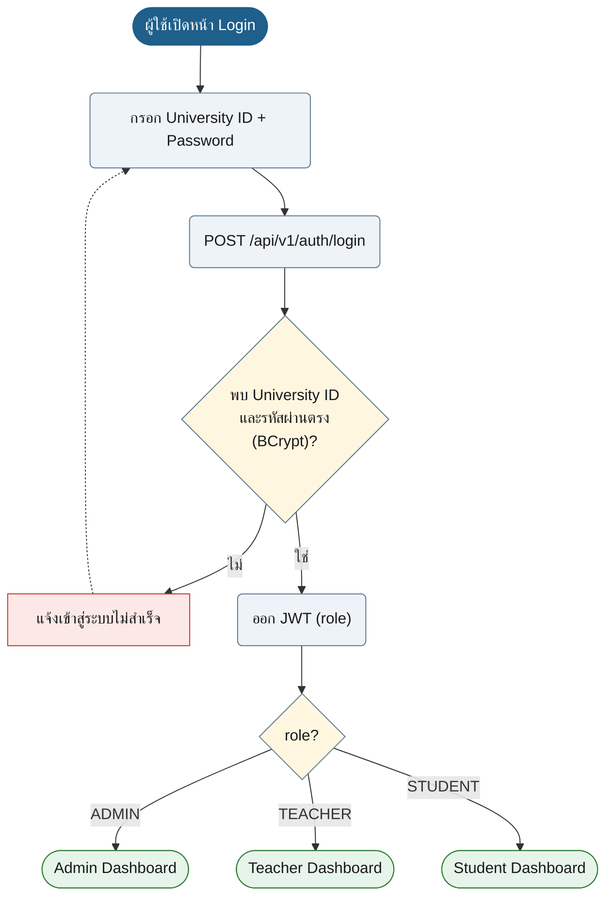
```mermaid
flowchart TD
    n1(["ผู้ใช้เปิดหน้า Login"]):::start
    n2("กรอก University ID + Password"):::act
    n3("POST /api/v1/auth/login"):::act
    n1 --> n2
    n2 --> n3
    n4{"พบ University ID<br/>และรหัสผ่านตรง<br/>(BCrypt)?"}:::dec
    n3 --> n4
    n5["แจ้งเข้าสู่ระบบไม่สำเร็จ"]:::bad
    n4 -->|ไม่| n5
    n5 -.-> n2
    n6("ออก JWT (role)"):::act
    n4 -->|ใช่| n6
    n7{"role?"}:::dec
    n6 --> n7
    n8(["Admin Dashboard"]):::ok
    n9(["Teacher Dashboard"]):::ok
    n10(["Student Dashboard"]):::ok
    n7 -->|ADMIN| n8
    n7 -->|TEACHER| n9
    n7 -->|STUDENT| n10
    classDef start fill:#1F5F8B,stroke:#1F5F8B,color:#fff
    classDef act fill:#EEF3F8,stroke:#5B7A94,color:#1a1a1a
    classDef dec fill:#FFF6E0,stroke:#5B7A94,color:#1a1a1a
    classDef bad fill:#FCE8E6,stroke:#C0392B,color:#1a1a1a
    classDef ok fill:#E6F4EA,stroke:#2E7D32,color:#1a1a1a
    classDef note fill:#F4F4F4,stroke:#999,color:#1a1a1a
```

### C02 Logout

**Role:** ทุก Role · **อ้างอิง:** §13.2 Authentication · §15.1 · §15.3

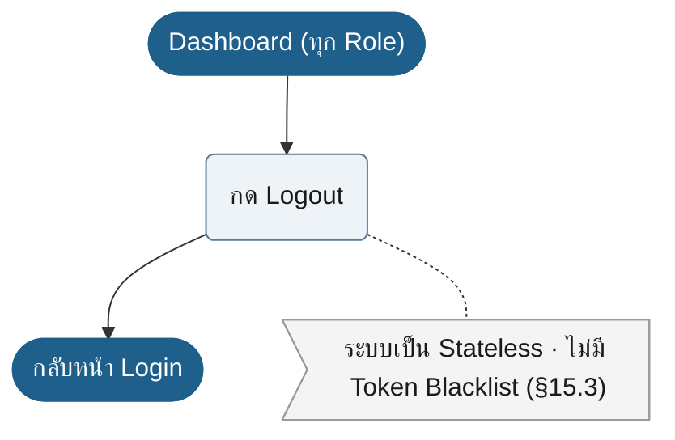
```mermaid
flowchart TD
    n1(["Dashboard (ทุก Role)"]):::start
    n2("กด Logout"):::act
    n3(["กลับหน้า Login"]):::start
    n1 --> n2
    n2 --> n3
    n4>"ระบบเป็น Stateless · ไม่มี Token Blacklist (§15.3)"]:::note
    n2 -.- n4
    classDef start fill:#1F5F8B,stroke:#1F5F8B,color:#fff
    classDef act fill:#EEF3F8,stroke:#5B7A94,color:#1a1a1a
    classDef dec fill:#FFF6E0,stroke:#5B7A94,color:#1a1a1a
    classDef bad fill:#FCE8E6,stroke:#C0392B,color:#1a1a1a
    classDef ok fill:#E6F4EA,stroke:#2E7D32,color:#1a1a1a
    classDef note fill:#F4F4F4,stroke:#999,color:#1a1a1a
```

### C03 เข้าถึงข้อมูลตาม Role

**Role:** ทุก Role · **อ้างอิง:** §5.1 Layering Rules · §13.3 Actor Permission Restrictions · §15.2 Role Matrix

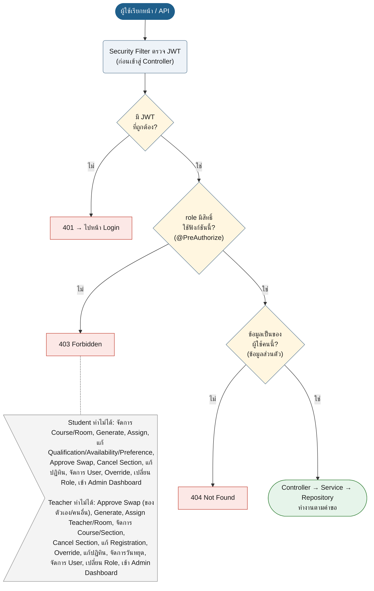
```mermaid
flowchart TD
    n1(["ผู้ใช้เรียกหน้า / API"]):::start
    n2("Security Filter ตรวจ JWT<br/>(ก่อนเข้าสู่ Controller)"):::act
    n1 --> n2
    n3{"มี JWT<br/>ที่ถูกต้อง?"}:::dec
    n2 --> n3
    n4["401 → ไปหน้า Login"]:::bad
    n3 -->|ไม่| n4
    n5{"role มีสิทธิ์<br/>ใช้ฟังก์ชันนี้?<br/>(@PreAuthorize)"}:::dec
    n3 -->|ใช่| n5
    n6["403 Forbidden"]:::bad
    n5 -->|ไม่| n6
    n7{"ข้อมูลเป็นของ<br/>ผู้ใช้คนนี้?<br/>(ข้อมูลส่วนตัว)"}:::dec
    n5 -->|ใช่| n7
    n8["404 Not Found"]:::bad
    n7 -->|ไม่| n8
    n9(["Controller → Service → Repository<br/>ทำงานตามคำขอ"]):::ok
    n7 -->|ใช่| n9
    n10>"Student ทำไม่ได้: จัดการ Course/Room, Generate, Assign, แก้ Qualification/Availability/Preference,<br/>Approve Swap, Cancel Section, แก้ปฏิทิน, จัดการ User, Override, เปลี่ยน Role, เข้า Admin Dashboard<br/><br/>Teacher ทำไม่ได้: Approve Swap (ของตัวเอง/คนอื่น), Generate, Assign Teacher/Room, จัดการ Course/Section,<br/>Cancel Section, แก้ Registration, Override, แก้ปฏิทิน, จัดการวันหยุด, จัดการ User, เปลี่ยน Role, เข้า Admin Dashboard"]:::note
    n6 -.- n10
    classDef start fill:#1F5F8B,stroke:#1F5F8B,color:#fff
    classDef act fill:#EEF3F8,stroke:#5B7A94,color:#1a1a1a
    classDef dec fill:#FFF6E0,stroke:#5B7A94,color:#1a1a1a
    classDef bad fill:#FCE8E6,stroke:#C0392B,color:#1a1a1a
    classDef ok fill:#E6F4EA,stroke:#2E7D32,color:#1a1a1a
    classDef note fill:#F4F4F4,stroke:#999,color:#1a1a1a
```

### C04 ดู Notification

**Role:** ทุก Role · **อ้างอิง:** §13.2 Notification · §14.5 · §16 GET /notifications

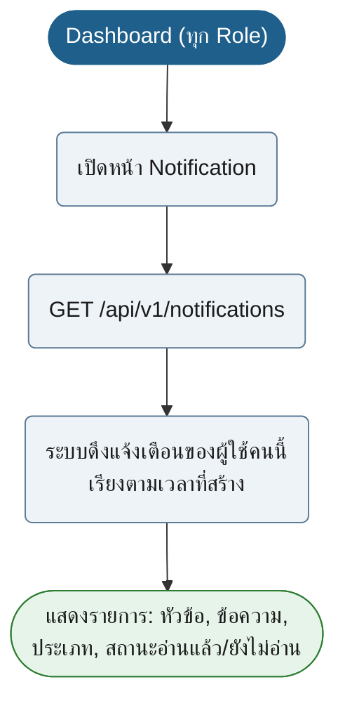
```mermaid
flowchart TD
    n1(["Dashboard (ทุก Role)"]):::start
    n2("เปิดหน้า Notification"):::act
    n3("GET /api/v1/notifications"):::act
    n4("ระบบดึงแจ้งเตือนของผู้ใช้คนนี้<br/>เรียงตามเวลาที่สร้าง"):::act
    n5(["แสดงรายการ: หัวข้อ, ข้อความ,<br/>ประเภท, สถานะอ่านแล้ว/ยังไม่อ่าน"]):::ok
    n1 --> n2
    n2 --> n3
    n3 --> n4
    n4 --> n5
    classDef start fill:#1F5F8B,stroke:#1F5F8B,color:#fff
    classDef act fill:#EEF3F8,stroke:#5B7A94,color:#1a1a1a
    classDef dec fill:#FFF6E0,stroke:#5B7A94,color:#1a1a1a
    classDef bad fill:#FCE8E6,stroke:#C0392B,color:#1a1a1a
    classDef ok fill:#E6F4EA,stroke:#2E7D32,color:#1a1a1a
    classDef note fill:#F4F4F4,stroke:#999,color:#1a1a1a
```

### C05 อ่าน Notification

**Role:** ทุก Role · **อ้างอิง:** §10.1 Notification.markAsRead() · §16 PUT /notifications/{id}/read

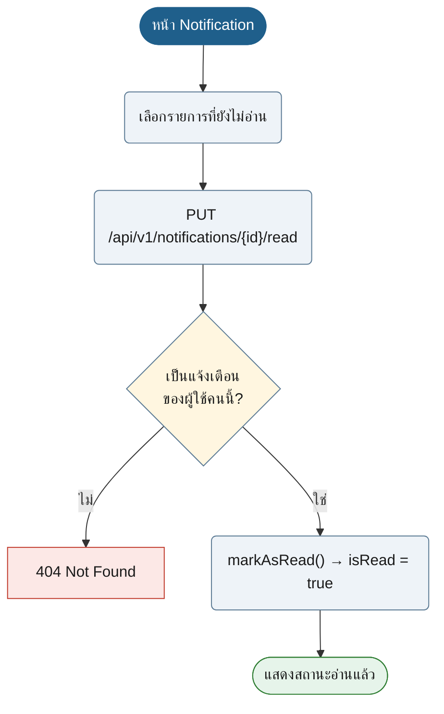
```mermaid
flowchart TD
    n1(["หน้า Notification"]):::start
    n2("เลือกรายการที่ยังไม่อ่าน"):::act
    n3("PUT /api/v1/notifications/{id}/read"):::act
    n1 --> n2
    n2 --> n3
    n4{"เป็นแจ้งเตือน<br/>ของผู้ใช้คนนี้?"}:::dec
    n3 --> n4
    n5["404 Not Found"]:::bad
    n4 -->|ไม่| n5
    n6("markAsRead() → isRead = true"):::act
    n4 -->|ใช่| n6
    n7(["แสดงสถานะอ่านแล้ว"]):::ok
    n6 --> n7
    classDef start fill:#1F5F8B,stroke:#1F5F8B,color:#fff
    classDef act fill:#EEF3F8,stroke:#5B7A94,color:#1a1a1a
    classDef dec fill:#FFF6E0,stroke:#5B7A94,color:#1a1a1a
    classDef bad fill:#FCE8E6,stroke:#C0392B,color:#1a1a1a
    classDef ok fill:#E6F4EA,stroke:#2E7D32,color:#1a1a1a
    classDef note fill:#F4F4F4,stroke:#999,color:#1a1a1a
```

### C06 ดู Academic Calendar / Public Holiday

**Role:** ทุก Role · **อ้างอิง:** §13.2 Academic Calendar & Events · §14.7 · FL-04 · ไม่มี University Event

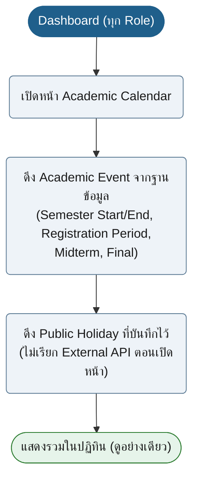
```mermaid
flowchart TD
    n1(["Dashboard (ทุก Role)"]):::start
    n2("เปิดหน้า Academic Calendar"):::act
    n3("ดึง Academic Event จากฐานข้อมูล<br/>(Semester Start/End, Registration Period,<br/>Midterm, Final)"):::act
    n4("ดึง Public Holiday ที่บันทึกไว้<br/>(ไม่เรียก External API ตอนเปิดหน้า)"):::act
    n5(["แสดงรวมในปฏิทิน (ดูอย่างเดียว)"]):::ok
    n1 --> n2
    n2 --> n3
    n3 --> n4
    n4 --> n5
    classDef start fill:#1F5F8B,stroke:#1F5F8B,color:#fff
    classDef act fill:#EEF3F8,stroke:#5B7A94,color:#1a1a1a
    classDef dec fill:#FFF6E0,stroke:#5B7A94,color:#1a1a1a
    classDef bad fill:#FCE8E6,stroke:#C0392B,color:#1a1a1a
    classDef ok fill:#E6F4EA,stroke:#2E7D32,color:#1a1a1a
    classDef note fill:#F4F4F4,stroke:#999,color:#1a1a1a
```

---

## Student

### S01 ดู Course ที่เปิดให้ลงทะเบียน

**Role:** Student · **อ้างอิง:** §13.2.3 View Course · §16 GET /courses

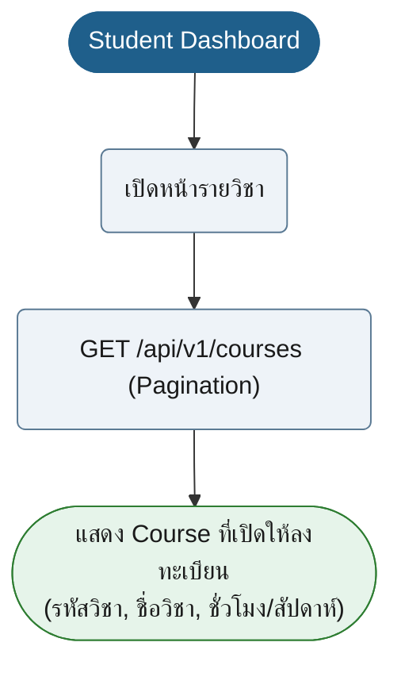
```mermaid
flowchart TD
    n1(["Student Dashboard"]):::start
    n2("เปิดหน้ารายวิชา"):::act
    n3("GET /api/v1/courses (Pagination)"):::act
    n4(["แสดง Course ที่เปิดให้ลงทะเบียน<br/>(รหัสวิชา, ชื่อวิชา, ชั่วโมง/สัปดาห์)"]):::ok
    n1 --> n2
    n2 --> n3
    n3 --> n4
    classDef start fill:#1F5F8B,stroke:#1F5F8B,color:#fff
    classDef act fill:#EEF3F8,stroke:#5B7A94,color:#1a1a1a
    classDef dec fill:#FFF6E0,stroke:#5B7A94,color:#1a1a1a
    classDef bad fill:#FCE8E6,stroke:#C0392B,color:#1a1a1a
    classDef ok fill:#E6F4EA,stroke:#2E7D32,color:#1a1a1a
    classDef note fill:#F4F4F4,stroke:#999,color:#1a1a1a
```

### S02 ดู Section / Capacity / Schedule ของ Section

**Role:** Student · **อ้างอิง:** §13.2.3 View Section, View Capacity

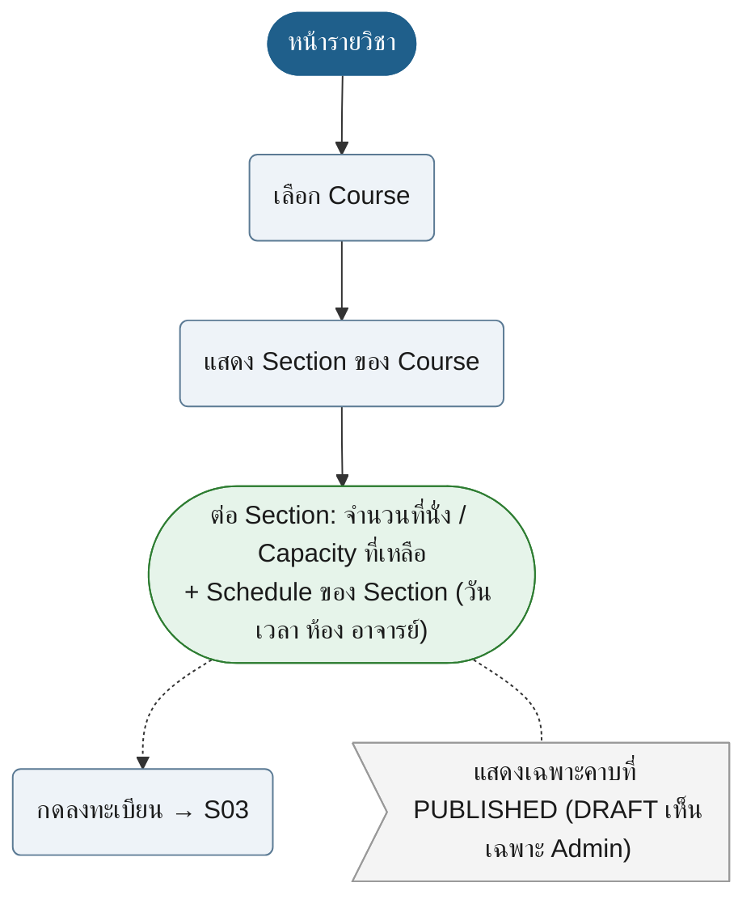
```mermaid
flowchart TD
    n1(["หน้ารายวิชา"]):::start
    n2("เลือก Course"):::act
    n3("แสดง Section ของ Course"):::act
    n4(["ต่อ Section: จำนวนที่นั่ง / Capacity ที่เหลือ<br/>+ Schedule ของ Section (วัน เวลา ห้อง อาจารย์)"]):::ok
    n1 --> n2
    n2 --> n3
    n3 --> n4
    n5("กดลงทะเบียน → S03"):::act
    n4 -.-> n5
    n6>"แสดงเฉพาะคาบที่ PUBLISHED (DRAFT เห็นเฉพาะ Admin)"]:::note
    n4 -.- n6
    classDef start fill:#1F5F8B,stroke:#1F5F8B,color:#fff
    classDef act fill:#EEF3F8,stroke:#5B7A94,color:#1a1a1a
    classDef dec fill:#FFF6E0,stroke:#5B7A94,color:#1a1a1a
    classDef bad fill:#FCE8E6,stroke:#C0392B,color:#1a1a1a
    classDef ok fill:#E6F4EA,stroke:#2E7D32,color:#1a1a1a
    classDef note fill:#F4F4F4,stroke:#999,color:#1a1a1a
```

### S03 ลงทะเบียนเรียน

**Role:** Student · **อ้างอิง:** §14.1 · §14.5 · §14.6 · BR-03, BR-04, BR-05, BR-09

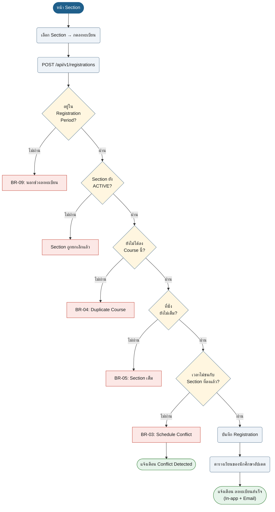
```mermaid
flowchart TD
    n1(["หน้า Section"]):::start
    n2("เลือก Section → กดลงทะเบียน"):::act
    n3("POST /api/v1/registrations"):::act
    n1 --> n2
    n2 --> n3
    n4{"อยู่ใน<br/>Registration<br/>Period?"}:::dec
    n3 --> n4
    n5["BR-09: นอกช่วงลงทะเบียน"]:::bad
    n4 -->|ไม่ผ่าน| n5
    n6{"Section ยัง<br/>ACTIVE?"}:::dec
    n4 -->|ผ่าน| n6
    n7["Section ถูกยกเลิกแล้ว"]:::bad
    n6 -->|ไม่ผ่าน| n7
    n8{"ยังไม่ได้ลง<br/>Course นี้?"}:::dec
    n6 -->|ผ่าน| n8
    n9["BR-04: Duplicate Course"]:::bad
    n8 -->|ไม่ผ่าน| n9
    n10{"ที่นั่ง<br/>ยังไม่เต็ม?"}:::dec
    n8 -->|ผ่าน| n10
    n11["BR-05: Section เต็ม"]:::bad
    n10 -->|ไม่ผ่าน| n11
    n12{"เวลาไม่ชนกับ<br/>Section ที่ลงแล้ว?"}:::dec
    n10 -->|ผ่าน| n12
    n13["BR-03: Schedule Conflict"]:::bad
    n12 -->|ไม่ผ่าน| n13
    n14(["แจ้งเตือน Conflict Detected"]):::ok
    n13 --> n14
    n15("บันทึก Registration"):::act
    n12 -->|ผ่าน| n15
    n16("ตารางเรียนของนักศึกษาอัปเดต"):::act
    n15 --> n16
    n17(["แจ้งเตือน ลงทะเบียนสำเร็จ<br/>(In-app + Email)"]):::ok
    n16 --> n17
    classDef start fill:#1F5F8B,stroke:#1F5F8B,color:#fff
    classDef act fill:#EEF3F8,stroke:#5B7A94,color:#1a1a1a
    classDef dec fill:#FFF6E0,stroke:#5B7A94,color:#1a1a1a
    classDef bad fill:#FCE8E6,stroke:#C0392B,color:#1a1a1a
    classDef ok fill:#E6F4EA,stroke:#2E7D32,color:#1a1a1a
    classDef note fill:#F4F4F4,stroke:#999,color:#1a1a1a
```

### S04 ถอนรายวิชา

**Role:** Student · **อ้างอิง:** §14.2 · §16 DELETE /registrations/{id} · BR-09

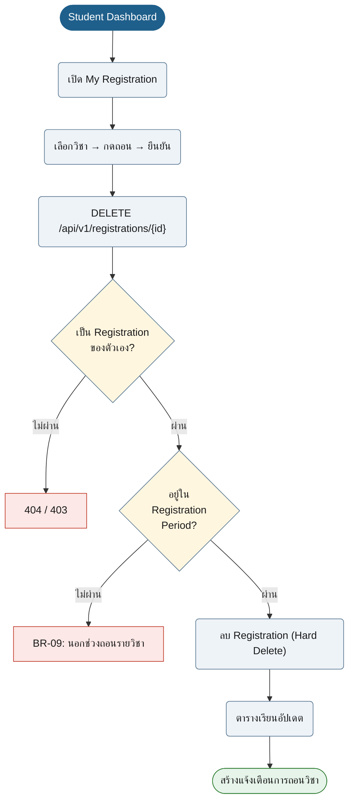
```mermaid
flowchart TD
    n1(["Student Dashboard"]):::start
    n2("เปิด My Registration"):::act
    n3("เลือกวิชา → กดถอน → ยืนยัน"):::act
    n4("DELETE /api/v1/registrations/{id}"):::act
    n1 --> n2
    n2 --> n3
    n3 --> n4
    n5{"เป็น Registration<br/>ของตัวเอง?"}:::dec
    n4 --> n5
    n6["404 / 403"]:::bad
    n5 -->|ไม่ผ่าน| n6
    n7{"อยู่ใน<br/>Registration<br/>Period?"}:::dec
    n5 -->|ผ่าน| n7
    n8["BR-09: นอกช่วงถอนรายวิชา"]:::bad
    n7 -->|ไม่ผ่าน| n8
    n9("ลบ Registration (Hard Delete)"):::act
    n7 -->|ผ่าน| n9
    n10("ตารางเรียนอัปเดต"):::act
    n9 --> n10
    n11(["สร้างแจ้งเตือนการถอนวิชา"]):::ok
    n10 --> n11
    classDef start fill:#1F5F8B,stroke:#1F5F8B,color:#fff
    classDef act fill:#EEF3F8,stroke:#5B7A94,color:#1a1a1a
    classDef dec fill:#FFF6E0,stroke:#5B7A94,color:#1a1a1a
    classDef bad fill:#FCE8E6,stroke:#C0392B,color:#1a1a1a
    classDef ok fill:#E6F4EA,stroke:#2E7D32,color:#1a1a1a
    classDef note fill:#F4F4F4,stroke:#999,color:#1a1a1a
```

### S05 ดูตารางเรียนของตัวเอง / Schedule ของ Section ที่ลงทะเบียน

**Role:** Student · **อ้างอิง:** §13.2.3 Student Schedule · §16 GET /schedules

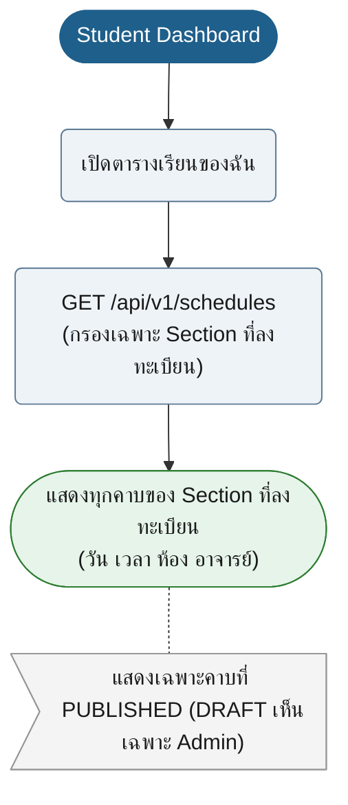
```mermaid
flowchart TD
    n1(["Student Dashboard"]):::start
    n2("เปิดตารางเรียนของฉัน"):::act
    n3("GET /api/v1/schedules<br/>(กรองเฉพาะ Section ที่ลงทะเบียน)"):::act
    n4(["แสดงทุกคาบของ Section ที่ลงทะเบียน<br/>(วัน เวลา ห้อง อาจารย์)"]):::ok
    n1 --> n2
    n2 --> n3
    n3 --> n4
    n5>"แสดงเฉพาะคาบที่ PUBLISHED (DRAFT เห็นเฉพาะ Admin)"]:::note
    n4 -.- n5
    classDef start fill:#1F5F8B,stroke:#1F5F8B,color:#fff
    classDef act fill:#EEF3F8,stroke:#5B7A94,color:#1a1a1a
    classDef dec fill:#FFF6E0,stroke:#5B7A94,color:#1a1a1a
    classDef bad fill:#FCE8E6,stroke:#C0392B,color:#1a1a1a
    classDef ok fill:#E6F4EA,stroke:#2E7D32,color:#1a1a1a
    classDef note fill:#F4F4F4,stroke:#999,color:#1a1a1a
```

### S06 เห็นการเปลี่ยนแปลง Schedule / Section ถูกยกเลิก

**Role:** Student · **อ้างอิง:** §14.4 · §14.5 Schedule Changed, Section Cancelled · §17.2 Observer · ข้อตกลง: แจ้งตอน Publish

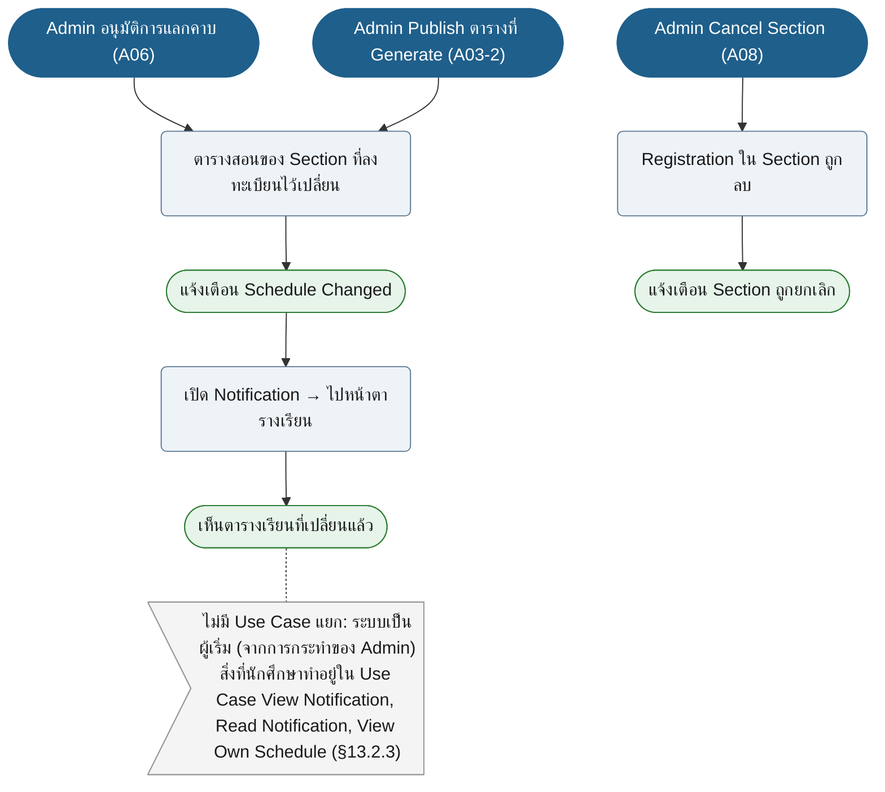
```mermaid
flowchart TD
    n1(["Admin อนุมัติการแลกคาบ (A06)"]):::start
    n2(["Admin Publish ตารางที่ Generate (A03-2)"]):::start
    n3("ตารางสอนของ Section ที่ลงทะเบียนไว้เปลี่ยน"):::act
    n1 --> n3
    n2 --> n3
    n4(["แจ้งเตือน Schedule Changed"]):::ok
    n3 --> n4
    n5("เปิด Notification → ไปหน้าตารางเรียน"):::act
    n4 --> n5
    n6(["เห็นตารางเรียนที่เปลี่ยนแล้ว"]):::ok
    n5 --> n6
    n7(["Admin Cancel Section (A08)"]):::start
    n8("Registration ใน Section ถูกลบ"):::act
    n9(["แจ้งเตือน Section ถูกยกเลิก"]):::ok
    n7 --> n8
    n8 --> n9
    n10>"ไม่มี Use Case แยก: ระบบเป็นผู้เริ่ม (จากการกระทำของ Admin)<br/>สิ่งที่นักศึกษาทำอยู่ใน Use Case View Notification, Read Notification, View Own Schedule (§13.2.3)"]:::note
    n6 -.- n10
    classDef start fill:#1F5F8B,stroke:#1F5F8B,color:#fff
    classDef act fill:#EEF3F8,stroke:#5B7A94,color:#1a1a1a
    classDef dec fill:#FFF6E0,stroke:#5B7A94,color:#1a1a1a
    classDef bad fill:#FCE8E6,stroke:#C0392B,color:#1a1a1a
    classDef ok fill:#E6F4EA,stroke:#2E7D32,color:#1a1a1a
    classDef note fill:#F4F4F4,stroke:#999,color:#1a1a1a
```

---

## Teacher

### T01 ดู Schedule / Section ที่ได้รับ / Timetable

**Role:** Teacher · **อ้างอิง:** §13.2.2 Teaching Schedule · §16 GET /schedules

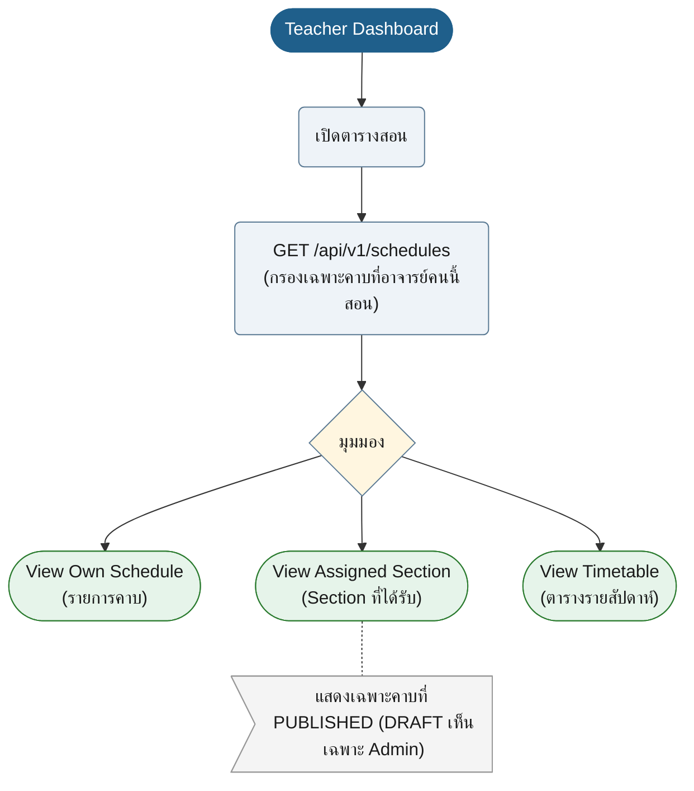
```mermaid
flowchart TD
    n1(["Teacher Dashboard"]):::start
    n2("เปิดตารางสอน"):::act
    n3("GET /api/v1/schedules<br/>(กรองเฉพาะคาบที่อาจารย์คนนี้สอน)"):::act
    n4{"มุมมอง"}:::dec
    n1 --> n2
    n2 --> n3
    n3 --> n4
    n5(["View Own Schedule<br/>(รายการคาบ)"]):::ok
    n6(["View Assigned Section<br/>(Section ที่ได้รับ)"]):::ok
    n7(["View Timetable<br/>(ตารางรายสัปดาห์)"]):::ok
    n4 --> n5
    n4 --> n6
    n4 --> n7
    n8>"แสดงเฉพาะคาบที่ PUBLISHED (DRAFT เห็นเฉพาะ Admin)"]:::note
    n6 -.- n8
    classDef start fill:#1F5F8B,stroke:#1F5F8B,color:#fff
    classDef act fill:#EEF3F8,stroke:#5B7A94,color:#1a1a1a
    classDef dec fill:#FFF6E0,stroke:#5B7A94,color:#1a1a1a
    classDef bad fill:#FCE8E6,stroke:#C0392B,color:#1a1a1a
    classDef ok fill:#E6F4EA,stroke:#2E7D32,color:#1a1a1a
    classDef note fill:#F4F4F4,stroke:#999,color:#1a1a1a
```

### T02 กำหนด / แก้ไข / ลบ Availability

**Role:** Teacher · **อ้างอิง:** §13.2.2 Manage Availability · BR-07 · D22 · ข้อตกลง C-01

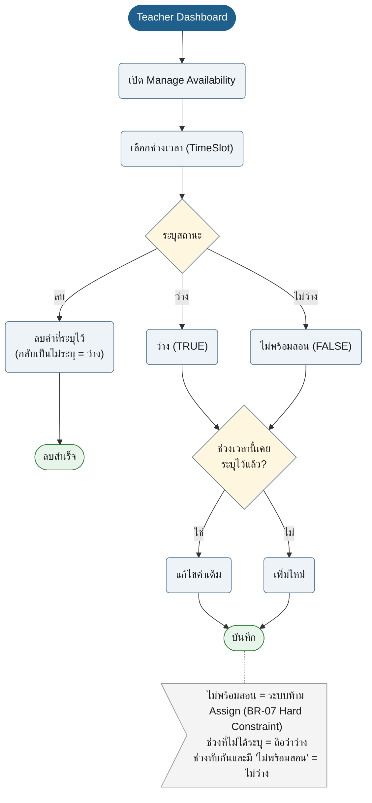
```mermaid
flowchart TD
    n1(["Teacher Dashboard"]):::start
    n2("เปิด Manage Availability"):::act
    n3("เลือกช่วงเวลา (TimeSlot)"):::act
    n1 --> n2
    n2 --> n3
    n4{"ระบุสถานะ"}:::dec
    n3 --> n4
    n5("ว่าง (TRUE)"):::act
    n6("ไม่พร้อมสอน (FALSE)"):::act
    n7("ลบค่าที่ระบุไว้<br/>(กลับเป็นไม่ระบุ = ว่าง)"):::act
    n4 -->|ว่าง| n5
    n4 -->|ไม่ว่าง| n6
    n4 -->|ลบ| n7
    n8(["ลบสำเร็จ"]):::ok
    n7 --> n8
    n9{"ช่วงเวลานี้เคย<br/>ระบุไว้แล้ว?"}:::dec
    n5 --> n9
    n6 --> n9
    n10("แก้ไขค่าเดิม"):::act
    n11("เพิ่มใหม่"):::act
    n9 -->|ใช่| n10
    n9 -->|ไม่| n11
    n12(["บันทึก"]):::ok
    n10 --> n12
    n11 --> n12
    n13>"ไม่พร้อมสอน = ระบบห้าม Assign (BR-07 Hard Constraint)<br/>ช่วงที่ไม่ได้ระบุ = ถือว่าว่าง<br/>ช่วงทับกันและมี 'ไม่พร้อมสอน' = ไม่ว่าง"]:::note
    n12 -.- n13
    classDef start fill:#1F5F8B,stroke:#1F5F8B,color:#fff
    classDef act fill:#EEF3F8,stroke:#5B7A94,color:#1a1a1a
    classDef dec fill:#FFF6E0,stroke:#5B7A94,color:#1a1a1a
    classDef bad fill:#FCE8E6,stroke:#C0392B,color:#1a1a1a
    classDef ok fill:#E6F4EA,stroke:#2E7D32,color:#1a1a1a
    classDef note fill:#F4F4F4,stroke:#999,color:#1a1a1a
```

### T03 ดู Availability ของตัวเอง

**Role:** Teacher · **อ้างอิง:** §13.2.2 View Own Availability

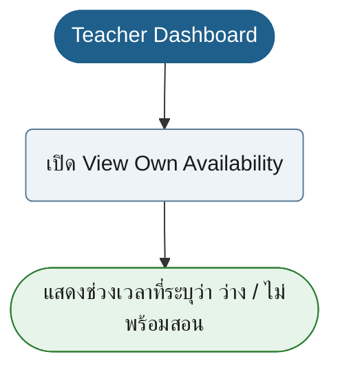
```mermaid
flowchart TD
    n1(["Teacher Dashboard"]):::start
    n2("เปิด View Own Availability"):::act
    n3(["แสดงช่วงเวลาที่ระบุว่า ว่าง / ไม่พร้อมสอน"]):::ok
    n1 --> n2
    n2 --> n3
    classDef start fill:#1F5F8B,stroke:#1F5F8B,color:#fff
    classDef act fill:#EEF3F8,stroke:#5B7A94,color:#1a1a1a
    classDef dec fill:#FFF6E0,stroke:#5B7A94,color:#1a1a1a
    classDef bad fill:#FCE8E6,stroke:#C0392B,color:#1a1a1a
    classDef ok fill:#E6F4EA,stroke:#2E7D32,color:#1a1a1a
    classDef note fill:#F4F4F4,stroke:#999,color:#1a1a1a
```

### T04 ดู Qualification ของตัวเอง

**Role:** Teacher · **อ้างอิง:** §13.2.2 View Own Qualification · BR-06 · D20, D33

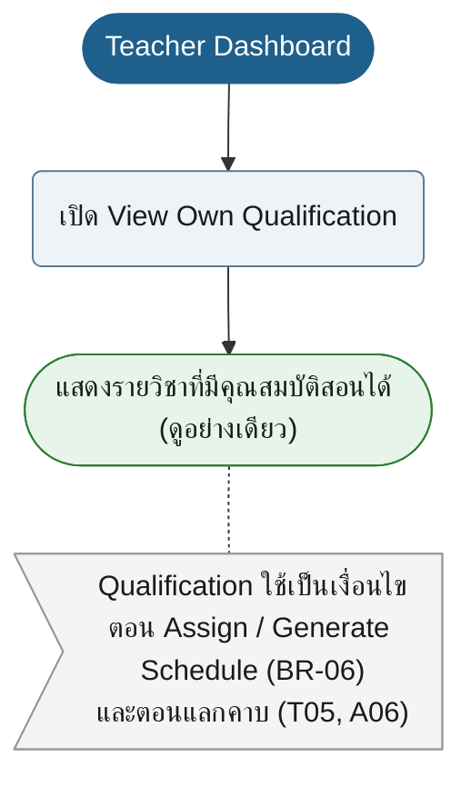
```mermaid
flowchart TD
    n1(["Teacher Dashboard"]):::start
    n2("เปิด View Own Qualification"):::act
    n3(["แสดงรายวิชาที่มีคุณสมบัติสอนได้ (ดูอย่างเดียว)"]):::ok
    n1 --> n2
    n2 --> n3
    n4>"Qualification ใช้เป็นเงื่อนไขตอน Assign / Generate Schedule (BR-06)<br/>และตอนแลกคาบ (T05, A06)"]:::note
    n3 -.- n4
    classDef start fill:#1F5F8B,stroke:#1F5F8B,color:#fff
    classDef act fill:#EEF3F8,stroke:#5B7A94,color:#1a1a1a
    classDef dec fill:#FFF6E0,stroke:#5B7A94,color:#1a1a1a
    classDef bad fill:#FCE8E6,stroke:#C0392B,color:#1a1a1a
    classDef ok fill:#E6F4EA,stroke:#2E7D32,color:#1a1a1a
    classDef note fill:#F4F4F4,stroke:#999,color:#1a1a1a
```

### T05 สร้าง Swap Request (Teacher A)

**Role:** Teacher · **อ้างอิง:** §14.3 Request Swap → Select Teacher B → System Validation · §16 POST /teacher-swaps

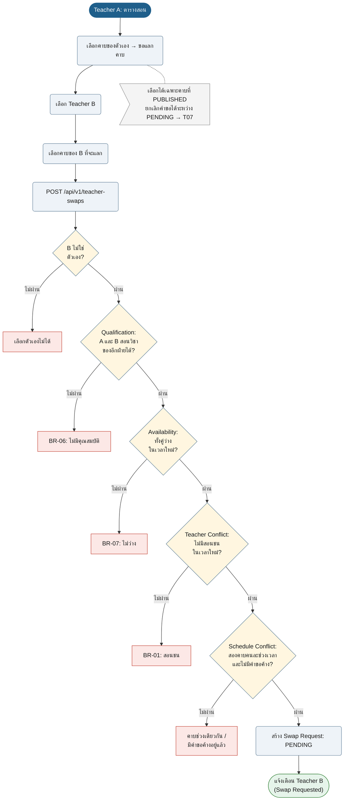
```mermaid
flowchart TD
    n1(["Teacher A: ตารางสอน"]):::start
    n2("เลือกคาบของตัวเอง → ขอแลกคาบ"):::act
    n3("เลือก Teacher B"):::act
    n4("เลือกคาบของ B ที่จะแลก"):::act
    n5("POST /api/v1/teacher-swaps"):::act
    n1 --> n2
    n2 --> n3
    n3 --> n4
    n4 --> n5
    n6{"B ไม่ใช่<br/>ตัวเอง?"}:::dec
    n5 --> n6
    n7["เลือกตัวเองไม่ได้"]:::bad
    n6 -->|ไม่ผ่าน| n7
    n8{"Qualification:<br/>A และ B สอนวิชา<br/>ของอีกฝ่ายได้?"}:::dec
    n6 -->|ผ่าน| n8
    n9["BR-06: ไม่มีคุณสมบัติ"]:::bad
    n8 -->|ไม่ผ่าน| n9
    n10{"Availability:<br/>ทั้งคู่ว่าง<br/>ในเวลาใหม่?"}:::dec
    n8 -->|ผ่าน| n10
    n11["BR-07: ไม่ว่าง"]:::bad
    n10 -->|ไม่ผ่าน| n11
    n12{"Teacher Conflict:<br/>ไม่มีสอนชน<br/>ในเวลาใหม่?"}:::dec
    n10 -->|ผ่าน| n12
    n13["BR-01: สอนชน"]:::bad
    n12 -->|ไม่ผ่าน| n13
    n14{"Schedule Conflict:<br/>สองคาบคนละช่วงเวลา<br/>และไม่มีคำขอค้าง?"}:::dec
    n12 -->|ผ่าน| n14
    n15["คาบช่วงเดียวกัน /<br/>มีคำขอค้างอยู่แล้ว"]:::bad
    n14 -->|ไม่ผ่าน| n15
    n16("สร้าง Swap Request: PENDING"):::act
    n14 -->|ผ่าน| n16
    n17(["แจ้งเตือน Teacher B<br/>(Swap Requested)"]):::ok
    n16 --> n17
    n18>"เลือกได้เฉพาะคาบที่ PUBLISHED<br/>ยกเลิกคำขอได้ระหว่าง PENDING → T07"]:::note
    n2 -.- n18
    classDef start fill:#1F5F8B,stroke:#1F5F8B,color:#fff
    classDef act fill:#EEF3F8,stroke:#5B7A94,color:#1a1a1a
    classDef dec fill:#FFF6E0,stroke:#5B7A94,color:#1a1a1a
    classDef bad fill:#FCE8E6,stroke:#C0392B,color:#1a1a1a
    classDef ok fill:#E6F4EA,stroke:#2E7D32,color:#1a1a1a
    classDef note fill:#F4F4F4,stroke:#999,color:#1a1a1a
```

### T06 ตอบรับ / ปฏิเสธ Swap Request ของ Teacher คนอื่น (Teacher B)

**Role:** Teacher · **อ้างอิง:** §14.3 Teacher B Respond (Accept / Reject) · §16 PUT /teacher-swaps/{id}/respond

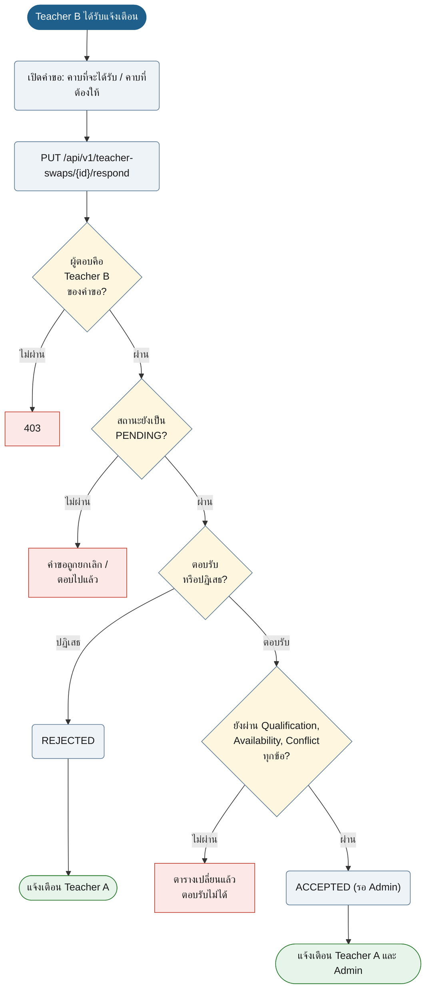
```mermaid
flowchart TD
    n1(["Teacher B ได้รับแจ้งเตือน"]):::start
    n2("เปิดคำขอ: คาบที่จะได้รับ / คาบที่ต้องให้"):::act
    n3("PUT /api/v1/teacher-swaps/{id}/respond"):::act
    n1 --> n2
    n2 --> n3
    n4{"ผู้ตอบคือ<br/>Teacher B<br/>ของคำขอ?"}:::dec
    n3 --> n4
    n5["403"]:::bad
    n4 -->|ไม่ผ่าน| n5
    n6{"สถานะยังเป็น<br/>PENDING?"}:::dec
    n4 -->|ผ่าน| n6
    n7["คำขอถูกยกเลิก /<br/>ตอบไปแล้ว"]:::bad
    n6 -->|ไม่ผ่าน| n7
    n8{"ตอบรับ<br/>หรือปฏิเสธ?"}:::dec
    n6 -->|ผ่าน| n8
    n9("REJECTED"):::act
    n8 -->|ปฏิเสธ| n9
    n10(["แจ้งเตือน Teacher A"]):::ok
    n9 --> n10
    n11{"ยังผ่าน Qualification,<br/>Availability, Conflict<br/>ทุกข้อ?"}:::dec
    n8 -->|ตอบรับ| n11
    n12["ตารางเปลี่ยนแล้ว<br/>ตอบรับไม่ได้"]:::bad
    n11 -->|ไม่ผ่าน| n12
    n13("ACCEPTED (รอ Admin)"):::act
    n11 -->|ผ่าน| n13
    n14(["แจ้งเตือน Teacher A และ Admin"]):::ok
    n13 --> n14
    classDef start fill:#1F5F8B,stroke:#1F5F8B,color:#fff
    classDef act fill:#EEF3F8,stroke:#5B7A94,color:#1a1a1a
    classDef dec fill:#FFF6E0,stroke:#5B7A94,color:#1a1a1a
    classDef bad fill:#FCE8E6,stroke:#C0392B,color:#1a1a1a
    classDef ok fill:#E6F4EA,stroke:#2E7D32,color:#1a1a1a
    classDef note fill:#F4F4F4,stroke:#999,color:#1a1a1a
```

### T07 ยกเลิก Swap Request ของตัวเอง (เฉพาะ PENDING)

**Role:** Teacher · **อ้างอิง:** AcadOS_7: สามารถยกเลิก Swap request ของตัวเองได้ (หาก pending) · สถานะ CANCELLED (ข้อตกลงทีม)

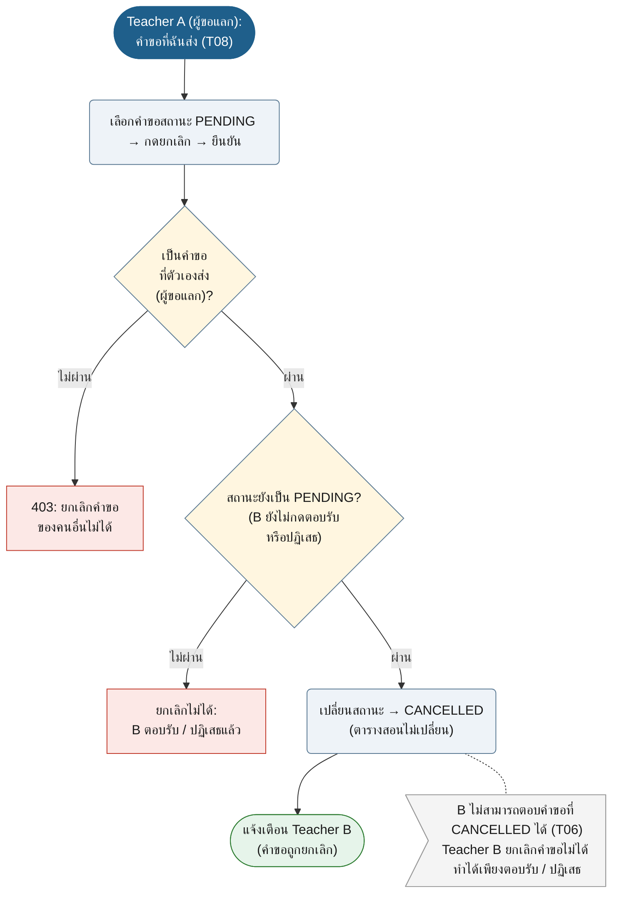
```mermaid
flowchart TD
    n1(["Teacher A (ผู้ขอแลก):<br/>คำขอที่ฉันส่ง (T08)"]):::start
    n2("เลือกคำขอสถานะ PENDING → กดยกเลิก → ยืนยัน"):::act
    n1 --> n2
    n3{"เป็นคำขอ<br/>ที่ตัวเองส่ง<br/>(ผู้ขอแลก)?"}:::dec
    n2 --> n3
    n4["403: ยกเลิกคำขอ<br/>ของคนอื่นไม่ได้"]:::bad
    n3 -->|ไม่ผ่าน| n4
    n5{"สถานะยังเป็น PENDING?<br/>(B ยังไม่กดตอบรับ<br/>หรือปฏิเสธ)"}:::dec
    n3 -->|ผ่าน| n5
    n6["ยกเลิกไม่ได้:<br/>B ตอบรับ / ปฏิเสธแล้ว"]:::bad
    n5 -->|ไม่ผ่าน| n6
    n7("เปลี่ยนสถานะ → CANCELLED<br/>(ตารางสอนไม่เปลี่ยน)"):::act
    n5 -->|ผ่าน| n7
    n8(["แจ้งเตือน Teacher B<br/>(คำขอถูกยกเลิก)"]):::ok
    n7 --> n8
    n9>"B ไม่สามารถตอบคำขอที่ CANCELLED ได้ (T06)<br/>Teacher B ยกเลิกคำขอไม่ได้ ทำได้เพียงตอบรับ / ปฏิเสธ"]:::note
    n7 -.- n9
    classDef start fill:#1F5F8B,stroke:#1F5F8B,color:#fff
    classDef act fill:#EEF3F8,stroke:#5B7A94,color:#1a1a1a
    classDef dec fill:#FFF6E0,stroke:#5B7A94,color:#1a1a1a
    classDef bad fill:#FCE8E6,stroke:#C0392B,color:#1a1a1a
    classDef ok fill:#E6F4EA,stroke:#2E7D32,color:#1a1a1a
    classDef note fill:#F4F4F4,stroke:#999,color:#1a1a1a
```

### T08 ดูสถานะ Swap Request

**Role:** Teacher · **อ้างอิง:** §13.2.2 View Swap Request Status

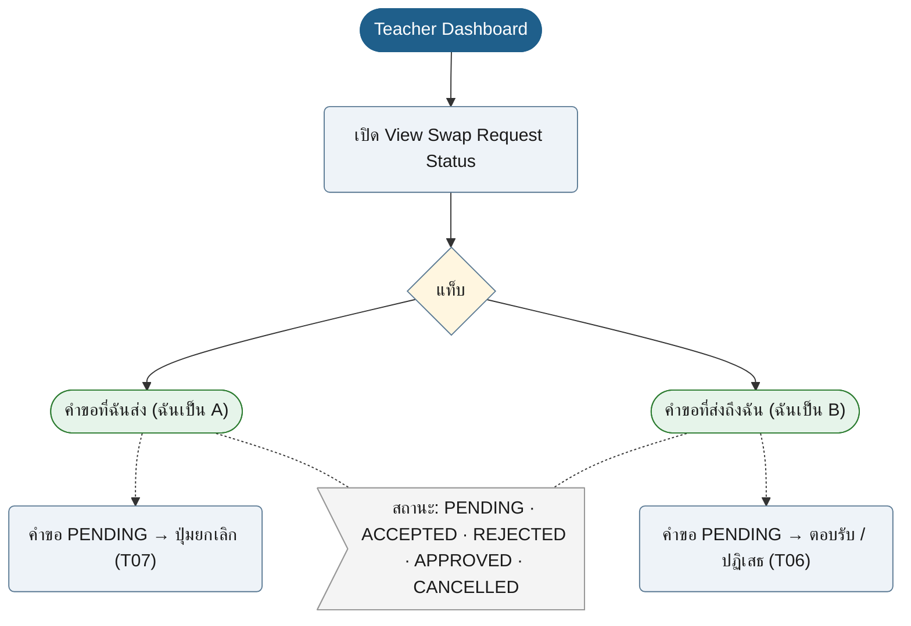
```mermaid
flowchart TD
    n1(["Teacher Dashboard"]):::start
    n2("เปิด View Swap Request Status"):::act
    n3{"แท็บ"}:::dec
    n1 --> n2
    n2 --> n3
    n4(["คำขอที่ฉันส่ง (ฉันเป็น A)"]):::ok
    n5(["คำขอที่ส่งถึงฉัน (ฉันเป็น B)"]):::ok
    n3 --> n4
    n3 --> n5
    n6("คำขอ PENDING → ปุ่มยกเลิก (T07)"):::act
    n4 -.-> n6
    n7("คำขอ PENDING → ตอบรับ / ปฏิเสธ (T06)"):::act
    n5 -.-> n7
    n8>"สถานะ: PENDING · ACCEPTED · REJECTED · APPROVED · CANCELLED"]:::note
    n4 -.- n8
    n5 -.- n8
    classDef start fill:#1F5F8B,stroke:#1F5F8B,color:#fff
    classDef act fill:#EEF3F8,stroke:#5B7A94,color:#1a1a1a
    classDef dec fill:#FFF6E0,stroke:#5B7A94,color:#1a1a1a
    classDef bad fill:#FCE8E6,stroke:#C0392B,color:#1a1a1a
    classDef ok fill:#E6F4EA,stroke:#2E7D32,color:#1a1a1a
    classDef note fill:#F4F4F4,stroke:#999,color:#1a1a1a
```

---

## Admin

### A01-1 Read Course

**Role:** Admin · **อ้างอิง:** §13.2.1 Course Management · §16 /courses

```mermaid
flowchart TD
    n1(["Admin Dashboard"]):::start
    n2("เปิดหน้า Course"):::act
    n3("GET /api/v1/courses / /api/v1/courses/{id}"):::act
    n1 --> n2
    n2 --> n3
    n4(["แสดงรายการ / รายละเอียด"]):::ok
    n3 --> n4
    classDef start fill:#1F5F8B,stroke:#1F5F8B,color:#fff
    classDef act fill:#EEF3F8,stroke:#5B7A94,color:#1a1a1a
    classDef dec fill:#FFF6E0,stroke:#5B7A94,color:#1a1a1a
    classDef bad fill:#FCE8E6,stroke:#C0392B,color:#1a1a1a
    classDef ok fill:#E6F4EA,stroke:#2E7D32,color:#1a1a1a
    classDef note fill:#F4F4F4,stroke:#999,color:#1a1a1a
```

### A01-2 Create Course

**Role:** Admin · **อ้างอิง:** §13.2.1 Course Management · §16 /courses

```mermaid
flowchart TD
    n1(["Admin Dashboard"]):::start
    n2("สร้าง Course → กรอกข้อมูล"):::act
    n3("POST /api/v1/courses"):::act
    n1 --> n2
    n2 --> n3
    n4{"ข้อมูลครบ<br/>และถูกรูปแบบ?"}:::dec
    n3 --> n4
    n5["400 Bean Validation"]:::bad
    n4 -->|ไม่ผ่าน| n5
    n6{"รหัสวิชาไม่ซ้ำ?"}:::dec
    n4 -->|ผ่าน| n6
    n7["409: รหัสวิชาซ้ำ"]:::bad
    n6 -->|ไม่ผ่าน| n7
    n8(["บันทึกสำเร็จ"]):::ok
    n6 -->|ผ่าน| n8
    classDef start fill:#1F5F8B,stroke:#1F5F8B,color:#fff
    classDef act fill:#EEF3F8,stroke:#5B7A94,color:#1a1a1a
    classDef dec fill:#FFF6E0,stroke:#5B7A94,color:#1a1a1a
    classDef bad fill:#FCE8E6,stroke:#C0392B,color:#1a1a1a
    classDef ok fill:#E6F4EA,stroke:#2E7D32,color:#1a1a1a
    classDef note fill:#F4F4F4,stroke:#999,color:#1a1a1a
```

### A01-3 Update Course

**Role:** Admin · **อ้างอิง:** §13.2.1 Course Management · §16 /courses

```mermaid
flowchart TD
    n1(["Admin Dashboard"]):::start
    n2("แก้ไข Course → กรอกข้อมูล"):::act
    n3("PUT /api/v1/courses/{id}"):::act
    n1 --> n2
    n2 --> n3
    n4{"พบรายการ?"}:::dec
    n3 --> n4
    n5["404 Not Found"]:::bad
    n4 -->|ไม่ผ่าน| n5
    n6{"ข้อมูลครบ<br/>และถูกรูปแบบ?"}:::dec
    n4 -->|ผ่าน| n6
    n7["400 Bean Validation"]:::bad
    n6 -->|ไม่ผ่าน| n7
    n8{"รหัสวิชาไม่ซ้ำ?"}:::dec
    n6 -->|ผ่าน| n8
    n9["409: รหัสวิชาซ้ำ"]:::bad
    n8 -->|ไม่ผ่าน| n9
    n10(["บันทึกสำเร็จ"]):::ok
    n8 -->|ผ่าน| n10
    classDef start fill:#1F5F8B,stroke:#1F5F8B,color:#fff
    classDef act fill:#EEF3F8,stroke:#5B7A94,color:#1a1a1a
    classDef dec fill:#FFF6E0,stroke:#5B7A94,color:#1a1a1a
    classDef bad fill:#FCE8E6,stroke:#C0392B,color:#1a1a1a
    classDef ok fill:#E6F4EA,stroke:#2E7D32,color:#1a1a1a
    classDef note fill:#F4F4F4,stroke:#999,color:#1a1a1a
```

### A01-4 Delete Course

**Role:** Admin · **อ้างอิง:** §13.2.1 Course Management · §16 /courses

```mermaid
flowchart TD
    n1(["Admin Dashboard"]):::start
    n2("เลือก Course → ลบ → ยืนยัน"):::act
    n3("DELETE /api/v1/courses/{id}"):::act
    n1 --> n2
    n2 --> n3
    n4{"พบรายการ?"}:::dec
    n3 --> n4
    n5["404 Not Found"]:::bad
    n4 -->|ไม่ผ่าน| n5
    n6{"ไม่มี Section<br/>ของวิชานี้?"}:::dec
    n4 -->|ผ่าน| n6
    n7["409: ยังมี Section"]:::bad
    n6 -->|ไม่ผ่าน| n7
    n8(["ลบสำเร็จ"]):::ok
    n6 -->|ผ่าน| n8
    classDef start fill:#1F5F8B,stroke:#1F5F8B,color:#fff
    classDef act fill:#EEF3F8,stroke:#5B7A94,color:#1a1a1a
    classDef dec fill:#FFF6E0,stroke:#5B7A94,color:#1a1a1a
    classDef bad fill:#FCE8E6,stroke:#C0392B,color:#1a1a1a
    classDef ok fill:#E6F4EA,stroke:#2E7D32,color:#1a1a1a
    classDef note fill:#F4F4F4,stroke:#999,color:#1a1a1a
```

### A02-1 Read Room

**Role:** Admin · **อ้างอิง:** §13.2.1 Room Management · §16 /rooms

```mermaid
flowchart TD
    n1(["Admin Dashboard"]):::start
    n2("เปิดหน้า Room"):::act
    n3("GET /api/v1/rooms / /api/v1/rooms/{id}"):::act
    n1 --> n2
    n2 --> n3
    n4(["แสดงรายการ / รายละเอียด"]):::ok
    n3 --> n4
    classDef start fill:#1F5F8B,stroke:#1F5F8B,color:#fff
    classDef act fill:#EEF3F8,stroke:#5B7A94,color:#1a1a1a
    classDef dec fill:#FFF6E0,stroke:#5B7A94,color:#1a1a1a
    classDef bad fill:#FCE8E6,stroke:#C0392B,color:#1a1a1a
    classDef ok fill:#E6F4EA,stroke:#2E7D32,color:#1a1a1a
    classDef note fill:#F4F4F4,stroke:#999,color:#1a1a1a
```

### A02-2 Create Room

**Role:** Admin · **อ้างอิง:** §13.2.1 Room Management · §16 /rooms

```mermaid
flowchart TD
    n1(["Admin Dashboard"]):::start
    n2("สร้าง Room → กรอกข้อมูล"):::act
    n3("POST /api/v1/rooms"):::act
    n1 --> n2
    n2 --> n3
    n4{"ข้อมูลครบ<br/>และถูกรูปแบบ?"}:::dec
    n3 --> n4
    n5["400 Bean Validation"]:::bad
    n4 -->|ไม่ผ่าน| n5
    n6{"เลขห้องไม่ซ้ำ<br/>ในอาคารเดียวกัน?"}:::dec
    n4 -->|ผ่าน| n6
    n7["409: ห้องซ้ำ"]:::bad
    n6 -->|ไม่ผ่าน| n7
    n8(["บันทึกสำเร็จ"]):::ok
    n6 -->|ผ่าน| n8
    classDef start fill:#1F5F8B,stroke:#1F5F8B,color:#fff
    classDef act fill:#EEF3F8,stroke:#5B7A94,color:#1a1a1a
    classDef dec fill:#FFF6E0,stroke:#5B7A94,color:#1a1a1a
    classDef bad fill:#FCE8E6,stroke:#C0392B,color:#1a1a1a
    classDef ok fill:#E6F4EA,stroke:#2E7D32,color:#1a1a1a
    classDef note fill:#F4F4F4,stroke:#999,color:#1a1a1a
```

### A02-3 Update Room

**Role:** Admin · **อ้างอิง:** §13.2.1 Room Management · §16 /rooms

```mermaid
flowchart TD
    n1(["Admin Dashboard"]):::start
    n2("แก้ไข Room → กรอกข้อมูล"):::act
    n3("PUT /api/v1/rooms/{id}"):::act
    n1 --> n2
    n2 --> n3
    n4{"พบรายการ?"}:::dec
    n3 --> n4
    n5["404 Not Found"]:::bad
    n4 -->|ไม่ผ่าน| n5
    n6{"ข้อมูลครบ<br/>และถูกรูปแบบ?"}:::dec
    n4 -->|ผ่าน| n6
    n7["400 Bean Validation"]:::bad
    n6 -->|ไม่ผ่าน| n7
    n8{"เลขห้องไม่ซ้ำ<br/>ในอาคารเดียวกัน?"}:::dec
    n6 -->|ผ่าน| n8
    n9["409: ห้องซ้ำ"]:::bad
    n8 -->|ไม่ผ่าน| n9
    n10{"ความจุไม่ต่ำกว่า<br/>Section ที่ใช้ห้องนี้?"}:::dec
    n8 -->|ผ่าน| n10
    n11["BR-05: ความจุไม่พอ"]:::bad
    n10 -->|ไม่ผ่าน| n11
    n12(["บันทึกสำเร็จ"]):::ok
    n10 -->|ผ่าน| n12
    n13>"ปิดการใช้งานห้อง (isAvailable = false)<br/>→ ไม่ถูกเลือกตอน Generate (BR-08)"]:::note
    n12 -.- n13
    classDef start fill:#1F5F8B,stroke:#1F5F8B,color:#fff
    classDef act fill:#EEF3F8,stroke:#5B7A94,color:#1a1a1a
    classDef dec fill:#FFF6E0,stroke:#5B7A94,color:#1a1a1a
    classDef bad fill:#FCE8E6,stroke:#C0392B,color:#1a1a1a
    classDef ok fill:#E6F4EA,stroke:#2E7D32,color:#1a1a1a
    classDef note fill:#F4F4F4,stroke:#999,color:#1a1a1a
```

### A02-4 Delete Room

**Role:** Admin · **อ้างอิง:** §13.2.1 Room Management · §16 /rooms

```mermaid
flowchart TD
    n1(["Admin Dashboard"]):::start
    n2("เลือก Room → ลบ → ยืนยัน"):::act
    n3("DELETE /api/v1/rooms/{id}"):::act
    n1 --> n2
    n2 --> n3
    n4{"พบรายการ?"}:::dec
    n3 --> n4
    n5["404 Not Found"]:::bad
    n4 -->|ไม่ผ่าน| n5
    n6{"ไม่มี Section /<br/>คาบสอนใช้ห้องนี้?"}:::dec
    n4 -->|ผ่าน| n6
    n7["409: ห้องถูกใช้อยู่"]:::bad
    n6 -->|ไม่ผ่าน| n7
    n8(["ลบสำเร็จ"]):::ok
    n6 -->|ผ่าน| n8
    classDef start fill:#1F5F8B,stroke:#1F5F8B,color:#fff
    classDef act fill:#EEF3F8,stroke:#5B7A94,color:#1a1a1a
    classDef dec fill:#FFF6E0,stroke:#5B7A94,color:#1a1a1a
    classDef bad fill:#FCE8E6,stroke:#C0392B,color:#1a1a1a
    classDef ok fill:#E6F4EA,stroke:#2E7D32,color:#1a1a1a
    classDef note fill:#F4F4F4,stroke:#999,color:#1a1a1a
```

### A03-1 Generate Schedule

**Role:** Admin · **อ้างอิง:** §12.1–12.4 · D26–D29, D32, D36 · §16 POST /schedules/generate · ข้อตกลง: ผลเป็น DRAFT

```mermaid
flowchart TD
    n1(["Admin Dashboard"]):::start
    n2("กด Generate Schedule"):::act
    n3("POST /api/v1/schedules/generate"):::act
    n4{"มี DRAFT<br/>ค้างอยู่?"}:::dec
    n1 --> n2
    n2 --> n3
    n3 --> n4
    n5("ทิ้ง DRAFT เดิม"):::act
    n4 -->|มี| n5
    n6("ดึง Section ที่ ACTIVE และยังไม่มีตารางครบ<br/>+ ชั่วโมง/สัปดาห์ของ Course"):::act
    n4 -->|ไม่มี| n6
    n5 --> n6
    n7("แบ่งคาบเรียน"):::act
    n6 --> n7
    n8>"รูปแบบการแบ่งคาบ (Define Schedule Format) = TBA · D26"]:::note
    n7 -.- n8
    n9{"อาจารย์ระบุ<br/>Preference?"}:::dec
    n7 --> n9
    n10("D32: สุ่มเลือกวิชา<br/>ที่อาจารย์ Qualified"):::act
    n9 -->|ไม่| n10
    n11("สร้าง Candidate<br/>(อาจารย์ × ห้อง × ช่วงเวลา)"):::act
    n9 -->|ใช่| n11
    n10 --> n11
    n12{"1. Teacher<br/>Qualification?"}:::dec
    n11 --> n12
    n13["Reject Candidate"]:::bad
    n12 -->|ไม่ผ่าน| n13
    n14{"2. Teacher<br/>Availability?"}:::dec
    n12 -->|ผ่าน| n14
    n15["Reject Candidate"]:::bad
    n14 -->|ไม่ผ่าน| n15
    n16{"3. ไม่มี<br/>Teacher Conflict?"}:::dec
    n14 -->|ผ่าน| n16
    n17["Reject Candidate"]:::bad
    n16 -->|ไม่ผ่าน| n17
    n18{"4. ไม่มี<br/>Room Conflict?"}:::dec
    n16 -->|ผ่าน| n18
    n19["Reject Candidate"]:::bad
    n18 -->|ไม่ผ่าน| n19
    n20{"5. Room<br/>Availability?"}:::dec
    n18 -->|ผ่าน| n20
    n21["Reject Candidate"]:::bad
    n20 -->|ไม่ผ่าน| n21
    n22{"6. ไม่มี<br/>Student Conflict?"}:::dec
    n20 -->|ผ่าน| n22
    n23["Reject Candidate"]:::bad
    n22 -->|ไม่ผ่าน| n23
    n24{"7. Room<br/>Capacity พอ?"}:::dec
    n22 -->|ผ่าน| n24
    n25["Reject Candidate"]:::bad
    n24 -->|ไม่ผ่าน| n25
    n26("คำนวณคะแนน: Baseline +100<br/>+ Preference +30 + Room Suitability +20 (TBA)<br/>+ Workload +20"):::act
    n24 -->|ผ่านทุกข้อ| n26
    n27{"มี Candidate<br/>เหลือ?"}:::dec
    n26 --> n27
    n28["แจ้งจัดไม่ได้<br/>พร้อมสาเหตุหลัก"]:::bad
    n27 -->|ไม่มี| n28
    n29{"คะแนนสูงสุด<br/>เท่ากันหลายตัว?"}:::dec
    n27 -->|มี| n29
    n30("สุ่มเลือก 1 ตัว"):::act
    n29 -->|ใช่| n30
    n31("เลือก Candidate คะแนนสูงสุด<br/>→ บันทึกเป็น DRAFT"):::act
    n29 -->|ไม่| n31
    n30 --> n31
    n32(["ไปตรวจตาราง → A03-2<br/>(ยังไม่แจ้งเตือนใคร)"]):::ok
    n31 --> n32
    classDef start fill:#1F5F8B,stroke:#1F5F8B,color:#fff
    classDef act fill:#EEF3F8,stroke:#5B7A94,color:#1a1a1a
    classDef dec fill:#FFF6E0,stroke:#5B7A94,color:#1a1a1a
    classDef bad fill:#FCE8E6,stroke:#C0392B,color:#1a1a1a
    classDef ok fill:#E6F4EA,stroke:#2E7D32,color:#1a1a1a
    classDef note fill:#F4F4F4,stroke:#999,color:#1a1a1a
```

### A03-2 View Generated Schedule (Publish / Discard)

**Role:** Admin · **อ้างอิง:** §3 View Generated Schedule: ตรวจสอบก่อนนำไปใช้งาน · ข้อตกลงทีม

```mermaid
flowchart TD
    n1(["Admin Dashboard"]):::start
    n2("เปิด View Generated Schedule"):::act
    n3("แสดงตาราง DRAFT บน Timetable<br/>(อาจารย์ ห้อง เวลา ของทุก Section)"):::act
    n1 --> n2
    n2 --> n3
    n4{"ตารางเป็นที่<br/>พอใจ?"}:::dec
    n3 --> n4
    n5("Publish → สถานะ PUBLISHED"):::act
    n4 -->|พอใจ| n5
    n6(["แจ้งเตือนอาจารย์ที่ได้คาบใหม่"]):::ok
    n7(["แจ้งเตือนนักศึกษาของ Section<br/>ที่ตารางเปลี่ยน (Schedule Changed)"]):::ok
    n5 --> n6
    n5 --> n7
    n8("Discard → ลบ DRAFT"):::act
    n4 -->|ไม่พอใจ| n8
    n9("Generate ใหม่ → A03-1"):::act
    n8 -.-> n9
    n10>"DRAFT เห็นเฉพาะ Admin · Teacher / Student เห็นเฉพาะ PUBLISHED<br/>endpoint Publish / Discard ยังไม่มีใน §16 (C-12)"]:::note
    n3 -.- n10
    classDef start fill:#1F5F8B,stroke:#1F5F8B,color:#fff
    classDef act fill:#EEF3F8,stroke:#5B7A94,color:#1a1a1a
    classDef dec fill:#FFF6E0,stroke:#5B7A94,color:#1a1a1a
    classDef bad fill:#FCE8E6,stroke:#C0392B,color:#1a1a1a
    classDef ok fill:#E6F4EA,stroke:#2E7D32,color:#1a1a1a
    classDef note fill:#F4F4F4,stroke:#999,color:#1a1a1a
```

### A04 ดูตารางสอนรวม / การลงทะเบียน

**Role:** Admin · **อ้างอิง:** AcadOS_7 System · §16 GET /schedules (Admin → ทั้งหมด)

```mermaid
flowchart TD
    n1(["Admin Dashboard"]):::start
    n2{"เลือกดู"}:::dec
    n3("GET /api/v1/schedules<br/>(ทั้งหมด)"):::act
    n4("ดูการลงทะเบียน"):::act
    n1 --> n2
    n2 -->|ตารางสอนรวม| n3
    n2 -->|การลงทะเบียน| n4
    n5(["แสดงตารางสอนทุก Section<br/>(อาจารย์ ห้อง เวลา)"]):::ok
    n6(["แสดงนักศึกษาที่ลงทะเบียน<br/>แต่ละ Section"]):::ok
    n3 --> n5
    n4 --> n6
    n7>"ดูอย่างเดียว · ตารางสอนแสดงทั้ง DRAFT และ PUBLISHED<br/>endpoint ดูการลงทะเบียนของ Admin ยังไม่มีใน §16 (TBA C-12)"]:::note
    n6 -.- n7
    classDef start fill:#1F5F8B,stroke:#1F5F8B,color:#fff
    classDef act fill:#EEF3F8,stroke:#5B7A94,color:#1a1a1a
    classDef dec fill:#FFF6E0,stroke:#5B7A94,color:#1a1a1a
    classDef bad fill:#FCE8E6,stroke:#C0392B,color:#1a1a1a
    classDef ok fill:#E6F4EA,stroke:#2E7D32,color:#1a1a1a
    classDef note fill:#F4F4F4,stroke:#999,color:#1a1a1a
```

### A05 ดู Swap Request

**Role:** Admin · **อ้างอิง:** §13.2.1 View Swap Request · §14.3 Admin Review

```mermaid
flowchart TD
    n1(["Admin ได้รับแจ้งเตือน<br/>(B ตอบรับแล้ว)"]):::start
    n2("เปิด View Swap Request"):::act
    n3(["แสดงคำขอสถานะ ACCEPTED<br/>เรียงตามเวลาที่ส่ง"]):::ok
    n4("เลือกคำขอ → ดูคาบของ A และ B"):::act
    n1 --> n2
    n2 --> n3
    n3 --> n4
    n5{"ตัดสิน"}:::dec
    n4 --> n5
    n6(["อนุมัติ → A06"]):::ok
    n7(["ปฏิเสธ → A07"]):::ok
    n5 --> n6
    n5 --> n7
    classDef start fill:#1F5F8B,stroke:#1F5F8B,color:#fff
    classDef act fill:#EEF3F8,stroke:#5B7A94,color:#1a1a1a
    classDef dec fill:#FFF6E0,stroke:#5B7A94,color:#1a1a1a
    classDef bad fill:#FCE8E6,stroke:#C0392B,color:#1a1a1a
    classDef ok fill:#E6F4EA,stroke:#2E7D32,color:#1a1a1a
    classDef note fill:#F4F4F4,stroke:#999,color:#1a1a1a
```

### A06 Approve Swap Request

**Role:** Admin · **อ้างอิง:** §14.3 → Update Schedule · §14.6 Email Swap Approved · §16 PUT /teacher-swaps/{id}/approve

```mermaid
flowchart TD
    n1(["เลือกคำขอ (ACCEPTED)"]):::start
    n2("กดอนุมัติ"):::act
    n3("PUT /api/v1/teacher-swaps/{id}/approve"):::act
    n1 --> n2
    n2 --> n3
    n4{"สถานะยังเป็น<br/>ACCEPTED?"}:::dec
    n3 --> n4
    n5["อนุมัติไม่ได้"]:::bad
    n4 -->|ไม่ผ่าน| n5
    n6{"คาบยังเป็นของ<br/>A และ B?"}:::dec
    n4 -->|ผ่าน| n6
    n7["ตารางเปลี่ยนแล้ว"]:::bad
    n6 -->|ไม่ผ่าน| n7
    n8{"Qualification<br/>ทั้งสองฝั่ง?"}:::dec
    n6 -->|ผ่าน| n8
    n9["BR-06"]:::bad
    n8 -->|ไม่ผ่าน| n9
    n10{"Availability<br/>ทั้งสองฝั่ง?"}:::dec
    n8 -->|ผ่าน| n10
    n11["BR-07"]:::bad
    n10 -->|ไม่ผ่าน| n11
    n12{"ไม่มี Teacher<br/>Conflict ทั้งสองฝั่ง?"}:::dec
    n10 -->|ผ่าน| n12
    n13["BR-01"]:::bad
    n12 -->|ไม่ผ่าน| n13
    n14("APPROVED"):::act
    n12 -->|ผ่าน| n14
    n15("Update Schedule: สลับอาจารย์ของ 2 คาบ (ถาวร)"):::act
    n14 --> n15
    n16(["แจ้งเตือน Teacher A และ B<br/>(In-app + Email)"]):::ok
    n17(["แจ้งเตือนนักศึกษาของทั้ง 2 Section<br/>(Schedule Changed)"]):::ok
    n15 --> n16
    n15 --> n17
    classDef start fill:#1F5F8B,stroke:#1F5F8B,color:#fff
    classDef act fill:#EEF3F8,stroke:#5B7A94,color:#1a1a1a
    classDef dec fill:#FFF6E0,stroke:#5B7A94,color:#1a1a1a
    classDef bad fill:#FCE8E6,stroke:#C0392B,color:#1a1a1a
    classDef ok fill:#E6F4EA,stroke:#2E7D32,color:#1a1a1a
    classDef note fill:#F4F4F4,stroke:#999,color:#1a1a1a
```

### A07 Reject Swap Request

**Role:** Admin · **อ้างอิง:** §14.3 Admin Review (Reject) · §16 PUT /teacher-swaps/{id}/reject

```mermaid
flowchart TD
    n1(["เลือกคำขอ (ACCEPTED)"]):::start
    n2("กดปฏิเสธ"):::act
    n3("PUT /api/v1/teacher-swaps/{id}/reject"):::act
    n1 --> n2
    n2 --> n3
    n4{"สถานะเป็น<br/>ACCEPTED?"}:::dec
    n3 --> n4
    n5["ปฏิเสธไม่ได้<br/>(PENDING ปฏิเสธโดย Admin ไม่ได้)"]:::bad
    n4 -->|ไม่ผ่าน| n5
    n6("REJECTED (ตารางไม่เปลี่ยน)"):::act
    n4 -->|ผ่าน| n6
    n7(["แจ้งเตือน Teacher A และ B"]):::ok
    n6 --> n7
    classDef start fill:#1F5F8B,stroke:#1F5F8B,color:#fff
    classDef act fill:#EEF3F8,stroke:#5B7A94,color:#1a1a1a
    classDef dec fill:#FFF6E0,stroke:#5B7A94,color:#1a1a1a
    classDef bad fill:#FCE8E6,stroke:#C0392B,color:#1a1a1a
    classDef ok fill:#E6F4EA,stroke:#2E7D32,color:#1a1a1a
    classDef note fill:#F4F4F4,stroke:#999,color:#1a1a1a
```

### A08 Cancel Section

**Role:** Admin · **อ้างอิง:** §14.4 · §16 PUT /sections/{id}/cancel · C-11

```mermaid
flowchart TD
    n1(["Admin Dashboard"]):::start
    n2("เลือก Section → Cancel → ยืนยัน"):::act
    n3("PUT /api/v1/sections/{id}/cancel"):::act
    n1 --> n2
    n2 --> n3
    n4{"Section ยัง<br/>ACTIVE?"}:::dec
    n3 --> n4
    n5["Section ถูกยกเลิกไปแล้ว"]:::bad
    n4 -->|ไม่ผ่าน| n5
    n6("เปลี่ยนสถานะ ACTIVE → CANCELLED"):::act
    n4 -->|ผ่าน| n6
    n7("ค้นหา Student ที่ได้รับผลกระทบ"):::act
    n8("ค้นหา Teacher ที่เกี่ยวข้อง<br/>(ผู้สอน + ทั้งสองฝ่ายของคำขอแลกคาบที่อ้างถึงคาบนี้)"):::act
    n9("ลบ Registration (Hard Delete)"):::act
    n10("Release Schedule: ลบคาบสอนของ Section<br/>(คำขอแลกคาบที่เกี่ยวข้องถูกลบตาม)"):::act
    n11(["สร้าง Notification ถึง Student และ Teacher<br/>(Section Cancelled)"]):::ok
    n6 --> n7
    n7 --> n8
    n8 --> n9
    n9 --> n10
    n10 --> n11
    classDef start fill:#1F5F8B,stroke:#1F5F8B,color:#fff
    classDef act fill:#EEF3F8,stroke:#5B7A94,color:#1a1a1a
    classDef dec fill:#FFF6E0,stroke:#5B7A94,color:#1a1a1a
    classDef bad fill:#FCE8E6,stroke:#C0392B,color:#1a1a1a
    classDef ok fill:#E6F4EA,stroke:#2E7D32,color:#1a1a1a
    classDef note fill:#F4F4F4,stroke:#999,color:#1a1a1a
```

### A09-1 Read Academic Event

**Role:** Admin · **อ้างอิง:** §14.7 Academic Calendar (CRUD) · endpoint ยังไม่มีใน §16 (TBA C-12)

```mermaid
flowchart TD
    n1(["Admin Dashboard"]):::start
    n2("เปิด Academic Calendar"):::act
    n1 --> n2
    n3(["แสดง Academic Event ทั้งหมด"]):::ok
    n2 --> n3
    classDef start fill:#1F5F8B,stroke:#1F5F8B,color:#fff
    classDef act fill:#EEF3F8,stroke:#5B7A94,color:#1a1a1a
    classDef dec fill:#FFF6E0,stroke:#5B7A94,color:#1a1a1a
    classDef bad fill:#FCE8E6,stroke:#C0392B,color:#1a1a1a
    classDef ok fill:#E6F4EA,stroke:#2E7D32,color:#1a1a1a
    classDef note fill:#F4F4F4,stroke:#999,color:#1a1a1a
```

### A09-2 Create Academic Event

**Role:** Admin · **อ้างอิง:** §14.7 Academic Calendar (CRUD) · endpoint ยังไม่มีใน §16 (TBA C-12)

```mermaid
flowchart TD
    n1(["Admin Dashboard"]):::start
    n2("เปิด Academic Calendar"):::act
    n1 --> n2
    n3("เพิ่ม<br/>ชื่อ, ประเภท, วันเริ่ม, วันจบ"):::act
    n2 --> n3
    n4{"ประเภทถูกต้อง?"}:::dec
    n3 --> n4
    n5["400: ประเภทไม่ถูกต้อง"]:::bad
    n4 -->|ไม่ผ่าน| n5
    n6{"วันจบไม่ก่อน<br/>วันเริ่ม?"}:::dec
    n4 -->|ผ่าน| n6
    n7["400: วันที่ไม่ถูกต้อง"]:::bad
    n6 -->|ไม่ผ่าน| n7
    n8(["บันทึกสำเร็จ"]):::ok
    n6 -->|ผ่าน| n8
    n9>"ประเภท: Semester Start · Semester End · Registration Period · Midterm · Final Exam<br/>(ไม่มี University Event) · Registration Period ใช้ตรวจ BR-09"]:::note
    n8 -.- n9
    classDef start fill:#1F5F8B,stroke:#1F5F8B,color:#fff
    classDef act fill:#EEF3F8,stroke:#5B7A94,color:#1a1a1a
    classDef dec fill:#FFF6E0,stroke:#5B7A94,color:#1a1a1a
    classDef bad fill:#FCE8E6,stroke:#C0392B,color:#1a1a1a
    classDef ok fill:#E6F4EA,stroke:#2E7D32,color:#1a1a1a
    classDef note fill:#F4F4F4,stroke:#999,color:#1a1a1a
```

### A09-3 Update Academic Event

**Role:** Admin · **อ้างอิง:** §14.7 Academic Calendar (CRUD) · endpoint ยังไม่มีใน §16 (TBA C-12)

```mermaid
flowchart TD
    n1(["Admin Dashboard"]):::start
    n2("เปิด Academic Calendar"):::act
    n1 --> n2
    n3("เลือก Event → แก้ไข<br/>ชื่อ, ประเภท, วันเริ่ม, วันจบ"):::act
    n2 --> n3
    n4{"พบ Event?"}:::dec
    n3 --> n4
    n5["404 Not Found"]:::bad
    n4 -->|ไม่ผ่าน| n5
    n6{"ประเภทถูกต้อง?"}:::dec
    n4 -->|ผ่าน| n6
    n7["400: ประเภทไม่ถูกต้อง"]:::bad
    n6 -->|ไม่ผ่าน| n7
    n8{"วันจบไม่ก่อน<br/>วันเริ่ม?"}:::dec
    n6 -->|ผ่าน| n8
    n9["400: วันที่ไม่ถูกต้อง"]:::bad
    n8 -->|ไม่ผ่าน| n9
    n10(["บันทึกสำเร็จ"]):::ok
    n8 -->|ผ่าน| n10
    n11>"ประเภท: Semester Start · Semester End · Registration Period · Midterm · Final Exam<br/>(ไม่มี University Event) · Registration Period ใช้ตรวจ BR-09"]:::note
    n10 -.- n11
    classDef start fill:#1F5F8B,stroke:#1F5F8B,color:#fff
    classDef act fill:#EEF3F8,stroke:#5B7A94,color:#1a1a1a
    classDef dec fill:#FFF6E0,stroke:#5B7A94,color:#1a1a1a
    classDef bad fill:#FCE8E6,stroke:#C0392B,color:#1a1a1a
    classDef ok fill:#E6F4EA,stroke:#2E7D32,color:#1a1a1a
    classDef note fill:#F4F4F4,stroke:#999,color:#1a1a1a
```

### A09-4 Delete Academic Event

**Role:** Admin · **อ้างอิง:** §14.7 Academic Calendar (CRUD) · endpoint ยังไม่มีใน §16 (TBA C-12)

```mermaid
flowchart TD
    n1(["Admin Dashboard"]):::start
    n2("เปิด Academic Calendar"):::act
    n1 --> n2
    n3("เลือก Event → ลบ → ยืนยัน"):::act
    n2 --> n3
    n4{"พบ Event?"}:::dec
    n3 --> n4
    n5["404 Not Found"]:::bad
    n4 -->|ไม่ผ่าน| n5
    n6(["ลบสำเร็จ"]):::ok
    n4 -->|ผ่าน| n6
    classDef start fill:#1F5F8B,stroke:#1F5F8B,color:#fff
    classDef act fill:#EEF3F8,stroke:#5B7A94,color:#1a1a1a
    classDef dec fill:#FFF6E0,stroke:#5B7A94,color:#1a1a1a
    classDef bad fill:#FCE8E6,stroke:#C0392B,color:#1a1a1a
    classDef ok fill:#E6F4EA,stroke:#2E7D32,color:#1a1a1a
    classDef note fill:#F4F4F4,stroke:#999,color:#1a1a1a
```

### A10-1 Fetch Public Holiday (ระบบดึงอัตโนมัติ)

**Role:** ระบบ · **อ้างอิง:** §14.7 Public Holiday API Flow · §13.2.1 Fetch Holiday Data · ข้อตกลง: ดึงเดือนละครั้ง

```mermaid
flowchart TD
    n1(["ระบบ: ถึงรอบดึงข้อมูล<br/>(เดือนละครั้ง)"]):::start
    n2("HolidayService.syncHolidays()"):::act
    n3("ExternalHolidayAdapter<br/>เรียก External Holiday API"):::act
    n1 --> n2
    n2 --> n3
    n4{"API ตอบกลับ<br/>สำเร็จ?"}:::dec
    n3 --> n4
    n5["ดึงไม่สำเร็จ<br/>รอรอบถัดไป"]:::bad
    n4 -->|ไม่ผ่าน| n5
    n6("Validate & Transform"):::act
    n4 -->|ผ่าน| n6
    n7("บันทึกลง Database<br/>(PublicHolidayRepository · ข้อมูลซ้ำไม่บันทึกซ้ำ)"):::act
    n6 --> n7
    n8(["Admin ดูได้ที่ A10-2 · ทุก Role ดูได้ที่ C06"]):::ok
    n7 --> n8
    classDef start fill:#1F5F8B,stroke:#1F5F8B,color:#fff
    classDef act fill:#EEF3F8,stroke:#5B7A94,color:#1a1a1a
    classDef dec fill:#FFF6E0,stroke:#5B7A94,color:#1a1a1a
    classDef bad fill:#FCE8E6,stroke:#C0392B,color:#1a1a1a
    classDef ok fill:#E6F4EA,stroke:#2E7D32,color:#1a1a1a
    classDef note fill:#F4F4F4,stroke:#999,color:#1a1a1a
```

### A10-2 ดูข้อมูล Holiday ที่บันทึกไว้

**Role:** Admin · **อ้างอิง:** §13.2.1 View Public Holiday · §14.7

```mermaid
flowchart TD
    n1(["Admin Dashboard"]):::start
    n2("เปิด View Public Holiday"):::act
    n3("HolidayService.getHolidays()<br/>(อ่านจาก Database)"):::act
    n4(["แสดงวันหยุดที่บันทึกไว้"]):::ok
    n1 --> n2
    n2 --> n3
    n3 --> n4
    classDef start fill:#1F5F8B,stroke:#1F5F8B,color:#fff
    classDef act fill:#EEF3F8,stroke:#5B7A94,color:#1a1a1a
    classDef dec fill:#FFF6E0,stroke:#5B7A94,color:#1a1a1a
    classDef bad fill:#FCE8E6,stroke:#C0392B,color:#1a1a1a
    classDef ok fill:#E6F4EA,stroke:#2E7D32,color:#1a1a1a
    classDef note fill:#F4F4F4,stroke:#999,color:#1a1a1a
```

### A11-1 Read Account

**Role:** Admin · **อ้างอิง:** §13.2.1 User Management · endpoint ยังไม่มีใน §16 (C-12)

```mermaid
flowchart TD
    n1(["Admin Dashboard"]):::start
    n2("เปิดหน้าจัดการบัญชี"):::act
    n3(["แสดงบัญชี Teacher / Student<br/>(University ID, ชื่อ, email, role)"]):::ok
    n1 --> n2
    n2 --> n3
    classDef start fill:#1F5F8B,stroke:#1F5F8B,color:#fff
    classDef act fill:#EEF3F8,stroke:#5B7A94,color:#1a1a1a
    classDef dec fill:#FFF6E0,stroke:#5B7A94,color:#1a1a1a
    classDef bad fill:#FCE8E6,stroke:#C0392B,color:#1a1a1a
    classDef ok fill:#E6F4EA,stroke:#2E7D32,color:#1a1a1a
    classDef note fill:#F4F4F4,stroke:#999,color:#1a1a1a
```

### A11-2 Create Teacher / Student Account

**Role:** Admin · **อ้างอิง:** §3 Account Management · §13.2.1 · §15.1 BCrypt · endpoint ยังไม่มีใน §16 (C-12)

```mermaid
flowchart TD
    n1(["Admin Dashboard"]):::start
    n2("สร้างบัญชี → เลือก role (TEACHER / STUDENT)"):::act
    n3("กรอก University ID, ชื่อ-นามสกุล,<br/>email, รหัสผ่านเริ่มต้น"):::act
    n1 --> n2
    n2 --> n3
    n4{"ข้อมูลครบ<br/>และถูกรูปแบบ?"}:::dec
    n3 --> n4
    n5["400 Bean Validation"]:::bad
    n4 -->|ไม่ผ่าน| n5
    n6{"role เป็น<br/>TEACHER หรือ<br/>STUDENT?"}:::dec
    n4 -->|ผ่าน| n6
    n7["สร้างบัญชี Admin ไม่ได้"]:::bad
    n6 -->|ไม่ผ่าน| n7
    n8{"University ID<br/>ไม่ซ้ำ?"}:::dec
    n6 -->|ผ่าน| n8
    n9["409: University ID ซ้ำ"]:::bad
    n8 -->|ไม่ผ่าน| n9
    n10{"email<br/>ไม่ซ้ำ?"}:::dec
    n8 -->|ผ่าน| n10
    n11["409: email ซ้ำ"]:::bad
    n10 -->|ไม่ผ่าน| n11
    n12("เข้ารหัสรหัสผ่านด้วย BCrypt"):::act
    n10 -->|ผ่าน| n12
    n13("บันทึก users + students / teachers<br/>ใน Transaction เดียวกัน"):::act
    n12 --> n13
    n14(["สร้างบัญชีสำเร็จ<br/>(ผู้ใช้ Login ด้วย University ID + รหัสผ่านนี้)"]):::ok
    n13 --> n14
    classDef start fill:#1F5F8B,stroke:#1F5F8B,color:#fff
    classDef act fill:#EEF3F8,stroke:#5B7A94,color:#1a1a1a
    classDef dec fill:#FFF6E0,stroke:#5B7A94,color:#1a1a1a
    classDef bad fill:#FCE8E6,stroke:#C0392B,color:#1a1a1a
    classDef ok fill:#E6F4EA,stroke:#2E7D32,color:#1a1a1a
    classDef note fill:#F4F4F4,stroke:#999,color:#1a1a1a
```

### A11-3 Update Account

**Role:** Admin · **อ้างอิง:** §13.2.1 User Management · endpoint ยังไม่มีใน §16 (C-12)

```mermaid
flowchart TD
    n1(["Admin Dashboard"]):::start
    n2("เลือกบัญชี → แก้ไข"):::act
    n3("แก้ชื่อ-นามสกุล / email / รหัสผ่าน"):::act
    n1 --> n2
    n2 --> n3
    n4{"พบบัญชี?"}:::dec
    n3 --> n4
    n5["404 Not Found"]:::bad
    n4 -->|ไม่ผ่าน| n5
    n6{"ข้อมูลครบ<br/>และถูกรูปแบบ?"}:::dec
    n4 -->|ผ่าน| n6
    n7["400 Bean Validation"]:::bad
    n6 -->|ไม่ผ่าน| n7
    n8{"email ไม่ซ้ำ<br/>กับบัญชีอื่น?"}:::dec
    n6 -->|ผ่าน| n8
    n9["409: email ซ้ำ"]:::bad
    n8 -->|ไม่ผ่าน| n9
    n10{"เปลี่ยน<br/>รหัสผ่าน?"}:::dec
    n8 -->|ผ่าน| n10
    n11("เข้ารหัสด้วย BCrypt"):::act
    n10 -->|ใช่| n11
    n12(["บันทึกสำเร็จ"]):::ok
    n10 -->|ไม่| n12
    n11 --> n12
    n13>"University ID และ role แก้ไขไม่ได้"]:::note
    n3 -.- n13
    classDef start fill:#1F5F8B,stroke:#1F5F8B,color:#fff
    classDef act fill:#EEF3F8,stroke:#5B7A94,color:#1a1a1a
    classDef dec fill:#FFF6E0,stroke:#5B7A94,color:#1a1a1a
    classDef bad fill:#FCE8E6,stroke:#C0392B,color:#1a1a1a
    classDef ok fill:#E6F4EA,stroke:#2E7D32,color:#1a1a1a
    classDef note fill:#F4F4F4,stroke:#999,color:#1a1a1a
```

### A11-4 Delete Account

**Role:** Admin · **อ้างอิง:** §13.2.1 User Management · Database FK RESTRICT / CASCADE · endpoint ยังไม่มีใน §16 (C-12)

```mermaid
flowchart TD
    n1(["Admin Dashboard"]):::start
    n2("เลือกบัญชี → ลบ → ยืนยัน"):::act
    n1 --> n2
    n3{"พบบัญชี?"}:::dec
    n2 --> n3
    n4["404 Not Found"]:::bad
    n3 -->|ไม่ผ่าน| n4
    n5{"เป็นบัญชี<br/>Teacher / Student?"}:::dec
    n3 -->|ผ่าน| n5
    n6["ลบบัญชี Admin ไม่ได้"]:::bad
    n5 -->|ไม่ผ่าน| n6
    n7{"ไม่มีข้อมูลที่ผูกอยู่?<br/>(Student: Registration ·<br/>Teacher: คาบสอน / คำขอแลกคาบ)"}:::dec
    n5 -->|ผ่าน| n7
    n8["409: ยังมีข้อมูลผูกอยู่"]:::bad
    n7 -->|ไม่ผ่าน| n8
    n9("ลบ users (โปรไฟล์และ Notification ถูกลบตาม)"):::act
    n7 -->|ผ่าน| n9
    n10(["ลบสำเร็จ"]):::ok
    n9 --> n10
    classDef start fill:#1F5F8B,stroke:#1F5F8B,color:#fff
    classDef act fill:#EEF3F8,stroke:#5B7A94,color:#1a1a1a
    classDef dec fill:#FFF6E0,stroke:#5B7A94,color:#1a1a1a
    classDef bad fill:#FCE8E6,stroke:#C0392B,color:#1a1a1a
    classDef ok fill:#E6F4EA,stroke:#2E7D32,color:#1a1a1a
    classDef note fill:#F4F4F4,stroke:#999,color:#1a1a1a
```

### A12-1 Read Section

**Role:** Admin · **อ้างอิง:** §3 Section Management · endpoint ยังไม่มีใน §16 (C-12)

```mermaid
flowchart TD
    n1(["Admin Dashboard"]):::start
    n2("เปิดหน้า Section"):::act
    n3(["แสดง Section ทุก Course<br/>(เลข Sec, Capacity, สถานะ, จำนวนผู้ลงทะเบียน)"]):::ok
    n1 --> n2
    n2 --> n3
    classDef start fill:#1F5F8B,stroke:#1F5F8B,color:#fff
    classDef act fill:#EEF3F8,stroke:#5B7A94,color:#1a1a1a
    classDef dec fill:#FFF6E0,stroke:#5B7A94,color:#1a1a1a
    classDef bad fill:#FCE8E6,stroke:#C0392B,color:#1a1a1a
    classDef ok fill:#E6F4EA,stroke:#2E7D32,color:#1a1a1a
    classDef note fill:#F4F4F4,stroke:#999,color:#1a1a1a
```

### A12-2 Create Section (Define Capacity / Assign Course)

**Role:** Admin · **อ้างอิง:** §3 · §13.2.1 Manage Section, Define Capacity, Assign Course · D16, D17 · endpoint ยังไม่มีใน §16 (C-12)

```mermaid
flowchart TD
    n1(["Admin Dashboard"]):::start
    n2("สร้าง Section"):::act
    n3("เลือก Course (Assign Course)<br/>+ เลข Section + Capacity"):::act
    n1 --> n2
    n2 --> n3
    n4{"ข้อมูลครบ<br/>และถูกรูปแบบ?"}:::dec
    n3 --> n4
    n5["400 Bean Validation"]:::bad
    n4 -->|ไม่ผ่าน| n5
    n6{"พบ Course?"}:::dec
    n4 -->|ผ่าน| n6
    n7["404 Not Found"]:::bad
    n6 -->|ไม่ผ่าน| n7
    n8{"เลข Section ไม่ซ้ำ<br/>ใน Course นี้?"}:::dec
    n6 -->|ผ่าน| n8
    n9["409: Section ซ้ำ"]:::bad
    n8 -->|ไม่ผ่าน| n9
    n12("บันทึก Section สถานะ ACTIVE"):::act
    n8 -->|ผ่าน| n12
    n13(["สร้างสำเร็จ (ยังไม่มีคาบสอน → รอ Generate จัดห้องและเวลา)"]):::ok
    n12 --> n13
    classDef start fill:#1F5F8B,stroke:#1F5F8B,color:#fff
    classDef act fill:#EEF3F8,stroke:#5B7A94,color:#1a1a1a
    classDef dec fill:#FFF6E0,stroke:#5B7A94,color:#1a1a1a
    classDef bad fill:#FCE8E6,stroke:#C0392B,color:#1a1a1a
    classDef ok fill:#E6F4EA,stroke:#2E7D32,color:#1a1a1a
    classDef note fill:#F4F4F4,stroke:#999,color:#1a1a1a
```

### A12-3 Update Section

**Role:** Admin · **อ้างอิง:** §3 · §13.2.1 Manage Section, Define Capacity · BR-05 · endpoint ยังไม่มีใน §16 (C-12)

```mermaid
flowchart TD
    n1(["Admin Dashboard"]):::start
    n2("เลือก Section → แก้ไข Capacity"):::act
    n1 --> n2
    n3{"พบ Section<br/>และยัง ACTIVE?"}:::dec
    n2 --> n3
    n4["404 / Section ถูกยกเลิก"]:::bad
    n3 -->|ไม่ผ่าน| n4
    n5{"ข้อมูลครบ<br/>และถูกรูปแบบ?"}:::dec
    n3 -->|ผ่าน| n5
    n6["400 Bean Validation"]:::bad
    n5 -->|ไม่ผ่าน| n6
    n7{"Capacity ไม่ต่ำกว่า<br/>จำนวนผู้ลงทะเบียน?"}:::dec
    n5 -->|ผ่าน| n7
    n8["BR-05: ที่นั่งน้อยกว่าผู้ลงทะเบียน"]:::bad
    n7 -->|ไม่ผ่าน| n8
    n14(["บันทึกสำเร็จ"]):::ok
    n7 -->|ผ่าน| n14
    n15>"ไม่มีการลบ Section ใช้ Cancel Section (A08) แทน<br/>ห้องเรียนจัดสรรรายคาบใน Schedule"]:::note
    n14 -.- n15
    classDef start fill:#1F5F8B,stroke:#1F5F8B,color:#fff
    classDef act fill:#EEF3F8,stroke:#5B7A94,color:#1a1a1a
    classDef dec fill:#FFF6E0,stroke:#5B7A94,color:#1a1a1a
    classDef bad fill:#FCE8E6,stroke:#C0392B,color:#1a1a1a
    classDef ok fill:#E6F4EA,stroke:#2E7D32,color:#1a1a1a
    classDef note fill:#F4F4F4,stroke:#999,color:#1a1a1a
    classDef dec fill:#FFF6E0,stroke:#5B7A94,color:#1a1a1a
    classDef bad fill:#FCE8E6,stroke:#C0392B,color:#1a1a1a
    classDef ok fill:#E6F4EA,stroke:#2E7D32,color:#1a1a1a
    classDef note fill:#F4F4F4,stroke:#999,color:#1a1a1a
```

### A13 Assign Teacher (ทั้ง Section)

**Role:** Admin · **อ้างอิง:** §3 Teacher Assignment · §13.2.1 · BR-01, BR-06, BR-07 · endpoint ยังไม่มีใน §16 (C-12)

```mermaid
flowchart TD
    n1(["Admin Dashboard"]):::start
    n2("เลือก Section → Assign Teacher"):::act
    n3("เลือกอาจารย์"):::act
    n1 --> n2
    n2 --> n3
    n4{"Section ยัง<br/>ACTIVE?"}:::dec
    n3 --> n4
    n5["Section ถูกยกเลิก"]:::bad
    n4 -->|ไม่ผ่าน| n5
    n6{"Section มีคาบ<br/>ที่ PUBLISHED แล้ว?"}:::dec
    n4 -->|ผ่าน| n6
    n7["ยังไม่มีคาบ → Generate<br/>และ Publish ก่อน"]:::bad
    n6 -->|ไม่ผ่าน| n7
    n8{"ตรวจ Qualification:<br/>สอน Course นี้ได้?"}:::dec
    n6 -->|ผ่าน| n8
    n9["BR-06: ไม่มีคุณสมบัติ"]:::bad
    n8 -->|ไม่ผ่าน| n9
    n10{"ตรวจ Availability:<br/>ว่างทุกคาบของ Section?"}:::dec
    n8 -->|ผ่าน| n10
    n11["BR-07: ไม่ว่าง"]:::bad
    n10 -->|ไม่ผ่าน| n11
    n12{"ตรวจ Conflict:<br/>ไม่มีสอนชนทุกคาบ?"}:::dec
    n10 -->|ผ่าน| n12
    n13["BR-01: สอนชน"]:::bad
    n12 -->|ไม่ผ่าน| n13
    n14("เปลี่ยนอาจารย์ของทุกคาบใน Section"):::act
    n12 -->|ผ่าน| n14
    n15(["แจ้งเตือนอาจารย์คนใหม่<br/>และคนเดิม"]):::ok
    n16(["แจ้งเตือนนักศึกษาใน Section<br/>(Schedule Changed)"]):::ok
    n14 --> n15
    n14 --> n16
    classDef start fill:#1F5F8B,stroke:#1F5F8B,color:#fff
    classDef act fill:#EEF3F8,stroke:#5B7A94,color:#1a1a1a
    classDef dec fill:#FFF6E0,stroke:#5B7A94,color:#1a1a1a
    classDef bad fill:#FCE8E6,stroke:#C0392B,color:#1a1a1a
    classDef ok fill:#E6F4EA,stroke:#2E7D32,color:#1a1a1a
    classDef note fill:#F4F4F4,stroke:#999,color:#1a1a1a
```
