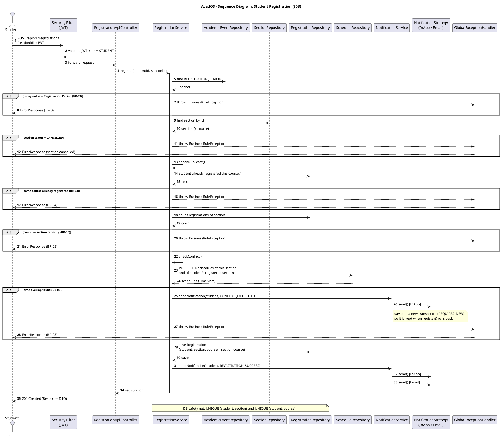
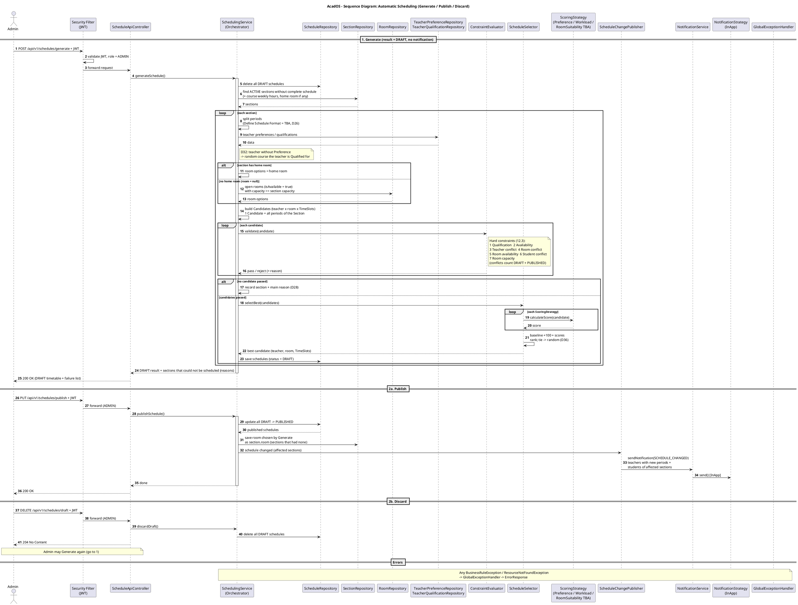
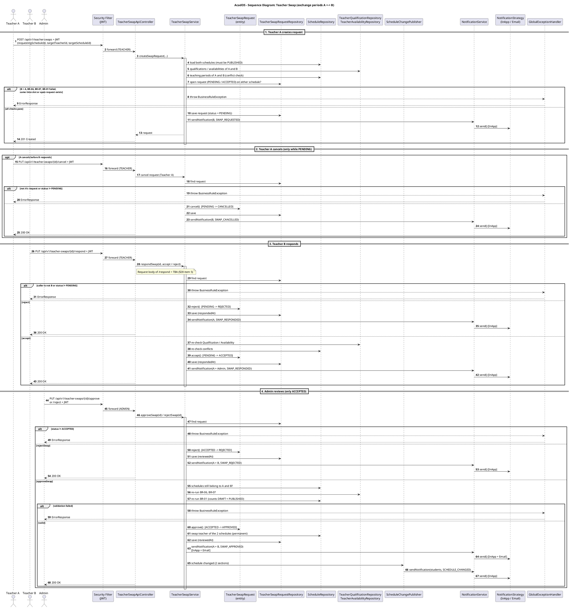

# AcadOS v4 — Sequence Diagrams (PlantUML)

> อ้างอิง Implement Plan (Acad Lastest v6 + ข้อตกลงทีม) §20 · ไฟล์ `.puml` อยู่ใน `doc/diagrams/` · ภาพ PNG อยู่ในโฟลเดอร์ `sequence/` วางไว้ข้างไฟล์นี้

## สารบัญ

1. 4. ขั้นตอนการลงทะเบียนเรียน (Student Registration)
2. 5. ขั้นตอนการจัดตารางอัตโนมัติ (Generate / Publish / Discard)
3. 6. ขั้นตอนการแลกคาบของอาจารย์ (Teacher Swap)

---

## 4. ขั้นตอนการลงทะเบียนเรียน (Student Registration)

**อ้างอิง:** §14.1 · §10.2 RegistrationService · BR-03, BR-04, BR-05, BR-09 · §14.6 Email · §23.2 Scenario 1 · ไฟล์ `04-sequence-registration.puml`

---

## 5. ขั้นตอนการจัดตารางอัตโนมัติ (Generate / Publish / Discard)

**อ้างอิง:** §6.2 Schedule Status · §10.2–10.3 · §12 · D26, D28, D32, D34, D35, D36 · §17.2 Observer, Strategy · §23.2 Scenario 2 · ไฟล์ `05-sequence-scheduling.puml`

---

## 6. ขั้นตอนการแลกคาบของอาจารย์ (Teacher Swap)

**อ้างอิง:** §14.3 · §14.5 SWAP_CANCELLED · §14.6 Email · §16 /teacher-swaps · BR-01, BR-06, BR-07 · §28 ข้อ 5 · §23.2 Scenario 3 · ไฟล์ `06-sequence-teacher-swap.puml`

