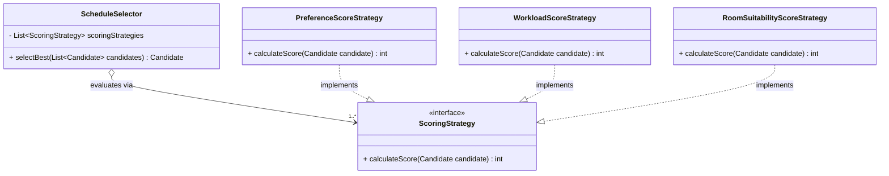
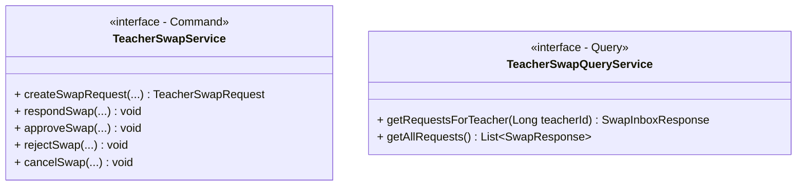

# AcadOS — การวิเคราะห์การปฏิบัติตามหลักการ SOLID (SOLID Principles Analysis)

**เอกสารการวิเคราะห์และตรวจสอบการปฏิบัติตามหลักการออกแบบเชิงวัตถุ SOLID ประจำโครงการ AcadOS**  
**อ้างอิงข้อกำหนด:** [`doc/prof_ruleset.md`](prof_ruleset.md) หัวข้อที่ 4 (SOLID Principles Checklist)  

---

## 1. บทสรุปภาพรวม (Executive Summary)

ระบบ **AcadOS (Automated Proctor Scheduling and Academic Operations System)** ได้รับการออกแบบและพัฒนาตามหลักสถาปัตยกรรม **Clean Architecture & Strict 3-Tier Layered Architecture** โดยยึดถือหลักการพื้นฐานของ **SOLID Principles** อย่างเคร่งครัดทั้ง 5 ข้อ เพื่อให้ระบบมีลักษณะ:
- **High Cohesion & Low Coupling:** แต่ละคลาสมีขอบเขตความรับผิดชอบที่กระชับและไม่ผูกติดกันแน่น
- **Extensible & Maintainable:** รองรับการต่อขยายอัลกอริทึมและฟีเจอร์ใหม่โดยไม่แก้ไขโค้ดเดิม (OCP)
- **Robust & Type-Safe:** ปฏิบัติตามสัญญา (Contract) ระหว่างคลาสอย่างซื่อตรง ไม่เกิด Unexpected Runtime Exception (LSP)
- **100% Testable via Dependency Injection:** ทุกคลาสใช้ **Constructor Injection** เท่านั้น ปราศจาก Field Injection (`@Autowired` บนฟิลด์) ส่งผลให้สามารถทำ Unit Testing และ Mocking ด้วย Mockito ได้อย่างสมบูรณ์

---

## 2. ตารางสรุปการประยุกต์ใช้ SOLID Principles ภาพรวม (SOLID Alignment Catalog)

| หลักการ SOLID | สาระสำคัญตามข้อกำหนดอาจารย์ | คลาสและไฟล์ตัวอย่างหลักใน AcadOS | ตำแหน่งบรรทัดจริง (Verified Line) | เหตุผลและประโยชน์ทางวิศวกรรม (Engineering Rationale) |
| :---: | :--- | :--- | :---: | :--- |
| **S**<br/>Single Responsibility | แต่ละ Class มีหน้าที่เดียว ไม่รวม Business + Validation + Persistence ในคลาสเดียว | [`RegistrationServiceImpl.java`](../code/acados/src/main/java/com/project/acados/service/impl/RegistrationServiceImpl.java)<br/>[`RegistrationApiController.java`](../code/acados/src/main/java/com/project/acados/controller/api/RegistrationApiController.java)<br/>[`RegistrationRepository.java`](../code/acados/src/main/java/com/project/acados/repository/RegistrationRepository.java)<br/>[`ConstraintEvaluator.java`](../code/acados/src/main/java/com/project/acados/service/ConstraintEvaluator.java) | L37–L46<br/>L31–L35<br/>L11–L14<br/>L20–L32 | แยก Controller (HTTP Routing), Service (Business Logic & Transactions), Validation (Hard Constraints), และ Repository (JPA Persistence) ออกจากกันอย่างเด็ดขาด |
| **O**<br/>Open / Closed | ขยายฟีเจอร์ใหม่ด้วยการเพิ่มคลาส ไม่แก้ `if-else` เดิม (ใช้ Strategy / Polymorphism) | [`ScheduleSelector.java`](../code/acados/src/main/java/com/project/acados/service/ScheduleSelector.java)<br/>[`ScoringStrategy.java`](../code/acados/src/main/java/com/project/acados/strategy/ScoringStrategy.java)<br/>[`NotificationServiceImpl.java`](../code/acados/src/main/java/com/project/acados/service/impl/NotificationServiceImpl.java)<br/>[`NotificationStrategy.java`](../code/acados/src/main/java/com/project/acados/notification/strategy/NotificationStrategy.java) | L22, L39–L43<br/>L9–L18<br/>L40, L122–L128<br/>L9–L14 | เพิ่มสูตรคิดคะแนนจัดตารางใหม่ หรือเพิ่มช่องทางแจ้งเตือนใหม่ (เช่น SMS / Line) ได้ด้วยการ Implement คลาสใหม่ โดยไม่ต้องแก้ไขโค้ดเดิมใน Service แม้แต่บรรทัดเดียว |
| **L**<br/>Liskov Substitution | Subclass / Impl ใช้แทน Superclass / Interface ได้โดยไม่พังตรรกะ ไม่ throw `UnsupportedOperationException` | [`InAppNotificationStrategy.java`](../code/acados/src/main/java/com/project/acados/notification/strategy/InAppNotificationStrategy.java)<br/>[`EmailNotificationStrategy.java`](../code/acados/src/main/java/com/project/acados/notification/strategy/EmailNotificationStrategy.java)<br/>[`BusinessRuleException.java`](../code/acados/src/main/java/com/project/acados/exception/BusinessRuleException.java)<br/>[`ResourceNotFoundException.java`](../code/acados/src/main/java/com/project/acados/exception/ResourceNotFoundException.java) | L13, L23–L31<br/>L17, L34–L46<br/>L7–L12<br/>L7–L12 | ทุก Strategy ส่งข้อความตามสัญญาและดักจับ Exception ป้องกัน Side-effect ย้อนกลับ และ Custom Exceptions สืบทอด `RuntimeException` ทำงานร่วมกับ `GlobalExceptionHandler` ได้อย่างสม่ำเสมอ |
| **I**<br/>Interface Segregation | แยก Interface ย่อยตามการใช้งานจริง ไม่มี Fat Interface | [`TeacherSwapService.java`](../code/acados/src/main/java/com/project/acados/service/TeacherSwapService.java) (Command)<br/>[`TeacherSwapQueryService.java`](../code/acados/src/main/java/com/project/acados/service/TeacherSwapQueryService.java) (Query)<br/>[`ScoringStrategy.java`](../code/acados/src/main/java/com/project/acados/strategy/ScoringStrategy.java)<br/>[`HolidayProvider.java`](../code/acados/src/main/java/com/project/acados/pattern/holiday/HolidayProvider.java) | L8–L24<br/>L9–L13<br/>L9–L18<br/>L12–L29 | แยกอินเทอร์เฟซย่อยตามบทบาท Client: CQRS แยกฝั่งอ่านและฝั่งเขียนออกจากกัน, Strategy แต่ละตัวมีเฉพาะเมธอดที่เกี่ยวข้อง ไม่บังคับให้ Client ต้อง Implement เมธอดที่ไม่จำเป็น |
| **D**<br/>Dependency Inversion | คลาสระดับสูงพึ่งพา Interface ไม่พึ่ง Concrete Class + Constructor Injection 100% | [`TeacherPreferenceApiController.java`](../code/acados/src/main/java/com/project/acados/controller/api/TeacherPreferenceApiController.java)<br/>[`TeacherPreferenceService.java`](../code/acados/src/main/java/com/project/acados/service/TeacherPreferenceService.java)<br/>[`HolidayServiceImpl.java`](../code/acados/src/main/java/com/project/acados/service/impl/HolidayServiceImpl.java)<br/>[`HolidayProvider.java`](../code/acados/src/main/java/com/project/acados/pattern/holiday/HolidayProvider.java) | L20–L23<br/>L15–L28<br/>L21–L28<br/>L12–L29 | ทุก Controller พึ่งพา Service Interface (ไม่ข้าม Layer ไปหา Repo และไม่ขึ้นกับ Impl), ทุก Service พึ่งพา Repository Interfaces และ Provider Interfaces ผ่าน Constructor Injection |

---

## 3. รายละเอียดเชิงลึกและหลักฐานอ้างอิงรายหลักการ (Deep-Dive Analysis with Source References)

### 3.1 Single Responsibility Principle (SRP) — หลักการความรับผิดชอบเดี่ยว

> **นิยามตามข้อกำหนด:** แต่ละ Class ต้องมีหน้าที่เดียว ไม่รวม Business Logic + Validation + Persistence ไว้ในคลาสเดียวกัน

#### กรณีศึกษาที่ 1: การแยกชั้นสถาปัตยกรรม 3-Tier Layered Architecture (ระบบลงทะเบียนเรียน)
ในกระบวนการลงทะเบียนเรียนของนักศึกษา (Use Case `S01`, Sequence Diagram 04) หน้าที่ถูกกระจายออกเป็น 4 คลาสอย่างเป็นเอกเทศ:

1. **Presentation / Web Routing:**
   - **คลาส:** [`RegistrationApiController.java`](../code/acados/src/main/java/com/project/acados/controller/api/RegistrationApiController.java) (บรรทัดที่ 31–75)
   - **หน้าที่เดียว:** รับ HTTP Request (`POST /api/v1/registrations`), ดึงข้อมูลตัวตนจาก JWT `Authentication`, ตรวจสอบ Security Authority (`@PreAuthorize("hasRole('STUDENT')")`), และส่งต่อให้ Service พร้อมคืนค่า HTTP Status `201 Created`
   - **สิ่งที่ไม่มี:** ไม่มีการต่อ Database ตรง, ไม่เขียน SQL, และไม่มี Business Rules ตรวจสอบเวลาชน
2. **Business Workflow & Transaction Boundary:**
   - **คลาส:** [`RegistrationServiceImpl.java`](../code/acados/src/main/java/com/project/acados/service/impl/RegistrationServiceImpl.java) (บรรทัดที่ 37–120)
   - **หน้าที่เดียว:** ควบคุมตรรกะทางธุรกิจของระบบลงทะเบียน: ตรวจสอบช่วงเวลาลงทะเบียน (BR-09), ตรวจสถานะกลุ่มเรียน ACTIVE, ตรวจการลงทะเบียนซ้ำ (BR-04), ตรวจความจุกลุ่มเรียน (BR-05), ตรวจเวลาเรียนชน (BR-03), บันทึกการลงทะเบียน, และสั่งส่งการแจ้งเตือน
3. **Data Access & Persistence Abstraction:**
   - **คลาส:** [`RegistrationRepository.java`](../code/acados/src/main/java/com/project/acados/repository/RegistrationRepository.java) (บรรทัดที่ 11–28)
   - **หน้าที่เดียว:** ทำงานร่วมกับ Database ตาราง `registrations` ผ่าน Spring Data JPA เช่น `countBySectionId()`, `existsByStudentIdAndCourseId()`
4. **Input Contract & Data Transfer:**
   - **คลาส:** [`RegistrationRequest.java`](../code/acados/src/main/java/com/project/acados/dto/request/RegistrationRequest.java) และ [`RegistrationMapper.java`](../code/acados/src/main/java/com/project/acados/mapper/RegistrationMapper.java)
   - **หน้าที่เดียว:** ทำหน้าที่เป็น Data Contract และแปลงข้อมูลระหว่าง DTO กับ Entity โดยใช้ MapStruct

#### กรณีศึกษาที่ 2: การแยกส่วนการประมวลผลของ Scheduling Engine
กระบวนการสร้างตารางสอนอัตโนมัติ (Automated Scheduling Pipeline) ถูกแยกย่อยออกเป็นคลาสเฉพาะทางเพื่อป้องกัน God Class / Fat Service:

1. **Orchestrator:** [`SchedulingServiceImpl.java`](../code/acados/src/main/java/com/project/acados/service/impl/SchedulingServiceImpl.java) (บรรทัดที่ 45–130)  
   ควบคุม Lifecycle ของกระบวนการ: เคลียร์ตาราง DRAFT เดิม, วนลูปกลุ่มเรียนที่ยังไม่มีตาราง, เรียก Candidate Matrix, ประสานงานระหว่าง Evaluator และ Selector, และบันทึกผล
2. **Hard Constraint Validation:** [`ConstraintEvaluator.java`](../code/acados/src/main/java/com/project/acados/service/ConstraintEvaluator.java) (บรรทัดที่ 20–120)  
   ตรวจสอบเฉพาะเงื่อนไขบังคับ 7 ข้อ (Hard Constraints: BR-01 ตารางชน, BR-02 ห้องชน, BR-06 คุณสมบัติอาจารย์, BR-07 ความพร้อมอาจารย์, BR-08 ความพร้อมห้องเรียน) คืนค่า `ValidationResult` โดยไม่แตะตรรกะการให้คะแนนหรือการบันทึกข้อมูล
3. **Soft Constraint Scoring & Winner Selection:** [`ScheduleSelector.java`](../code/acados/src/main/java/com/project/acados/service/ScheduleSelector.java) (บรรทัดที่ 18–67)  
   รับ Candidate ที่ผ่าน Hard Constraints ทั้งหมดมาวนลูปคำนวณคะแนนรวม และเลือก Candidate ที่มีคะแนนสูงสุด (หรือสุ่มเลือกเมื่อคะแนนเท่ากันตาม Decision D36)

#### กรณีศึกษาที่ 3: การแยก Service การยกเลิกกลุ่มเรียน (Section Cancellation)
- [`SectionService.java`](../code/acados/src/main/java/com/project/acados/service/SectionService.java): ดูแลเฉพาะ CRUD พื้นฐานของกลุ่มเรียน และการมอบหมายผู้สอน (Sub-feature A13)
- [`SectionCancellationService.java`](../code/acados/src/main/java/com/project/acados/service/SectionCancellationService.java): ดูแลเฉพาะ Cascading Workflow ของการยกเลิกกลุ่มเรียน (เปลี่ยนสถานะผ่าน State Pattern, ปลดตารางใน Schedule, ลบข้อมูลการลงทะเบียน, และแจ้งเตือนผู้ได้รับผลกระทบ) เพื่อไม่ให้ `SectionService` บวมเกินความจำเป็น

---

### 3.2 Open/Closed Principle (OCP) — หลักการเปิดต่อการขยาย ปิดต่อการแก้ไข

> **นิยามตามข้อกำหนด:** เพิ่มฟีเจอร์ใหม่ด้วยการเพิ่มคลาสใหม่ ไม่ใช่การแก้ไขโค้ดเดิมหรือเพิ่มเงื่อนไข `if-else` ซับซ้อน (ใช้ Strategy / Polymorphism)

#### กรณีศึกษาที่ 1: Multi-factor Candidate Scoring Engine (`ScoringStrategy`)
ในการคำนวณคะแนนความเหมาะสมของตารางเรียน ระบบต้องประเมินหลายปัจจัย:
- ความต้องการของอาจารย์ (Preference: +30 คะแนน)
- การกระจายภาระงานสอน (Workload: +20 คะแนน)
- ความเหมาะสมของขนาดห้องเรียน (Room Suitability: +20 คะแนน)



- **ตำแหน่งโค้ด:** [`ScheduleSelector.java`](../code/acados/src/main/java/com/project/acados/service/ScheduleSelector.java) บรรทัดที่ 22, 39–43
  ```java
  private final List<ScoringStrategy> scoringStrategies;
  ...
  for (ScoringStrategy strategy : scoringStrategies) {
      totalScore += strategy.calculateScore(candidate);
  }
  ```
- **การปฏิบัติตาม OCP:** หากในอนาคตคณะกรรมการต้องการเพิ่มเกณฑ์ใหม่ เช่น **"การประหยัดพลังงานของอาคารเรียน (+15 คะแนน)"** นักพัฒนาเพียงแค่สร้างคลาส `EnergySavingScoreStrategy implements ScoringStrategy` ขึ้นมาใหม่และใส่ `@Component` โดยไม่ต้องแก้ไขโค้ดของ `ScheduleSelector.java` แม้แต่ตัวอักษรเดียว

#### กรณีศึกษาที่ 2: Multi-channel Notification Engine (`NotificationStrategy`)
ระบบ AcadOS รองรับการส่งการแจ้งเตือนทั้งแบบภายในเว็บ (In-App Database Alert) และอีเมลภายนอก (Mailtrap SMTP):
- **อินเทอร์เฟซ:** [`NotificationStrategy.java`](../code/acados/src/main/java/com/project/acados/notification/strategy/NotificationStrategy.java) (บรรทัดที่ 9–14)
- **Implementations:** 
  - [`InAppNotificationStrategy.java`](../code/acados/src/main/java/com/project/acados/notification/strategy/InAppNotificationStrategy.java) (บรรทัดที่ 13–32)
  - [`EmailNotificationStrategy.java`](../code/acados/src/main/java/com/project/acados/notification/strategy/EmailNotificationStrategy.java) (บรรทัดที่ 17–47)
- **ตำแหน่งโค้ด Dispatcher:** [`NotificationServiceImpl.java`](../code/acados/src/main/java/com/project/acados/service/impl/NotificationServiceImpl.java) บรรทัดที่ 40, 122–128
  ```java
  private final List<NotificationStrategy> strategies;
  ...
  for (NotificationStrategy strategy : strategies) {
      if (strategy.supports(channel)) {
          strategy.send(notificationMessage);
      }
  }
  ```
- **การปฏิบัติตาม OCP:** หากต้องการเพิ่มช่องทางใหม่ เช่น **LINE Notify**, **Telegram Bot**, หรือ **SMS Gateway** เพียงแค่สร้างคลาสใหม่ที่ `implements NotificationStrategy` ระบบ Spring จะรวบรวมเข้า `List<NotificationStrategy>` อัตโนมัติ โดยไม่ต้องแก้ฟังก์ชัน `send()` ของ `NotificationServiceImpl`

#### กรณีศึกษาที่ 3: Section Lifecycle State Pattern (`SectionState`)
- **อินเทอร์เฟซ:** [`SectionState.java`](../code/acados/src/main/java/com/project/acados/state/SectionState.java) (บรรทัดที่ 9–12)
- **คลาสสถานะ:** [`ActiveSectionState.java`](../code/acados/src/main/java/com/project/acados/state/ActiveSectionState.java) และ [`CancelledSectionState.java`](../code/acados/src/main/java/com/project/acados/state/CancelledSectionState.java)
- **ตำแหน่งโค้ดใน Entity:** [`Section.java`](../code/acados/src/main/java/com/project/acados/domain/entity/Section.java) บรรทัดที่ 61–63
  ```java
  public void cancel() {
      getState().cancel(this);
  }
  ```
- **การปฏิบัติตาม OCP:** แทนที่จะเขียน `if (status == ACTIVE) ... else if (status == CANCELLED) ...` กระจายอยู่ทั่วระบบ พฤติกรรมของการยกเลิกถูกซ่อนไว้ใน State Object หากอนาคตมีสถานะใหม่ เช่น `ARCHIVED` หรือ `PENDING_APPROVAL` สามารถเพิ่มคลาสใหม่โดยไม่กระทบพฤติกรรมเดิม

---

### 3.3 Liskov Substitution Principle (LSP) — หลักการทดแทนของลิสคอฟ

> **นิยามตามข้อกำหนด:** คลาสลูก (Subclass หรือ Implementation) ต้องสามารถถูกนำมาใช้งานแทนคลาสแม่ (Interface หรือ Superclass) ได้อย่างสมบูรณ์โดยตรรกะระบบไม่ล้มเหลว และต้องไม่ throw `UnsupportedOperationException`

#### กรณีศึกษาที่ 1: การทดแทนกันได้อย่างปลอดภัยของ `NotificationStrategy`
- **สัญญาของอินเทอร์เฟซ:** กำหนดว่าทุก Strategy ต้องมีเมธอด `boolean supports(NotificationChannel)` และ `void send(NotificationMessage)`
- **การตรวจสอบใน Implementation:**
  - [`InAppNotificationStrategy.java`](../code/acados/src/main/java/com/project/acados/notification/strategy/InAppNotificationStrategy.java): ทำงานโดยบันทึกลงฐานข้อมูล คืนค่าเรียบร้อย
  - [`EmailNotificationStrategy.java`](../code/acados/src/main/java/com/project/acados/notification/strategy/EmailNotificationStrategy.java) (บรรทัดที่ 40–45): มีการครอบ `try-catch` ป้องกัน `MailException` ล้มเหลวไม่ให้ throw runtime error หลุดออกไปทำลาย Caller Transaction
  ```java
  try {
      mailSender.send(mail);
  } catch (MailException e) {
      log.warn("Could not send {} email to user {}: {}",
              message.type(), message.recipient().getId(), e.getMessage());
  }
  ```
- **ผลลัพธ์ตาม LSP:** ไม่มี Strategy ตัวใด throw `UnsupportedOperationException` หรือทำให้ระบบขัดข้อง ทั้งสองคลาสสามารถถูกแทนที่ในลูป Dispatcher ได้อย่างปลอดภัย 100%

#### กรณีศึกษาที่ 2: ความคงเส้นคงวาของ `ScoringStrategy`
- **สัญญาของอินเทอร์เฟซ:** `int calculateScore(Candidate candidate)` คืนค่าคะแนนเป็นจำนวนเต็ม
- **การตรวจสอบใน Implementation:** ทั้ง `PreferenceScoreStrategy`, `WorkloadScoreStrategy`, และ `RoomSuitabilityScoreStrategy` มีการทำ Defensive Null Check อย่างรัดกุม (ถ้า Candidate หรือฟิลด์ที่จำเป็นเป็น null จะ return `0` ทันที) ไม่มีการ throw Exception ที่ไม่คาดฝัน
- **ผลลัพธ์ตาม LSP:** `ScheduleSelector` สามารถเรียกใช้ Strategy ทุกตัวได้อย่างมั่นใจโดยไม่ต้องดักจับ Exception พิเศษเฉพาะของแต่ละคลาส

#### กรณีศึกษาที่ 3: ระบบข้อยกเว้นมาตรฐาน (Exception Hierarchy)
- **คลาส:** [`BusinessRuleException.java`](../code/acados/src/main/java/com/project/acados/exception/BusinessRuleException.java) (บรรทัดที่ 7–12) และ [`ResourceNotFoundException.java`](../code/acados/src/main/java/com/project/acados/exception/ResourceNotFoundException.java) (บรรทัดที่ 7–12) ทั้งสองสืบทอดมาจาก `RuntimeException`
- **ผลลัพธ์ตาม LSP:** สามารถถูกจัดการในฐานะ `RuntimeException` ในระดับโครงสร้าง และถูกดักจับอย่างเป็นระบบใน [`GlobalExceptionHandler.java`](../code/acados/src/main/java/com/project/acados/exception/GlobalExceptionHandler.java) โดยไม่สูญเสียความหมายหรือสัญญาระดับ Application

---

### 3.4 Interface Segregation Principle (ISP) — หลักการแยกส่วนอินเทอร์เฟซ

> **นิยามตามข้อกำหนด:** แยก Interface ออกเป็นหน่วยย่อยตามบริบทการใช้งานจริง ห้ามมี Fat Interface ที่บังคับให้ Client ต้อง Implement เมธอดที่ตนเองไม่ได้ใช้

#### กรณีศึกษาที่ 1: การแยกย่อย Strategy & Provider Interfaces ขนาดกะทัดรัด (Focused Interfaces)
ระบบ AcadOS ปฏิเสธการสร้าง Fat Interface ขนาดใหญ่ และแยกออกเป็นอินเทอร์เฟซย่อยที่มีจุดประสงค์เดียว:

1. **[`ScoringStrategy.java`](../code/acados/src/main/java/com/project/acados/strategy/ScoringStrategy.java) (บรรทัดที่ 9–18):**  
   มีเพียง **1 เมธอด** คือ `calculateScore(Candidate)` — ไม่มีเมธอดจัดการ Candidate หรือคำนวณคะแนนรวม
2. **[`NotificationStrategy.java`](../code/acados/src/main/java/com/project/acados/notification/strategy/NotificationStrategy.java) (บรรทัดที่ 9–14):**  
   มีเพียง **2 เมธอด** คือ `supports(channel)` และ `send(message)` — ไม่มีเมธอดค้นหาแจ้งเตือนย้อนหลังหรือมาร์กสถานะอ่านแล้ว
3. **[`HolidayProvider.java`](../code/acados/src/main/java/com/project/acados/pattern/holiday/HolidayProvider.java) (บรรทัดที่ 12–29):**  
   มีเพียงเมธอดดึงข้อมูลวันหยุด `fetchHolidays()` — ไม่ยัดเยียดเมธอดบันทึกลงฐานข้อมูลหรือคำนวณวันหยุดชดเชยลงใน Interface

#### กรณีศึกษาที่ 2: การแยกส่วน Command ออกจาก Query ตามแนวคิด CQRS (`TeacherSwap`)
เพื่อป้องกันไม่ให้อินเทอร์เฟซจัดการคำขอแลกคาบของอาจารย์กลายเป็น Fat Interface ระบบได้แยก Interface ออกเป็น 2 ด้านอย่างชัดเจน:



- **ด้าน Command (การเปลี่ยนแปลงสถานะ):** [`TeacherSwapService.java`](../code/acados/src/main/java/com/project/acados/service/TeacherSwapService.java) (บรรทัดที่ 8–24) — บรรจุเฉพาะเมธอดสร้างคำขอ, ตอบรับ, อนุมัติ, ปฏิเสธ, และยกเลิก
- **ด้าน Query (การอ่านข้อมูล):** [`TeacherSwapQueryService.java`](../code/acados/src/main/java/com/project/acados/service/TeacherSwapQueryService.java) (บรรทัดที่ 9–13) — บรรจุเฉพาะเมธอดอ่านรายการคำขอใน Inbox ของอาจารย์ และรายการทั้งหมดสำหรับ Admin
- **ผลลัพธ์ตาม ISP:** Controller หรือ Component ที่ต้องการเพียงอ่านรายการคำขอไปแสดงผลบน Dashboard ไม่ต้องพึ่งพาหรือมีความเสี่ยงต่อการเรียกใช้เมธอดแก้ไขสถานะ

#### กรณีศึกษาที่ 3: การแยกส่วนอินเทอร์เฟซ Observer Pattern
- **[`ScheduleChangeSubject.java`](../code/acados/src/main/java/com/project/acados/pattern/observer/ScheduleChangeSubject.java) (บรรทัดที่ 9–18):** มีเฉพาะ `attach()`, `detach()`, `notifyObservers()`
- **[`ScheduleChangeObserver.java`](../code/acados/src/main/java/com/project/acados/pattern/observer/ScheduleChangeObserver.java) (บรรทัดที่ 9–14):** มีเฉพาะ `onScheduleChanged(List<Section>)`
- **ผลลัพธ์ตาม ISP:** Subject ไม่จำเป็นต้องรู้ตรรกะการส่งอีเมล และ Observer ไม่จำเป็นต้องรู้วิธีจัดการรายชื่อผู้สังเกตการณ์

---

### 3.5 Dependency Inversion Principle (DIP) — หลักการผกผันการพึ่งพา

> **นิยามตามข้อกำหนด:** โมดูลระดับสูงต้องไม่พึ่งพาโมดูลระดับต่ำ ทั้งสองต้องพึ่งพา Abstraction (Interface) และต้องใช้ **Constructor Injection** เท่านั้น ห้ามใช้ Field Injection (`@Autowired` บนฟิลด์)

#### กรณีศึกษาที่ 1: การใช้ Strict Constructor Injection 100% ทั้งระบบ
จากการตรวจสอบ Source Code ทั้งหมดในโฟลเดอร์ `code/acados/src/main/java/` **ไม่พบการใช้งาน `@Autowired` บน Private Field แม้แต่จุดเดียว (0 Field Injections)**  
ทุกคลาสพึ่งพา Dependency ผ่าน Constructor โดยใช้ประโยชน์จาก Lombok `@RequiredArgsConstructor` หรือ Explicit Constructor:

```java
// ตัวอย่างที่ถูกต้อง: Constructor Injection ผ่าน Lombok @RequiredArgsConstructor
@Service
@RequiredArgsConstructor
public class RegistrationServiceImpl implements RegistrationService {
    private final AcademicEventRepository academicEventRepository;
    private final SectionRepository sectionRepository;
    private final RegistrationRepository registrationRepository;
    private final ScheduleRepository scheduleRepository;
    private final StudentRepository studentRepository;
    private final UserRepository userRepository;
    private final NotificationService notificationService;
    ...
}
```

- **ประโยชน์:**
  1. **Immutability:** ฟิลด์ทั้งหมดเป็น `private final` ป้องกันการถูก re-assign ระหว่าง Runtime
  2. **Testability:** สามารถเขียน Unit Test โดยส่ง Mock Object (Mockito) เข้าผ่าน Constructor ได้โดยตรงโดยไม่ต้องพึ่งพา Spring Context Container

#### กรณีศึกษาที่ 2: Controller พึ่งพา Service Interface (ไม่ข้าม Layer ไปหา Repository)
สอดคล้องกับกฎเหล็กข้อ 3 ของอาจารย์ (`doc/prof_ruleset.md`: *"ต้องแยก Layer ชัดเจน และห้ามข้าม Layer เช่น Controller เรียก Repository ตรง ๆ ถือว่าผิด"*):

- **ไฟล์:** [`TeacherPreferenceApiController.java`](../code/acados/src/main/java/com/project/acados/controller/api/TeacherPreferenceApiController.java) (บรรทัดที่ 20–23)
  ```java
  @RestController
  @RequestMapping({"/api/v1/teacher", "/api/v1"})
  @RequiredArgsConstructor
  public class TeacherPreferenceApiController {
      private final TeacherPreferenceService teacherPreferenceService;
      ...
  }
  ```
- **การปฏิบัติตาม DIP:** Controller พึ่งพา Abstraction [`TeacherPreferenceService.java`](../code/acados/src/main/java/com/project/acados/service/TeacherPreferenceService.java) โดยไม่พึ่งพา `TeacherPreferenceServiceImpl.java` หรือ Repositories ทั้ง 7 ตัวโดยตรง

#### กรณีศึกษาที่ 3: Service พึ่งพา External Provider ผ่าน Abstraction (Adapter Integration)
- **ไฟล์ High-level Service:** [`HolidayServiceImpl.java`](../code/acados/src/main/java/com/project/acados/service/impl/HolidayServiceImpl.java) (บรรทัดที่ 24–28)
  ```java
  @Service
  @RequiredArgsConstructor
  public class HolidayServiceImpl implements HolidayService {
      private final HolidayProvider holidayProvider; // พึ่งพา Interface
      private final PublicHolidayRepository publicHolidayRepository;
      ...
  }
  ```
- **การปฏิบัติตาม DIP:** `HolidayServiceImpl` ไม่รู้จักคลาส `ExternalHolidayAdapter` หรือ `RestClient` ภายนอกเลยแม้แต่น้อย รู้จักเพียงอินเทอร์เฟซ `HolidayProvider` ส่งผลให้ใน Unit Test ([`HolidayServiceTest.java`](../code/acados/src/test/java/com/project/acados/service/HolidayServiceTest.java)) สามารถ Mock `HolidayProvider` ได้อย่างง่ายดาย

---

## 4. ตารางตรวจสอบรายคลาสและหมายเลขบรรทัด (Class & Line Verification Matrix)

ตารางสรุปหลักฐานสำหรับคณะกรรมการและอาจารย์ผู้ตรวจประเมิน เพื่อความสะดวกรวดเร็วในการตรวจสอบ Source Code:

| หลักการ | ชื่อคลาส / อินเทอร์เฟซ | ตำแหน่งไฟล์ใน Repository | หมายเลขบรรทัดที่แสดงหลักการ | หน้าที่และสาระสำคัญ |
| :---: | :--- | :--- | :---: | :--- |
| **S** | `RegistrationApiController` | `code/acados/src/main/java/com/project/acados/controller/api/RegistrationApiController.java` | L31–L75 | จัดการเฉพาะ HTTP Request/Response, Status Code, และ Authorization (SRP ฝั่ง Presentation) |
| **S** | `RegistrationServiceImpl` | `code/acados/src/main/java/com/project/acados/service/impl/RegistrationServiceImpl.java` | L37–L120 | จัดการเฉพาะ Business Logic, BR Validation, และ Transaction Boundary (SRP ฝั่ง Business) |
| **S** | `ConstraintEvaluator` | `code/acados/src/main/java/com/project/acados/service/ConstraintEvaluator.java` | L20–L120 | รับผิดชอบเฉพาะการตรวจสอบ Hard Constraints 7 ข้อใน Scheduling Engine |
| **S** | `SectionCancellationServiceImpl` | `code/acados/src/main/java/com/project/acados/service/impl/SectionCancellationServiceImpl.java` | L31–L80 | แยก Workflow การยกเลิกกลุ่มเรียนที่ซับซ้อนออกจาก CRUD ปกติของ `SectionService` |
| **O** | `ScheduleSelector` | `code/acados/src/main/java/com/project/acados/service/ScheduleSelector.java` | L22, L39–L43 | เปิดรับ `List<ScoringStrategy>` เพื่อขยายสูตรคำนวณคะแนนใหม่โดยไม่แก้โค้ดเดิม |
| **O** | `NotificationServiceImpl` | `code/acados/src/main/java/com/project/acados/service/impl/NotificationServiceImpl.java` | L40, L122–L128 | เปิดรับ `List<NotificationStrategy>` เพื่อขยายช่องทางการแจ้งเตือนใหม่ |
| **O** | `Section` | `code/acados/src/main/java/com/project/acados/domain/entity/Section.java` | L58–L75 | ใช้ State Pattern ซ่อนพฤติกรรมสถานะ ACTIVE / CANCELLED โดยไม่ต้องเขียน if-else |
| **L** | `InAppNotificationStrategy` | `code/acados/src/main/java/com/project/acados/notification/strategy/InAppNotificationStrategy.java` | L13, L23–L31 | ปฏิบัติตามสัญญาของ `NotificationStrategy` ไม่ throw `UnsupportedOperationException` |
| **L** | `EmailNotificationStrategy` | `code/acados/src/main/java/com/project/acados/notification/strategy/EmailNotificationStrategy.java` | L17, L34–L46 | ดักจับ `MailException` อย่างปลอดภัย ไม่ทำให้ Transaction ของผู้เรียกเสียหาย |
| **L** | `PreferenceScoreStrategy` | `code/acados/src/main/java/com/project/acados/strategy/PreferenceScoreStrategy.java` | L17, L24–L39 | คืนค่าคะแนน int สม่ำเสมอ มี Defensive Null Check แทนที่ในลูป Selector ได้ปลอดภัย |
| **I** | `ScoringStrategy` | `code/acados/src/main/java/com/project/acados/strategy/ScoringStrategy.java` | L9–L18 | อินเทอร์เฟซขนาดเล็ก มีเพียง 1 เมธอด `calculateScore(Candidate)` |
| **I** | `NotificationStrategy` | `code/acados/src/main/java/com/project/acados/notification/strategy/NotificationStrategy.java` | L9–L14 | อินเทอร์เฟซขนาดเล็ก มีเพียง 2 เมธอด `supports(channel)` และ `send(message)` |
| **I** | `TeacherSwapQueryService` | `code/acados/src/main/java/com/project/acados/service/TeacherSwapQueryService.java` | L9–L13 | แยกเฉพาะเมธอด Query ออกจาก Command ตาม CQRS ป้องกัน Fat Interface |
| **D** | `TeacherPreferenceApiController` | `code/acados/src/main/java/com/project/acados/controller/api/TeacherPreferenceApiController.java` | L20–L23 | พึ่งพา `TeacherPreferenceService` (Interface) ผ่าน Constructor Injection |
| **D** | `HolidayServiceImpl` | `code/acados/src/main/java/com/project/acados/service/impl/HolidayServiceImpl.java` | L21–L28 | พึ่งพา `HolidayProvider` (Interface) ไม่พึ่งพา Concrete Adapter |
| **D** | `NotificationServiceImpl` | `code/acados/src/main/java/com/project/acados/service/impl/NotificationServiceImpl.java` | L37–L45 | พึ่งพา Interfaces (`NotificationStrategy`, `ScheduleChangeSubject`) ผ่าน Constructor Injection |

---

## 5. การทดสอบยืนยันผลการออกแบบ (Verification & Test Proof)

การออกแบบระบบตาม SOLID Principles ช่วยให้โค้ดแต่ละโมดูลสามารถทำ **Automated Unit Testing & Mocking** ได้อย่างมีประสิทธิภาพ:

- **คำสั่งรันชุดทดสอบ:**
  ```powershell
  mvn test
  ```
- **ผลลัพธ์การรันจริง:**
  - **326 Tests Run, 0 Failures, 0 Errors, 0 Skipped (100% Green)**
- **การทดสอบความสามารถในการสับเปลี่ยนและฉีด Dependency (DI & Mocking Proof):**
  - [`TeacherPreferenceApiControllerTest.java`](../code/acados/src/test/java/com/project/acados/controller/api/TeacherPreferenceApiControllerTest.java): ยืนยันว่า Controller สามารถทดสอบแบบตัดขาดจาก DB ได้ด้วยการ Mock `TeacherPreferenceService`
  - [`ScheduleSelectorTest.java`](../code/acados/src/test/java/com/project/acados/service/ScheduleSelectorTest.java): ยืนยันว่าสามารถทดสอบการคิดคะแนนโดยส่ง Mock Strategies หรือ Custom Strategies เข้าไปได้
  - [`HolidayServiceTest.java`](../code/acados/src/test/java/com/project/acados/service/HolidayServiceTest.java): ยืนยันว่าสามารถจำลองวันหยุดภายนอกผ่าน Mock `HolidayProvider` ได้โดยไม่ต้องเชื่อมต่ออินเทอร์เน็ตจริง

