# AcadOS v4 — Userflow

ระดับ Feature · Admin, Teacher, Student

| | |
|---|---|
| **อ้างอิง** | AcadOS v4 §3 Scope, §11 Business Rules, §12 Scheduling, §13 Use Case, §14 Feature Workflows, §16 REST API และ Database Design Specification ฉบับปรับปรุง 2026-10-09 |
| **ขอบเขต** | Feature ที่มี Use Case หรือ Workflow ในเอกสาร · Feature ที่ยังเป็น TBA ไม่มี flow |

## สารบัญ

| # | Feature | Role |
|---|---|---|
| 0.1 | [Login / Logout](#01-login--logout) | ทุก Role |
| 0.2 | [View / Read Notification](#02-view--read-notification) | ทุก Role |
| 0.3 | [View Academic Calendar / Public Holiday](#03-view-academic-calendar--public-holiday) | ทุก Role (Teacher, Student ดูอย่างเดียว) |
| 1.1 | [Register Course](#11-register-course) | Student |
| 1.2 | [Withdraw Course](#12-withdraw-course) | Student |
| 1.3 | [View Own Schedule](#13-view-own-schedule) | Student |
| 2.1 | [View Own Schedule](#21-view-own-schedule) | Teacher |
| 2.2 | [Manage Availability](#22-manage-availability) | Teacher |
| 2.3 | [Create Swap Request (Teacher A)](#23-create-swap-request-teacher-a) | Teacher |
| 2.4 | [Respond to Swap Request (Teacher B)](#24-respond-to-swap-request-teacher-b) | Teacher |
| 2.5 | [Cancel Swap Request (Teacher A)](#25-cancel-swap-request-teacher-a) | Teacher |
| 2.6 | [View Swap Request Status](#26-view-swap-request-status) | Teacher |
| 2.7 | [View Own Qualification / Availability](#27-view-own-qualification--availability) | Teacher |
| 3.1 | [Course Management (CRUD)](#31-course-management-crud) | Admin |
| 3.2 | [Room Management (CRUD)](#32-room-management-crud) | Admin |
| 3.3 | [Generate Schedule](#33-generate-schedule) | Admin |
| 3.4 | [Approve / Reject Swap Request](#34-approve--reject-swap-request) | Admin |
| 3.5 | [Cancel Section](#35-cancel-section) | Admin |
| 3.6 | [Academic Calendar (CRUD Academic Event)](#36-academic-calendar-crud-academic-event) | Admin |
| 3.7 | [Fetch / View Public Holiday](#37-fetch--view-public-holiday) | Admin |
| 4 | [ภาพรวมการแลกคาบข้าม Role](#4-ภาพรวมการแลกคาบข้าม-role) | Teacher A → Teacher B → Admin |

## สัญลักษณ์

| รูป | ความหมาย |
|---|---|
| สีน้ำเงินเข้ม (มุมมน) | จุดเริ่มต้น / จุดสิ้นสุด |
| สีฟ้าอ่อน | การกระทำของผู้ใช้หรือระบบ |
| สีเหลือง (ข้าวหลามตัด) | จุดตัดสินใจ / การตรวจเงื่อนไข |
| สีแดง | ระบบปฏิเสธ พร้อมเหตุผล (เช่น BR ที่ไม่ผ่าน) |
| สีเขียว | ผลลัพธ์สำเร็จ / การแจ้งเตือน |

## ข้อตกลงที่ใช้ในแผนภาพ (เอกสารไม่ได้ระบุ ทีมตัดสินใจแล้ว)

| เรื่อง | ข้อสรุป |
|---|---|
| การแลกคาบ (Swap) | แลกคาบระหว่าง Teacher A และ B · B ตอบรับ แล้ว Admin อนุมัติ · เมื่ออนุมัติ สลับอาจารย์ของ 2 คาบแบบถาวร |
| ยกเลิกคำขอแลกคาบ | A ยกเลิกได้เฉพาะตอน PENDING (สถานะ CANCELLED) · แจ้งเตือน B |
| Admin ปฏิเสธคำขอ | ได้เฉพาะคำขอที่ ACCEPTED |
| ผู้รับแจ้งเตือนของ Swap | A ส่งคำขอ → B · B ตอบรับ → A และ Admin · B ปฏิเสธ → A · Admin อนุมัติ → A และ B (+ Email) · Admin ปฏิเสธ → A และ B |
| หลัง Generate Schedule | แจ้งเตือนอาจารย์ที่ได้คาบใหม่ · ตารางใช้งานได้ทันที |
| Teacher Availability | ระบุได้ทั้ง ว่าง / ไม่ว่าง · ช่วงที่ไม่ระบุ = ว่าง · ช่วงทับกันและมี "ไม่ว่าง" = ไม่ว่าง |
| Cancel Section | Release Schedule = ลบคาบสอนของ Section · แจ้งอาจารย์ทั้งสองฝ่ายของคำขอแลกคาบที่เกี่ยวข้องก่อนลบ |

## Feature ที่ยังเป็น TBA (ไม่มี flow)

| Feature | อ้างอิง |
|---|---|
| Account Management (Create Teacher / Student Account) | §3 TBA |
| Section Management (Manage Section, Define Capacity, Assign Course, Define Schedule Format) | §3 TBA |
| Teacher Assignment (Assign Teacher) | §3 TBA |
| Schedule Override (BR-10) | §3 TBA |
| View Generated Schedule | §3 TBA |

---

## 0. ทุก Role

### 0.1 Login / Logout

**Role:** ทุก Role · **อ้างอิง:** §13.2 Authentication · §15.1 (JWT, BCrypt)

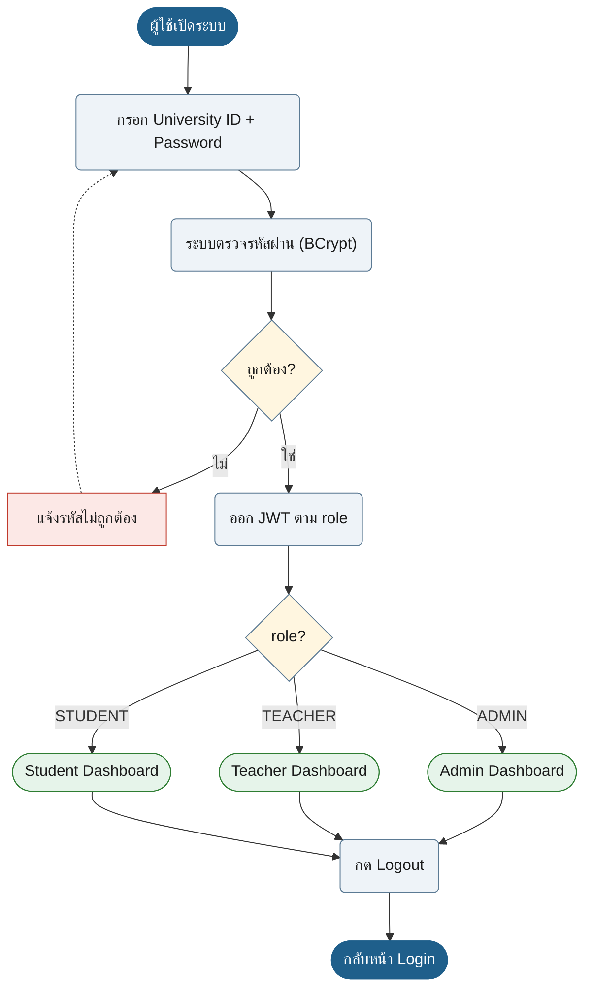
```mermaid
flowchart TD
    n1(["ผู้ใช้เปิดระบบ"]):::start
    n2("กรอก University ID + Password"):::act
    n3("ระบบตรวจรหัสผ่าน (BCrypt)"):::act
    n1 --> n2
    n2 --> n3
    n4{"ถูกต้อง?"}:::dec
    n3 --> n4
    n5["แจ้งรหัสไม่ถูกต้อง"]:::bad
    n4 -->|ไม่| n5
    n5 -.-> n2
    n6("ออก JWT ตาม role"):::act
    n4 -->|ใช่| n6
    n7{"role?"}:::dec
    n6 --> n7
    n8(["Admin Dashboard"]):::ok
    n9(["Teacher Dashboard"]):::ok
    n10(["Student Dashboard"]):::ok
    n7 -->|ADMIN| n8
    n7 -->|TEACHER| n9
    n7 -->|STUDENT| n10
    n11("กด Logout"):::act
    n8 --> n11
    n9 --> n11
    n10 --> n11
    n12(["กลับหน้า Login"]):::start
    n11 --> n12
    classDef start fill:#1F5F8B,stroke:#1F5F8B,color:#fff
    classDef act fill:#EEF3F8,stroke:#5B7A94,color:#1a1a1a
    classDef dec fill:#FFF6E0,stroke:#5B7A94,color:#1a1a1a
    classDef bad fill:#FCE8E6,stroke:#C0392B,color:#1a1a1a
    classDef ok fill:#E6F4EA,stroke:#2E7D32,color:#1a1a1a
    classDef note fill:#F4F4F4,stroke:#999,color:#1a1a1a
```

### 0.2 View / Read Notification

**Role:** ทุก Role · **อ้างอิง:** §13.2 Notification · §16 GET /notifications, PUT /notifications/{id}/read

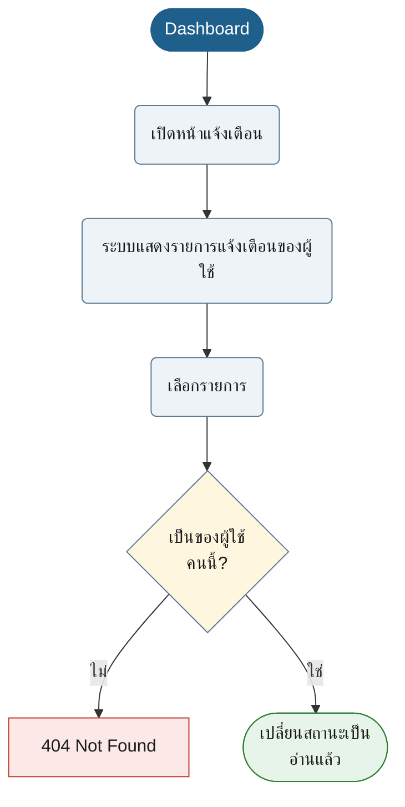
```mermaid
flowchart TD
    n1(["Dashboard"]):::start
    n2("เปิดหน้าแจ้งเตือน"):::act
    n3("ระบบแสดงรายการแจ้งเตือนของผู้ใช้"):::act
    n4("เลือกรายการ"):::act
    n1 --> n2
    n2 --> n3
    n3 --> n4
    n5{"เป็นของผู้ใช้<br/>คนนี้?"}:::dec
    n4 --> n5
    n6["404 Not Found"]:::bad
    n5 -->|ไม่| n6
    n7(["เปลี่ยนสถานะเป็น<br/>อ่านแล้ว"]):::ok
    n5 -->|ใช่| n7
    classDef start fill:#1F5F8B,stroke:#1F5F8B,color:#fff
    classDef act fill:#EEF3F8,stroke:#5B7A94,color:#1a1a1a
    classDef dec fill:#FFF6E0,stroke:#5B7A94,color:#1a1a1a
    classDef bad fill:#FCE8E6,stroke:#C0392B,color:#1a1a1a
    classDef ok fill:#E6F4EA,stroke:#2E7D32,color:#1a1a1a
    classDef note fill:#F4F4F4,stroke:#999,color:#1a1a1a
```

### 0.3 View Academic Calendar / Public Holiday

**Role:** ทุก Role (Teacher, Student ดูอย่างเดียว) · **อ้างอิง:** §13.2.2–13.2.3 · §14.7 · FL-04 (ไม่เรียก External API ทุกครั้งที่เปิดหน้า)

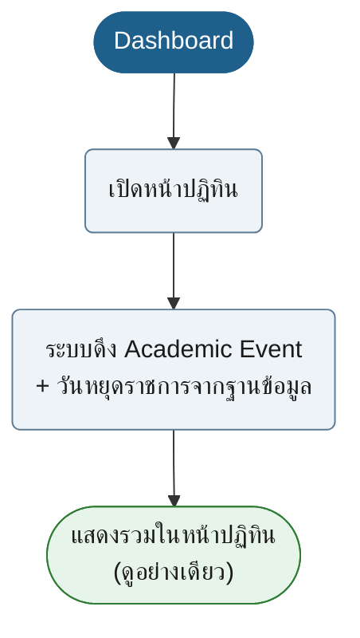
```mermaid
flowchart TD
    n1(["Dashboard"]):::start
    n2("เปิดหน้าปฏิทิน"):::act
    n3("ระบบดึง Academic Event<br/>+ วันหยุดราชการจากฐานข้อมูล"):::act
    n4(["แสดงรวมในหน้าปฏิทิน<br/>(ดูอย่างเดียว)"]):::ok
    n1 --> n2
    n2 --> n3
    n3 --> n4
    classDef start fill:#1F5F8B,stroke:#1F5F8B,color:#fff
    classDef act fill:#EEF3F8,stroke:#5B7A94,color:#1a1a1a
    classDef dec fill:#FFF6E0,stroke:#5B7A94,color:#1a1a1a
    classDef bad fill:#FCE8E6,stroke:#C0392B,color:#1a1a1a
    classDef ok fill:#E6F4EA,stroke:#2E7D32,color:#1a1a1a
    classDef note fill:#F4F4F4,stroke:#999,color:#1a1a1a
```

---

## 1. Student

### 1.1 Register Course

**Role:** Student · **อ้างอิง:** §14.1 · §14.6 (Email) · BR-03, BR-04, BR-05, BR-09

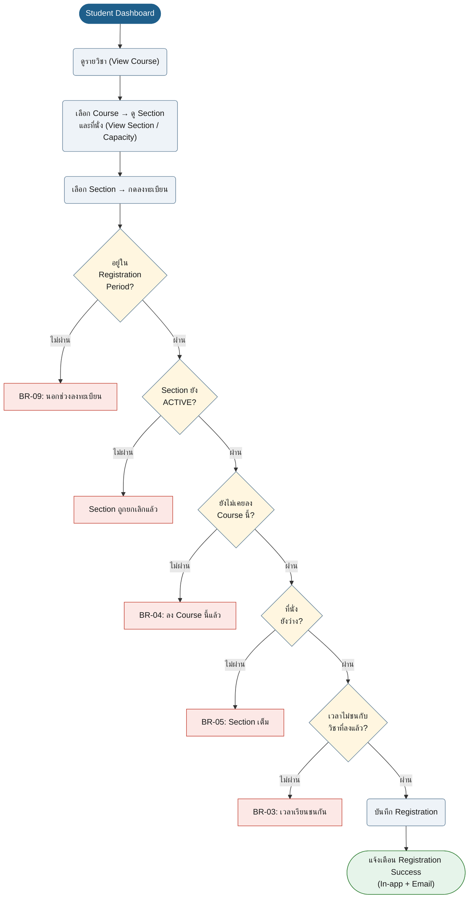
```mermaid
flowchart TD
    n1(["Student Dashboard"]):::start
    n2("ดูรายวิชา (View Course)"):::act
    n3("เลือก Course → ดู Section<br/>และที่นั่ง (View Section / Capacity)"):::act
    n4("เลือก Section → กดลงทะเบียน"):::act
    n1 --> n2
    n2 --> n3
    n3 --> n4
    n5{"อยู่ใน<br/>Registration<br/>Period?"}:::dec
    n4 --> n5
    n6["BR-09: นอกช่วงลงทะเบียน"]:::bad
    n5 -->|ไม่ผ่าน| n6
    n7{"Section ยัง<br/>ACTIVE?"}:::dec
    n5 -->|ผ่าน| n7
    n8["Section ถูกยกเลิกแล้ว"]:::bad
    n7 -->|ไม่ผ่าน| n8
    n9{"ยังไม่เคยลง<br/>Course นี้?"}:::dec
    n7 -->|ผ่าน| n9
    n10["BR-04: ลง Course นี้แล้ว"]:::bad
    n9 -->|ไม่ผ่าน| n10
    n11{"ที่นั่ง<br/>ยังว่าง?"}:::dec
    n9 -->|ผ่าน| n11
    n12["BR-05: Section เต็ม"]:::bad
    n11 -->|ไม่ผ่าน| n12
    n13{"เวลาไม่ชนกับ<br/>วิชาที่ลงแล้ว?"}:::dec
    n11 -->|ผ่าน| n13
    n14["BR-03: เวลาเรียนชนกัน"]:::bad
    n13 -->|ไม่ผ่าน| n14
    n15("บันทึก Registration"):::act
    n13 -->|ผ่าน| n15
    n16(["แจ้งเตือน Registration Success<br/>(In-app + Email)"]):::ok
    n15 --> n16
    classDef start fill:#1F5F8B,stroke:#1F5F8B,color:#fff
    classDef act fill:#EEF3F8,stroke:#5B7A94,color:#1a1a1a
    classDef dec fill:#FFF6E0,stroke:#5B7A94,color:#1a1a1a
    classDef bad fill:#FCE8E6,stroke:#C0392B,color:#1a1a1a
    classDef ok fill:#E6F4EA,stroke:#2E7D32,color:#1a1a1a
    classDef note fill:#F4F4F4,stroke:#999,color:#1a1a1a
```

### 1.2 Withdraw Course

**Role:** Student · **อ้างอิง:** §14.2 · BR-09

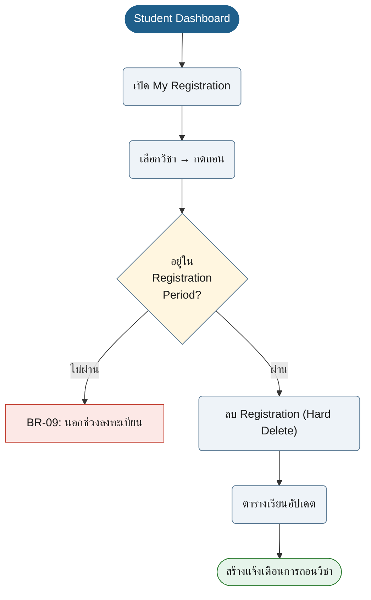
```mermaid
flowchart TD
    n1(["Student Dashboard"]):::start
    n2("เปิด My Registration"):::act
    n3("เลือกวิชา → กดถอน"):::act
    n1 --> n2
    n2 --> n3
    n4{"อยู่ใน<br/>Registration<br/>Period?"}:::dec
    n3 --> n4
    n5["BR-09: นอกช่วงลงทะเบียน"]:::bad
    n4 -->|ไม่ผ่าน| n5
    n6("ลบ Registration (Hard Delete)"):::act
    n4 -->|ผ่าน| n6
    n7("ตารางเรียนอัปเดต"):::act
    n8(["สร้างแจ้งเตือนการถอนวิชา"]):::ok
    n6 --> n7
    n7 --> n8
    classDef start fill:#1F5F8B,stroke:#1F5F8B,color:#fff
    classDef act fill:#EEF3F8,stroke:#5B7A94,color:#1a1a1a
    classDef dec fill:#FFF6E0,stroke:#5B7A94,color:#1a1a1a
    classDef bad fill:#FCE8E6,stroke:#C0392B,color:#1a1a1a
    classDef ok fill:#E6F4EA,stroke:#2E7D32,color:#1a1a1a
    classDef note fill:#F4F4F4,stroke:#999,color:#1a1a1a
```

### 1.3 View Own Schedule

**Role:** Student · **อ้างอิง:** §13.2.3 · อาจารย์แสดงตามคาบ (schedules.teacher_id)

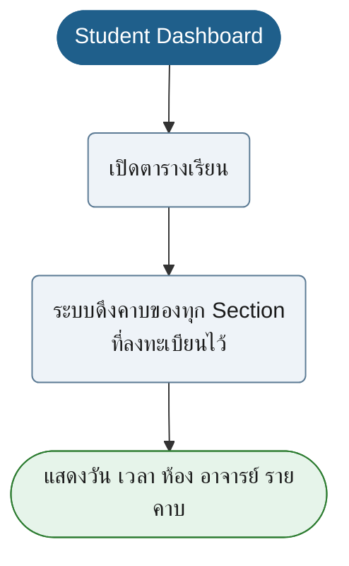
```mermaid
flowchart TD
    n1(["Student Dashboard"]):::start
    n2("เปิดตารางเรียน"):::act
    n3("ระบบดึงคาบของทุก Section<br/>ที่ลงทะเบียนไว้"):::act
    n4(["แสดงวัน เวลา ห้อง อาจารย์ รายคาบ"]):::ok
    n1 --> n2
    n2 --> n3
    n3 --> n4
    classDef start fill:#1F5F8B,stroke:#1F5F8B,color:#fff
    classDef act fill:#EEF3F8,stroke:#5B7A94,color:#1a1a1a
    classDef dec fill:#FFF6E0,stroke:#5B7A94,color:#1a1a1a
    classDef bad fill:#FCE8E6,stroke:#C0392B,color:#1a1a1a
    classDef ok fill:#E6F4EA,stroke:#2E7D32,color:#1a1a1a
    classDef note fill:#F4F4F4,stroke:#999,color:#1a1a1a
```

---

## 2. Teacher

### 2.1 View Own Schedule

**Role:** Teacher · **อ้างอิง:** §13.2.2 Teaching Schedule

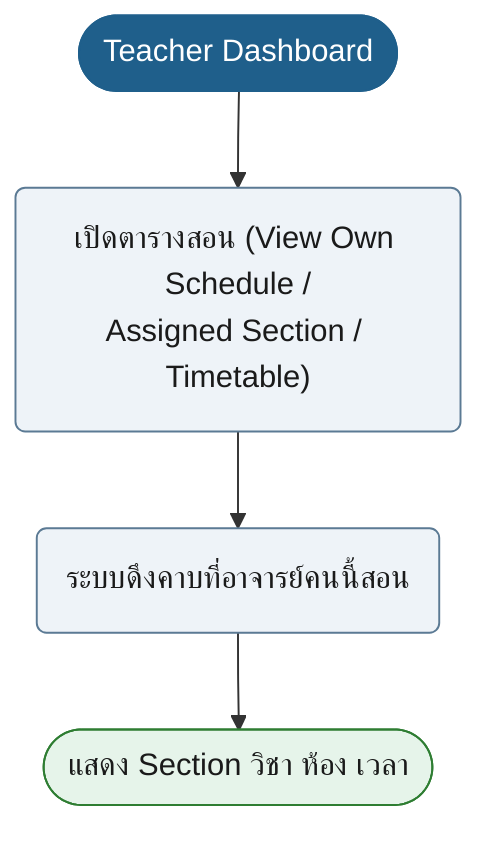
```mermaid
flowchart TD
    n1(["Teacher Dashboard"]):::start
    n2("เปิดตารางสอน (View Own Schedule /<br/>Assigned Section / Timetable)"):::act
    n3("ระบบดึงคาบที่อาจารย์คนนี้สอน"):::act
    n4(["แสดง Section วิชา ห้อง เวลา"]):::ok
    n1 --> n2
    n2 --> n3
    n3 --> n4
    classDef start fill:#1F5F8B,stroke:#1F5F8B,color:#fff
    classDef act fill:#EEF3F8,stroke:#5B7A94,color:#1a1a1a
    classDef dec fill:#FFF6E0,stroke:#5B7A94,color:#1a1a1a
    classDef bad fill:#FCE8E6,stroke:#C0392B,color:#1a1a1a
    classDef ok fill:#E6F4EA,stroke:#2E7D32,color:#1a1a1a
    classDef note fill:#F4F4F4,stroke:#999,color:#1a1a1a
```

### 2.2 Manage Availability

**Role:** Teacher · **อ้างอิง:** §13.2.2 · BR-07 · D22 · C-01 (ทีมตัดสินใจ)

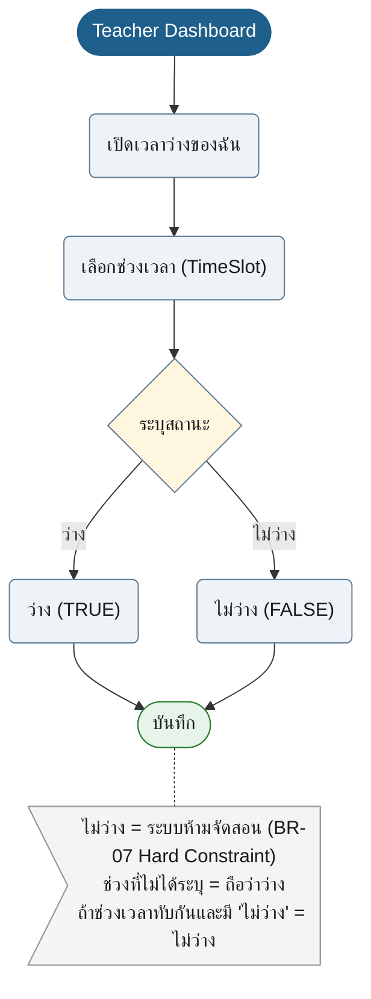
```mermaid
flowchart TD
    n1(["Teacher Dashboard"]):::start
    n2("เปิดเวลาว่างของฉัน"):::act
    n3("เลือกช่วงเวลา (TimeSlot)"):::act
    n1 --> n2
    n2 --> n3
    n4{"ระบุสถานะ"}:::dec
    n3 --> n4
    n5("ว่าง (TRUE)"):::act
    n6("ไม่ว่าง (FALSE)"):::act
    n4 -->|ว่าง| n5
    n4 -->|ไม่ว่าง| n6
    n7(["บันทึก"]):::ok
    n5 --> n7
    n6 --> n7
    n8>"ไม่ว่าง = ระบบห้ามจัดสอน (BR-07 Hard Constraint)<br/>ช่วงที่ไม่ได้ระบุ = ถือว่าว่าง<br/>ถ้าช่วงเวลาทับกันและมี 'ไม่ว่าง' = ไม่ว่าง"]:::note
    n7 -.- n8
    classDef start fill:#1F5F8B,stroke:#1F5F8B,color:#fff
    classDef act fill:#EEF3F8,stroke:#5B7A94,color:#1a1a1a
    classDef dec fill:#FFF6E0,stroke:#5B7A94,color:#1a1a1a
    classDef bad fill:#FCE8E6,stroke:#C0392B,color:#1a1a1a
    classDef ok fill:#E6F4EA,stroke:#2E7D32,color:#1a1a1a
    classDef note fill:#F4F4F4,stroke:#999,color:#1a1a1a
```

### 2.3 Create Swap Request (Teacher A)

**Role:** Teacher · **อ้างอิง:** §14.3 Request Swap → Select Teacher B → System Validation · การแลกคาบ (C-05)

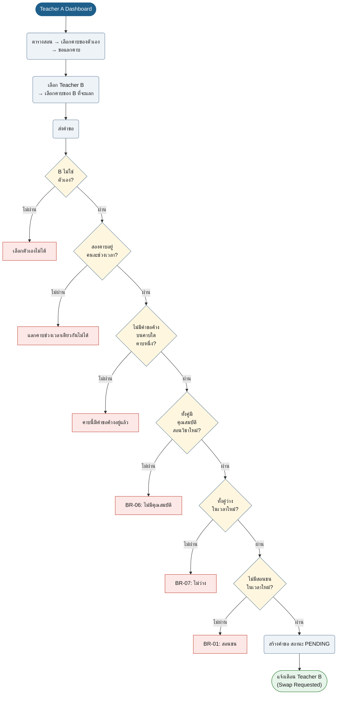
```mermaid
flowchart TD
    n1(["Teacher A Dashboard"]):::start
    n2("ตารางสอน → เลือกคาบของตัวเอง<br/>→ ขอแลกคาบ"):::act
    n3("เลือก Teacher B<br/>→ เลือกคาบของ B ที่จะแลก"):::act
    n4("ส่งคำขอ"):::act
    n1 --> n2
    n2 --> n3
    n3 --> n4
    n5{"B ไม่ใช่<br/>ตัวเอง?"}:::dec
    n4 --> n5
    n6["เลือกตัวเองไม่ได้"]:::bad
    n5 -->|ไม่ผ่าน| n6
    n7{"สองคาบอยู่<br/>คนละช่วงเวลา?"}:::dec
    n5 -->|ผ่าน| n7
    n8["แลกคาบช่วงเวลาเดียวกันไม่ได้"]:::bad
    n7 -->|ไม่ผ่าน| n8
    n9{"ไม่มีคำขอค้าง<br/>บนคาบใด<br/>คาบหนึ่ง?"}:::dec
    n7 -->|ผ่าน| n9
    n10["คาบนี้มีคำขอค้างอยู่แล้ว"]:::bad
    n9 -->|ไม่ผ่าน| n10
    n11{"ทั้งคู่มี<br/>คุณสมบัติ<br/>สอนวิชาใหม่?"}:::dec
    n9 -->|ผ่าน| n11
    n12["BR-06: ไม่มีคุณสมบัติ"]:::bad
    n11 -->|ไม่ผ่าน| n12
    n13{"ทั้งคู่ว่าง<br/>ในเวลาใหม่?"}:::dec
    n11 -->|ผ่าน| n13
    n14["BR-07: ไม่ว่าง"]:::bad
    n13 -->|ไม่ผ่าน| n14
    n15{"ไม่มีสอนชน<br/>ในเวลาใหม่?"}:::dec
    n13 -->|ผ่าน| n15
    n16["BR-01: สอนชน"]:::bad
    n15 -->|ไม่ผ่าน| n16
    n17("สร้างคำขอ สถานะ PENDING"):::act
    n15 -->|ผ่าน| n17
    n18(["แจ้งเตือน Teacher B<br/>(Swap Requested)"]):::ok
    n17 --> n18
    classDef start fill:#1F5F8B,stroke:#1F5F8B,color:#fff
    classDef act fill:#EEF3F8,stroke:#5B7A94,color:#1a1a1a
    classDef dec fill:#FFF6E0,stroke:#5B7A94,color:#1a1a1a
    classDef bad fill:#FCE8E6,stroke:#C0392B,color:#1a1a1a
    classDef ok fill:#E6F4EA,stroke:#2E7D32,color:#1a1a1a
    classDef note fill:#F4F4F4,stroke:#999,color:#1a1a1a
```

### 2.4 Respond to Swap Request (Teacher B)

**Role:** Teacher · **อ้างอิง:** §14.3 Teacher B Respond (Accept / Reject)

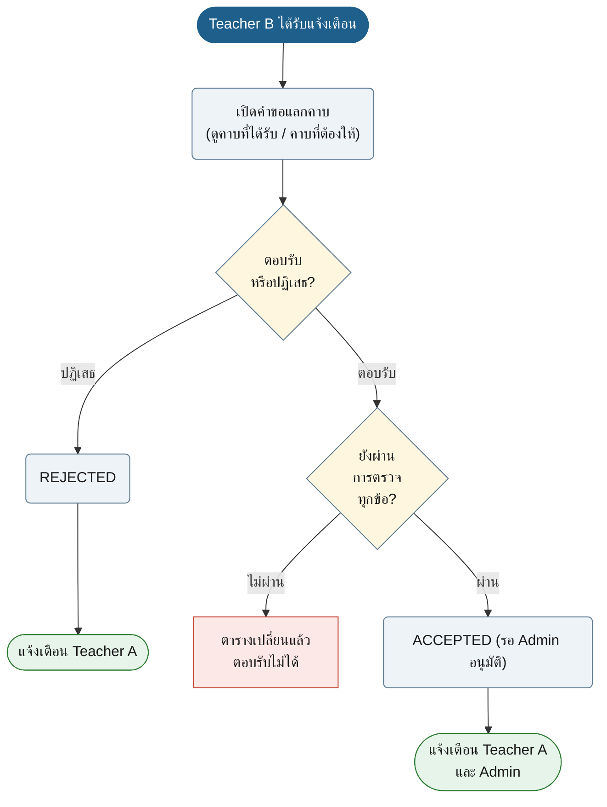
```mermaid
flowchart TD
    n1(["Teacher B ได้รับแจ้งเตือน"]):::start
    n2("เปิดคำขอแลกคาบ<br/>(ดูคาบที่ได้รับ / คาบที่ต้องให้)"):::act
    n1 --> n2
    n3{"ตอบรับ<br/>หรือปฏิเสธ?"}:::dec
    n2 --> n3
    n4("REJECTED"):::act
    n3 -->|ปฏิเสธ| n4
    n5(["แจ้งเตือน Teacher A"]):::ok
    n4 --> n5
    n6{"ยังผ่าน<br/>การตรวจ<br/>ทุกข้อ?"}:::dec
    n3 -->|ตอบรับ| n6
    n7["ตารางเปลี่ยนแล้ว<br/>ตอบรับไม่ได้"]:::bad
    n6 -->|ไม่ผ่าน| n7
    n8("ACCEPTED (รอ Admin อนุมัติ)"):::act
    n6 -->|ผ่าน| n8
    n9(["แจ้งเตือน Teacher A<br/>และ Admin"]):::ok
    n8 --> n9
    classDef start fill:#1F5F8B,stroke:#1F5F8B,color:#fff
    classDef act fill:#EEF3F8,stroke:#5B7A94,color:#1a1a1a
    classDef dec fill:#FFF6E0,stroke:#5B7A94,color:#1a1a1a
    classDef bad fill:#FCE8E6,stroke:#C0392B,color:#1a1a1a
    classDef ok fill:#E6F4EA,stroke:#2E7D32,color:#1a1a1a
    classDef note fill:#F4F4F4,stroke:#999,color:#1a1a1a
```

### 2.5 Cancel Swap Request (Teacher A)

**Role:** Teacher · **อ้างอิง:** ทีมตัดสินใจเพิ่มสถานะ CANCELLED (ไม่มีในเอกสารหลัก §6.1)

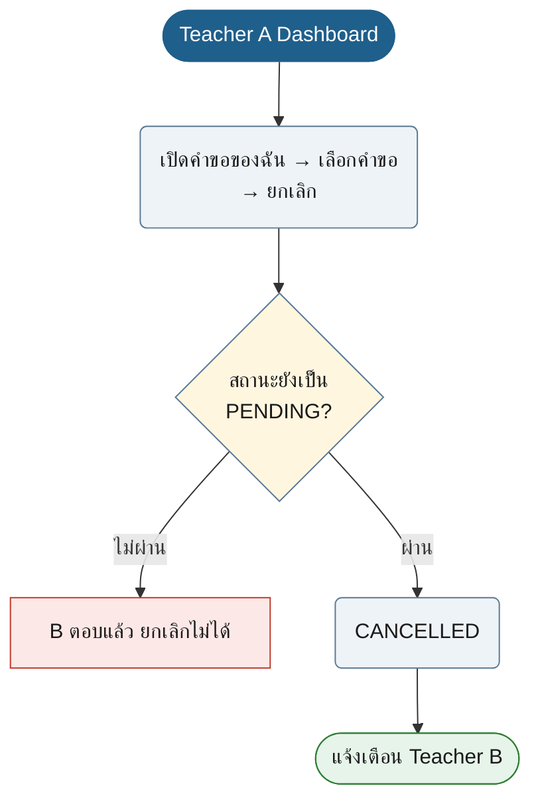
```mermaid
flowchart TD
    n1(["Teacher A Dashboard"]):::start
    n2("เปิดคำขอของฉัน → เลือกคำขอ<br/>→ ยกเลิก"):::act
    n1 --> n2
    n3{"สถานะยังเป็น<br/>PENDING?"}:::dec
    n2 --> n3
    n4["B ตอบแล้ว ยกเลิกไม่ได้"]:::bad
    n3 -->|ไม่ผ่าน| n4
    n5("CANCELLED"):::act
    n3 -->|ผ่าน| n5
    n6(["แจ้งเตือน Teacher B"]):::ok
    n5 --> n6
    classDef start fill:#1F5F8B,stroke:#1F5F8B,color:#fff
    classDef act fill:#EEF3F8,stroke:#5B7A94,color:#1a1a1a
    classDef dec fill:#FFF6E0,stroke:#5B7A94,color:#1a1a1a
    classDef bad fill:#FCE8E6,stroke:#C0392B,color:#1a1a1a
    classDef ok fill:#E6F4EA,stroke:#2E7D32,color:#1a1a1a
    classDef note fill:#F4F4F4,stroke:#999,color:#1a1a1a
```

### 2.6 View Swap Request Status

**Role:** Teacher · **อ้างอิง:** §13.2.2 Teacher Swap Management

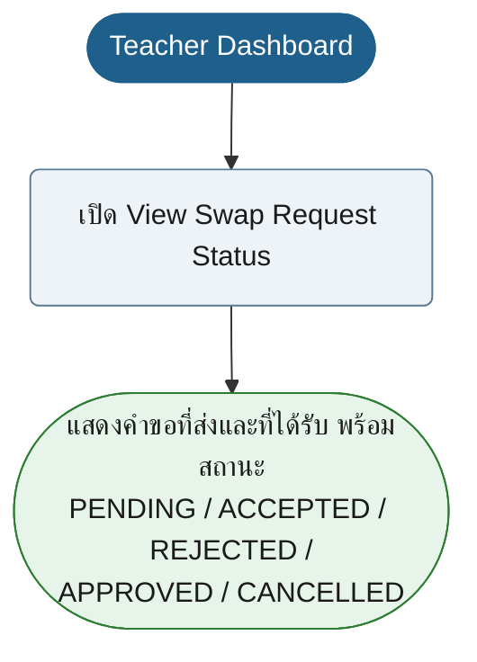
```mermaid
flowchart TD
    n1(["Teacher Dashboard"]):::start
    n2("เปิด View Swap Request Status"):::act
    n3(["แสดงคำขอที่ส่งและที่ได้รับ พร้อมสถานะ<br/>PENDING / ACCEPTED / REJECTED /<br/>APPROVED / CANCELLED"]):::ok
    n1 --> n2
    n2 --> n3
    classDef start fill:#1F5F8B,stroke:#1F5F8B,color:#fff
    classDef act fill:#EEF3F8,stroke:#5B7A94,color:#1a1a1a
    classDef dec fill:#FFF6E0,stroke:#5B7A94,color:#1a1a1a
    classDef bad fill:#FCE8E6,stroke:#C0392B,color:#1a1a1a
    classDef ok fill:#E6F4EA,stroke:#2E7D32,color:#1a1a1a
    classDef note fill:#F4F4F4,stroke:#999,color:#1a1a1a
```

### 2.7 View Own Qualification / Availability

**Role:** Teacher · **อ้างอิง:** §13.2.2 Profile & Availability

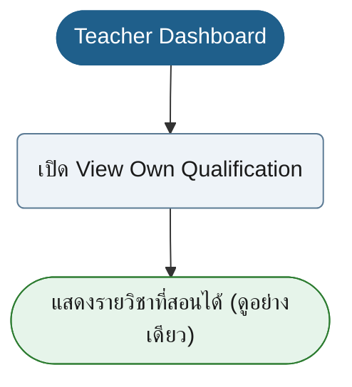
```mermaid
flowchart TD
    n1(["Teacher Dashboard"]):::start
    n2("เปิด View Own Qualification"):::act
    n3(["แสดงรายวิชาที่สอนได้ (ดูอย่างเดียว)"]):::ok
    n1 --> n2
    n2 --> n3
    classDef start fill:#1F5F8B,stroke:#1F5F8B,color:#fff
    classDef act fill:#EEF3F8,stroke:#5B7A94,color:#1a1a1a
    classDef dec fill:#FFF6E0,stroke:#5B7A94,color:#1a1a1a
    classDef bad fill:#FCE8E6,stroke:#C0392B,color:#1a1a1a
    classDef ok fill:#E6F4EA,stroke:#2E7D32,color:#1a1a1a
    classDef note fill:#F4F4F4,stroke:#999,color:#1a1a1a
```

---

## 3. Admin

### 3.1 Course Management (CRUD)

**Role:** Admin · **อ้างอิง:** §13.2.1 · §16 /api/v1/courses

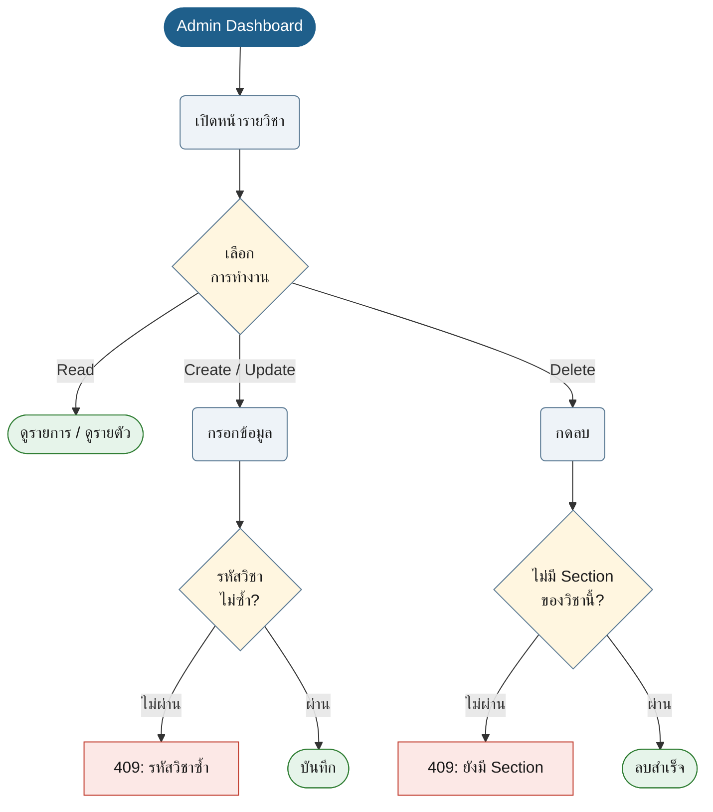
```mermaid
flowchart TD
    n1(["Admin Dashboard"]):::start
    n2("เปิดหน้ารายวิชา"):::act
    n1 --> n2
    n3{"เลือก<br/>การทำงาน"}:::dec
    n2 --> n3
    n4(["ดูรายการ / ดูรายตัว"]):::ok
    n3 -->|Read| n4
    n5("กรอกข้อมูล"):::act
    n3 -->|Create / Update| n5
    n6{"รหัสวิชา<br/>ไม่ซ้ำ?"}:::dec
    n5 --> n6
    n7["409: รหัสวิชาซ้ำ"]:::bad
    n6 -->|ไม่ผ่าน| n7
    n8(["บันทึก"]):::ok
    n6 -->|ผ่าน| n8
    n9("กดลบ"):::act
    n3 -->|Delete| n9
    n10{"ไม่มี Section<br/>ของวิชานี้?"}:::dec
    n9 --> n10
    n11["409: ยังมี Section"]:::bad
    n10 -->|ไม่ผ่าน| n11
    n12(["ลบสำเร็จ"]):::ok
    n10 -->|ผ่าน| n12
    classDef start fill:#1F5F8B,stroke:#1F5F8B,color:#fff
    classDef act fill:#EEF3F8,stroke:#5B7A94,color:#1a1a1a
    classDef dec fill:#FFF6E0,stroke:#5B7A94,color:#1a1a1a
    classDef bad fill:#FCE8E6,stroke:#C0392B,color:#1a1a1a
    classDef ok fill:#E6F4EA,stroke:#2E7D32,color:#1a1a1a
    classDef note fill:#F4F4F4,stroke:#999,color:#1a1a1a
```

### 3.2 Room Management (CRUD)

**Role:** Admin · **อ้างอิง:** §13.2.1 · §16 /api/v1/rooms · ห้องที่ปิดใช้งานจะไม่ถูกเลือกตอนจัดตาราง (BR-08)

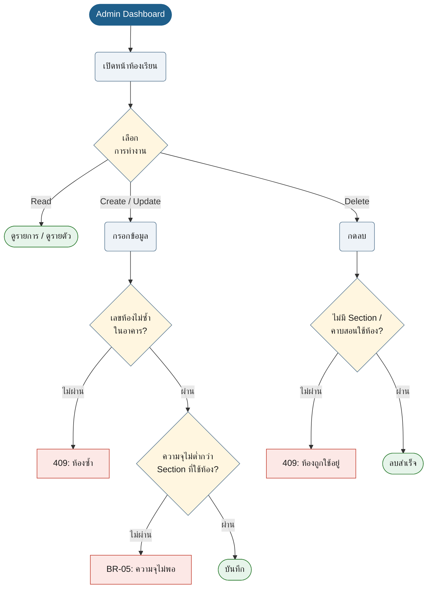
```mermaid
flowchart TD
    n1(["Admin Dashboard"]):::start
    n2("เปิดหน้าห้องเรียน"):::act
    n1 --> n2
    n3{"เลือก<br/>การทำงาน"}:::dec
    n2 --> n3
    n4(["ดูรายการ / ดูรายตัว"]):::ok
    n3 -->|Read| n4
    n5("กรอกข้อมูล"):::act
    n3 -->|Create / Update| n5
    n6{"เลขห้องไม่ซ้ำ<br/>ในอาคาร?"}:::dec
    n5 --> n6
    n7["409: ห้องซ้ำ"]:::bad
    n6 -->|ไม่ผ่าน| n7
    n8{"ความจุไม่ต่ำกว่า<br/>Section ที่ใช้ห้อง?"}:::dec
    n6 -->|ผ่าน| n8
    n9["BR-05: ความจุไม่พอ"]:::bad
    n8 -->|ไม่ผ่าน| n9
    n10(["บันทึก"]):::ok
    n8 -->|ผ่าน| n10
    n11("กดลบ"):::act
    n3 -->|Delete| n11
    n12{"ไม่มี Section /<br/>คาบสอนใช้ห้อง?"}:::dec
    n11 --> n12
    n13["409: ห้องถูกใช้อยู่"]:::bad
    n12 -->|ไม่ผ่าน| n13
    n14(["ลบสำเร็จ"]):::ok
    n12 -->|ผ่าน| n14
    classDef start fill:#1F5F8B,stroke:#1F5F8B,color:#fff
    classDef act fill:#EEF3F8,stroke:#5B7A94,color:#1a1a1a
    classDef dec fill:#FFF6E0,stroke:#5B7A94,color:#1a1a1a
    classDef bad fill:#FCE8E6,stroke:#C0392B,color:#1a1a1a
    classDef ok fill:#E6F4EA,stroke:#2E7D32,color:#1a1a1a
    classDef note fill:#F4F4F4,stroke:#999,color:#1a1a1a
```

### 3.3 Generate Schedule

**Role:** Admin · **อ้างอิง:** §12.2–12.4 · D27–D29, D36 · ตารางที่สร้างใช้งานได้ทันที

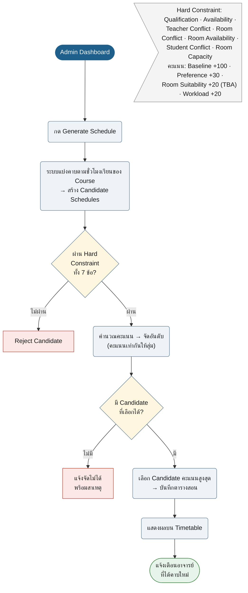
```mermaid
flowchart TD
    n1(["Admin Dashboard"]):::start
    n2("กด Generate Schedule"):::act
    n3("ระบบแบ่งคาบตามชั่วโมงเรียนของ Course<br/>→ สร้าง Candidate Schedules"):::act
    n1 --> n2
    n2 --> n3
    n4{"ผ่าน Hard<br/>Constraint<br/>ทั้ง 7 ข้อ?"}:::dec
    n3 --> n4
    n5["Reject Candidate"]:::bad
    n4 -->|ไม่ผ่าน| n5
    n6("คำนวณคะแนน → จัดอันดับ<br/>(คะแนนเท่ากันให้สุ่ม)"):::act
    n4 -->|ผ่าน| n6
    n7{"มี Candidate<br/>ที่เลือกได้?"}:::dec
    n6 --> n7
    n8["แจ้งจัดไม่ได้<br/>พร้อมสาเหตุ"]:::bad
    n7 -->|ไม่มี| n8
    n9("เลือก Candidate คะแนนสูงสุด<br/>→ บันทึกตารางสอน"):::act
    n7 -->|มี| n9
    n10("แสดงผลบน Timetable"):::act
    n9 --> n10
    n11(["แจ้งเตือนอาจารย์<br/>ที่ได้คาบใหม่"]):::ok
    n10 --> n11
    n12>"Hard Constraint: Qualification · Availability ·<br/>Teacher Conflict · Room Conflict · Room Availability ·<br/>Student Conflict · Room Capacity<br/>คะแนน: Baseline +100 · Preference +30 ·<br/>Room Suitability +20 (TBA) · Workload +20"]:::note
    classDef start fill:#1F5F8B,stroke:#1F5F8B,color:#fff
    classDef act fill:#EEF3F8,stroke:#5B7A94,color:#1a1a1a
    classDef dec fill:#FFF6E0,stroke:#5B7A94,color:#1a1a1a
    classDef bad fill:#FCE8E6,stroke:#C0392B,color:#1a1a1a
    classDef ok fill:#E6F4EA,stroke:#2E7D32,color:#1a1a1a
    classDef note fill:#F4F4F4,stroke:#999,color:#1a1a1a
```

### 3.4 Approve / Reject Swap Request

**Role:** Admin · **อ้างอิง:** §14.3 Admin Review → Update Schedule · §14.6 Email Swap Approved · ปฏิเสธได้เฉพาะคำขอ ACCEPTED

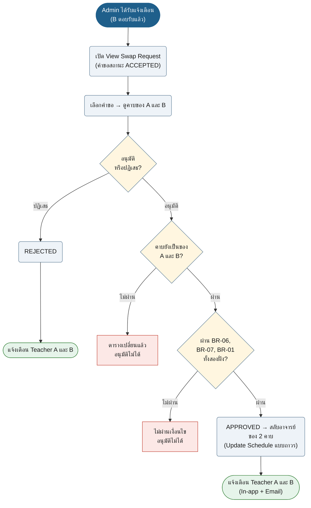
```mermaid
flowchart TD
    n1(["Admin ได้รับแจ้งเตือน<br/>(B ตอบรับแล้ว)"]):::start
    n2("เปิด View Swap Request<br/>(คำขอสถานะ ACCEPTED)"):::act
    n3("เลือกคำขอ → ดูคาบของ A และ B"):::act
    n1 --> n2
    n2 --> n3
    n4{"อนุมัติ<br/>หรือปฏิเสธ?"}:::dec
    n3 --> n4
    n5("REJECTED"):::act
    n4 -->|ปฏิเสธ| n5
    n6(["แจ้งเตือน Teacher A และ B"]):::ok
    n5 --> n6
    n7{"คาบยังเป็นของ<br/>A และ B?"}:::dec
    n4 -->|อนุมัติ| n7
    n8["ตารางเปลี่ยนแล้ว<br/>อนุมัติไม่ได้"]:::bad
    n7 -->|ไม่ผ่าน| n8
    n9{"ผ่าน BR-06,<br/>BR-07, BR-01<br/>ทั้งสองฝั่ง?"}:::dec
    n7 -->|ผ่าน| n9
    n10["ไม่ผ่านเงื่อนไข<br/>อนุมัติไม่ได้"]:::bad
    n9 -->|ไม่ผ่าน| n10
    n11("APPROVED → สลับอาจารย์ของ 2 คาบ<br/>(Update Schedule แบบถาวร)"):::act
    n9 -->|ผ่าน| n11
    n12(["แจ้งเตือน Teacher A และ B<br/>(In-app + Email)"]):::ok
    n11 --> n12
    classDef start fill:#1F5F8B,stroke:#1F5F8B,color:#fff
    classDef act fill:#EEF3F8,stroke:#5B7A94,color:#1a1a1a
    classDef dec fill:#FFF6E0,stroke:#5B7A94,color:#1a1a1a
    classDef bad fill:#FCE8E6,stroke:#C0392B,color:#1a1a1a
    classDef ok fill:#E6F4EA,stroke:#2E7D32,color:#1a1a1a
    classDef note fill:#F4F4F4,stroke:#999,color:#1a1a1a
```

### 3.5 Cancel Section

**Role:** Admin · **อ้างอิง:** §14.4 · C-11 (Release Schedule = ลบคาบสอน)

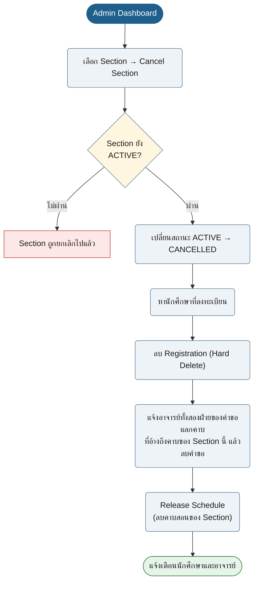
```mermaid
flowchart TD
    n1(["Admin Dashboard"]):::start
    n2("เลือก Section → Cancel Section"):::act
    n1 --> n2
    n3{"Section ยัง<br/>ACTIVE?"}:::dec
    n2 --> n3
    n4["Section ถูกยกเลิกไปแล้ว"]:::bad
    n3 -->|ไม่ผ่าน| n4
    n5("เปลี่ยนสถานะ ACTIVE → CANCELLED"):::act
    n3 -->|ผ่าน| n5
    n6("หานักศึกษาที่ลงทะเบียน"):::act
    n7("ลบ Registration (Hard Delete)"):::act
    n8("แจ้งอาจารย์ทั้งสองฝ่ายของคำขอแลกคาบ<br/>ที่อ้างถึงคาบของ Section นี้ แล้วลบคำขอ"):::act
    n9("Release Schedule<br/>(ลบคาบสอนของ Section)"):::act
    n10(["แจ้งเตือนนักศึกษาและอาจารย์"]):::ok
    n5 --> n6
    n6 --> n7
    n7 --> n8
    n8 --> n9
    n9 --> n10
    classDef start fill:#1F5F8B,stroke:#1F5F8B,color:#fff
    classDef act fill:#EEF3F8,stroke:#5B7A94,color:#1a1a1a
    classDef dec fill:#FFF6E0,stroke:#5B7A94,color:#1a1a1a
    classDef bad fill:#FCE8E6,stroke:#C0392B,color:#1a1a1a
    classDef ok fill:#E6F4EA,stroke:#2E7D32,color:#1a1a1a
    classDef note fill:#F4F4F4,stroke:#999,color:#1a1a1a
```

### 3.6 Academic Calendar (CRUD Academic Event)

**Role:** Admin · **อ้างอิง:** §14.7 · Event: Semester Start/End, Registration Period, Midterm, Final · Registration Period ใช้ตรวจ BR-09

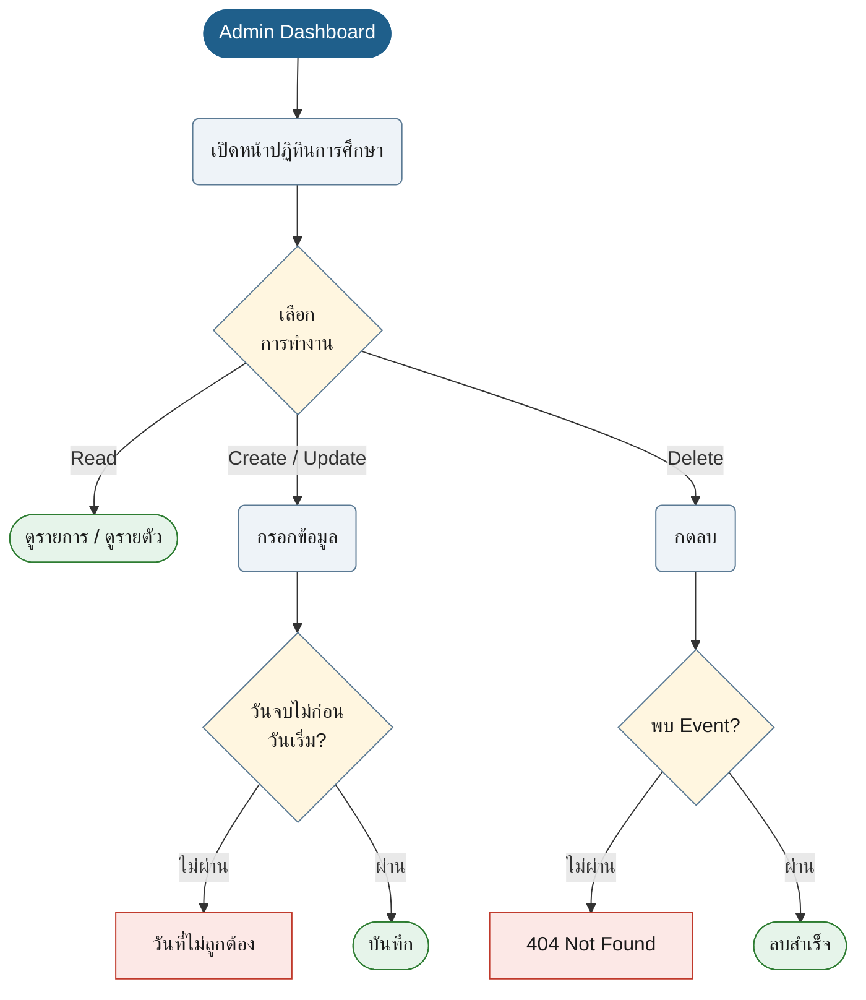
```mermaid
flowchart TD
    n1(["Admin Dashboard"]):::start
    n2("เปิดหน้าปฏิทินการศึกษา"):::act
    n1 --> n2
    n3{"เลือก<br/>การทำงาน"}:::dec
    n2 --> n3
    n4(["ดูรายการ / ดูรายตัว"]):::ok
    n3 -->|Read| n4
    n5("กรอกข้อมูล"):::act
    n3 -->|Create / Update| n5
    n6{"วันจบไม่ก่อน<br/>วันเริ่ม?"}:::dec
    n5 --> n6
    n7["วันที่ไม่ถูกต้อง"]:::bad
    n6 -->|ไม่ผ่าน| n7
    n8(["บันทึก"]):::ok
    n6 -->|ผ่าน| n8
    n9("กดลบ"):::act
    n3 -->|Delete| n9
    n10{"พบ Event?"}:::dec
    n9 --> n10
    n11["404 Not Found"]:::bad
    n10 -->|ไม่ผ่าน| n11
    n12(["ลบสำเร็จ"]):::ok
    n10 -->|ผ่าน| n12
    classDef start fill:#1F5F8B,stroke:#1F5F8B,color:#fff
    classDef act fill:#EEF3F8,stroke:#5B7A94,color:#1a1a1a
    classDef dec fill:#FFF6E0,stroke:#5B7A94,color:#1a1a1a
    classDef bad fill:#FCE8E6,stroke:#C0392B,color:#1a1a1a
    classDef ok fill:#E6F4EA,stroke:#2E7D32,color:#1a1a1a
    classDef note fill:#F4F4F4,stroke:#999,color:#1a1a1a
```

### 3.7 Fetch / View Public Holiday

**Role:** Admin · **อ้างอิง:** §14.7 Public Holiday API Flow · §13.2.1

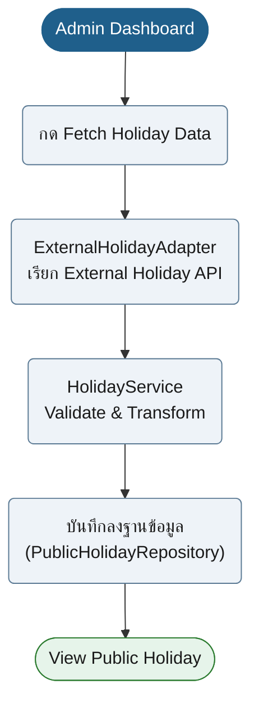
```mermaid
flowchart TD
    n1(["Admin Dashboard"]):::start
    n2("กด Fetch Holiday Data"):::act
    n3("ExternalHolidayAdapter<br/>เรียก External Holiday API"):::act
    n4("HolidayService<br/>Validate & Transform"):::act
    n5("บันทึกลงฐานข้อมูล<br/>(PublicHolidayRepository)"):::act
    n6(["View Public Holiday"]):::ok
    n1 --> n2
    n2 --> n3
    n3 --> n4
    n4 --> n5
    n5 --> n6
    classDef start fill:#1F5F8B,stroke:#1F5F8B,color:#fff
    classDef act fill:#EEF3F8,stroke:#5B7A94,color:#1a1a1a
    classDef dec fill:#FFF6E0,stroke:#5B7A94,color:#1a1a1a
    classDef bad fill:#FCE8E6,stroke:#C0392B,color:#1a1a1a
    classDef ok fill:#E6F4EA,stroke:#2E7D32,color:#1a1a1a
    classDef note fill:#F4F4F4,stroke:#999,color:#1a1a1a
```

---

## 4. ภาพรวมการแลกคาบ

### 4 ภาพรวมการแลกคาบข้าม Role

**Role:** Teacher A → Teacher B → Admin · **อ้างอิง:** §14.3 · สถานะ CANCELLED เป็นการตัดสินใจของทีม

```mermaid
flowchart LR
    n1(["Teacher A<br/>ส่งคำขอ"]):::start
    n2("PENDING"):::act
    n3{"Teacher B<br/>ตอบ"}:::dec
    n4("ACCEPTED"):::act
    n5{"Admin<br/>ตัดสิน"}:::dec
    n6(["APPROVED<br/>สลับอาจารย์ 2 คาบ"]):::ok
    n7["REJECTED"]:::bad
    n8["REJECTED"]:::bad
    n9["CANCELLED"]:::bad
    n1 --> n2
    n2 --> n3
    n3 -->|ตอบรับ| n4
    n4 --> n5
    n5 -->|อนุมัติ| n6
    n3 -->|ปฏิเสธ| n7
    n5 -->|ปฏิเสธ| n8
    n2 -->|A ยกเลิก| n9
    classDef start fill:#1F5F8B,stroke:#1F5F8B,color:#fff
    classDef act fill:#EEF3F8,stroke:#5B7A94,color:#1a1a1a
    classDef dec fill:#FFF6E0,stroke:#5B7A94,color:#1a1a1a
    classDef bad fill:#FCE8E6,stroke:#C0392B,color:#1a1a1a
    classDef ok fill:#E6F4EA,stroke:#2E7D32,color:#1a1a1a
    classDef note fill:#F4F4F4,stroke:#999,color:#1a1a1a
```
